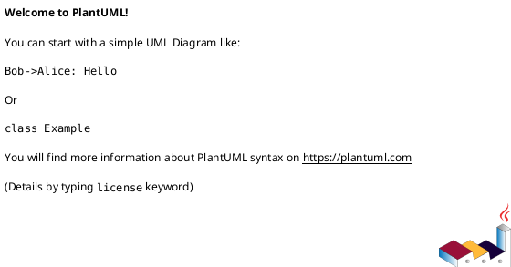

# 作業履歴 2024-08-16

## 概要

2024-08-16の作業内容をまとめています。

## コミット: 2708221

### メッセージ

```
feat: ログイン機能の実装
fix: データベース挿入順序の修正
feat: ログインフォームの追加
feat: ログアウト機能をリストページに追加
feat: Webセキュリティ設定の追加
```
```

### 変更されたファイル

- M	build.gradle
- A	src/main/java/mrs/WebSecurityConfig.java
- A	src/main/java/mrs/app/login/LoginController.java
- M	src/main/resources/data.sql
- A	src/main/resources/templates/login/loginForm.html
- M	src/main/resources/templates/room/listRooms.html

### 変更内容

```diff
commit 27082219254d2f18bbb617f2d52fe68c0521b231
Author: Katuyuki Kakigi <kakimomokuri@gmail.com>
Date:   Fri Aug 16 18:30:16 2024 +0900

    feat: ログイン機能の実装
    
    fix: データベース挿入順序の修正
    feat: ログインフォームの追加
    feat: ログアウト機能をリストページに追加
    feat: Webセキュリティ設定の追加
    ```

diff --git a/build.gradle b/build.gradle
index 5fc87f6..e8fcaea 100644
--- a/build.gradle
+++ b/build.gradle
@@ -26,11 +26,11 @@ dependencies {
     runtimeOnly 'com.h2database:h2'
     runtimeOnly 'org.postgresql:postgresql'
     testImplementation 'org.springframework.boot:spring-boot-starter-test'
+    testImplementation 'org.springframework.security:spring-security-test'
     testRuntimeOnly 'org.junit.platform:junit-platform-launcher'
     compileOnly 'org.projectlombok:lombok'
     annotationProcessor 'org.projectlombok:lombok'
     developmentOnly("org.springframework.boot:spring-boot-devtools")
-
 }
 
 tasks.named('test') {
diff --git a/src/main/java/mrs/WebSecurityConfig.java b/src/main/java/mrs/WebSecurityConfig.java
new file mode 100644
index 0000000..2d77819
--- /dev/null
+++ b/src/main/java/mrs/WebSecurityConfig.java
@@ -0,0 +1,41 @@
+package mrs;
+
+import org.springframework.context.annotation.Bean;
+import org.springframework.context.annotation.Configuration;
+import org.springframework.security.config.annotation.method.configuration.EnableMethodSecurity;
+import org.springframework.security.config.annotation.web.builders.HttpSecurity;
+import org.springframework.security.config.annotation.web.configuration.EnableWebSecurity;
+import org.springframework.security.crypto.bcrypt.BCryptPasswordEncoder;
+import org.springframework.security.crypto.password.PasswordEncoder;
+import org.springframework.security.web.SecurityFilterChain;
+
+@Configuration
+@EnableWebSecurity
+@EnableMethodSecurity
+public class WebSecurityConfig {
+
+    @Bean
+    PasswordEncoder passwordEncoder() {
+        return new BCryptPasswordEncoder();
+    }
+
+    @Bean
+    public SecurityFilterChain securityFilterChain(HttpSecurity http) throws Exception {
+        http.authorizeHttpRequests(authorize -> authorize
+                        .requestMatchers("/js/**", "/css/**").permitAll()
+                        .anyRequest().authenticated()
+                )
+                .formLogin(form -> form
+                        .loginPage("/loginForm")
+                        .loginProcessingUrl("/login")
+                        .usernameParameter("username")
+                        .passwordParameter("password")
+                        .defaultSuccessUrl("/rooms", true)
+                        .failureUrl("/loginForm?error=true")
+                        .permitAll()
+                );
+
+        return http.build();
+    }
+
+}
diff --git a/src/main/java/mrs/app/login/LoginController.java b/src/main/java/mrs/app/login/LoginController.java
new file mode 100644
index 0000000..4c62130
--- /dev/null
+++ b/src/main/java/mrs/app/login/LoginController.java
@@ -0,0 +1,12 @@
+package mrs.app.login;
+
+import org.springframework.stereotype.Controller;
+import org.springframework.web.bind.annotation.RequestMapping;
+
+@Controller
+public class LoginController {
+    @RequestMapping("loginForm")
+    String loginForm() {
+        return "login/loginForm";
+    }
+}
diff --git a/src/main/resources/data.sql b/src/main/resources/data.sql
index 7e7d0c0..2a17493 100644
--- a/src/main/resources/data.sql
+++ b/src/main/resources/data.sql
@@ -31,12 +31,12 @@ INSERT INTO reservable_room(reserved_date, room_id)
 VALUES (CURRENT_DATE - 1, 7);
 
 -- ダミーユーザー(password = demo)
-INSERT INTO usr (user_id, first_name, last_name, password, role_name)
-VALUES ('taro-yamada', '太郎', '山田', '$2a$10$oxSJ1.keBwxmsMLkcT9lPeAIxfNTPNQxpeywMrF7A3kVszwUTqfTK', 'USER');
+INSERT INTO usr (user_id, first_name, last_name, role_name, password)
+VALUES ('taro-yamada', '太郎', '山田', 'USER', '$2a$10$oxSJl.keBwxmsMLkcT9lPeAIxfNTPNQxpeywMrF7A3kVszwUTqfTK');
 -- 認証確認用のテストユーザー(password = demo)
-INSERT INTO usr (user_id, first_name, last_name, password, role_name)
-VALUES ('aaaa', 'Aaa', 'Aaa', '$2a$10$oxSJ1.keBwxmsMLkcT9lPeAIxfNTPNQxpeywMrF7A3kVszwUTqfTK', 'USER');
-INSERT INTO usr (user_id, first_name, last_name, password, role_name)
-VALUES ('bbbb', 'Bbb', 'Bbb', '$2a$10$oxSJ1.keBwxmsMLkcT9lPeAIxfNTPNQxpeywMrF7A3kVszwUTqfTK', 'USER');
-INSERT INTO usr (user_id, first_name, last_name, password, role_name)
-VALUES ('cccc', 'Ccc', 'Ccc', '$2a$10$oxSJ1.keBwxmsMLkcT9lPeAIxfNTPNQxpeywMrF7A3kVszwUTqfTK', 'ADMIN');
+INSERT INTO usr (user_id, first_name, last_name, role_name, password)
+VALUES ('aaaa', 'Aaa', 'Aaa', 'USER', '$2a$10$oxSJl.keBwxmsMLkcT9lPeAIxfNTPNQxpeywMrF7A3kVszwUTqfTK');
+INSERT INTO usr (user_id, first_name, last_name, role_name, password)
+VALUES ('bbbb', 'Bbb', 'Bbb', 'USER', '$2a$10$oxSJl.keBwxmsMLkcT9lPeAIxfNTPNQxpeywMrF7A3kVszwUTqfTK');
+INSERT INTO usr (user_id, first_name, last_name, role_name, password)
+VALUES ('cccc', 'Ccc', 'Ccc', 'ADMIN', '$2a$10$oxSJl.keBwxmsMLkcT9lPeAIxfNTPNQxpeywMrF7A3kVszwUTqfTK');
diff --git a/src/main/resources/templates/login/loginForm.html b/src/main/resources/templates/login/loginForm.html
new file mode 100644
index 0000000..71d72dc
--- /dev/null
+++ b/src/main/resources/templates/login/loginForm.html
@@ -0,0 +1,33 @@
+<!DOCTYPE html>
+<html xmlns="http://www.w3.org/1999/xhtml" xmlns:th="http://www.thymeleaf.org">
+<head>
+    <meta charset="UTF-8">
+    <title></title>
+</head>
+<body>
+<h3>ログインフォーム</h3>
+
+<p th:if="${param.error}">
+    Error!
+</p>
+<form method="POST" th:action="@{/login}">
+    <table>
+        <tr>
+            <td><label for="username">User:</label></td>
+            <td><input id="username" name="username" type="text" value="aaaa"></td>
+        </tr>
+        <tr>
+            <td><label for="password">Password:</label></td>
+            <td><input id="password" name="password" type="password" value="demo"></td>
+        </tr>
+        <tr>
+            <td>&nbsp;</td>
+            <td>
+                <button type="submit">ログイン</button>
+            </td>
+        </tr>
+    </table>
+</form>
+
+</body>
+</html>
diff --git a/src/main/resources/templates/room/listRooms.html b/src/main/resources/templates/room/listRooms.html
index ff96e6c..d500a19 100644
--- a/src/main/resources/templates/room/listRooms.html
+++ b/src/main/resources/templates/room/listRooms.html
@@ -16,5 +16,8 @@
            th:text="${room.meetingRoom.roomName}"></a>
     </li>
 </ul>
+<form method="post" th:action="@{/logout}">
+    <button>ログアウト</button>
+</form>
 </body>
 </html>

```

## コミット: beda554

### メッセージ

```
feat: ログイン機能の実装
- ReservationUserDetailsService, UserRepository, ReservationUserDetailsクラスを追加
- ReservationUserDetailsServiceTestクラスでテストを追加
- Spring Securityを依存関係に追加
```

### 変更されたファイル

- M	build.gradle
- A	src/main/java/mrs/domain/repository/user/UserRepository.java
- A	src/main/java/mrs/domain/service/user/ReservationUserDetails.java
- A	src/main/java/mrs/domain/service/user/ReservationUserDetailsService.java
- A	src/test/java/mrs/domain/service/user/ReservationUserDetailsServiceTest.java

### 変更内容

```diff
commit beda554996b636c736b2e26504f7be456550b7a5
Author: Katuyuki Kakigi <kakimomokuri@gmail.com>
Date:   Fri Aug 16 17:19:56 2024 +0900

    feat: ログイン機能の実装
    
    - ReservationUserDetailsService, UserRepository, ReservationUserDetailsクラスを追加
    - ReservationUserDetailsServiceTestクラスでテストを追加
    - Spring Securityを依存関係に追加

diff --git a/build.gradle b/build.gradle
index 9b182e9..5fc87f6 100644
--- a/build.gradle
+++ b/build.gradle
@@ -22,6 +22,7 @@ dependencies {
     implementation 'org.springframework.boot:spring-boot-starter-thymeleaf'
     implementation 'org.springframework.boot:spring-boot-starter-web'
     implementation 'org.springframework.boot:spring-boot-starter-validation'
+    implementation 'org.springframework.boot:spring-boot-starter-security'
     runtimeOnly 'com.h2database:h2'
     runtimeOnly 'org.postgresql:postgresql'
     testImplementation 'org.springframework.boot:spring-boot-starter-test'
diff --git a/src/main/java/mrs/domain/repository/user/UserRepository.java b/src/main/java/mrs/domain/repository/user/UserRepository.java
new file mode 100644
index 0000000..c552baa
--- /dev/null
+++ b/src/main/java/mrs/domain/repository/user/UserRepository.java
@@ -0,0 +1,7 @@
+package mrs.domain.repository.user;
+
+import mrs.domain.model.User;
+import org.springframework.data.jpa.repository.JpaRepository;
+
+public interface UserRepository extends JpaRepository<User, String> {
+}
diff --git a/src/main/java/mrs/domain/service/user/ReservationUserDetails.java b/src/main/java/mrs/domain/service/user/ReservationUserDetails.java
new file mode 100644
index 0000000..04a4377
--- /dev/null
+++ b/src/main/java/mrs/domain/service/user/ReservationUserDetails.java
@@ -0,0 +1,53 @@
+package mrs.domain.service.user;
+
+import lombok.Getter;
+import mrs.domain.model.User;
+import org.springframework.security.core.GrantedAuthority;
+import org.springframework.security.core.authority.AuthorityUtils;
+import org.springframework.security.core.userdetails.UserDetails;
+
+import java.util.Collection;
+
+@Getter
+public class ReservationUserDetails implements UserDetails {
+    private final User user;
+
+    public ReservationUserDetails(User user) {
+        this.user = user;
+    }
+
+    @Override
+    public Collection<? extends GrantedAuthority> getAuthorities() {
+        return AuthorityUtils.createAuthorityList("ROLE_" + this.user.getRoleName().name());
+    }
+
+    @Override
+    public String getPassword() {
+        return user.getPassword();
+    }
+
+    @Override
+    public String getUsername() {
+        return user.getUserId();
+    }
+
+    @Override
+    public boolean isAccountNonExpired() {
+        return UserDetails.super.isAccountNonExpired();
+    }
+
+    @Override
+    public boolean isAccountNonLocked() {
+        return true;
+    }
+
+    @Override
+    public boolean isCredentialsNonExpired() {
+        return true;
+    }
+
+    @Override
+    public boolean isEnabled() {
+        return true;
+    }
+}
diff --git a/src/main/java/mrs/domain/service/user/ReservationUserDetailsService.java b/src/main/java/mrs/domain/service/user/ReservationUserDetailsService.java
new file mode 100644
index 0000000..c8c093c
--- /dev/null
+++ b/src/main/java/mrs/domain/service/user/ReservationUserDetailsService.java
@@ -0,0 +1,21 @@
+package mrs.domain.service.user;
+
+import mrs.domain.model.User;
+import mrs.domain.repository.user.UserRepository;
+import org.springframework.beans.factory.annotation.Autowired;
+import org.springframework.security.core.userdetails.UserDetails;
+import org.springframework.security.core.userdetails.UserDetailsService;
+import org.springframework.security.core.userdetails.UsernameNotFoundException;
+import org.springframework.stereotype.Service;
+
+@Service
+public class ReservationUserDetailsService implements UserDetailsService {
+    @Autowired
+    UserRepository userRepository;
+
+    @Override
+    public UserDetails loadUserByUsername(String username) throws UsernameNotFoundException {
+        User user = userRepository.findById(username).orElseThrow(() -> new UsernameNotFoundException(username + " is not found."));
+        return new ReservationUserDetails(user);
+    }
+}
diff --git a/src/test/java/mrs/domain/service/user/ReservationUserDetailsServiceTest.java b/src/test/java/mrs/domain/service/user/ReservationUserDetailsServiceTest.java
new file mode 100644
index 0000000..5de6ddd
--- /dev/null
+++ b/src/test/java/mrs/domain/service/user/ReservationUserDetailsServiceTest.java
@@ -0,0 +1,55 @@
+package mrs.domain.service.user;
+
+import mrs.domain.model.RoleName;
+import mrs.domain.model.User;
+import mrs.domain.repository.user.UserRepository;
+import org.junit.jupiter.api.Assertions;
+import org.junit.jupiter.api.DisplayName;
+import org.junit.jupiter.api.Test;
+import org.springframework.beans.factory.annotation.Autowired;
+import org.springframework.boot.test.context.SpringBootTest;
+import org.springframework.boot.test.mock.mockito.MockBean;
+import org.springframework.security.core.userdetails.UserDetails;
+import org.springframework.security.core.userdetails.UsernameNotFoundException;
+
+import java.util.Optional;
+
+import static org.mockito.ArgumentMatchers.anyString;
+import static org.mockito.Mockito.when;
+
+@SpringBootTest
+public class ReservationUserDetailsServiceTest {
+
+    @Autowired
+    ReservationUserDetailsService service;
+
+    @MockBean
+    UserRepository repository;
+
+    @Test
+    @DisplayName("ユーザが存在する場合、ユーザ情報を返す")
+    void loadUserByUsername_WhenUserExists_ReturnsUserDetails() {
+        User user = new User();
+        user.setUserId("test");
+        user.setPassword("pass");
+        user.setFirstName("first");
+        user.setLastName("last");
+        user.setRoleName(RoleName.USER);
+
+        when(repository.findById(anyString())).thenReturn(Optional.of(user));
+
+        UserDetails userDetails = service.loadUserByUsername("test");
+
+        Assertions.assertEquals(userDetails.getUsername(), "test");
+
+    }
+
+    @Test
+    @DisplayName("ユーザが存在しない場合、UsernameNotFoundExceptionをスローする")
+    void loadUserByUsername_WhenUserDoesNotExist_ThrowsUsernameNotFoundException() {
+        when(repository.findById(anyString())).thenReturn(Optional.empty());
+
+        Assertions.assertThrows(UsernameNotFoundException.class,
+                () -> service.loadUserByUsername("test"));
+    }
+}

```

### 構造変更



## コミット: b320fff

### メッセージ

```
feat: 予約システムの機能追加
- ReservableRoomに悲観的ロックを追加
- findOneForUpdateByReservableRoomIdメソッドを追加
- ReservationServiceでfindByIdの代わりにfindOneForUpdateByReservableRoomIdを使用
- テストコードを修正して新メソッドを使用
```

### 変更されたファイル

- M	src/main/java/mrs/domain/repository/room/ReservableRoomRepository.java
- M	src/main/java/mrs/domain/service/reservation/ReservationService.java
- M	src/test/java/mrs/domain/service/reservation/ReservationServiceTest.java

### 変更内容

```diff
commit b320fff7abcc92f8e8ccfc6d178c746628db5cee
Author: Katuyuki Kakigi <kakimomokuri@gmail.com>
Date:   Fri Aug 16 16:58:45 2024 +0900

    feat: 予約システムの機能追加
    
    - ReservableRoomに悲観的ロックを追加
    - findOneForUpdateByReservableRoomIdメソッドを追加
    - ReservationServiceでfindByIdの代わりにfindOneForUpdateByReservableRoomIdを使用
    - テストコードを修正して新メソッドを使用

diff --git a/src/main/java/mrs/domain/repository/room/ReservableRoomRepository.java b/src/main/java/mrs/domain/repository/room/ReservableRoomRepository.java
index 375b48d..d7efed4 100644
--- a/src/main/java/mrs/domain/repository/room/ReservableRoomRepository.java
+++ b/src/main/java/mrs/domain/repository/room/ReservableRoomRepository.java
@@ -1,12 +1,16 @@
 package mrs.domain.repository.room;
 
+import jakarta.persistence.LockModeType;
 import mrs.domain.model.ReservableRoom;
 import mrs.domain.model.ReservableRoomId;
 import org.springframework.data.jpa.repository.JpaRepository;
+import org.springframework.data.jpa.repository.Lock;
 
 import java.time.LocalDate;
 import java.util.List;
 
 public interface ReservableRoomRepository extends JpaRepository<ReservableRoom, ReservableRoomId> {
+    @Lock(LockModeType.PESSIMISTIC_WRITE)
+    ReservableRoom findOneForUpdateByReservableRoomId(ReservableRoomId reservableRoomId);
     List<ReservableRoom> findByReservableRoomId_reservedDateOrderByReservableRoomId_roomIdAsc(LocalDate reservedDate);
 }
diff --git a/src/main/java/mrs/domain/service/reservation/ReservationService.java b/src/main/java/mrs/domain/service/reservation/ReservationService.java
index 904a607..8bd0564 100644
--- a/src/main/java/mrs/domain/service/reservation/ReservationService.java
+++ b/src/main/java/mrs/domain/service/reservation/ReservationService.java
@@ -24,7 +24,7 @@ public class ReservationService {
 
     public Reservation reserve(Reservation reservation) {
         ReservableRoomId reservableRoomId = reservation.getReservableRoom().getReservableRoomId();
-        ReservableRoom reservable = reservableRoomRepository.findById(reservableRoomId).orElse(null);
+        ReservableRoom reservable = reservableRoomRepository.findOneForUpdateByReservableRoomId(reservableRoomId);
         if (reservable == null) {
             throw new UnavailableReservationException("入力の日付・部屋の組合わせは予約できません。");
         }
diff --git a/src/test/java/mrs/domain/service/reservation/ReservationServiceTest.java b/src/test/java/mrs/domain/service/reservation/ReservationServiceTest.java
index 2d3e291..0d2cc7c 100644
--- a/src/test/java/mrs/domain/service/reservation/ReservationServiceTest.java
+++ b/src/test/java/mrs/domain/service/reservation/ReservationServiceTest.java
@@ -71,7 +71,7 @@ public class ReservationServiceTest {
         reservableRoom.setReservableRoomId(reservableRoomId);
         reservation.setReservableRoom(reservableRoom);
 
-        when(reservableRoomRepository.findById(reservableRoomId)).thenReturn(Optional.of(reservableRoom));
+        when(reservableRoomRepository.findOneForUpdateByReservableRoomId(reservableRoomId)).thenReturn(reservableRoom);
         when(reservationRepository.findByReservableRoom_ReservableRoomIdOrderByStartTimeAsc(reservableRoomId))
                 .thenReturn(new ArrayList<>());
         when(reservationRepository.save(reservation)).thenReturn(reservation);
@@ -112,7 +112,7 @@ public class ReservationServiceTest {
         reservation.setEndTime(LocalTime.of(11, 0));
         reservation.setReservableRoom(reservableRoom);
 
-        when(reservableRoomRepository.findById(reservableRoomId)).thenReturn(Optional.of(reservableRoom));
+        when(reservableRoomRepository.findOneForUpdateByReservableRoomId(reservableRoomId)).thenReturn(reservableRoom);
         when(reservationRepository.findByReservableRoom_ReservableRoomIdOrderByStartTimeAsc(reservableRoomId))
                 .thenReturn(List.of(reservation));
 

```

### 構造変更


## コミット: 6ec6875

### メッセージ

```
feat: 予約システムの機能追加
- ReservationFormTest: 新規作成
- ReservationsControllerTest: 例外処理のテスト追加
- EndTimeMustBeAfterStartTime, ThirtyMinutesUnit: 新規作成
- ReservationForm: バリデーションアノテーション追加
- ReservationsController: 予約とキャンセル処理を実装
```

### 変更されたファイル

- A	src/main/java/mrs/app/reservation/EndTimeMustBeAfterStartTime.java
- A	src/main/java/mrs/app/reservation/EndTimeMustBeAfterStartTimeValidator.java
- M	src/main/java/mrs/app/reservation/ReservationForm.java
- M	src/main/java/mrs/app/reservation/ReservationsController.java
- A	src/main/java/mrs/app/reservation/ThirtyMinutesUnit.java
- A	src/main/java/mrs/app/reservation/ThirtyMinutesUnitValidator.java
- A	src/test/java/mrs/app/reservation/ReservationFormTest.java
- M	src/test/java/mrs/app/reservation/ReservationsControllerTest.java

### 変更内容

```diff
commit 6ec6875a67131225748aaed8351ca370ec02c999
Author: Katuyuki Kakigi <kakimomokuri@gmail.com>
Date:   Fri Aug 16 16:49:08 2024 +0900

    feat: 予約システムの機能追加
    
    - ReservationFormTest: 新規作成
    - ReservationsControllerTest: 例外処理のテスト追加
    - EndTimeMustBeAfterStartTime, ThirtyMinutesUnit: 新規作成
    - ReservationForm: バリデーションアノテーション追加
    - ReservationsController: 予約とキャンセル処理を実装

diff --git a/src/main/java/mrs/app/reservation/EndTimeMustBeAfterStartTime.java b/src/main/java/mrs/app/reservation/EndTimeMustBeAfterStartTime.java
new file mode 100644
index 0000000..91efe88
--- /dev/null
+++ b/src/main/java/mrs/app/reservation/EndTimeMustBeAfterStartTime.java
@@ -0,0 +1,30 @@
+package mrs.app.reservation;
+
+import jakarta.validation.Constraint;
+import jakarta.validation.Payload;
+
+import java.lang.annotation.Documented;
+import java.lang.annotation.Retention;
+import java.lang.annotation.Target;
+
+import static java.lang.annotation.ElementType.*;
+import static java.lang.annotation.RetentionPolicy.RUNTIME;
+
+@Documented
+@Constraint(validatedBy = {EndTimeMustBeAfterStartTimeValidator.class})
+@Target({METHOD, FIELD, ANNOTATION_TYPE, CONSTRUCTOR, PARAMETER})
+@Retention(RUNTIME)
+public @interface EndTimeMustBeAfterStartTime {
+    String message() default "{mrs.app.reservation.EndTimeMustBeAfterStartTime.message}";
+
+    Class<?>[] groups() default {};
+
+    Class<? extends Payload>[] payload() default {};
+
+    @Target({METHOD, FIELD, ANNOTATION_TYPE, CONSTRUCTOR, PARAMETER})
+    @Retention(RUNTIME)
+    @Documented
+    public @interface List {
+        EndTimeMustBeAfterStartTime[] value();
+    }
+}
diff --git a/src/main/java/mrs/app/reservation/EndTimeMustBeAfterStartTimeValidator.java b/src/main/java/mrs/app/reservation/EndTimeMustBeAfterStartTimeValidator.java
new file mode 100644
index 0000000..17c12a4
--- /dev/null
+++ b/src/main/java/mrs/app/reservation/EndTimeMustBeAfterStartTimeValidator.java
@@ -0,0 +1,26 @@
+package mrs.app.reservation;
+
+import jakarta.validation.ConstraintValidator;
+import jakarta.validation.ConstraintValidatorContext;
+
+public class EndTimeMustBeAfterStartTimeValidator implements ConstraintValidator<EndTimeMustBeAfterStartTime, ReservationForm> {
+    private String message;
+
+    @Override
+    public void initialize(EndTimeMustBeAfterStartTime constraintAnnotation) {
+        this.message = constraintAnnotation.message();
+    }
+
+    @Override
+    public boolean isValid(ReservationForm value, ConstraintValidatorContext context) {
+        if (value.getStartTime() == null || value.getEndTime() == null) {
+            return true;
+        }
+        boolean isEndTimeMustBeAfterStartTime = value.getEndTime().isAfter(value.getStartTime());
+        if (!isEndTimeMustBeAfterStartTime) {
+            context.disableDefaultConstraintViolation();
+            context.buildConstraintViolationWithTemplate(message).addPropertyNode("endTime").addConstraintViolation();
+        }
+        return isEndTimeMustBeAfterStartTime;
+    }
+}
diff --git a/src/main/java/mrs/app/reservation/ReservationForm.java b/src/main/java/mrs/app/reservation/ReservationForm.java
index a98a5e0..90281b6 100644
--- a/src/main/java/mrs/app/reservation/ReservationForm.java
+++ b/src/main/java/mrs/app/reservation/ReservationForm.java
@@ -9,9 +9,11 @@ import java.time.LocalTime;
 @Data
 public class ReservationForm {
     @NotNull(message = "必須です")
+    @ThirtyMinutesUnit(message = "30分単位で入力してください")
     @DateTimeFormat(pattern = "HH:mm")
     private LocalTime startTime;
     @NotNull(message = "必須です")
+    @ThirtyMinutesUnit(message = "30分単位で入力してください")
     @DateTimeFormat(pattern = "HH:mm")
     private LocalTime endTime;
 }
diff --git a/src/main/java/mrs/app/reservation/ReservationsController.java b/src/main/java/mrs/app/reservation/ReservationsController.java
index 319cecc..0663634 100644
--- a/src/main/java/mrs/app/reservation/ReservationsController.java
+++ b/src/main/java/mrs/app/reservation/ReservationsController.java
@@ -1,16 +1,17 @@
 package mrs.app.reservation;
 
 import mrs.domain.model.*;
+import mrs.domain.service.reservation.AlreadyReservedException;
 import mrs.domain.service.reservation.ReservationService;
+import mrs.domain.service.reservation.UnavailableReservationException;
 import mrs.domain.service.room.RoomService;
 import org.springframework.beans.factory.annotation.Autowired;
 import org.springframework.format.annotation.DateTimeFormat;
 import org.springframework.stereotype.Controller;
 import org.springframework.ui.Model;
-import org.springframework.web.bind.annotation.ModelAttribute;
-import org.springframework.web.bind.annotation.PathVariable;
-import org.springframework.web.bind.annotation.RequestMapping;
-import org.springframework.web.bind.annotation.RequestMethod;
+import org.springframework.validation.BindingResult;
+import org.springframework.validation.annotation.Validated;
+import org.springframework.web.bind.annotation.*;
 
 import java.time.LocalDate;
 import java.time.LocalTime;
@@ -49,6 +50,41 @@ public class ReservationsController {
         return "reservation/reserveForm";
     }
 
+    @RequestMapping(method = RequestMethod.POST)
+    String reserve(@Validated ReservationForm form, BindingResult bindingResult, @DateTimeFormat(iso = DateTimeFormat.ISO.DATE) @PathVariable("date") LocalDate date, @PathVariable("roomId") Integer roomId, Model model) {
+        if (bindingResult.hasErrors()) {
+            return reserveForm(date, roomId, model);
+        }
+
+        ReservableRoom reservableRoom = new ReservableRoom(new ReservableRoomId(roomId, date));
+        Reservation reservation = new Reservation();
+        reservation.setStartTime(form.getStartTime());
+        reservation.setEndTime(form.getEndTime());
+        reservation.setReservableRoom(reservableRoom);
+        reservation.setUser(dummyUser());
+
+        try {
+            reservationService.reserve(reservation);
+        } catch (UnavailableReservationException | AlreadyReservedException e) {
+            model.addAttribute("error", e.getMessage());
+            return reserveForm(date, roomId, model);
+        }
+
+        return "redirect:/reservations/{date}/{roomId}";
+    }
+
+    @RequestMapping(method = RequestMethod.POST, params = "cancel")
+    String cancel(@RequestParam("reservationId") Integer reservationId, @PathVariable("roomId") Integer roomId, @DateTimeFormat(iso = DateTimeFormat.ISO.DATE) @PathVariable("date") LocalDate date, Model model) {
+        User user = dummyUser();
+        try {
+            reservationService.cancel(reservationId, user);
+        } catch (IllegalStateException e) {
+            model.addAttribute("error", e.getMessage());
+            return reserveForm(date, roomId, model);
+        }
+        return "redirect:/reservations/{date}/{roomId}";
+    }
+
     private User dummyUser() {
         User user = new User();
         user.setUserId("taro-yamada");
diff --git a/src/main/java/mrs/app/reservation/ThirtyMinutesUnit.java b/src/main/java/mrs/app/reservation/ThirtyMinutesUnit.java
new file mode 100644
index 0000000..bf67c95
--- /dev/null
+++ b/src/main/java/mrs/app/reservation/ThirtyMinutesUnit.java
@@ -0,0 +1,30 @@
+package mrs.app.reservation;
+
+import jakarta.validation.Constraint;
+import jakarta.validation.Payload;
+
+import java.lang.annotation.Documented;
+import java.lang.annotation.Retention;
+import java.lang.annotation.Target;
+
+import static java.lang.annotation.ElementType.*;
+import static java.lang.annotation.RetentionPolicy.RUNTIME;
+
+@Documented
+@Constraint(validatedBy = {ThirtyMinutesUnitValidator.class})
+@Target({METHOD, FIELD, ANNOTATION_TYPE, CONSTRUCTOR, PARAMETER})
+@Retention(RUNTIME)
+public @interface ThirtyMinutesUnit {
+    String message() default "{mrs.app.reservation.ThirtyMinutesUnit.message}";
+
+    Class<?>[] groups() default {};
+
+    Class<? extends Payload>[] payload() default {};
+
+    @Target({METHOD, FIELD, ANNOTATION_TYPE, CONSTRUCTOR, PARAMETER})
+    @Retention(RUNTIME)
+    @Documented
+    public @interface List {
+        ThirtyMinutesUnit[] value();
+    }
+}
diff --git a/src/main/java/mrs/app/reservation/ThirtyMinutesUnitValidator.java b/src/main/java/mrs/app/reservation/ThirtyMinutesUnitValidator.java
new file mode 100644
index 0000000..c136fd3
--- /dev/null
+++ b/src/main/java/mrs/app/reservation/ThirtyMinutesUnitValidator.java
@@ -0,0 +1,21 @@
+package mrs.app.reservation;
+
+import jakarta.validation.ConstraintValidator;
+import jakarta.validation.ConstraintValidatorContext;
+
+import java.time.LocalTime;
+
+public class ThirtyMinutesUnitValidator implements ConstraintValidator<ThirtyMinutesUnit, LocalTime> {
+    @Override
+    public void initialize(ThirtyMinutesUnit constraintAnnotation) {
+
+    }
+
+    @Override
+    public boolean isValid(LocalTime value, ConstraintValidatorContext context) {
+        if (value == null) {
+            return true;
+        }
+        return value.getMinute() % 30 == 0;
+    }
+}
diff --git a/src/test/java/mrs/app/reservation/ReservationFormTest.java b/src/test/java/mrs/app/reservation/ReservationFormTest.java
new file mode 100644
index 0000000..bc0f06e
--- /dev/null
+++ b/src/test/java/mrs/app/reservation/ReservationFormTest.java
@@ -0,0 +1,101 @@
+package mrs.app.reservation;
+
+import jakarta.validation.ConstraintViolation;
+import jakarta.validation.Validation;
+import jakarta.validation.Validator;
+import jakarta.validation.ValidatorFactory;
+import org.junit.jupiter.api.BeforeEach;
+import org.junit.jupiter.api.DisplayName;
+import org.junit.jupiter.api.Test;
+
+import java.time.LocalTime;
+import java.util.Set;
+
+import static org.junit.jupiter.api.Assertions.*;
+
+public class ReservationFormTest {
+
+    private Validator validator;
+
+    @BeforeEach
+    public void setUp() {
+        try (ValidatorFactory factory = Validation.buildDefaultValidatorFactory()) {
+            validator = factory.getValidator();
+        }
+    }
+
+    @Test
+    @DisplayName("正しい予約フォーム")
+    public void testValidReservationForm() {
+        ReservationForm form = new ReservationForm();
+        form.setStartTime(LocalTime.of(10, 0));
+        form.setEndTime(LocalTime.of(11, 0));
+
+        Set<ConstraintViolation<ReservationForm>> violations = validator.validate(form);
+        assertTrue(violations.isEmpty());
+    }
+
+    @Test
+    @DisplayName("開始時刻がnull")
+    public void testNullStartTime() {
+        ReservationForm form = new ReservationForm();
+        form.setStartTime(null);
+        form.setEndTime(LocalTime.of(11, 0));
+
+        Set<ConstraintViolation<ReservationForm>> violations = validator.validate(form);
+        assertFalse(violations.isEmpty());
+
+        for (ConstraintViolation<ReservationForm> violation : violations) {
+            assertEquals("必須です", violation.getMessage());
+        }
+    }
+
+    @Test
+    @DisplayName("開始時刻が不正")
+    public void testInvalidStartTime() {
+        ReservationForm form = new ReservationForm();
+        form.setStartTime(LocalTime.of(10, 15)); // 30分単位に合致しない
+        form.setEndTime(LocalTime.of(11, 0));
+
+        Set<ConstraintViolation<ReservationForm>> violations = validator.validate(form);
+        assertFalse(violations.isEmpty());
+
+        for (ConstraintViolation<ReservationForm> violation : violations) {
+            if ("startTime".equals(violation.getPropertyPath().toString())) {
+                assertEquals("30分単位で入力してください", violation.getMessage());
+            }
+        }
+    }
+
+    @Test
+    @DisplayName("終了時刻がnull")
+    public void testNullEndTime() {
+        ReservationForm form = new ReservationForm();
+        form.setStartTime(LocalTime.of(10, 0));
+        form.setEndTime(null);
+
+        Set<ConstraintViolation<ReservationForm>> violations = validator.validate(form);
+        assertFalse(violations.isEmpty());
+
+        for (ConstraintViolation<ReservationForm> violation : violations) {
+            assertEquals("必須です", violation.getMessage());
+        }
+    }
+
+    @Test
+    @DisplayName("終了時刻が不正")
+    public void testInvalidEndTime() {
+        ReservationForm form = new ReservationForm();
+        form.setStartTime(LocalTime.of(10, 0));
+        form.setEndTime(LocalTime.of(11, 15)); // 30分単位に合致しない
+
+        Set<ConstraintViolation<ReservationForm>> violations = validator.validate(form);
+        assertFalse(violations.isEmpty());
+
+        for (ConstraintViolation<ReservationForm> violation : violations) {
+            if ("endTime".equals(violation.getPropertyPath().toString())) {
+                assertEquals("30分単位で入力してください", violation.getMessage());
+            }
+        }
+    }
+}
diff --git a/src/test/java/mrs/app/reservation/ReservationsControllerTest.java b/src/test/java/mrs/app/reservation/ReservationsControllerTest.java
index 182148d..7578505 100644
--- a/src/test/java/mrs/app/reservation/ReservationsControllerTest.java
+++ b/src/test/java/mrs/app/reservation/ReservationsControllerTest.java
@@ -2,6 +2,7 @@ package mrs.app.reservation;
 
 import mrs.domain.model.*;
 import mrs.domain.service.reservation.ReservationService;
+import mrs.domain.service.reservation.UnavailableReservationException;
 import mrs.domain.service.room.RoomService;
 import org.junit.jupiter.api.DisplayName;
 import org.junit.jupiter.api.Test;
@@ -14,10 +15,13 @@ import java.time.LocalDate;
 import java.time.LocalTime;
 import java.util.List;
 
+import static org.mockito.ArgumentMatchers.any;
+import static org.mockito.ArgumentMatchers.eq;
 import static org.mockito.BDDMockito.given;
+import static org.mockito.Mockito.doThrow;
 import static org.springframework.test.web.servlet.request.MockMvcRequestBuilders.get;
-import static org.springframework.test.web.servlet.result.MockMvcResultMatchers.model;
-import static org.springframework.test.web.servlet.result.MockMvcResultMatchers.status;
+import static org.springframework.test.web.servlet.request.MockMvcRequestBuilders.post;
+import static org.springframework.test.web.servlet.result.MockMvcResultMatchers.*;
 
 @WebMvcTest(ReservationsController.class)
 public class ReservationsControllerTest {
@@ -57,4 +61,88 @@ public class ReservationsControllerTest {
                 .andExpect(model().attribute("reservations", List.of(reservation)))
                 .andExpect(model().attributeExists("user"));
     }
+
+    @Test
+    @DisplayName("BindResultにエラーがある場合、エラー付きでreserveFormを返すことをテスト")
+    public void testReserve_BindResultHasErrors() throws Exception {
+        Integer roomId = 1;
+        LocalDate date = LocalDate.of(2022, 2, 22);
+        MeetingRoom meetingRoom = new MeetingRoom(roomId, "Room-1");
+        ReservableRoomId reservableRoomId = new ReservableRoomId(roomId, date);
+        ReservableRoom reservableRoom = new ReservableRoom(reservableRoomId, meetingRoom);
+        ReservationForm form = new ReservationForm();
+        form.setStartTime(null);
+        form.setEndTime(LocalTime.of(10, 0));
+        given(roomService.findMeetingRoom(roomId)).willReturn(meetingRoom);
+        mockMvc.perform(post("/reservations/{date}/{roomId}", date, roomId)
+                        .flashAttr("reservationForm", form))
+                .andExpect(status().isOk())
+                .andExpect(view().name("reservation/reserveForm"));
+    }
+
+    @Test
+    @DisplayName("予約中に例外が発生した場合に、エラーメッセージ付きでreserveFormを返すことをテスト")
+    public void testReserve_ThrowsExceptionDuringReservation() throws Exception {
+        Integer roomId = 1;
+        LocalDate date = LocalDate.of(2022, 2, 22);
+        MeetingRoom meetingRoom = new MeetingRoom(roomId, "Room-1");
+        ReservableRoomId reservableRoomId = new ReservableRoomId(roomId, date);
+        ReservableRoom reservableRoom = new ReservableRoom(reservableRoomId, meetingRoom);
+        ReservationForm form = new ReservationForm();
+        form.setStartTime(LocalTime.of(9, 0));
+        form.setEndTime(LocalTime.of(10, 0));
+        doThrow(new UnavailableReservationException("nothing")).when(reservationService).reserve(any(Reservation.class));
+        given(roomService.findMeetingRoom(roomId)).willReturn(meetingRoom);
+        mockMvc.perform(post("/reservations/{date}/{roomId}", date, roomId)
+                        .flashAttr("reservationForm", form))
+                .andExpect(status().isOk())
+                .andExpect(view().name("reservation/reserveForm"))
+                .andExpect(model().attributeExists("error"));
+    }
+
+    @Test
+    @DisplayName("エラーや例外が発生しない場合に、/reservations/{date}/{roomId}にリダイレクトすることをテスト")
+    public void testReserve_NoErrorsOrExceptions() throws Exception {
+        Integer roomId = 1;
+        LocalDate date = LocalDate.of(2022, 2, 22);
+        MeetingRoom meetingRoom = new MeetingRoom(roomId, "Room-1");
+        ReservableRoomId reservableRoomId = new ReservableRoomId(roomId, date);
+        ReservableRoom reservableRoom = new ReservableRoom(reservableRoomId, meetingRoom);
+        ReservationForm form = new ReservationForm();
+        form.setStartTime(LocalTime.of(9, 0));
+        form.setEndTime(LocalTime.of(10, 0));
+        mockMvc.perform(post("/reservations/{date}/{roomId}", date, roomId)
+                        .flashAttr("reservationForm", form))
+                .andExpect(status().isFound())
+                .andExpect(redirectedUrl("/reservations/" + date + "/" + roomId));
+    }
+
+    @Test
+    @DisplayName("存在しない予約をキャンセルしようとした場合、エラーメッセージと共にフォームが再読み込みされるべきである")
+    public void testCancel_NonExistentReservation() throws Exception {
+        Integer roomId = 1;
+        Integer reservationId = 1;
+        LocalDate date = LocalDate.of(2022, 2, 22);
+        String errorMessage = "Reservation does not exist.";
+        doThrow(new IllegalStateException(errorMessage)).when(reservationService).cancel(eq(reservationId), any(User.class));
+        MeetingRoom meetingRoom = new MeetingRoom(roomId, "Room-1");
+        given(roomService.findMeetingRoom(roomId)).willReturn(meetingRoom);
+        this.mockMvc.perform(post("/reservations/{date}/{roomId}", date, roomId).param("cancel", "")
+                        .param("reservationId", String.valueOf(reservationId)))
+                .andExpect(status().isOk())
+                .andExpect(model().attributeExists("error"))
+                .andExpect(model().attribute("error", errorMessage));
+    }
+
+    @Test
+    @DisplayName("予約のキャンセルが成功した場合、ページは更新された予約一覧にリダイレクトされるべきである")
+    public void testCancel_SuccessfulCancellation() throws Exception {
+        Integer roomId = 1;
+        Integer reservationId = 1;
+        LocalDate date = LocalDate.of(2022, 2, 22);
+        this.mockMvc.perform(post("/reservations/{date}/{roomId}", date, roomId).param("cancel", "")
+                        .param("reservationId", String.valueOf(reservationId)))
+                .andExpect(status().isFound())
+                .andExpect(redirectedUrl("/reservations/" + date + "/" + roomId));
+    }
 }

```

## コミット: e0ff97b

### メッセージ

```
feat: 予約システムの機能追加
- ReservationsControllerとReservationsControllerTestを追加
- ReservationFormクラスを追加
- reserveForm.htmlテンプレートを追加
- 依存関係にspring-boot-starter-validationを追加
```

### 変更されたファイル

- M	build.gradle
- A	src/main/java/mrs/app/reservation/ReservationForm.java
- A	src/main/java/mrs/app/reservation/ReservationsController.java
- A	src/main/resources/templates/reservation/reserveForm.html
- A	src/test/java/mrs/app/reservation/ReservationsControllerTest.java

### 変更内容

```diff
commit e0ff97b4ffc5c72d776a10da93d1dbde3a69ad92
Author: Katuyuki Kakigi <kakimomokuri@gmail.com>
Date:   Fri Aug 16 15:20:50 2024 +0900

    feat: 予約システムの機能追加
    
    - ReservationsControllerとReservationsControllerTestを追加
    - ReservationFormクラスを追加
    - reserveForm.htmlテンプレートを追加
    - 依存関係にspring-boot-starter-validationを追加

diff --git a/build.gradle b/build.gradle
index b6c3790..9b182e9 100644
--- a/build.gradle
+++ b/build.gradle
@@ -21,6 +21,7 @@ dependencies {
     implementation 'org.springframework.boot:spring-boot-starter-data-jpa'
     implementation 'org.springframework.boot:spring-boot-starter-thymeleaf'
     implementation 'org.springframework.boot:spring-boot-starter-web'
+    implementation 'org.springframework.boot:spring-boot-starter-validation'
     runtimeOnly 'com.h2database:h2'
     runtimeOnly 'org.postgresql:postgresql'
     testImplementation 'org.springframework.boot:spring-boot-starter-test'
@@ -28,6 +29,7 @@ dependencies {
     compileOnly 'org.projectlombok:lombok'
     annotationProcessor 'org.projectlombok:lombok'
     developmentOnly("org.springframework.boot:spring-boot-devtools")
+
 }
 
 tasks.named('test') {
diff --git a/src/main/java/mrs/app/reservation/ReservationForm.java b/src/main/java/mrs/app/reservation/ReservationForm.java
new file mode 100644
index 0000000..a98a5e0
--- /dev/null
+++ b/src/main/java/mrs/app/reservation/ReservationForm.java
@@ -0,0 +1,17 @@
+package mrs.app.reservation;
+
+import jakarta.validation.constraints.NotNull;
+import lombok.Data;
+import org.springframework.format.annotation.DateTimeFormat;
+
+import java.time.LocalTime;
+
+@Data
+public class ReservationForm {
+    @NotNull(message = "必須です")
+    @DateTimeFormat(pattern = "HH:mm")
+    private LocalTime startTime;
+    @NotNull(message = "必須です")
+    @DateTimeFormat(pattern = "HH:mm")
+    private LocalTime endTime;
+}
diff --git a/src/main/java/mrs/app/reservation/ReservationsController.java b/src/main/java/mrs/app/reservation/ReservationsController.java
new file mode 100644
index 0000000..319cecc
--- /dev/null
+++ b/src/main/java/mrs/app/reservation/ReservationsController.java
@@ -0,0 +1,60 @@
+package mrs.app.reservation;
+
+import mrs.domain.model.*;
+import mrs.domain.service.reservation.ReservationService;
+import mrs.domain.service.room.RoomService;
+import org.springframework.beans.factory.annotation.Autowired;
+import org.springframework.format.annotation.DateTimeFormat;
+import org.springframework.stereotype.Controller;
+import org.springframework.ui.Model;
+import org.springframework.web.bind.annotation.ModelAttribute;
+import org.springframework.web.bind.annotation.PathVariable;
+import org.springframework.web.bind.annotation.RequestMapping;
+import org.springframework.web.bind.annotation.RequestMethod;
+
+import java.time.LocalDate;
+import java.time.LocalTime;
+import java.util.List;
+import java.util.stream.Stream;
+
+
+@Controller
+@RequestMapping("reservations/{date}/{roomId}")
+public class ReservationsController {
+    @Autowired
+    RoomService roomService;
+    @Autowired
+    ReservationService reservationService;
+
+    @ModelAttribute
+    ReservationForm setUpForm() {
+        ReservationForm form = new ReservationForm();
+        form.setStartTime(LocalTime.of(9, 0));
+        form.setEndTime(LocalTime.of(10, 0));
+        return form;
+    }
+
+    @RequestMapping(method = RequestMethod.GET)
+    String reserveForm(@DateTimeFormat(iso = DateTimeFormat.ISO.DATE) @PathVariable("date") LocalDate date, @PathVariable("roomId") Integer roomId, Model model) {
+        MeetingRoom meetingRoom = roomService.findMeetingRoom(roomId);
+        ReservableRoomId reservableRoomId = new ReservableRoomId(roomId, date);
+        List<Reservation> reservations = reservationService.findReservations(reservableRoomId);
+
+        List<LocalTime> timeList = Stream.iterate(LocalTime.of(0, 0), t -> t.plusMinutes(30)).limit(24 * 2).toList();
+
+        model.addAttribute("room", meetingRoom);
+        model.addAttribute("reservations", reservations);
+        model.addAttribute("timeList", timeList);
+        model.addAttribute("user", dummyUser());
+        return "reservation/reserveForm";
+    }
+
+    private User dummyUser() {
+        User user = new User();
+        user.setUserId("taro-yamada");
+        user.setFirstName("太郎");
+        user.setLastName("山田");
+        user.setRoleName(RoleName.USER);
+        return user;
+    }
+}
diff --git a/src/main/resources/templates/reservation/reserveForm.html b/src/main/resources/templates/reservation/reserveForm.html
new file mode 100644
index 0000000..3e40d7b
--- /dev/null
+++ b/src/main/resources/templates/reservation/reserveForm.html
@@ -0,0 +1,64 @@
+<!DOCTYPE html>
+<html xmlns="http://www.w3.org/1999/xhtml" xmlns:th="http://www.thymeleaf.org">
+<head>
+    <meta charset="UTF-8">
+    <title th:text="|${#temporals.format(date, 'yyyy/M/d')}の会議室|">2016/5/20の会議室</title>
+</head>
+<body>
+
+<div>
+    <a th:href="@{'/rooms/' + ${date}}">会議室一覧へ</a>
+</div>
+
+<p style="color: red" th:if="${error != null}" th:text="${error}"></p>
+
+<form method="post"
+      th:action="@{'/reservations/' + ${date} + '/' + ${roomId}}" th:object="${reservationForm}">
+    会議室: <span th:text="${room.roomName}">豊洲</span>
+    <br/>
+    予約者名: <span th:text="${user.lastName + ' ' + user.firstName}">山田 太郎</span>
+    <br/>
+    日付: <span th:text="${#temporals.format(date, 'yyyy/M/d')}">2016/5/20</span>
+    <br/>
+    時間帯:
+    <select th:field="*{startTime}">
+        <option th:each="time : ${timeList}" th:text="${time}" th:value="${time}">09:00</option>
+    </select>
+    <span style="color:red" th:error="*{startTime}" th:if="${#fields.hasErrors('startTime')}">error</span>
+    -
+    <select th:field="*{endTime}">
+        <option th:each="time : ${timeList}" th:text="${time}" th:value="${time}">10:00</option>
+    </select>
+    <span style="color:red" th:error="*{endTime}" th:if="${#fields.hasErrors('endTime')}">error</span>
+    <br/>
+    <button>予約</button>
+</form>
+
+<table>
+    <tr>
+        <th>時間帯</th>
+        <th>予約者</th>
+        <th>操作</th>
+    </tr>
+    <tr th:each="reservation : ${reservations}">
+        <td>
+            <span th:text="${reservation.startTime}"/>
+            -
+            <span th:text="${reservation.endTime}"/>
+        </td>
+        <td>
+            <span th:text="${reservation.user.lastName}"/>
+            <span th:text="${reservation.user.firstName}"/>
+        </td>
+        <td>
+            <form method="post" th:action="@{'/reservations/' + ${date} + '/' + ${roomId}}"
+                  th:if="${user.userId == reservation.user.userId}">
+                <input name="reservationId" th:value="${reservation.reservationId}" type="hidden"/>
+                <input name="cancel" type="submit" value="取消">
+            </form>
+        </td>
+    </tr>
+</table>
+
+</body>
+</html>
diff --git a/src/test/java/mrs/app/reservation/ReservationsControllerTest.java b/src/test/java/mrs/app/reservation/ReservationsControllerTest.java
new file mode 100644
index 0000000..182148d
--- /dev/null
+++ b/src/test/java/mrs/app/reservation/ReservationsControllerTest.java
@@ -0,0 +1,60 @@
+package mrs.app.reservation;
+
+import mrs.domain.model.*;
+import mrs.domain.service.reservation.ReservationService;
+import mrs.domain.service.room.RoomService;
+import org.junit.jupiter.api.DisplayName;
+import org.junit.jupiter.api.Test;
+import org.springframework.beans.factory.annotation.Autowired;
+import org.springframework.boot.test.autoconfigure.web.servlet.WebMvcTest;
+import org.springframework.boot.test.mock.mockito.MockBean;
+import org.springframework.test.web.servlet.MockMvc;
+
+import java.time.LocalDate;
+import java.time.LocalTime;
+import java.util.List;
+
+import static org.mockito.BDDMockito.given;
+import static org.springframework.test.web.servlet.request.MockMvcRequestBuilders.get;
+import static org.springframework.test.web.servlet.result.MockMvcResultMatchers.model;
+import static org.springframework.test.web.servlet.result.MockMvcResultMatchers.status;
+
+@WebMvcTest(ReservationsController.class)
+public class ReservationsControllerTest {
+    @Autowired
+    MockMvc mockMvc;
+    @MockBean
+    RoomService roomService;
+    @MockBean
+    ReservationService reservationService;
+
+    @Test
+    @DisplayName("指定した日付と会議室IDに対応する予約情報を取得して予約フォームを表示する")
+    public void reserveForm() throws Exception {
+        Integer roomId = 1;
+        LocalDate date = LocalDate.of(2022, 2, 22);
+        MeetingRoom meetingRoom = new MeetingRoom(roomId, "Room-1");
+        ReservableRoomId reservableRoomId = new ReservableRoomId(roomId, date);
+        ReservableRoom reservableRoom = new ReservableRoom(reservableRoomId, meetingRoom);
+        ReservationForm form = new ReservationForm();
+        form.setStartTime(LocalTime.of(9, 0));
+        form.setEndTime(LocalTime.of(10, 0));
+        User user = new User();
+        user.setUserId("taro-yamada");
+        user.setFirstName("太郎");
+        user.setLastName("山田");
+        user.setRoleName(RoleName.USER);
+        Reservation reservation = new Reservation(1, form.getStartTime(), form.getEndTime(), reservableRoom, user);
+        LocalTime time1 = LocalTime.of(0, 0);
+        LocalTime time2 = LocalTime.of(0, 30);
+        given(roomService.findMeetingRoom(roomId)).willReturn(meetingRoom);
+        given(reservationService.findReservations(reservableRoomId)).willReturn(List.of(reservation));
+        this.mockMvc.perform(get("/reservations/{date}/{roomId}", date, roomId))
+                .andExpect(status().isOk())
+                .andExpect(model().attributeExists("room"))
+                .andExpect(model().attributeExists("reservations"))
+                .andExpect(model().attribute("room", meetingRoom))
+                .andExpect(model().attribute("reservations", List.of(reservation)))
+                .andExpect(model().attributeExists("user"));
+    }
+}

```

## コミット: 0289d07

### メッセージ

```
feat: 会議室予約機能の実装
- UnavailableReservationException, AlreadyReservedExceptionクラスを追加
- RoomServiceにfindMeetingRoomメソッドを追加
- Reservationクラスにoverlapメソッドを追加
- ReservationServiceクラスを追加
- ReservationServiceTestクラスを追加
- RoomServiceTestクラスに新しいテストケースを追加
```

### 変更されたファイル

- M	src/main/java/mrs/domain/model/Reservation.java
- A	src/main/java/mrs/domain/service/reservation/AlreadyReservedException.java
- A	src/main/java/mrs/domain/service/reservation/ReservationService.java
- A	src/main/java/mrs/domain/service/reservation/UnavailableReservationException.java
- M	src/main/java/mrs/domain/service/room/RoomService.java
- A	src/test/java/mrs/domain/service/reservation/ReservationServiceTest.java
- M	src/test/java/mrs/domain/service/room/RoomServiceTest.java

### 変更内容

```diff
commit 0289d07edcf163293767d6fa41aed56b723f7ca6
Author: Katuyuki Kakigi <kakimomokuri@gmail.com>
Date:   Fri Aug 16 14:35:23 2024 +0900

    feat: 会議室予約機能の実装
    
    - UnavailableReservationException, AlreadyReservedExceptionクラスを追加
    - RoomServiceにfindMeetingRoomメソッドを追加
    - Reservationクラスにoverlapメソッドを追加
    - ReservationServiceクラスを追加
    - ReservationServiceTestクラスを追加
    - RoomServiceTestクラスに新しいテストケースを追加

diff --git a/src/main/java/mrs/domain/model/Reservation.java b/src/main/java/mrs/domain/model/Reservation.java
index 7839994..f677399 100644
--- a/src/main/java/mrs/domain/model/Reservation.java
+++ b/src/main/java/mrs/domain/model/Reservation.java
@@ -7,6 +7,7 @@ import lombok.NoArgsConstructor;
 
 import java.io.Serializable;
 import java.time.LocalTime;
+import java.util.Objects;
 
 @Entity
 @Data
@@ -28,4 +29,14 @@ public class Reservation implements Serializable {
     @ManyToOne
     @JoinColumn(name = "user_id")
     private User user;
+
+    public boolean overlap(Reservation target) {
+        if (!Objects.equals(reservableRoom.getReservableRoomId(), target.reservableRoom.getReservableRoomId())) {
+            return false;
+        }
+        if (startTime.equals(target.startTime) && endTime.equals(target.endTime)) {
+            return true;
+        }
+        return target.endTime.isAfter(startTime) && endTime.isAfter(target.startTime);
+    }
 }
diff --git a/src/main/java/mrs/domain/service/reservation/AlreadyReservedException.java b/src/main/java/mrs/domain/service/reservation/AlreadyReservedException.java
new file mode 100644
index 0000000..6b635f5
--- /dev/null
+++ b/src/main/java/mrs/domain/service/reservation/AlreadyReservedException.java
@@ -0,0 +1,7 @@
+package mrs.domain.service.reservation;
+
+public class AlreadyReservedException extends RuntimeException {
+    public AlreadyReservedException(String message) {
+        super(message);
+    }
+}
diff --git a/src/main/java/mrs/domain/service/reservation/ReservationService.java b/src/main/java/mrs/domain/service/reservation/ReservationService.java
new file mode 100644
index 0000000..904a607
--- /dev/null
+++ b/src/main/java/mrs/domain/service/reservation/ReservationService.java
@@ -0,0 +1,51 @@
+package mrs.domain.service.reservation;
+
+import mrs.domain.model.*;
+import mrs.domain.repository.reservation.ReservationRepository;
+import mrs.domain.repository.room.ReservableRoomRepository;
+import org.springframework.beans.factory.annotation.Autowired;
+import org.springframework.stereotype.Service;
+import org.springframework.transaction.annotation.Transactional;
+
+import java.util.List;
+import java.util.Objects;
+
+@Service
+@Transactional
+public class ReservationService {
+    @Autowired
+    ReservationRepository reservationRepository;
+    @Autowired
+    ReservableRoomRepository reservableRoomRepository;
+
+    public List<Reservation> findReservations(ReservableRoomId reservableRoomId) {
+        return reservationRepository.findByReservableRoom_ReservableRoomIdOrderByStartTimeAsc(reservableRoomId);
+    }
+
+    public Reservation reserve(Reservation reservation) {
+        ReservableRoomId reservableRoomId = reservation.getReservableRoom().getReservableRoomId();
+        ReservableRoom reservable = reservableRoomRepository.findById(reservableRoomId).orElse(null);
+        if (reservable == null) {
+            throw new UnavailableReservationException("入力の日付・部屋の組合わせは予約できません。");
+        }
+        boolean overlap = reservationRepository.findByReservableRoom_ReservableRoomIdOrderByStartTimeAsc(reservableRoomId)
+                .stream()
+                .anyMatch(x -> x.overlap(reservation));
+        if (overlap) {
+            throw new AlreadyReservedException("入力の時間帯はすでに予約済みです。");
+        }
+        reservationRepository.save(reservation);
+        return reservation;
+    }
+
+    public void cancel(Integer reservationId, User requestUser) {
+        Reservation reservation = reservationRepository.findById(reservationId).orElse(null);
+        if (reservation == null) {
+            throw new IllegalStateException("予約が見つかりません。");
+        }
+        if (RoleName.ADMIN != requestUser.getRoleName() && !Objects.equals(reservation.getUser().getUserId(), requestUser.getUserId())) {
+            throw new IllegalStateException("要求されたキャンセルは許可できません。");
+        }
+        reservationRepository.delete(reservation);
+    }
+}
diff --git a/src/main/java/mrs/domain/service/reservation/UnavailableReservationException.java b/src/main/java/mrs/domain/service/reservation/UnavailableReservationException.java
new file mode 100644
index 0000000..3447bd4
--- /dev/null
+++ b/src/main/java/mrs/domain/service/reservation/UnavailableReservationException.java
@@ -0,0 +1,7 @@
+package mrs.domain.service.reservation;
+
+public class UnavailableReservationException extends RuntimeException {
+    public UnavailableReservationException(String message) {
+        super(message);
+    }
+}
diff --git a/src/main/java/mrs/domain/service/room/RoomService.java b/src/main/java/mrs/domain/service/room/RoomService.java
index 15bdf51..71fde28 100644
--- a/src/main/java/mrs/domain/service/room/RoomService.java
+++ b/src/main/java/mrs/domain/service/room/RoomService.java
@@ -1,17 +1,31 @@
 package mrs.domain.service.room;
 
+import mrs.domain.model.MeetingRoom;
 import mrs.domain.model.ReservableRoom;
+import mrs.domain.repository.room.MeetingRoomRepository;
 import mrs.domain.repository.room.ReservableRoomRepository;
 import org.springframework.beans.factory.annotation.Autowired;
 import org.springframework.stereotype.Service;
+import org.springframework.transaction.annotation.Transactional;
 
 import java.time.LocalDate;
 import java.util.List;
 
 @Service
+@Transactional
 public class RoomService {
     @Autowired
     ReservableRoomRepository reservableRoomRepository;
+    @Autowired
+    MeetingRoomRepository meetingRoomRepository;
+
+    public MeetingRoom findMeetingRoom(Integer roomId) {
+        MeetingRoom meetingRoom = meetingRoomRepository.findById(roomId).orElse(null);
+        if (meetingRoom == null) {
+            throw new IllegalStateException("会議室が見つかりません。");
+        }
+        return meetingRoom;
+    }
 
     public List<ReservableRoom> findReservableRooms(LocalDate date) {
         return reservableRoomRepository.findByReservableRoomId_reservedDateOrderByReservableRoomId_roomIdAsc(date);
diff --git a/src/test/java/mrs/domain/service/reservation/ReservationServiceTest.java b/src/test/java/mrs/domain/service/reservation/ReservationServiceTest.java
new file mode 100644
index 0000000..2d3e291
--- /dev/null
+++ b/src/test/java/mrs/domain/service/reservation/ReservationServiceTest.java
@@ -0,0 +1,195 @@
+package mrs.domain.service.reservation;
+
+import mrs.domain.model.*;
+import mrs.domain.repository.reservation.ReservationRepository;
+import mrs.domain.repository.room.ReservableRoomRepository;
+import org.junit.jupiter.api.DisplayName;
+import org.junit.jupiter.api.Test;
+import org.mockito.InjectMocks;
+import org.mockito.Mock;
+import org.springframework.boot.test.autoconfigure.orm.jpa.DataJpaTest;
+
+import java.time.LocalDate;
+import java.time.LocalTime;
+import java.util.ArrayList;
+import java.util.List;
+import java.util.Optional;
+import java.util.stream.Collectors;
+import java.util.stream.IntStream;
+
+import static org.junit.jupiter.api.Assertions.assertEquals;
+import static org.junit.jupiter.api.Assertions.assertThrows;
+import static org.mockito.Mockito.*;
+
+@DataJpaTest
+public class ReservationServiceTest {
+
+    @InjectMocks
+    private ReservationService reservationService;
+
+    @Mock
+    private ReservationRepository reservationRepository;
+
+    @Mock
+    private ReservableRoomRepository reservableRoomRepository;
+
+    @Test
+    @DisplayName("指定した部屋IDの予約情報を取得する")
+    public void shouldFindReservationsByRoomId() {
+        ReservableRoomId reservableRoomId = new ReservableRoomId(1, LocalDate.of(2023, 10, 1));
+        List<Reservation> expectedReservations = IntStream.range(0, 5)
+                .mapToObj(i -> new Reservation(/* construct as needed */))
+                .collect(Collectors.toList());
+
+        when(reservationRepository.findByReservableRoom_ReservableRoomIdOrderByStartTimeAsc(reservableRoomId)).
+                thenReturn(expectedReservations);
+
+        List<Reservation> actualReservations = reservationService.findReservations(reservableRoomId);
+
+        assertEquals(expectedReservations, actualReservations);
+    }
+
+    @Test
+    @DisplayName("指定した部屋IDの予約情報が見つからない場合、空のリストを返す")
+    public void shouldReturnEmptyListIfNoReservationsFoundByRoomId() {
+        ReservableRoomId reservableRoomId = new ReservableRoomId(1, LocalDate.of(2023, 10, 1));
+
+        when(reservationRepository.findByReservableRoom_ReservableRoomIdOrderByStartTimeAsc(reservableRoomId)).
+                thenReturn(List.of());
+
+        List<Reservation> actualReservations = reservationService.findReservations(reservableRoomId);
+
+        assertEquals(List.of(), actualReservations);
+    }
+
+    @Test
+    @DisplayName("正常に予約に成功する場合")
+    public void shouldSuccessfullyReserve() {
+        Reservation reservation = new Reservation();
+        ReservableRoomId reservableRoomId = new ReservableRoomId();
+        ReservableRoom reservableRoom = new ReservableRoom();
+        reservableRoom.setReservableRoomId(reservableRoomId);
+        reservation.setReservableRoom(reservableRoom);
+
+        when(reservableRoomRepository.findById(reservableRoomId)).thenReturn(Optional.of(reservableRoom));
+        when(reservationRepository.findByReservableRoom_ReservableRoomIdOrderByStartTimeAsc(reservableRoomId))
+                .thenReturn(new ArrayList<>());
+        when(reservationRepository.save(reservation)).thenReturn(reservation);
+
+        Reservation actualReservation = reservationService.reserve(reservation);
+
+        assertEquals(reservation, actualReservation);
+    }
+
+    @Test
+    @DisplayName("会議室が存在しない場合はエラーが発生する")
+    public void shouldThrowErrorWhenRoomDoesNotExist() {
+        Reservation reservation = new Reservation();
+        ReservableRoomId reservableRoomId = new ReservableRoomId();
+        ReservableRoom reservableRoom = new ReservableRoom();
+        reservableRoom.setReservableRoomId(reservableRoomId);
+        reservation.setReservableRoom(reservableRoom);
+
+        when(reservableRoomRepository.findById(reservableRoomId)).thenReturn(Optional.empty());
+
+        assertThrows(UnavailableReservationException.class, () -> {
+            reservationService.reserve(reservation);
+        });
+    }
+
+    @Test
+    @DisplayName("他の予約と時間が重複する場合はエラーが発生する")
+    public void shouldThrowErrorWhenReservationOverlaps() {
+        Reservation reservation = new Reservation();
+        ReservableRoomId reservableRoomId = new ReservableRoomId(1, LocalDate.of(2023, 10, 1));
+        MeetingRoom room = new MeetingRoom();
+        room.setRoomId(1);
+        room.setRoomName("会議室1");
+        ReservableRoom reservableRoom = new ReservableRoom();
+        reservableRoom.setReservableRoomId(reservableRoomId);
+        reservableRoom.setMeetingRoom(room);
+        reservation.setStartTime(LocalTime.of(10, 0));
+        reservation.setEndTime(LocalTime.of(11, 0));
+        reservation.setReservableRoom(reservableRoom);
+
+        when(reservableRoomRepository.findById(reservableRoomId)).thenReturn(Optional.of(reservableRoom));
+        when(reservationRepository.findByReservableRoom_ReservableRoomIdOrderByStartTimeAsc(reservableRoomId))
+                .thenReturn(List.of(reservation));
+
+        assertThrows(AlreadyReservedException.class, () -> {
+            reservationService.reserve(reservation);
+        });
+    }
+
+    @Test
+    @DisplayName("正常に予約をキャンセルする場合")
+    public void shouldSuccessfullyCancel() {
+        int reservationId = 1;
+        User requestUser = new User();
+        requestUser.setUserId("admin");
+        requestUser.setRoleName(RoleName.ADMIN);
+        Reservation reservation = new Reservation();
+        reservation.setReservationId(reservationId);
+
+        when(reservationRepository.findById(reservationId)).thenReturn(Optional.of(reservation));
+
+        reservationService.cancel(reservationId, requestUser);
+        verify(reservationRepository, times(1)).delete(reservation);
+    }
+
+    @Test
+    @DisplayName("予約が存在しない場合はエラーが発生する")
+    public void shouldThrowErrorWhenReservationDoesNotExist() {
+        int reservationId = 1;
+        User requestUser = new User();
+        requestUser.setUserId("admin");
+        requestUser.setRoleName(RoleName.ADMIN);
+
+        when(reservationRepository.findById(reservationId)).thenReturn(Optional.empty());
+
+        assertThrows(IllegalStateException.class, () -> {
+            reservationService.cancel(reservationId, requestUser);
+        });
+    }
+
+    @Test
+    @DisplayName("他のユーザーの予約を権限のないユーザーがキャンセルしようとするとエラーが発生する")
+    public void shouldThrowErrorWhenCancelingOtherUsersReservation() {
+        int reservationId = 1;
+        User requestUser = new User();
+        requestUser.setUserId("user1");
+        requestUser.setRoleName(RoleName.USER);
+        User owner = new User();
+        owner.setUserId("user2");
+        owner.setRoleName(RoleName.USER);
+        Reservation reservation = new Reservation();
+        reservation.setUser(owner);
+        reservation.setReservationId(reservationId);
+
+        when(reservationRepository.findById(reservationId)).thenReturn(Optional.of(reservation));
+
+        assertThrows(IllegalStateException.class, () -> {
+            reservationService.cancel(reservationId, requestUser);
+        });
+    }
+
+    @Test
+    @DisplayName("管理者権限を持つユーザーが他のユーザーの予約をキャンセルする場合")
+    public void shouldSuccessfullyCancelOtherUsersReservation() {
+        int reservationId = 1;
+        User requestUser = new User();
+        requestUser.setUserId("admin");
+        requestUser.setRoleName(RoleName.ADMIN);
+        User owner = new User();
+        owner.setUserId("user1");
+        owner.setRoleName(RoleName.USER);
+        Reservation reservation = new Reservation();
+        reservation.setUser(owner);
+        reservation.setReservationId(reservationId);
+
+        when(reservationRepository.findById(reservationId)).thenReturn(Optional.of(reservation));
+
+        reservationService.cancel(reservationId, requestUser);
+        verify(reservationRepository, times(1)).delete(reservation);
+    }
+}
diff --git a/src/test/java/mrs/domain/service/room/RoomServiceTest.java b/src/test/java/mrs/domain/service/room/RoomServiceTest.java
index 2a12850..879acbf 100644
--- a/src/test/java/mrs/domain/service/room/RoomServiceTest.java
+++ b/src/test/java/mrs/domain/service/room/RoomServiceTest.java
@@ -1,7 +1,9 @@
 package mrs.domain.service.room;
 
+import mrs.domain.model.MeetingRoom;
 import mrs.domain.model.ReservableRoom;
 import mrs.domain.model.ReservableRoomId;
+import mrs.domain.repository.room.MeetingRoomRepository;
 import mrs.domain.repository.room.ReservableRoomRepository;
 import org.junit.jupiter.api.BeforeEach;
 import org.junit.jupiter.api.DisplayName;
@@ -13,9 +15,9 @@ import org.springframework.boot.test.context.SpringBootTest;
 import java.time.LocalDate;
 import java.util.ArrayList;
 import java.util.List;
+import java.util.Optional;
 
-import static org.junit.jupiter.api.Assertions.assertEquals;
-import static org.junit.jupiter.api.Assertions.assertNotNull;
+import static org.junit.jupiter.api.Assertions.*;
 import static org.mockito.ArgumentMatchers.any;
 import static org.mockito.Mockito.when;
 
@@ -24,6 +26,8 @@ public class RoomServiceTest {
 
     @Mock
     private ReservableRoomRepository reservableRoomRepository;
+    @Mock
+    private MeetingRoomRepository meetingRoomRepository;
 
     @InjectMocks
     private RoomService roomService;
@@ -46,4 +50,29 @@ public class RoomServiceTest {
         assertEquals(1, reservableRooms.get(0).getReservableRoomId().getRoomId(), "The roomId should be 1");
         assertEquals(date, reservableRooms.get(0).getReservableRoomId().getReservedDate(), "Reserved date should be equal");
     }
+
+    @Test
+    @DisplayName("会議室が見つかる時")
+    public void testFindMeetingRoom_Found() {
+        Integer roomId = 1;
+        MeetingRoom expectedMeetingRoom = new MeetingRoom();
+        expectedMeetingRoom.setRoomId(roomId);
+        when(meetingRoomRepository.findById(roomId)).thenReturn(Optional.of(expectedMeetingRoom));
+
+        MeetingRoom meetingRoom = roomService.findMeetingRoom(roomId);
+        assertNotNull(meetingRoom, "Returned meeting room should not be null");
+        assertEquals(roomId, meetingRoom.getRoomId(), "Returned room id should be 1");
+    }
+
+    @Test
+    @DisplayName("会議室が見つからない時")
+    public void testFindMeetingRoom_NotFound() {
+        Integer roomId = 1;
+        when(meetingRoomRepository.findById(roomId)).thenReturn(Optional.empty());
+
+        Throwable exception = assertThrows(IllegalStateException.class, () -> {
+            roomService.findMeetingRoom(roomId);
+        });
+        assertEquals("会議室が見つかりません。", exception.getMessage());
+    }
 }

```

### 構造変更


