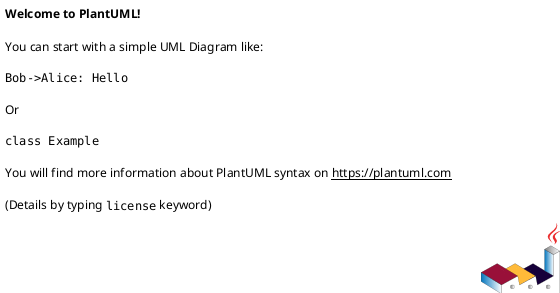

# 作業履歴 2024-08-17

## 概要

2024-08-17の作業内容をまとめています。

## コミット: 6915bc5

### メッセージ

```
build: 依存関係のバージョン更新
- Spring Boot関連の依存関係を最新バージョンに更新
- FlywayDatabasePostgreSQLの依存関係を追加
- Junit Platform Launcherの依存関係を追加
- Jig-erdの依存関係バージョンを固定
```

### 変更されたファイル

- M	build.gradle

### 変更内容

```diff
commit 6915bc53f861e9bfe5b9c7a971ec216b8a608afd
Author: Katuyuki Kakigi <kakimomokuri@gmail.com>
Date:   Sat Aug 17 18:46:36 2024 +0900

    build: 依存関係のバージョン更新
    
    - Spring Boot関連の依存関係を最新バージョンに更新
    - FlywayDatabasePostgreSQLの依存関係を追加
    - Junit Platform Launcherの依存関係を追加
    - Jig-erdの依存関係バージョンを固定

diff --git a/build.gradle b/build.gradle
index 26692b5..832652d 100644
--- a/build.gradle
+++ b/build.gradle
@@ -19,23 +19,23 @@ repositories {
 }
 
 dependencies {
-    implementation 'org.springframework.boot:spring-boot-starter-data-jpa'
-    implementation 'org.springframework.boot:spring-boot-starter-thymeleaf'
-    implementation 'org.springframework.boot:spring-boot-starter-web'
-    implementation 'org.springframework.boot:spring-boot-starter-validation'
-    implementation 'org.springframework.boot:spring-boot-starter-security'
-    implementation 'org.thymeleaf.extras:thymeleaf-extras-springsecurity6'
-    runtimeOnly 'com.h2database:h2'
-    runtimeOnly 'org.postgresql:postgresql'
-    testImplementation 'org.springframework.boot:spring-boot-starter-test'
-    testImplementation 'org.springframework.security:spring-security-test'
-    testRuntimeOnly 'org.junit.platform:junit-platform-launcher'
-    compileOnly 'org.projectlombok:lombok'
-    annotationProcessor 'org.projectlombok:lombok'
-    developmentOnly "org.springframework.boot:spring-boot-devtools"
-    runtimeOnly "org.flywaydb:flyway-core"
+    implementation 'org.springframework.boot:spring-boot-starter-data-jpa:3.3.2'
+    implementation 'org.springframework.boot:spring-boot-starter-thymeleaf:3.3.2'
+    implementation 'org.springframework.boot:spring-boot-starter-web:3.3.2'
+    implementation 'org.springframework.boot:spring-boot-starter-validation:3.3.2'
+    implementation 'org.springframework.boot:spring-boot-starter-security:3.2.8'
+    implementation 'org.thymeleaf.extras:thymeleaf-extras-springsecurity6:3.1.2.RELEASE'
+    runtimeOnly 'com.h2database:h2:2.2.224'
+    runtimeOnly 'org.postgresql:postgresql:42.7.3'
+    runtimeOnly 'org.flywaydb:flyway-core:10.15.0'
     runtimeOnly group: 'org.flywaydb', name: 'flyway-database-postgresql', version: '10.17.1'
-    testImplementation 'com.github.irof:jig-erd:latest.release'
+    developmentOnly 'org.springframework.boot:spring-boot-devtools:3.3.2'
+    testImplementation 'org.springframework.boot:spring-boot-starter-test:3.3.1'
+    testImplementation 'org.springframework.security:spring-security-test:6.3.0'
+    testImplementation 'com.github.irof:jig-erd:0.1.0'
+    testRuntimeOnly 'org.junit.platform:junit-platform-launcher:1.10.3'
+    compileOnly 'org.projectlombok:lombok:1.18.32'
+    annotationProcessor 'org.projectlombok:lombok'
 }
 
 tasks.named('test') {

```

## コミット: 113c4f1

### メッセージ

```
docs: 各クラスとメソッドにJavadocコメントを追加
- ReservationsControllerにコメント追加
- RoleNameにコメント追加
- ReservationUserDetailsServiceにコメント追加
- RoomServiceにコメント追加
- ReservableRoomにコメント追加
- Reservationにコメント追加
- ReservableRoomIdにコメント追加
- MeetingRoomにコメント追加
- Userにコメント追加
- ReservationServiceにコメント追加
- LoginControllerにコメント追加
- RoomsControllerにコメント追加
```

### 変更されたファイル

- M	src/main/java/mrs/app/login/LoginController.java
- M	src/main/java/mrs/app/reservation/ReservationsController.java
- M	src/main/java/mrs/app/room/RoomsController.java
- M	src/main/java/mrs/domain/model/MeetingRoom.java
- M	src/main/java/mrs/domain/model/ReservableRoom.java
- M	src/main/java/mrs/domain/model/ReservableRoomId.java
- M	src/main/java/mrs/domain/model/Reservation.java
- M	src/main/java/mrs/domain/model/RoleName.java
- M	src/main/java/mrs/domain/model/User.java
- M	src/main/java/mrs/domain/service/reservation/ReservationService.java
- M	src/main/java/mrs/domain/service/room/RoomService.java
- M	src/main/java/mrs/domain/service/user/ReservationUserDetailsService.java

### 変更内容

```diff
commit 113c4f1422620b32f72352c634a25a4966e13f62
Author: Katuyuki Kakigi <kakimomokuri@gmail.com>
Date:   Sat Aug 17 18:37:36 2024 +0900

    docs: 各クラスとメソッドにJavadocコメントを追加
    
    - ReservationsControllerにコメント追加
    - RoleNameにコメント追加
    - ReservationUserDetailsServiceにコメント追加
    - RoomServiceにコメント追加
    - ReservableRoomにコメント追加
    - Reservationにコメント追加
    - ReservableRoomIdにコメント追加
    - MeetingRoomにコメント追加
    - Userにコメント追加
    - ReservationServiceにコメント追加
    - LoginControllerにコメント追加
    - RoomsControllerにコメント追加

diff --git a/src/main/java/mrs/app/login/LoginController.java b/src/main/java/mrs/app/login/LoginController.java
index 4c62130..d830926 100644
--- a/src/main/java/mrs/app/login/LoginController.java
+++ b/src/main/java/mrs/app/login/LoginController.java
@@ -3,8 +3,14 @@ package mrs.app.login;
 import org.springframework.stereotype.Controller;
 import org.springframework.web.bind.annotation.RequestMapping;
 
+/**
+ * ログイン画面
+ */
 @Controller
 public class LoginController {
+    /**
+     * ログインフォーム表示
+     */
     @RequestMapping("loginForm")
     String loginForm() {
         return "login/loginForm";
diff --git a/src/main/java/mrs/app/reservation/ReservationsController.java b/src/main/java/mrs/app/reservation/ReservationsController.java
index 8da4dac..64236d0 100644
--- a/src/main/java/mrs/app/reservation/ReservationsController.java
+++ b/src/main/java/mrs/app/reservation/ReservationsController.java
@@ -25,6 +25,9 @@ import java.util.List;
 import java.util.stream.Stream;
 
 
+/**
+ * 会議室予約画面
+ */
 @Controller
 @RequestMapping("reservations/{date}/{roomId}")
 public class ReservationsController {
@@ -41,6 +44,9 @@ public class ReservationsController {
         return form;
     }
 
+    /**
+     * 指定した会議室の予約画面
+     */
     @RequestMapping(method = RequestMethod.GET)
     String reserveForm(@DateTimeFormat(iso = DateTimeFormat.ISO.DATE) @PathVariable("date") LocalDate date, @PathVariable("roomId") Integer roomId, Model model) {
         MeetingRoom meetingRoom = roomService.findMeetingRoom(roomId);
@@ -55,6 +61,9 @@ public class ReservationsController {
         return "reservation/reserveForm";
     }
 
+    /**
+     * 指定した会議室の予約処理
+     */
     @RequestMapping(method = RequestMethod.POST)
     String reserve(@Validated ReservationForm form, BindingResult bindingResult, @AuthenticationPrincipal ReservationUserDetails userDetails, @DateTimeFormat(iso = DateTimeFormat.ISO.DATE) @PathVariable("date") LocalDate date, @PathVariable("roomId") Integer roomId, Model model) {
         if (bindingResult.hasErrors()) {
@@ -78,6 +87,9 @@ public class ReservationsController {
         return "redirect:/reservations/{date}/{roomId}";
     }
 
+    /**
+     * 指定した会議室の予約取消処理
+     */
     @RequestMapping(method = RequestMethod.POST, params = "cancel")
     String cancel(@RequestParam("reservationId") Integer reservationId, @PathVariable("roomId") Integer roomId, @DateTimeFormat(iso = DateTimeFormat.ISO.DATE) @PathVariable("date") LocalDate date, Model model) {
         try {
diff --git a/src/main/java/mrs/app/room/RoomsController.java b/src/main/java/mrs/app/room/RoomsController.java
index 176a953..e649117 100644
--- a/src/main/java/mrs/app/room/RoomsController.java
+++ b/src/main/java/mrs/app/room/RoomsController.java
@@ -13,12 +13,18 @@ import org.springframework.web.bind.annotation.RequestMethod;
 import java.time.LocalDate;
 import java.util.List;
 
+/**
+ * 会議室一覧表示画面
+ */
 @Controller
 @RequestMapping("rooms")
 public class RoomsController {
     @Autowired
     RoomService roomService;
 
+    /**
+     * 今日の予約可能会議室一覧
+     */
     @RequestMapping(method = RequestMethod.GET)
     String listRooms(Model model) {
         LocalDate today = LocalDate.now();
@@ -28,6 +34,9 @@ public class RoomsController {
         return "room/listRooms";
     }
 
+    /**
+     * 特定日付の予約可能会議室一覧
+     */
     @RequestMapping(path = "{date}", method = RequestMethod.GET)
     String listRooms(@DateTimeFormat(iso = DateTimeFormat.ISO.DATE) @PathVariable("date") LocalDate date, Model model) {
         List<ReservableRoom> rooms = roomService.findReservableRooms(date);
diff --git a/src/main/java/mrs/domain/model/MeetingRoom.java b/src/main/java/mrs/domain/model/MeetingRoom.java
index ef4bf2d..a9626d1 100644
--- a/src/main/java/mrs/domain/model/MeetingRoom.java
+++ b/src/main/java/mrs/domain/model/MeetingRoom.java
@@ -8,6 +8,9 @@ import lombok.AllArgsConstructor;
 import lombok.Data;
 import lombok.NoArgsConstructor;
 
+/**
+ * 会議室
+ */
 @Entity
 @Data
 @AllArgsConstructor
diff --git a/src/main/java/mrs/domain/model/ReservableRoom.java b/src/main/java/mrs/domain/model/ReservableRoom.java
index 96df101..3cb2ddb 100644
--- a/src/main/java/mrs/domain/model/ReservableRoom.java
+++ b/src/main/java/mrs/domain/model/ReservableRoom.java
@@ -5,6 +5,9 @@ import lombok.AllArgsConstructor;
 import lombok.Data;
 import lombok.NoArgsConstructor;
 
+/**
+ * 特定の日に予約可能な会議室
+ */
 @Entity
 @Data
 @AllArgsConstructor
diff --git a/src/main/java/mrs/domain/model/ReservableRoomId.java b/src/main/java/mrs/domain/model/ReservableRoomId.java
index aab4e75..6efd803 100644
--- a/src/main/java/mrs/domain/model/ReservableRoomId.java
+++ b/src/main/java/mrs/domain/model/ReservableRoomId.java
@@ -9,6 +9,9 @@ import lombok.Value;
 import java.io.Serializable;
 import java.time.LocalDate;
 
+/**
+ * 予約可能な会議室のID
+ */
 @Getter
 @Value
 @AllArgsConstructor
diff --git a/src/main/java/mrs/domain/model/Reservation.java b/src/main/java/mrs/domain/model/Reservation.java
index f677399..63a17d4 100644
--- a/src/main/java/mrs/domain/model/Reservation.java
+++ b/src/main/java/mrs/domain/model/Reservation.java
@@ -9,6 +9,9 @@ import java.io.Serializable;
 import java.time.LocalTime;
 import java.util.Objects;
 
+/**
+ * 予約情報
+ */
 @Entity
 @Data
 @AllArgsConstructor
diff --git a/src/main/java/mrs/domain/model/RoleName.java b/src/main/java/mrs/domain/model/RoleName.java
index b76495b..7f76c54 100644
--- a/src/main/java/mrs/domain/model/RoleName.java
+++ b/src/main/java/mrs/domain/model/RoleName.java
@@ -1,5 +1,8 @@
 package mrs.domain.model;
 
+/**
+ * ロール名
+ */
 public enum RoleName {
     ADMIN, USER
 }
diff --git a/src/main/java/mrs/domain/model/User.java b/src/main/java/mrs/domain/model/User.java
index fb51244..09a4c1e 100644
--- a/src/main/java/mrs/domain/model/User.java
+++ b/src/main/java/mrs/domain/model/User.java
@@ -7,6 +7,9 @@ import lombok.NoArgsConstructor;
 
 import java.io.Serializable;
 
+/**
+ * ユーザー
+ */
 @Entity
 @Table(name = "usr")
 @Data
diff --git a/src/main/java/mrs/domain/service/reservation/ReservationService.java b/src/main/java/mrs/domain/service/reservation/ReservationService.java
index ae2b068..72ab843 100644
--- a/src/main/java/mrs/domain/service/reservation/ReservationService.java
+++ b/src/main/java/mrs/domain/service/reservation/ReservationService.java
@@ -13,6 +13,9 @@ import org.springframework.transaction.annotation.Transactional;
 
 import java.util.List;
 
+/**
+ * 会議室予約サービス
+ */
 @Service
 @Transactional
 public class ReservationService {
@@ -21,10 +24,16 @@ public class ReservationService {
     @Autowired
     ReservableRoomRepository reservableRoomRepository;
 
+    /**
+     * 予約一覧を取得する
+     */
     public List<Reservation> findReservations(ReservableRoomId reservableRoomId) {
         return reservationRepository.findByReservableRoom_ReservableRoomIdOrderByStartTimeAsc(reservableRoomId);
     }
 
+    /**
+     * 予約を行う
+     */
     public Reservation reserve(Reservation reservation) {
         ReservableRoomId reservableRoomId = reservation.getReservableRoom().getReservableRoomId();
         ReservableRoom reservable = reservableRoomRepository.findOneForUpdateByReservableRoomId(reservableRoomId);
@@ -41,11 +50,17 @@ public class ReservationService {
         return reservation;
     }
 
+    /**
+     * 予約を取消す
+     */
     @PreAuthorize("hasRole('ADMIN') or #reservation.user.userId == principal.user.userId")
     public void cancel(@P("reservation") Reservation reservation) {
         reservationRepository.delete(reservation);
     }
 
+    /**
+     * 予約情報を取得する
+     */
     public Reservation findOne(Integer reservationId) {
         Reservation reservation = reservationRepository.findById(reservationId).orElse(null);
         if (reservation == null) {
diff --git a/src/main/java/mrs/domain/service/room/RoomService.java b/src/main/java/mrs/domain/service/room/RoomService.java
index 71fde28..b33e425 100644
--- a/src/main/java/mrs/domain/service/room/RoomService.java
+++ b/src/main/java/mrs/domain/service/room/RoomService.java
@@ -11,6 +11,9 @@ import org.springframework.transaction.annotation.Transactional;
 import java.time.LocalDate;
 import java.util.List;
 
+/**
+ * 会議室サービス
+ */
 @Service
 @Transactional
 public class RoomService {
@@ -19,6 +22,9 @@ public class RoomService {
     @Autowired
     MeetingRoomRepository meetingRoomRepository;
 
+    /**
+     * 会議室を取得する
+     */
     public MeetingRoom findMeetingRoom(Integer roomId) {
         MeetingRoom meetingRoom = meetingRoomRepository.findById(roomId).orElse(null);
         if (meetingRoom == null) {
@@ -27,6 +33,9 @@ public class RoomService {
         return meetingRoom;
     }
 
+    /**
+     * 予約可能会議室を取得する
+     */
     public List<ReservableRoom> findReservableRooms(LocalDate date) {
         return reservableRoomRepository.findByReservableRoomId_reservedDateOrderByReservableRoomId_roomIdAsc(date);
     }
diff --git a/src/main/java/mrs/domain/service/user/ReservationUserDetailsService.java b/src/main/java/mrs/domain/service/user/ReservationUserDetailsService.java
index c8c093c..46534dd 100644
--- a/src/main/java/mrs/domain/service/user/ReservationUserDetailsService.java
+++ b/src/main/java/mrs/domain/service/user/ReservationUserDetailsService.java
@@ -8,11 +8,17 @@ import org.springframework.security.core.userdetails.UserDetailsService;
 import org.springframework.security.core.userdetails.UsernameNotFoundException;
 import org.springframework.stereotype.Service;
 
+/**
+ * 認証サービス
+ */
 @Service
 public class ReservationUserDetailsService implements UserDetailsService {
     @Autowired
     UserRepository userRepository;
 
+    /**
+     * ユーザー情報を取得する
+     */
     @Override
     public UserDetails loadUserByUsername(String username) throws UsernameNotFoundException {
         User user = userRepository.findById(username).orElseThrow(() -> new UsernameNotFoundException(username + " is not found."));

```

### 構造変更



## コミット: b3c878d

### メッセージ

```
feat: JIGセットアップ
- jig.propertiesを追加
- Erdテストクラスを追加
- jig-erdのGradleプラグインと依存関係を追加
```

### 変更されたファイル

- M	build.gradle
- A	src/test/java/mrs/Erd.java
- A	src/test/resources/jig.properties

### 変更内容

```diff
commit b3c878d75ad08ec67d5957591af2ac7ac19b1dab
Author: Katuyuki Kakigi <kakimomokuri@gmail.com>
Date:   Sat Aug 17 18:14:59 2024 +0900

    feat: JIGセットアップ
    
    - jig.propertiesを追加
    - Erdテストクラスを追加
    - jig-erdのGradleプラグインと依存関係を追加

diff --git a/build.gradle b/build.gradle
index f682201..26692b5 100644
--- a/build.gradle
+++ b/build.gradle
@@ -2,6 +2,7 @@ plugins {
     id 'java'
     id 'org.springframework.boot' version '3.3.2'
     id 'io.spring.dependency-management' version '1.1.6'
+    id 'org.dddjava.jig-gradle-plugin' version '2024.7.2'
 }
 
 group = 'com.example'
@@ -34,6 +35,7 @@ dependencies {
     developmentOnly "org.springframework.boot:spring-boot-devtools"
     runtimeOnly "org.flywaydb:flyway-core"
     runtimeOnly group: 'org.flywaydb', name: 'flyway-database-postgresql', version: '10.17.1'
+    testImplementation 'com.github.irof:jig-erd:latest.release'
 }
 
 tasks.named('test') {
diff --git a/src/test/java/mrs/Erd.java b/src/test/java/mrs/Erd.java
new file mode 100644
index 0000000..386bf3c
--- /dev/null
+++ b/src/test/java/mrs/Erd.java
@@ -0,0 +1,17 @@
+package mrs;
+
+import jig.erd.JigErd;
+import org.junit.jupiter.api.Test;
+import org.springframework.beans.factory.annotation.Autowired;
+import org.springframework.boot.test.context.SpringBootTest;
+
+import javax.sql.DataSource;
+
+@SpringBootTest
+public class Erd {
+
+    @Test
+    void run(@Autowired DataSource dataSource) {
+        JigErd.run(dataSource);
+    }
+}
diff --git a/src/test/resources/jig.properties b/src/test/resources/jig.properties
new file mode 100644
index 0000000..61e52b6
--- /dev/null
+++ b/src/test/resources/jig.properties
@@ -0,0 +1,3 @@
+jig.erd.output.directory=./build/jig-erd
+jig.erd.output.prefix=library-er
+jig.erd.output.format=png

```

## コミット: 4a1baf1

### メッセージ

```
build: herokuセットアップ
ProcfileをJavaアプリに変更
- Procfileのwebコマンド更新
- system.propertiesファイル追加
```

### 変更されたファイル

- M	Procfile
- A	system.properties

### 変更内容

```diff
commit 4a1baf1cf052c71ebce455f651aa2a90c2c7ea0a
Author: Katuyuki Kakigi <kakimomokuri@gmail.com>
Date:   Sat Aug 17 17:52:26 2024 +0900

    build: herokuセットアップ
    
    ProcfileをJavaアプリに変更
    - Procfileのwebコマンド更新
    - system.propertiesファイル追加

diff --git a/Procfile b/Procfile
index b6e64b3..e7e1f1a 100644
--- a/Procfile
+++ b/Procfile
@@ -1 +1 @@
-web: npx http-server -p $PORT
\ No newline at end of file
+web: java -jar build/libs/mrs-0.0.1-SNAPSHOT.jar --server.port=$PORT
diff --git a/system.properties b/system.properties
new file mode 100644
index 0000000..eafd676
--- /dev/null
+++ b/system.properties
@@ -0,0 +1 @@
+java.runtime.version=17

```

## コミット: 06b533a

### メッセージ

```
Merge pull request #1 from k2works/develop
チュートリアル
```

### 変更されたファイル


### 変更内容

```diff
commit 06b533a60152519c48a4a934563d72eae46cfb6c
Merge: 3c92cc8 a32f6b6
Author: Katuyuki Kakigi <kakimomokuri@gmail.com>
Date:   Sat Aug 17 17:32:11 2024 +0900

    Merge pull request #1 from k2works/develop
    
    チュートリアル


```

## コミット: a32f6b6

### メッセージ

```
build: flywayセットアップ
- PostgreSQLバージョンアップ (15 → 16)
- データベース初期化スクリプトをFlywayに移行
- dev/prd環境の設定ファイル追加
- Build.gradleにFlyway依存関係追加
- H2データベース設定を変更
```

### 変更されたファイル

- M	build.gradle
- M	docker-compose.yml
- A	src/main/resources/application-prd.properties
- M	src/main/resources/application.properties
- A	src/main/resources/db/migration/prd/V1.00__shema_startup.sql
- A	src/main/resources/db/migration/prd/V1.01__data_startup.sql

### 変更内容

```diff
commit a32f6b672a011842124a6500efa0214dfd84465f
Author: Katuyuki Kakigi <kakimomokuri@gmail.com>
Date:   Sat Aug 17 17:29:25 2024 +0900

    build: flywayセットアップ
    
    - PostgreSQLバージョンアップ (15 → 16)
    - データベース初期化スクリプトをFlywayに移行
    - dev/prd環境の設定ファイル追加
    - Build.gradleにFlyway依存関係追加
    - H2データベース設定を変更

diff --git a/build.gradle b/build.gradle
index 9a4d244..f682201 100644
--- a/build.gradle
+++ b/build.gradle
@@ -32,6 +32,8 @@ dependencies {
     compileOnly 'org.projectlombok:lombok'
     annotationProcessor 'org.projectlombok:lombok'
     developmentOnly "org.springframework.boot:spring-boot-devtools"
+    runtimeOnly "org.flywaydb:flyway-core"
+    runtimeOnly group: 'org.flywaydb', name: 'flyway-database-postgresql', version: '10.17.1'
 }
 
 tasks.named('test') {
diff --git a/docker-compose.yml b/docker-compose.yml
index 9d92bc6..8acf58d 100644
--- a/docker-compose.yml
+++ b/docker-compose.yml
@@ -18,7 +18,7 @@ services:
     command: --sql_mode=""
 
   db_postgresql:
-    image: postgres:15
+    image: postgres:16
     ports:
       - "5432:5432"
     volumes:
diff --git a/src/main/resources/application-prd.properties b/src/main/resources/application-prd.properties
new file mode 100644
index 0000000..ea17845
--- /dev/null
+++ b/src/main/resources/application-prd.properties
@@ -0,0 +1,13 @@
+spring.application.name=mrs
+spring.jpa.database=postgresql
+spring.datasource.url=jdbc:postgresql://localhost:5432/mrs
+spring.datasource.username=root
+spring.datasource.password=password
+spring.jpa.hibernate.ddl-auto=validate
+spring.jpa.properties.hibernate.forma_sql=true
+spring.datasource.driver-class-name=org.postgresql.Driver
+spring.sql.init.encoding=UTF-8
+logging.level.org.hibernate.SQL=DEBUG
+logging.level.org.hibernate.type.descriptor.sql.BasicBinder=TRACE
+spring.sql.init.mode=always
+spring.flyway.locations=classpath:/db/migration/prd
diff --git a/src/main/resources/application.properties b/src/main/resources/application.properties
index b7682f5..ec61ffc 100644
--- a/src/main/resources/application.properties
+++ b/src/main/resources/application.properties
@@ -1,12 +1,10 @@
-spring.application.name=mrs
-spring.jpa.database=postgresql
-spring.datasource.url=jdbc:postgresql://localhost:5432/mrs
-spring.datasource.username=root
-spring.datasource.password=password
+spring.datasource.driver-class-name=org.h2.Driver
+spring.datasource.url=jdbc:h2:mem:mrsdb;MODE=PostgreSQL
+spring.datasource.username=sa
+spring.datasource.password=sa
+spring.h2.console.enabled=true
 spring.jpa.hibernate.ddl-auto=validate
 spring.jpa.properties.hibernate.forma_sql=true
-spring.datasource.driver-class-name=org.postgresql.Driver
-spring.sql.init.encoding=UTF-8
 logging.level.org.hibernate.SQL=DEBUG
 logging.level.org.hibernate.type.descriptor.sql.BasicBinder=TRACE
-spring.sql.init.mode=always
+spring.flyway.locations=classpath:/db/migration/dev
diff --git a/src/main/resources/schema.sql b/src/main/resources/db/migration/dev/V1.00__shema_startup.sql
similarity index 100%
rename from src/main/resources/schema.sql
rename to src/main/resources/db/migration/dev/V1.00__shema_startup.sql
diff --git a/src/main/resources/data.sql b/src/main/resources/db/migration/dev/V1.01__data_startup.sql
similarity index 100%
rename from src/main/resources/data.sql
rename to src/main/resources/db/migration/dev/V1.01__data_startup.sql
diff --git a/src/main/resources/db/migration/prd/V1.00__shema_startup.sql b/src/main/resources/db/migration/prd/V1.00__shema_startup.sql
new file mode 100644
index 0000000..a3dcb0a
--- /dev/null
+++ b/src/main/resources/db/migration/prd/V1.00__shema_startup.sql
@@ -0,0 +1,39 @@
+DROP TABLE IF EXISTS meeting_room CASCADE;
+DROP TABLE IF EXISTS reservable_room CASCADE;
+DROP TABLE IF EXISTS reservation CASCADE;
+DROP TABLE IF EXISTS usr CASCADE;
+
+CREATE TABLE meeting_room
+(
+    room_id   SERIAL       NOT NULL,
+    room_name VARCHAR(255) NOT NULL,
+    PRIMARY KEY (room_id)
+);
+CREATE TABLE reservable_room
+(
+    reserved_date DATE NOT NULL,
+    room_id       INT4 NOT NULL,
+    PRIMARY KEY (reserved_date, room_id),
+    FOREIGN KEY (room_id) REFERENCES meeting_room
+);
+CREATE TABLE usr
+(
+    user_id    VARCHAR(255) NOT NULL,
+    first_name VARCHAR(255) NOT NULL,
+    last_name  VARCHAR(255) NOT NULL,
+    password   VARCHAR(255) NOT NULL,
+    role_name  VARCHAR(255) NOT NULL,
+    PRIMARY KEY (user_id)
+);
+CREATE TABLE reservation
+(
+    reservation_id SERIAL       NOT NULL,
+    end_time       TIME         NOT NULL,
+    start_time     TIME         NOT NULL,
+    reserved_date  DATE         NOT NULL,
+    room_id        INT4         NOT NULL,
+    user_id        VARCHAR(255) NOT NULL,
+    PRIMARY KEY (reservation_id),
+    FOREIGN KEY (reserved_date, room_id) REFERENCES reservable_room,
+    FOREIGN KEY (user_id) REFERENCES usr
+);
diff --git a/src/main/resources/db/migration/prd/V1.01__data_startup.sql b/src/main/resources/db/migration/prd/V1.01__data_startup.sql
new file mode 100644
index 0000000..ee1feca
--- /dev/null
+++ b/src/main/resources/db/migration/prd/V1.01__data_startup.sql
@@ -0,0 +1,39 @@
+-- 会議室
+INSERT INTO meeting_room (room_name)
+VALUES ('新木場');
+INSERT INTO meeting_room (room_name)
+VALUES ('辰巳');
+INSERT INTO meeting_room (room_name)
+VALUES ('豊洲');
+INSERT INTO meeting_room (room_name)
+VALUES ('月島');
+INSERT INTO meeting_room (room_name)
+VALUES ('新富町');
+INSERT INTO meeting_room (room_name)
+VALUES ('銀座一丁目');
+INSERT INTO meeting_room (room_name)
+VALUES ('有楽町');
+
+-- 会議室の予約可能日(room_idが2〜6用のSQLは省略
+-- room_id=1(新木場)の予約可能日
+INSERT INTO reservable_room(reserved_date, room_id)
+VALUES (CURRENT_DATE, 1);
+INSERT INTO reservable_room(reserved_date, room_id)
+VALUES (CURRENT_DATE + 1, 1);
+INSERT INTO reservable_room(reserved_date, room_id)
+VALUES (CURRENT_DATE - 1, 1);
+-- room_id=7(有楽町)の予約可能日
+INSERT INTO reservable_room(reserved_date, room_id)
+VALUES (CURRENT_DATE, 7);
+INSERT INTO reservable_room(reserved_date, room_id)
+VALUES (CURRENT_DATE + 1, 7);
+INSERT INTO reservable_room(reserved_date, room_id)
+VALUES (CURRENT_DATE - 1, 7);
+
+-- 認証確認用のテストユーザー(password = demo)
+INSERT INTO usr (user_id, first_name, last_name, role_name, password)
+VALUES ('aaaa', 'Aaa', 'Aaa', 'USER', '$2a$10$oxSJl.keBwxmsMLkcT9lPeAIxfNTPNQxpeywMrF7A3kVszwUTqfTK');
+INSERT INTO usr (user_id, first_name, last_name, role_name, password)
+VALUES ('bbbb', 'Bbb', 'Bbb', 'USER', '$2a$10$oxSJl.keBwxmsMLkcT9lPeAIxfNTPNQxpeywMrF7A3kVszwUTqfTK');
+INSERT INTO usr (user_id, first_name, last_name, role_name, password)
+VALUES ('cccc', 'Ccc', 'Ccc', 'ADMIN', '$2a$10$oxSJl.keBwxmsMLkcT9lPeAIxfNTPNQxpeywMrF7A3kVszwUTqfTK');

```

## コミット: 93eb645

### メッセージ

```
feat: ログイン機能の実装
- ユーザー権限のモックデータ修正
- 予約キャンセルのサービスロジック修正
- コントローラーに予約取得メソッド追加
- 不要なテスト削除
```

### 変更されたファイル

- M	src/main/java/mrs/app/reservation/ReservationsController.java
- M	src/main/java/mrs/domain/service/reservation/ReservationService.java
- M	src/test/java/mrs/app/reservation/ReservationsControllerTest.java
- M	src/test/java/mrs/domain/service/reservation/ReservationServiceTest.java

### 変更内容

```diff
commit 93eb6450e8dda1727c57b3bad4678ac04897fae9
Author: Katuyuki Kakigi <kakimomokuri@gmail.com>
Date:   Sat Aug 17 16:39:14 2024 +0900

    feat: ログイン機能の実装
    
    - ユーザー権限のモックデータ修正
    - 予約キャンセルのサービスロジック修正
    - コントローラーに予約取得メソッド追加
    - 不要なテスト削除

diff --git a/src/main/java/mrs/app/reservation/ReservationsController.java b/src/main/java/mrs/app/reservation/ReservationsController.java
index 5775a30..8da4dac 100644
--- a/src/main/java/mrs/app/reservation/ReservationsController.java
+++ b/src/main/java/mrs/app/reservation/ReservationsController.java
@@ -1,6 +1,9 @@
 package mrs.app.reservation;
 
-import mrs.domain.model.*;
+import mrs.domain.model.MeetingRoom;
+import mrs.domain.model.ReservableRoom;
+import mrs.domain.model.ReservableRoomId;
+import mrs.domain.model.Reservation;
 import mrs.domain.service.reservation.AlreadyReservedException;
 import mrs.domain.service.reservation.ReservationService;
 import mrs.domain.service.reservation.UnavailableReservationException;
@@ -76,10 +79,10 @@ public class ReservationsController {
     }
 
     @RequestMapping(method = RequestMethod.POST, params = "cancel")
-    String cancel(@AuthenticationPrincipal ReservationUserDetails userDetails, @RequestParam("reservationId") Integer reservationId, @PathVariable("roomId") Integer roomId, @DateTimeFormat(iso = DateTimeFormat.ISO.DATE) @PathVariable("date") LocalDate date, Model model) {
-        User user = userDetails.getUser();
+    String cancel(@RequestParam("reservationId") Integer reservationId, @PathVariable("roomId") Integer roomId, @DateTimeFormat(iso = DateTimeFormat.ISO.DATE) @PathVariable("date") LocalDate date, Model model) {
         try {
-            reservationService.cancel(reservationId, user);
+            Reservation reservation = reservationService.findOne(reservationId);
+            reservationService.cancel(reservation);
         } catch (AccessDeniedException e) {
             model.addAttribute("error", e.getMessage());
             return reserveForm(date, roomId, model);
diff --git a/src/main/java/mrs/domain/service/reservation/ReservationService.java b/src/main/java/mrs/domain/service/reservation/ReservationService.java
index fbad488..ae2b068 100644
--- a/src/main/java/mrs/domain/service/reservation/ReservationService.java
+++ b/src/main/java/mrs/domain/service/reservation/ReservationService.java
@@ -1,15 +1,17 @@
 package mrs.domain.service.reservation;
 
-import mrs.domain.model.*;
+import mrs.domain.model.ReservableRoom;
+import mrs.domain.model.ReservableRoomId;
+import mrs.domain.model.Reservation;
 import mrs.domain.repository.reservation.ReservationRepository;
 import mrs.domain.repository.room.ReservableRoomRepository;
 import org.springframework.beans.factory.annotation.Autowired;
-import org.springframework.security.access.AccessDeniedException;
+import org.springframework.security.access.prepost.PreAuthorize;
+import org.springframework.security.core.parameters.P;
 import org.springframework.stereotype.Service;
 import org.springframework.transaction.annotation.Transactional;
 
 import java.util.List;
-import java.util.Objects;
 
 @Service
 @Transactional
@@ -39,14 +41,16 @@ public class ReservationService {
         return reservation;
     }
 
-    public void cancel(Integer reservationId, User requestUser) {
+    @PreAuthorize("hasRole('ADMIN') or #reservation.user.userId == principal.user.userId")
+    public void cancel(@P("reservation") Reservation reservation) {
+        reservationRepository.delete(reservation);
+    }
+
+    public Reservation findOne(Integer reservationId) {
         Reservation reservation = reservationRepository.findById(reservationId).orElse(null);
         if (reservation == null) {
             throw new IllegalStateException("予約が見つかりません。");
         }
-        if (RoleName.ADMIN != requestUser.getRoleName() && !Objects.equals(reservation.getUser().getUserId(), requestUser.getUserId())) {
-            throw new AccessDeniedException("要求されたキャンセルは許可できません。");
-        }
-        reservationRepository.delete(reservation);
+        return reservation;
     }
 }
diff --git a/src/test/java/mrs/app/reservation/ReservationsControllerTest.java b/src/test/java/mrs/app/reservation/ReservationsControllerTest.java
index b835d9a..5578d1f 100644
--- a/src/test/java/mrs/app/reservation/ReservationsControllerTest.java
+++ b/src/test/java/mrs/app/reservation/ReservationsControllerTest.java
@@ -187,14 +187,14 @@ public class ReservationsControllerTest {
     }
 
     @Test
-    @WithMockUser(username = "user", roles = "USER")  // この行を追加
+    @WithMockUser(username = "taro-yamada", roles = "USER")  // この行を追加
     @DisplayName("権限のない予約をキャンセルしようとした場合、エラーメッセージと共にフォームが再読み込みされるべきである")
-    public void testCancel_NonExistentReservation() throws Exception {
+    public void testCancel_NonExistentReservation_() throws Exception {
         Integer roomId = 1;
         Integer reservationId = 1;
         LocalDate date = LocalDate.of(2022, 2, 22);
         String errorMessage = "要求されたキャンセルは許可できません。";
-        doThrow(new AccessDeniedException(errorMessage)).when(reservationService).cancel(eq(reservationId), any(User.class));
+        doThrow(new AccessDeniedException(errorMessage)).when(reservationService).findOne(eq(reservationId));
         MeetingRoom meetingRoom = new MeetingRoom(roomId, "Room-1");
         given(roomService.findMeetingRoom(roomId)).willReturn(meetingRoom);
 
@@ -219,7 +219,7 @@ public class ReservationsControllerTest {
     @Test
     @WithMockUser(username = "user", roles = "USER")  // この行を追加
     @DisplayName("予約のキャンセルが成功した場合、ページは更新された予約一覧にリダイレクトされるべきである")
-    public void testCancel_SuccessfulCancellation() throws Exception {
+    public void testCancel_SuccessfulCancellation_() throws Exception {
         Integer roomId = 1;
         Integer reservationId = 1;
         LocalDate date = LocalDate.of(2022, 2, 22);
diff --git a/src/test/java/mrs/domain/service/reservation/ReservationServiceTest.java b/src/test/java/mrs/domain/service/reservation/ReservationServiceTest.java
index 0d2cc7c..8b9419b 100644
--- a/src/test/java/mrs/domain/service/reservation/ReservationServiceTest.java
+++ b/src/test/java/mrs/domain/service/reservation/ReservationServiceTest.java
@@ -133,7 +133,7 @@ public class ReservationServiceTest {
 
         when(reservationRepository.findById(reservationId)).thenReturn(Optional.of(reservation));
 
-        reservationService.cancel(reservationId, requestUser);
+        reservationService.cancel(reservation);
         verify(reservationRepository, times(1)).delete(reservation);
     }
 
@@ -148,28 +148,7 @@ public class ReservationServiceTest {
         when(reservationRepository.findById(reservationId)).thenReturn(Optional.empty());
 
         assertThrows(IllegalStateException.class, () -> {
-            reservationService.cancel(reservationId, requestUser);
-        });
-    }
-
-    @Test
-    @DisplayName("他のユーザーの予約を権限のないユーザーがキャンセルしようとするとエラーが発生する")
-    public void shouldThrowErrorWhenCancelingOtherUsersReservation() {
-        int reservationId = 1;
-        User requestUser = new User();
-        requestUser.setUserId("user1");
-        requestUser.setRoleName(RoleName.USER);
-        User owner = new User();
-        owner.setUserId("user2");
-        owner.setRoleName(RoleName.USER);
-        Reservation reservation = new Reservation();
-        reservation.setUser(owner);
-        reservation.setReservationId(reservationId);
-
-        when(reservationRepository.findById(reservationId)).thenReturn(Optional.of(reservation));
-
-        assertThrows(IllegalStateException.class, () -> {
-            reservationService.cancel(reservationId, requestUser);
+            reservationService.findOne(reservationId);
         });
     }
 
@@ -189,7 +168,7 @@ public class ReservationServiceTest {
 
         when(reservationRepository.findById(reservationId)).thenReturn(Optional.of(reservation));
 
-        reservationService.cancel(reservationId, requestUser);
+        reservationService.cancel(reservation);
         verify(reservationRepository, times(1)).delete(reservation);
     }
 }

```

### 構造変更


## コミット: 6006fc0

### メッセージ

```
feat: ログイン機能の実装
- ReservationsControllerTestにユーザー詳細のモック追加
- 持ち主確認とADMIN権限による予約キャンセルのロジック修正
- ThymeleafテンプレートにSpring Securityタグを追加
- build.gradleにThymeleaf Security依存関係を追加
```

### 変更されたファイル

- M	build.gradle
- M	src/main/java/mrs/app/reservation/ReservationsController.java
- M	src/main/java/mrs/domain/service/reservation/ReservationService.java
- M	src/main/resources/templates/reservation/reserveForm.html
- M	src/test/java/mrs/app/reservation/ReservationsControllerTest.java

### 変更内容

```diff
commit 6006fc0b88cc91b91af5ef5891a40a17a7cf44c9
Author: Katuyuki Kakigi <kakimomokuri@gmail.com>
Date:   Sat Aug 17 16:07:09 2024 +0900

    feat: ログイン機能の実装
    
    - ReservationsControllerTestにユーザー詳細のモック追加
    - 持ち主確認とADMIN権限による予約キャンセルのロジック修正
    - ThymeleafテンプレートにSpring Securityタグを追加
    - build.gradleにThymeleaf Security依存関係を追加

diff --git a/build.gradle b/build.gradle
index e8fcaea..9a4d244 100644
--- a/build.gradle
+++ b/build.gradle
@@ -23,6 +23,7 @@ dependencies {
     implementation 'org.springframework.boot:spring-boot-starter-web'
     implementation 'org.springframework.boot:spring-boot-starter-validation'
     implementation 'org.springframework.boot:spring-boot-starter-security'
+    implementation 'org.thymeleaf.extras:thymeleaf-extras-springsecurity6'
     runtimeOnly 'com.h2database:h2'
     runtimeOnly 'org.postgresql:postgresql'
     testImplementation 'org.springframework.boot:spring-boot-starter-test'
@@ -30,7 +31,7 @@ dependencies {
     testRuntimeOnly 'org.junit.platform:junit-platform-launcher'
     compileOnly 'org.projectlombok:lombok'
     annotationProcessor 'org.projectlombok:lombok'
-    developmentOnly("org.springframework.boot:spring-boot-devtools")
+    developmentOnly "org.springframework.boot:spring-boot-devtools"
 }
 
 tasks.named('test') {
diff --git a/src/main/java/mrs/app/reservation/ReservationsController.java b/src/main/java/mrs/app/reservation/ReservationsController.java
index 0663634..5775a30 100644
--- a/src/main/java/mrs/app/reservation/ReservationsController.java
+++ b/src/main/java/mrs/app/reservation/ReservationsController.java
@@ -5,8 +5,11 @@ import mrs.domain.service.reservation.AlreadyReservedException;
 import mrs.domain.service.reservation.ReservationService;
 import mrs.domain.service.reservation.UnavailableReservationException;
 import mrs.domain.service.room.RoomService;
+import mrs.domain.service.user.ReservationUserDetails;
 import org.springframework.beans.factory.annotation.Autowired;
 import org.springframework.format.annotation.DateTimeFormat;
+import org.springframework.security.access.AccessDeniedException;
+import org.springframework.security.core.annotation.AuthenticationPrincipal;
 import org.springframework.stereotype.Controller;
 import org.springframework.ui.Model;
 import org.springframework.validation.BindingResult;
@@ -46,12 +49,11 @@ public class ReservationsController {
         model.addAttribute("room", meetingRoom);
         model.addAttribute("reservations", reservations);
         model.addAttribute("timeList", timeList);
-        model.addAttribute("user", dummyUser());
         return "reservation/reserveForm";
     }
 
     @RequestMapping(method = RequestMethod.POST)
-    String reserve(@Validated ReservationForm form, BindingResult bindingResult, @DateTimeFormat(iso = DateTimeFormat.ISO.DATE) @PathVariable("date") LocalDate date, @PathVariable("roomId") Integer roomId, Model model) {
+    String reserve(@Validated ReservationForm form, BindingResult bindingResult, @AuthenticationPrincipal ReservationUserDetails userDetails, @DateTimeFormat(iso = DateTimeFormat.ISO.DATE) @PathVariable("date") LocalDate date, @PathVariable("roomId") Integer roomId, Model model) {
         if (bindingResult.hasErrors()) {
             return reserveForm(date, roomId, model);
         }
@@ -61,7 +63,7 @@ public class ReservationsController {
         reservation.setStartTime(form.getStartTime());
         reservation.setEndTime(form.getEndTime());
         reservation.setReservableRoom(reservableRoom);
-        reservation.setUser(dummyUser());
+        reservation.setUser(userDetails.getUser());
 
         try {
             reservationService.reserve(reservation);
@@ -74,23 +76,14 @@ public class ReservationsController {
     }
 
     @RequestMapping(method = RequestMethod.POST, params = "cancel")
-    String cancel(@RequestParam("reservationId") Integer reservationId, @PathVariable("roomId") Integer roomId, @DateTimeFormat(iso = DateTimeFormat.ISO.DATE) @PathVariable("date") LocalDate date, Model model) {
-        User user = dummyUser();
+    String cancel(@AuthenticationPrincipal ReservationUserDetails userDetails, @RequestParam("reservationId") Integer reservationId, @PathVariable("roomId") Integer roomId, @DateTimeFormat(iso = DateTimeFormat.ISO.DATE) @PathVariable("date") LocalDate date, Model model) {
+        User user = userDetails.getUser();
         try {
             reservationService.cancel(reservationId, user);
-        } catch (IllegalStateException e) {
+        } catch (AccessDeniedException e) {
             model.addAttribute("error", e.getMessage());
             return reserveForm(date, roomId, model);
         }
         return "redirect:/reservations/{date}/{roomId}";
     }
-
-    private User dummyUser() {
-        User user = new User();
-        user.setUserId("taro-yamada");
-        user.setFirstName("太郎");
-        user.setLastName("山田");
-        user.setRoleName(RoleName.USER);
-        return user;
-    }
 }
diff --git a/src/main/java/mrs/domain/service/reservation/ReservationService.java b/src/main/java/mrs/domain/service/reservation/ReservationService.java
index 8bd0564..fbad488 100644
--- a/src/main/java/mrs/domain/service/reservation/ReservationService.java
+++ b/src/main/java/mrs/domain/service/reservation/ReservationService.java
@@ -4,6 +4,7 @@ import mrs.domain.model.*;
 import mrs.domain.repository.reservation.ReservationRepository;
 import mrs.domain.repository.room.ReservableRoomRepository;
 import org.springframework.beans.factory.annotation.Autowired;
+import org.springframework.security.access.AccessDeniedException;
 import org.springframework.stereotype.Service;
 import org.springframework.transaction.annotation.Transactional;
 
@@ -44,7 +45,7 @@ public class ReservationService {
             throw new IllegalStateException("予約が見つかりません。");
         }
         if (RoleName.ADMIN != requestUser.getRoleName() && !Objects.equals(reservation.getUser().getUserId(), requestUser.getUserId())) {
-            throw new IllegalStateException("要求されたキャンセルは許可できません。");
+            throw new AccessDeniedException("要求されたキャンセルは許可できません。");
         }
         reservationRepository.delete(reservation);
     }
diff --git a/src/main/resources/templates/reservation/reserveForm.html b/src/main/resources/templates/reservation/reserveForm.html
index 3e40d7b..8dd8cf3 100644
--- a/src/main/resources/templates/reservation/reserveForm.html
+++ b/src/main/resources/templates/reservation/reserveForm.html
@@ -1,10 +1,12 @@
 <!DOCTYPE html>
-<html xmlns="http://www.w3.org/1999/xhtml" xmlns:th="http://www.thymeleaf.org">
+<html xmlns="http://www.w3.org/1999/xhtml"
+      xmlns:sec="http://www.thymeleaf.org/extras/spring-security"
+      xmlns:th="http://www.thymeleaf.org">
 <head>
     <meta charset="UTF-8">
     <title th:text="|${#temporals.format(date, 'yyyy/M/d')}の会議室|">2016/5/20の会議室</title>
 </head>
-<body>
+<body th:with="user=${#authentication.principal.user}">
 
 <div>
     <a th:href="@{'/rooms/' + ${date}}">会議室一覧へ</a>
@@ -52,7 +54,7 @@
         </td>
         <td>
             <form method="post" th:action="@{'/reservations/' + ${date} + '/' + ${roomId}}"
-                  th:if="${user.userId == reservation.user.userId}">
+                  sec:authorize="${hasRole('ADMIN') or #vars.user.userId == #vars.reservation.user.userId}">
                 <input name="reservationId" th:value="${reservation.reservationId}" type="hidden"/>
                 <input name="cancel" type="submit" value="取消">
             </form>
diff --git a/src/test/java/mrs/app/reservation/ReservationsControllerTest.java b/src/test/java/mrs/app/reservation/ReservationsControllerTest.java
index 522e0a3..b835d9a 100644
--- a/src/test/java/mrs/app/reservation/ReservationsControllerTest.java
+++ b/src/test/java/mrs/app/reservation/ReservationsControllerTest.java
@@ -4,6 +4,8 @@ import mrs.domain.model.*;
 import mrs.domain.service.reservation.ReservationService;
 import mrs.domain.service.reservation.UnavailableReservationException;
 import mrs.domain.service.room.RoomService;
+import mrs.domain.service.user.ReservationUserDetails;
+import mrs.domain.service.user.ReservationUserDetailsService;
 import org.junit.jupiter.api.BeforeEach;
 import org.junit.jupiter.api.DisplayName;
 import org.junit.jupiter.api.Test;
@@ -11,6 +13,8 @@ import org.springframework.beans.factory.annotation.Autowired;
 import org.springframework.boot.test.autoconfigure.web.servlet.AutoConfigureMockMvc;
 import org.springframework.boot.test.context.SpringBootTest;
 import org.springframework.boot.test.mock.mockito.MockBean;
+import org.springframework.security.access.AccessDeniedException;
+import org.springframework.security.core.userdetails.UserDetails;
 import org.springframework.security.test.context.support.WithMockUser;
 import org.springframework.security.test.web.servlet.setup.SecurityMockMvcConfigurers;
 import org.springframework.test.web.servlet.MockMvc;
@@ -26,6 +30,7 @@ import static org.mockito.ArgumentMatchers.eq;
 import static org.mockito.BDDMockito.given;
 import static org.mockito.Mockito.doThrow;
 import static org.springframework.security.test.web.servlet.request.SecurityMockMvcRequestPostProcessors.csrf;
+import static org.springframework.security.test.web.servlet.request.SecurityMockMvcRequestPostProcessors.user;
 import static org.springframework.test.web.servlet.request.MockMvcRequestBuilders.get;
 import static org.springframework.test.web.servlet.request.MockMvcRequestBuilders.post;
 import static org.springframework.test.web.servlet.result.MockMvcResultMatchers.*;
@@ -37,6 +42,8 @@ public class ReservationsControllerTest {
     MockMvc mockMvc;
     @Autowired
     private WebApplicationContext context;
+    @MockBean
+    ReservationUserDetails userDetails;
 
     @BeforeEach
     void setUp() {
@@ -47,38 +54,46 @@ public class ReservationsControllerTest {
     RoomService roomService;
     @MockBean
     ReservationService reservationService;
+    @Autowired
+    private ReservationUserDetailsService userDetailsService;
 
     @Test
     @WithMockUser(username = "user", roles = "USER")  // この行を追加
     @DisplayName("指定した日付と会議室IDに対応する予約情報を取得して予約フォームを表示する")
     public void reserveForm() throws Exception {
-        Integer roomId = 1;
-        LocalDate date = LocalDate.of(2022, 2, 22);
-        MeetingRoom meetingRoom = new MeetingRoom(roomId, "Room-1");
-        ReservableRoomId reservableRoomId = new ReservableRoomId(roomId, date);
-        ReservableRoom reservableRoom = new ReservableRoom(reservableRoomId, meetingRoom);
         ReservationForm form = new ReservationForm();
         form.setStartTime(LocalTime.of(9, 0));
         form.setEndTime(LocalTime.of(10, 0));
+
         User user = new User();
         user.setUserId("taro-yamada");
         user.setFirstName("太郎");
         user.setLastName("山田");
         user.setRoleName(RoleName.USER);
-        Reservation reservation = new Reservation(1, form.getStartTime(), form.getEndTime(), reservableRoom, user);
+        given(userDetails.getUser()).willReturn(user);
+        UserDetails userDetails = userDetailsService.loadUserByUsername(user.getUserId());
 
+        Integer roomId = 1;
+        LocalDate date = LocalDate.of(2022, 2, 22);
+        MeetingRoom meetingRoom = new MeetingRoom(roomId, "Room-1");
+        ReservableRoomId reservableRoomId = new ReservableRoomId(roomId, date);
+        ReservableRoom reservableRoom = new ReservableRoom(reservableRoomId, meetingRoom);
         given(roomService.findMeetingRoom(roomId)).willReturn(meetingRoom);
+
+        Reservation reservation = new Reservation(1, form.getStartTime(), form.getEndTime(), reservableRoom, user);
         given(reservationService.findReservations(reservableRoomId)).willReturn(List.of(reservation));
 
-        this.mockMvc.perform(get("/reservations/{date}/{roomId}", date, roomId))
+        this.mockMvc.perform(get("/reservations/{date}/{roomId}", date, roomId)
+                        .with(user(userDetails))
+                )
                 .andExpect(status().isOk())
                 .andExpect(model().attributeExists("room"))
                 .andExpect(model().attributeExists("reservations"))
                 .andExpect(model().attribute("room", meetingRoom))
-                .andExpect(model().attribute("reservations", List.of(reservation)))
-                .andExpect(model().attributeExists("user"));
+                .andExpect(model().attribute("reservations", List.of(reservation)));
     }
 
+
     @Test
     @WithMockUser(username = "user", roles = "USER")  // この行を追加
     @DisplayName("BindResultにエラーがある場合、エラー付きでreserveFormを返すことをテスト")
@@ -93,7 +108,16 @@ public class ReservationsControllerTest {
 
         given(roomService.findMeetingRoom(roomId)).willReturn(meetingRoom);
 
+        User user = new User();
+        user.setUserId("taro-yamada");
+        user.setFirstName("太郎");
+        user.setLastName("山田");
+        user.setRoleName(RoleName.USER);
+        given(userDetails.getUser()).willReturn(user);
+        UserDetails userDetails = userDetailsService.loadUserByUsername(user.getUserId());
+
         mockMvc.perform(post("/reservations/{date}/{roomId}", date, roomId)
+                        .with(user(userDetails))
                         .with(csrf())
                         .flashAttr("reservationForm", form))
                 .andExpect(status().isOk())
@@ -116,7 +140,16 @@ public class ReservationsControllerTest {
         doThrow(new UnavailableReservationException("nothing")).when(reservationService).reserve(any(Reservation.class));
         given(roomService.findMeetingRoom(roomId)).willReturn(meetingRoom);
 
+        User user = new User();
+        user.setUserId("taro-yamada");
+        user.setFirstName("太郎");
+        user.setLastName("山田");
+        user.setRoleName(RoleName.USER);
+        given(userDetails.getUser()).willReturn(user);
+        UserDetails userDetails = userDetailsService.loadUserByUsername(user.getUserId());
+
         this.mockMvc.perform(post("/reservations/{date}/{roomId}", date, roomId)
+                        .with(user(userDetails))
                         .with(csrf())
                         .flashAttr("reservationForm", form))
                 .andExpect(status().isOk())
@@ -137,7 +170,16 @@ public class ReservationsControllerTest {
         form.setStartTime(LocalTime.of(9, 0));
         form.setEndTime(LocalTime.of(10, 0));
 
+        User user = new User();
+        user.setUserId("taro-yamada");
+        user.setFirstName("太郎");
+        user.setLastName("山田");
+        user.setRoleName(RoleName.USER);
+        given(userDetails.getUser()).willReturn(user);
+        UserDetails userDetails = userDetailsService.loadUserByUsername(user.getUserId());
+
         mockMvc.perform(post("/reservations/{date}/{roomId}", date, roomId)
+                        .with(user(userDetails))
                         .with(csrf())
                         .flashAttr("reservationForm", form))
                 .andExpect(status().isFound())
@@ -146,17 +188,26 @@ public class ReservationsControllerTest {
 
     @Test
     @WithMockUser(username = "user", roles = "USER")  // この行を追加
-    @DisplayName("存在しない予約をキャンセルしようとした場合、エラーメッセージと共にフォームが再読み込みされるべきである")
+    @DisplayName("権限のない予約をキャンセルしようとした場合、エラーメッセージと共にフォームが再読み込みされるべきである")
     public void testCancel_NonExistentReservation() throws Exception {
         Integer roomId = 1;
         Integer reservationId = 1;
         LocalDate date = LocalDate.of(2022, 2, 22);
-        String errorMessage = "Reservation does not exist.";
-        doThrow(new IllegalStateException(errorMessage)).when(reservationService).cancel(eq(reservationId), any(User.class));
+        String errorMessage = "要求されたキャンセルは許可できません。";
+        doThrow(new AccessDeniedException(errorMessage)).when(reservationService).cancel(eq(reservationId), any(User.class));
         MeetingRoom meetingRoom = new MeetingRoom(roomId, "Room-1");
         given(roomService.findMeetingRoom(roomId)).willReturn(meetingRoom);
 
+        User user = new User();
+        user.setUserId("taro-yamada");
+        user.setFirstName("太郎");
+        user.setLastName("山田");
+        user.setRoleName(RoleName.USER);
+        given(userDetails.getUser()).willReturn(user);
+        UserDetails userDetails = userDetailsService.loadUserByUsername(user.getUserId());
+
         this.mockMvc.perform(post("/reservations/{date}/{roomId}", date, roomId)
+                        .with(user(userDetails))
                         .with(csrf())
                         .param("cancel", "")
                         .param("reservationId", String.valueOf(reservationId)))
@@ -173,7 +224,16 @@ public class ReservationsControllerTest {
         Integer reservationId = 1;
         LocalDate date = LocalDate.of(2022, 2, 22);
 
+        User user = new User();
+        user.setUserId("taro-yamada");
+        user.setFirstName("太郎");
+        user.setLastName("山田");
+        user.setRoleName(RoleName.USER);
+        given(userDetails.getUser()).willReturn(user);
+        UserDetails userDetails = userDetailsService.loadUserByUsername(user.getUserId());
+
         this.mockMvc.perform(post("/reservations/{date}/{roomId}", date, roomId)
+                        .with(user(userDetails))
                         .with(csrf())
                         .param("cancel", "")
                         .param("reservationId", String.valueOf(reservationId)))

```

### 構造変更


## コミット: d384729

### メッセージ

```
feat: ログイン機能の実装
- ReservationsControllerTestにセキュリティ設定追加、LoginControllerTestを新規作成
- @SpringBootTestと@AutoConfigureMockMvcを追加
- CSRF設定と@WithMockUserアノテーションを各テストに追加
- LoginControllerTestを新規作成し、loginFormのビュー名のテストを追加
```

### 変更されたファイル

- A	src/test/java/mrs/app/login/LoginControllerTest.java
- M	src/test/java/mrs/app/reservation/ReservationsControllerTest.java

### 変更内容

```diff
commit d38472923dce24972d863805e9b35b6ac7024f9a
Author: Katuyuki Kakigi <kakimomokuri@gmail.com>
Date:   Sat Aug 17 14:34:05 2024 +0900

    feat: ログイン機能の実装
    
    - ReservationsControllerTestにセキュリティ設定追加、LoginControllerTestを新規作成
    - @SpringBootTestと@AutoConfigureMockMvcを追加
    - CSRF設定と@WithMockUserアノテーションを各テストに追加
    - LoginControllerTestを新規作成し、loginFormのビュー名のテストを追加

diff --git a/src/test/java/mrs/app/login/LoginControllerTest.java b/src/test/java/mrs/app/login/LoginControllerTest.java
new file mode 100644
index 0000000..b4375ef
--- /dev/null
+++ b/src/test/java/mrs/app/login/LoginControllerTest.java
@@ -0,0 +1,38 @@
+package mrs.app.login;
+
+import org.junit.jupiter.api.BeforeEach;
+import org.junit.jupiter.api.DisplayName;
+import org.junit.jupiter.api.Test;
+import org.springframework.beans.factory.annotation.Autowired;
+import org.springframework.boot.test.autoconfigure.web.servlet.AutoConfigureMockMvc;
+import org.springframework.boot.test.context.SpringBootTest;
+import org.springframework.security.test.web.servlet.setup.SecurityMockMvcConfigurers;
+import org.springframework.test.web.servlet.MockMvc;
+import org.springframework.test.web.servlet.request.MockMvcRequestBuilders;
+import org.springframework.test.web.servlet.result.MockMvcResultMatchers;
+import org.springframework.test.web.servlet.setup.MockMvcBuilders;
+import org.springframework.web.context.WebApplicationContext;
+
+@SpringBootTest
+@AutoConfigureMockMvc
+class LoginControllerTest {
+
+    @Autowired
+    private MockMvc mockMvc;
+
+    @Autowired
+    private WebApplicationContext context;
+
+    @BeforeEach
+    void setUp() {
+        this.mockMvc = MockMvcBuilders.webAppContextSetup(context).apply(SecurityMockMvcConfigurers.springSecurity()).build();
+    }
+
+    @Test
+    @DisplayName("loginFormが正しいビュー名を返すか")
+    void loginFormShouldReturnCorrectViewName() throws Exception {
+        mockMvc.perform(MockMvcRequestBuilders.get("/loginForm"))
+                .andExpect(MockMvcResultMatchers.status().isOk())
+                .andExpect(MockMvcResultMatchers.view().name("login/loginForm"));
+    }
+}
diff --git a/src/test/java/mrs/app/reservation/ReservationsControllerTest.java b/src/test/java/mrs/app/reservation/ReservationsControllerTest.java
index 7578505..522e0a3 100644
--- a/src/test/java/mrs/app/reservation/ReservationsControllerTest.java
+++ b/src/test/java/mrs/app/reservation/ReservationsControllerTest.java
@@ -4,12 +4,18 @@ import mrs.domain.model.*;
 import mrs.domain.service.reservation.ReservationService;
 import mrs.domain.service.reservation.UnavailableReservationException;
 import mrs.domain.service.room.RoomService;
+import org.junit.jupiter.api.BeforeEach;
 import org.junit.jupiter.api.DisplayName;
 import org.junit.jupiter.api.Test;
 import org.springframework.beans.factory.annotation.Autowired;
-import org.springframework.boot.test.autoconfigure.web.servlet.WebMvcTest;
+import org.springframework.boot.test.autoconfigure.web.servlet.AutoConfigureMockMvc;
+import org.springframework.boot.test.context.SpringBootTest;
 import org.springframework.boot.test.mock.mockito.MockBean;
+import org.springframework.security.test.context.support.WithMockUser;
+import org.springframework.security.test.web.servlet.setup.SecurityMockMvcConfigurers;
 import org.springframework.test.web.servlet.MockMvc;
+import org.springframework.test.web.servlet.setup.MockMvcBuilders;
+import org.springframework.web.context.WebApplicationContext;
 
 import java.time.LocalDate;
 import java.time.LocalTime;
@@ -19,20 +25,31 @@ import static org.mockito.ArgumentMatchers.any;
 import static org.mockito.ArgumentMatchers.eq;
 import static org.mockito.BDDMockito.given;
 import static org.mockito.Mockito.doThrow;
+import static org.springframework.security.test.web.servlet.request.SecurityMockMvcRequestPostProcessors.csrf;
 import static org.springframework.test.web.servlet.request.MockMvcRequestBuilders.get;
 import static org.springframework.test.web.servlet.request.MockMvcRequestBuilders.post;
 import static org.springframework.test.web.servlet.result.MockMvcResultMatchers.*;
 
-@WebMvcTest(ReservationsController.class)
+@SpringBootTest
+@AutoConfigureMockMvc
 public class ReservationsControllerTest {
     @Autowired
     MockMvc mockMvc;
+    @Autowired
+    private WebApplicationContext context;
+
+    @BeforeEach
+    void setUp() {
+        this.mockMvc = MockMvcBuilders.webAppContextSetup(context).apply(SecurityMockMvcConfigurers.springSecurity()).build();
+    }
+
     @MockBean
     RoomService roomService;
     @MockBean
     ReservationService reservationService;
 
     @Test
+    @WithMockUser(username = "user", roles = "USER")  // この行を追加
     @DisplayName("指定した日付と会議室IDに対応する予約情報を取得して予約フォームを表示する")
     public void reserveForm() throws Exception {
         Integer roomId = 1;
@@ -49,10 +66,10 @@ public class ReservationsControllerTest {
         user.setLastName("山田");
         user.setRoleName(RoleName.USER);
         Reservation reservation = new Reservation(1, form.getStartTime(), form.getEndTime(), reservableRoom, user);
-        LocalTime time1 = LocalTime.of(0, 0);
-        LocalTime time2 = LocalTime.of(0, 30);
+
         given(roomService.findMeetingRoom(roomId)).willReturn(meetingRoom);
         given(reservationService.findReservations(reservableRoomId)).willReturn(List.of(reservation));
+
         this.mockMvc.perform(get("/reservations/{date}/{roomId}", date, roomId))
                 .andExpect(status().isOk())
                 .andExpect(model().attributeExists("room"))
@@ -63,24 +80,28 @@ public class ReservationsControllerTest {
     }
 
     @Test
+    @WithMockUser(username = "user", roles = "USER")  // この行を追加
     @DisplayName("BindResultにエラーがある場合、エラー付きでreserveFormを返すことをテスト")
     public void testReserve_BindResultHasErrors() throws Exception {
         Integer roomId = 1;
         LocalDate date = LocalDate.of(2022, 2, 22);
         MeetingRoom meetingRoom = new MeetingRoom(roomId, "Room-1");
         ReservableRoomId reservableRoomId = new ReservableRoomId(roomId, date);
-        ReservableRoom reservableRoom = new ReservableRoom(reservableRoomId, meetingRoom);
         ReservationForm form = new ReservationForm();
         form.setStartTime(null);
         form.setEndTime(LocalTime.of(10, 0));
+
         given(roomService.findMeetingRoom(roomId)).willReturn(meetingRoom);
+
         mockMvc.perform(post("/reservations/{date}/{roomId}", date, roomId)
+                        .with(csrf())
                         .flashAttr("reservationForm", form))
                 .andExpect(status().isOk())
                 .andExpect(view().name("reservation/reserveForm"));
     }
 
     @Test
+    @WithMockUser(username = "user", roles = "USER")  // この行を追加
     @DisplayName("予約中に例外が発生した場合に、エラーメッセージ付きでreserveFormを返すことをテスト")
     public void testReserve_ThrowsExceptionDuringReservation() throws Exception {
         Integer roomId = 1;
@@ -91,9 +112,12 @@ public class ReservationsControllerTest {
         ReservationForm form = new ReservationForm();
         form.setStartTime(LocalTime.of(9, 0));
         form.setEndTime(LocalTime.of(10, 0));
+
         doThrow(new UnavailableReservationException("nothing")).when(reservationService).reserve(any(Reservation.class));
         given(roomService.findMeetingRoom(roomId)).willReturn(meetingRoom);
-        mockMvc.perform(post("/reservations/{date}/{roomId}", date, roomId)
+
+        this.mockMvc.perform(post("/reservations/{date}/{roomId}", date, roomId)
+                        .with(csrf())
                         .flashAttr("reservationForm", form))
                 .andExpect(status().isOk())
                 .andExpect(view().name("reservation/reserveForm"))
@@ -101,6 +125,7 @@ public class ReservationsControllerTest {
     }
 
     @Test
+    @WithMockUser(username = "user", roles = "USER")  // この行を追加
     @DisplayName("エラーや例外が発生しない場合に、/reservations/{date}/{roomId}にリダイレクトすることをテスト")
     public void testReserve_NoErrorsOrExceptions() throws Exception {
         Integer roomId = 1;
@@ -111,13 +136,16 @@ public class ReservationsControllerTest {
         ReservationForm form = new ReservationForm();
         form.setStartTime(LocalTime.of(9, 0));
         form.setEndTime(LocalTime.of(10, 0));
+
         mockMvc.perform(post("/reservations/{date}/{roomId}", date, roomId)
+                        .with(csrf())
                         .flashAttr("reservationForm", form))
                 .andExpect(status().isFound())
                 .andExpect(redirectedUrl("/reservations/" + date + "/" + roomId));
     }
 
     @Test
+    @WithMockUser(username = "user", roles = "USER")  // この行を追加
     @DisplayName("存在しない予約をキャンセルしようとした場合、エラーメッセージと共にフォームが再読み込みされるべきである")
     public void testCancel_NonExistentReservation() throws Exception {
         Integer roomId = 1;
@@ -127,7 +155,10 @@ public class ReservationsControllerTest {
         doThrow(new IllegalStateException(errorMessage)).when(reservationService).cancel(eq(reservationId), any(User.class));
         MeetingRoom meetingRoom = new MeetingRoom(roomId, "Room-1");
         given(roomService.findMeetingRoom(roomId)).willReturn(meetingRoom);
-        this.mockMvc.perform(post("/reservations/{date}/{roomId}", date, roomId).param("cancel", "")
+
+        this.mockMvc.perform(post("/reservations/{date}/{roomId}", date, roomId)
+                        .with(csrf())
+                        .param("cancel", "")
                         .param("reservationId", String.valueOf(reservationId)))
                 .andExpect(status().isOk())
                 .andExpect(model().attributeExists("error"))
@@ -135,12 +166,16 @@ public class ReservationsControllerTest {
     }
 
     @Test
+    @WithMockUser(username = "user", roles = "USER")  // この行を追加
     @DisplayName("予約のキャンセルが成功した場合、ページは更新された予約一覧にリダイレクトされるべきである")
     public void testCancel_SuccessfulCancellation() throws Exception {
         Integer roomId = 1;
         Integer reservationId = 1;
         LocalDate date = LocalDate.of(2022, 2, 22);
-        this.mockMvc.perform(post("/reservations/{date}/{roomId}", date, roomId).param("cancel", "")
+
+        this.mockMvc.perform(post("/reservations/{date}/{roomId}", date, roomId)
+                        .with(csrf())
+                        .param("cancel", "")
                         .param("reservationId", String.valueOf(reservationId)))
                 .andExpect(status().isFound())
                 .andExpect(redirectedUrl("/reservations/" + date + "/" + roomId));

```

