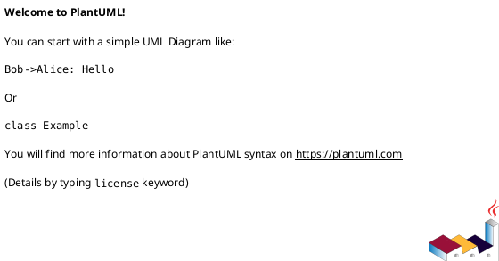

# 作業履歴 2024-08-18

## 概要

2024-08-18の作業内容をまとめています。

## コミット: f429cb4

### メッセージ

```
refactor: レイヤードアーキテクチャ
- appパッケージをpresentationへ移動
- domainパッケージをinfrastructureへ移動
- serviceパッケージをルートディレクトリへ移動
```

### 変更されたファイル

- D	src/main/java/mrs/app/package-info.java
- M	src/main/java/mrs/domain/package-info.java
- D	src/main/java/mrs/domain/service/package-info.java
- A	src/main/java/mrs/infrastructure/package-info.java
- A	src/main/java/mrs/presentation/package-info.java
- A	src/main/java/mrs/service/package-info.java

### 変更内容

```diff
commit f429cb4a0a9bcbd17723161db09078c816db5055
Author: Katuyuki Kakigi <kakimomokuri@gmail.com>
Date:   Sun Aug 18 15:11:46 2024 +0900

    refactor: レイヤードアーキテクチャ
    
    - appパッケージをpresentationへ移動
    - domainパッケージをinfrastructureへ移動
    - serviceパッケージをルートディレクトリへ移動

diff --git a/src/main/java/mrs/app/package-info.java b/src/main/java/mrs/app/package-info.java
deleted file mode 100644
index 6e8b439..0000000
--- a/src/main/java/mrs/app/package-info.java
+++ /dev/null
@@ -1,4 +0,0 @@
-/**
- * アプリケーション層クラスを配置するパッケージです。
- */
-package mrs.app;
diff --git a/src/main/java/mrs/domain/package-info.java b/src/main/java/mrs/domain/package-info.java
index 68c6f02..90304ed 100644
--- a/src/main/java/mrs/domain/package-info.java
+++ b/src/main/java/mrs/domain/package-info.java
@@ -1,4 +1,4 @@
 /**
- * ドメイン層のクラスを格納するパッケージです。
+ * ドメイン層
  */
 package mrs.domain;
diff --git a/src/main/java/mrs/domain/service/package-info.java b/src/main/java/mrs/domain/service/package-info.java
deleted file mode 100644
index ad106bd..0000000
--- a/src/main/java/mrs/domain/service/package-info.java
+++ /dev/null
@@ -1,4 +0,0 @@
-/**
- * ドメインサービスを提供するパッケージ。
- */
-package mrs.domain.service;
diff --git a/src/main/java/mrs/infrastructure/package-info.java b/src/main/java/mrs/infrastructure/package-info.java
new file mode 100644
index 0000000..edc657f
--- /dev/null
+++ b/src/main/java/mrs/infrastructure/package-info.java
@@ -0,0 +1,4 @@
+/**
+ * インフラストラクチャ層
+ */
+package mrs.infrastructure;
diff --git a/src/main/java/mrs/domain/repository/package-info.java b/src/main/java/mrs/infrastructure/repository/package-info.java
similarity index 65%
rename from src/main/java/mrs/domain/repository/package-info.java
rename to src/main/java/mrs/infrastructure/repository/package-info.java
index 844889b..9ae4ac6 100644
--- a/src/main/java/mrs/domain/repository/package-info.java
+++ b/src/main/java/mrs/infrastructure/repository/package-info.java
@@ -1,4 +1,4 @@
 /**
  * リポジトリクラスを格納するパッケージです。
  */
-package mrs.domain.repository;
+package mrs.infrastructure.repository;
diff --git a/src/main/java/mrs/domain/repository/reservation/ReservationRepository.java b/src/main/java/mrs/infrastructure/repository/reservation/ReservationRepository.java
similarity index 87%
rename from src/main/java/mrs/domain/repository/reservation/ReservationRepository.java
rename to src/main/java/mrs/infrastructure/repository/reservation/ReservationRepository.java
index b5766a0..7b9fd72 100644
--- a/src/main/java/mrs/domain/repository/reservation/ReservationRepository.java
+++ b/src/main/java/mrs/infrastructure/repository/reservation/ReservationRepository.java
@@ -1,4 +1,4 @@
-package mrs.domain.repository.reservation;
+package mrs.infrastructure.repository.reservation;
 
 import mrs.domain.model.ReservableRoomId;
 import mrs.domain.model.Reservation;
diff --git a/src/main/java/mrs/domain/repository/room/MeetingRoomRepository.java b/src/main/java/mrs/infrastructure/repository/room/MeetingRoomRepository.java
similarity index 81%
rename from src/main/java/mrs/domain/repository/room/MeetingRoomRepository.java
rename to src/main/java/mrs/infrastructure/repository/room/MeetingRoomRepository.java
index d57b030..dad4c85 100644
--- a/src/main/java/mrs/domain/repository/room/MeetingRoomRepository.java
+++ b/src/main/java/mrs/infrastructure/repository/room/MeetingRoomRepository.java
@@ -1,4 +1,4 @@
-package mrs.domain.repository.room;
+package mrs.infrastructure.repository.room;
 
 import mrs.domain.model.MeetingRoom;
 import org.springframework.data.jpa.repository.JpaRepository;
diff --git a/src/main/java/mrs/domain/repository/room/ReservableRoomRepository.java b/src/main/java/mrs/infrastructure/repository/room/ReservableRoomRepository.java
similarity index 93%
rename from src/main/java/mrs/domain/repository/room/ReservableRoomRepository.java
rename to src/main/java/mrs/infrastructure/repository/room/ReservableRoomRepository.java
index d7efed4..7f2a4da 100644
--- a/src/main/java/mrs/domain/repository/room/ReservableRoomRepository.java
+++ b/src/main/java/mrs/infrastructure/repository/room/ReservableRoomRepository.java
@@ -1,4 +1,4 @@
-package mrs.domain.repository.room;
+package mrs.infrastructure.repository.room;
 
 import jakarta.persistence.LockModeType;
 import mrs.domain.model.ReservableRoom;
diff --git a/src/main/java/mrs/domain/repository/user/UserRepository.java b/src/main/java/mrs/infrastructure/repository/user/UserRepository.java
similarity index 79%
rename from src/main/java/mrs/domain/repository/user/UserRepository.java
rename to src/main/java/mrs/infrastructure/repository/user/UserRepository.java
index c552baa..45bfbb5 100644
--- a/src/main/java/mrs/domain/repository/user/UserRepository.java
+++ b/src/main/java/mrs/infrastructure/repository/user/UserRepository.java
@@ -1,4 +1,4 @@
-package mrs.domain.repository.user;
+package mrs.infrastructure.repository.user;
 
 import mrs.domain.model.User;
 import org.springframework.data.jpa.repository.JpaRepository;
diff --git a/src/main/java/mrs/app/login/LoginController.java b/src/main/java/mrs/presentation/login/LoginController.java
similarity index 91%
rename from src/main/java/mrs/app/login/LoginController.java
rename to src/main/java/mrs/presentation/login/LoginController.java
index d830926..9ad6550 100644
--- a/src/main/java/mrs/app/login/LoginController.java
+++ b/src/main/java/mrs/presentation/login/LoginController.java
@@ -1,4 +1,4 @@
-package mrs.app.login;
+package mrs.presentation.login;
 
 import org.springframework.stereotype.Controller;
 import org.springframework.web.bind.annotation.RequestMapping;
diff --git a/src/main/java/mrs/presentation/package-info.java b/src/main/java/mrs/presentation/package-info.java
new file mode 100644
index 0000000..00982df
--- /dev/null
+++ b/src/main/java/mrs/presentation/package-info.java
@@ -0,0 +1,4 @@
+/**
+ * プレゼンテーション層
+ */
+package mrs.presentation;
diff --git a/src/main/java/mrs/app/reservation/EndTimeMustBeAfterStartTime.java b/src/main/java/mrs/presentation/reservation/EndTimeMustBeAfterStartTime.java
similarity index 95%
rename from src/main/java/mrs/app/reservation/EndTimeMustBeAfterStartTime.java
rename to src/main/java/mrs/presentation/reservation/EndTimeMustBeAfterStartTime.java
index 91efe88..3d33071 100644
--- a/src/main/java/mrs/app/reservation/EndTimeMustBeAfterStartTime.java
+++ b/src/main/java/mrs/presentation/reservation/EndTimeMustBeAfterStartTime.java
@@ -1,4 +1,4 @@
-package mrs.app.reservation;
+package mrs.presentation.reservation;
 
 import jakarta.validation.Constraint;
 import jakarta.validation.Payload;
diff --git a/src/main/java/mrs/app/reservation/EndTimeMustBeAfterStartTimeValidator.java b/src/main/java/mrs/presentation/reservation/EndTimeMustBeAfterStartTimeValidator.java
similarity index 96%
rename from src/main/java/mrs/app/reservation/EndTimeMustBeAfterStartTimeValidator.java
rename to src/main/java/mrs/presentation/reservation/EndTimeMustBeAfterStartTimeValidator.java
index 17c12a4..d3529a7 100644
--- a/src/main/java/mrs/app/reservation/EndTimeMustBeAfterStartTimeValidator.java
+++ b/src/main/java/mrs/presentation/reservation/EndTimeMustBeAfterStartTimeValidator.java
@@ -1,4 +1,4 @@
-package mrs.app.reservation;
+package mrs.presentation.reservation;
 
 import jakarta.validation.ConstraintValidator;
 import jakarta.validation.ConstraintValidatorContext;
diff --git a/src/main/java/mrs/app/reservation/ReservationForm.java b/src/main/java/mrs/presentation/reservation/ReservationForm.java
similarity index 93%
rename from src/main/java/mrs/app/reservation/ReservationForm.java
rename to src/main/java/mrs/presentation/reservation/ReservationForm.java
index 90281b6..68fb377 100644
--- a/src/main/java/mrs/app/reservation/ReservationForm.java
+++ b/src/main/java/mrs/presentation/reservation/ReservationForm.java
@@ -1,4 +1,4 @@
-package mrs.app.reservation;
+package mrs.presentation.reservation;
 
 import jakarta.validation.constraints.NotNull;
 import lombok.Data;
diff --git a/src/main/java/mrs/app/reservation/ReservationsController.java b/src/main/java/mrs/presentation/reservation/ReservationsController.java
similarity index 92%
rename from src/main/java/mrs/app/reservation/ReservationsController.java
rename to src/main/java/mrs/presentation/reservation/ReservationsController.java
index 64236d0..1216150 100644
--- a/src/main/java/mrs/app/reservation/ReservationsController.java
+++ b/src/main/java/mrs/presentation/reservation/ReservationsController.java
@@ -1,14 +1,14 @@
-package mrs.app.reservation;
+package mrs.presentation.reservation;
 
 import mrs.domain.model.MeetingRoom;
 import mrs.domain.model.ReservableRoom;
 import mrs.domain.model.ReservableRoomId;
 import mrs.domain.model.Reservation;
-import mrs.domain.service.reservation.AlreadyReservedException;
-import mrs.domain.service.reservation.ReservationService;
-import mrs.domain.service.reservation.UnavailableReservationException;
-import mrs.domain.service.room.RoomService;
-import mrs.domain.service.user.ReservationUserDetails;
+import mrs.service.reservation.AlreadyReservedException;
+import mrs.service.reservation.ReservationService;
+import mrs.service.reservation.UnavailableReservationException;
+import mrs.service.room.RoomService;
+import mrs.service.user.ReservationUserDetails;
 import org.springframework.beans.factory.annotation.Autowired;
 import org.springframework.format.annotation.DateTimeFormat;
 import org.springframework.security.access.AccessDeniedException;
diff --git a/src/main/java/mrs/app/reservation/ThirtyMinutesUnit.java b/src/main/java/mrs/presentation/reservation/ThirtyMinutesUnit.java
similarity index 95%
rename from src/main/java/mrs/app/reservation/ThirtyMinutesUnit.java
rename to src/main/java/mrs/presentation/reservation/ThirtyMinutesUnit.java
index bf67c95..4e088f9 100644
--- a/src/main/java/mrs/app/reservation/ThirtyMinutesUnit.java
+++ b/src/main/java/mrs/presentation/reservation/ThirtyMinutesUnit.java
@@ -1,4 +1,4 @@
-package mrs.app.reservation;
+package mrs.presentation.reservation;
 
 import jakarta.validation.Constraint;
 import jakarta.validation.Payload;
diff --git a/src/main/java/mrs/app/reservation/ThirtyMinutesUnitValidator.java b/src/main/java/mrs/presentation/reservation/ThirtyMinutesUnitValidator.java
similarity index 93%
rename from src/main/java/mrs/app/reservation/ThirtyMinutesUnitValidator.java
rename to src/main/java/mrs/presentation/reservation/ThirtyMinutesUnitValidator.java
index c136fd3..97f98d0 100644
--- a/src/main/java/mrs/app/reservation/ThirtyMinutesUnitValidator.java
+++ b/src/main/java/mrs/presentation/reservation/ThirtyMinutesUnitValidator.java
@@ -1,4 +1,4 @@
-package mrs.app.reservation;
+package mrs.presentation.reservation;
 
 import jakarta.validation.ConstraintValidator;
 import jakarta.validation.ConstraintValidatorContext;
diff --git a/src/main/java/mrs/app/room/RoomsController.java b/src/main/java/mrs/presentation/room/RoomsController.java
similarity index 95%
rename from src/main/java/mrs/app/room/RoomsController.java
rename to src/main/java/mrs/presentation/room/RoomsController.java
index e649117..cf0c63f 100644
--- a/src/main/java/mrs/app/room/RoomsController.java
+++ b/src/main/java/mrs/presentation/room/RoomsController.java
@@ -1,7 +1,7 @@
-package mrs.app.room;
+package mrs.presentation.room;
 
 import mrs.domain.model.ReservableRoom;
-import mrs.domain.service.room.RoomService;
+import mrs.service.room.RoomService;
 import org.springframework.beans.factory.annotation.Autowired;
 import org.springframework.format.annotation.DateTimeFormat;
 import org.springframework.stereotype.Controller;
diff --git a/src/main/java/mrs/service/package-info.java b/src/main/java/mrs/service/package-info.java
new file mode 100644
index 0000000..60a0355
--- /dev/null
+++ b/src/main/java/mrs/service/package-info.java
@@ -0,0 +1,4 @@
+/**
+ * サービス層
+ */
+package mrs.service;
diff --git a/src/main/java/mrs/domain/service/reservation/AlreadyReservedException.java b/src/main/java/mrs/service/reservation/AlreadyReservedException.java
similarity index 79%
rename from src/main/java/mrs/domain/service/reservation/AlreadyReservedException.java
rename to src/main/java/mrs/service/reservation/AlreadyReservedException.java
index 6b635f5..240b2a7 100644
--- a/src/main/java/mrs/domain/service/reservation/AlreadyReservedException.java
+++ b/src/main/java/mrs/service/reservation/AlreadyReservedException.java
@@ -1,4 +1,4 @@
-package mrs.domain.service.reservation;
+package mrs.service.reservation;
 
 public class AlreadyReservedException extends RuntimeException {
     public AlreadyReservedException(String message) {
diff --git a/src/main/java/mrs/domain/service/reservation/ReservationService.java b/src/main/java/mrs/service/reservation/ReservationService.java
similarity index 93%
rename from src/main/java/mrs/domain/service/reservation/ReservationService.java
rename to src/main/java/mrs/service/reservation/ReservationService.java
index 72ab843..59bfe69 100644
--- a/src/main/java/mrs/domain/service/reservation/ReservationService.java
+++ b/src/main/java/mrs/service/reservation/ReservationService.java
@@ -1,10 +1,10 @@
-package mrs.domain.service.reservation;
+package mrs.service.reservation;
 
 import mrs.domain.model.ReservableRoom;
 import mrs.domain.model.ReservableRoomId;
 import mrs.domain.model.Reservation;
-import mrs.domain.repository.reservation.ReservationRepository;
-import mrs.domain.repository.room.ReservableRoomRepository;
+import mrs.infrastructure.repository.reservation.ReservationRepository;
+import mrs.infrastructure.repository.room.ReservableRoomRepository;
 import org.springframework.beans.factory.annotation.Autowired;
 import org.springframework.security.access.prepost.PreAuthorize;
 import org.springframework.security.core.parameters.P;
diff --git a/src/main/java/mrs/domain/service/reservation/UnavailableReservationException.java b/src/main/java/mrs/service/reservation/UnavailableReservationException.java
similarity index 80%
rename from src/main/java/mrs/domain/service/reservation/UnavailableReservationException.java
rename to src/main/java/mrs/service/reservation/UnavailableReservationException.java
index 3447bd4..e3b780a 100644
--- a/src/main/java/mrs/domain/service/reservation/UnavailableReservationException.java
+++ b/src/main/java/mrs/service/reservation/UnavailableReservationException.java
@@ -1,4 +1,4 @@
-package mrs.domain.service.reservation;
+package mrs.service.reservation;
 
 public class UnavailableReservationException extends RuntimeException {
     public UnavailableReservationException(String message) {
diff --git a/src/main/java/mrs/domain/service/room/RoomService.java b/src/main/java/mrs/service/room/RoomService.java
similarity index 87%
rename from src/main/java/mrs/domain/service/room/RoomService.java
rename to src/main/java/mrs/service/room/RoomService.java
index b33e425..36a9639 100644
--- a/src/main/java/mrs/domain/service/room/RoomService.java
+++ b/src/main/java/mrs/service/room/RoomService.java
@@ -1,9 +1,9 @@
-package mrs.domain.service.room;
+package mrs.service.room;
 
 import mrs.domain.model.MeetingRoom;
 import mrs.domain.model.ReservableRoom;
-import mrs.domain.repository.room.MeetingRoomRepository;
-import mrs.domain.repository.room.ReservableRoomRepository;
+import mrs.infrastructure.repository.room.MeetingRoomRepository;
+import mrs.infrastructure.repository.room.ReservableRoomRepository;
 import org.springframework.beans.factory.annotation.Autowired;
 import org.springframework.stereotype.Service;
 import org.springframework.transaction.annotation.Transactional;
diff --git a/src/main/java/mrs/domain/service/user/ReservationUserDetails.java b/src/main/java/mrs/service/user/ReservationUserDetails.java
similarity index 97%
rename from src/main/java/mrs/domain/service/user/ReservationUserDetails.java
rename to src/main/java/mrs/service/user/ReservationUserDetails.java
index 04a4377..6729323 100644
--- a/src/main/java/mrs/domain/service/user/ReservationUserDetails.java
+++ b/src/main/java/mrs/service/user/ReservationUserDetails.java
@@ -1,4 +1,4 @@
-package mrs.domain.service.user;
+package mrs.service.user;
 
 import lombok.Getter;
 import mrs.domain.model.User;
diff --git a/src/main/java/mrs/domain/service/user/ReservationUserDetailsService.java b/src/main/java/mrs/service/user/ReservationUserDetailsService.java
similarity index 91%
rename from src/main/java/mrs/domain/service/user/ReservationUserDetailsService.java
rename to src/main/java/mrs/service/user/ReservationUserDetailsService.java
index 46534dd..67b56db 100644
--- a/src/main/java/mrs/domain/service/user/ReservationUserDetailsService.java
+++ b/src/main/java/mrs/service/user/ReservationUserDetailsService.java
@@ -1,7 +1,7 @@
-package mrs.domain.service.user;
+package mrs.service.user;
 
 import mrs.domain.model.User;
-import mrs.domain.repository.user.UserRepository;
+import mrs.infrastructure.repository.user.UserRepository;
 import org.springframework.beans.factory.annotation.Autowired;
 import org.springframework.security.core.userdetails.UserDetails;
 import org.springframework.security.core.userdetails.UserDetailsService;
diff --git a/src/test/java/mrs/domain/repository/reservation/ReservationRepositoryTest.java b/src/test/java/mrs/infrastructure/repository/reservation/ReservationRepositoryTest.java
similarity index 94%
rename from src/test/java/mrs/domain/repository/reservation/ReservationRepositoryTest.java
rename to src/test/java/mrs/infrastructure/repository/reservation/ReservationRepositoryTest.java
index 708ee37..7330ada 100644
--- a/src/test/java/mrs/domain/repository/reservation/ReservationRepositoryTest.java
+++ b/src/test/java/mrs/infrastructure/repository/reservation/ReservationRepositoryTest.java
@@ -1,8 +1,8 @@
-package mrs.domain.repository.reservation;
+package mrs.infrastructure.repository.reservation;
 
 import mrs.domain.model.*;
-import mrs.domain.repository.room.MeetingRoomRepository;
-import mrs.domain.repository.room.ReservableRoomRepository;
+import mrs.infrastructure.repository.room.MeetingRoomRepository;
+import mrs.infrastructure.repository.room.ReservableRoomRepository;
 import org.junit.jupiter.api.BeforeEach;
 import org.junit.jupiter.api.DisplayName;
 import org.junit.jupiter.api.Test;
diff --git a/src/test/java/mrs/domain/repository/room/ReservableRoomRepositoryTest.java b/src/test/java/mrs/infrastructure/repository/room/ReservableRoomRepositoryTest.java
similarity index 98%
rename from src/test/java/mrs/domain/repository/room/ReservableRoomRepositoryTest.java
rename to src/test/java/mrs/infrastructure/repository/room/ReservableRoomRepositoryTest.java
index f382867..c7cb85a 100644
--- a/src/test/java/mrs/domain/repository/room/ReservableRoomRepositoryTest.java
+++ b/src/test/java/mrs/infrastructure/repository/room/ReservableRoomRepositoryTest.java
@@ -1,4 +1,4 @@
-package mrs.domain.repository.room;
+package mrs.infrastructure.repository.room;
 
 import mrs.domain.model.MeetingRoom;
 import mrs.domain.model.ReservableRoom;
diff --git a/src/test/java/mrs/app/login/LoginControllerTest.java b/src/test/java/mrs/presentation/login/LoginControllerTest.java
similarity index 97%
rename from src/test/java/mrs/app/login/LoginControllerTest.java
rename to src/test/java/mrs/presentation/login/LoginControllerTest.java
index b4375ef..1d71b04 100644
--- a/src/test/java/mrs/app/login/LoginControllerTest.java
+++ b/src/test/java/mrs/presentation/login/LoginControllerTest.java
@@ -1,4 +1,4 @@
-package mrs.app.login;
+package mrs.presentation.login;
 
 import org.junit.jupiter.api.BeforeEach;
 import org.junit.jupiter.api.DisplayName;
diff --git a/src/test/java/mrs/app/reservation/ReservationFormTest.java b/src/test/java/mrs/presentation/reservation/ReservationFormTest.java
similarity index 98%
rename from src/test/java/mrs/app/reservation/ReservationFormTest.java
rename to src/test/java/mrs/presentation/reservation/ReservationFormTest.java
index bc0f06e..83170fb 100644
--- a/src/test/java/mrs/app/reservation/ReservationFormTest.java
+++ b/src/test/java/mrs/presentation/reservation/ReservationFormTest.java
@@ -1,4 +1,4 @@
-package mrs.app.reservation;
+package mrs.presentation.reservation;
 
 import jakarta.validation.ConstraintViolation;
 import jakarta.validation.Validation;
diff --git a/src/test/java/mrs/app/reservation/ReservationsControllerTest.java b/src/test/java/mrs/presentation/reservation/ReservationsControllerTest.java
similarity index 97%
rename from src/test/java/mrs/app/reservation/ReservationsControllerTest.java
rename to src/test/java/mrs/presentation/reservation/ReservationsControllerTest.java
index 5578d1f..93cc83d 100644
--- a/src/test/java/mrs/app/reservation/ReservationsControllerTest.java
+++ b/src/test/java/mrs/presentation/reservation/ReservationsControllerTest.java
@@ -1,11 +1,11 @@
-package mrs.app.reservation;
+package mrs.presentation.reservation;
 
 import mrs.domain.model.*;
-import mrs.domain.service.reservation.ReservationService;
-import mrs.domain.service.reservation.UnavailableReservationException;
-import mrs.domain.service.room.RoomService;
-import mrs.domain.service.user.ReservationUserDetails;
-import mrs.domain.service.user.ReservationUserDetailsService;
+import mrs.service.reservation.ReservationService;
+import mrs.service.reservation.UnavailableReservationException;
+import mrs.service.room.RoomService;
+import mrs.service.user.ReservationUserDetails;
+import mrs.service.user.ReservationUserDetailsService;
 import org.junit.jupiter.api.BeforeEach;
 import org.junit.jupiter.api.DisplayName;
 import org.junit.jupiter.api.Test;
diff --git a/src/test/java/mrs/domain/service/reservation/ReservationServiceTest.java b/src/test/java/mrs/service/reservation/ReservationServiceTest.java
similarity index 97%
rename from src/test/java/mrs/domain/service/reservation/ReservationServiceTest.java
rename to src/test/java/mrs/service/reservation/ReservationServiceTest.java
index 8b9419b..f24ff80 100644
--- a/src/test/java/mrs/domain/service/reservation/ReservationServiceTest.java
+++ b/src/test/java/mrs/service/reservation/ReservationServiceTest.java
@@ -1,8 +1,8 @@
-package mrs.domain.service.reservation;
+package mrs.service.reservation;
 
 import mrs.domain.model.*;
-import mrs.domain.repository.reservation.ReservationRepository;
-import mrs.domain.repository.room.ReservableRoomRepository;
+import mrs.infrastructure.repository.reservation.ReservationRepository;
+import mrs.infrastructure.repository.room.ReservableRoomRepository;
 import org.junit.jupiter.api.DisplayName;
 import org.junit.jupiter.api.Test;
 import org.mockito.InjectMocks;
diff --git a/src/test/java/mrs/domain/service/room/RoomServiceTest.java b/src/test/java/mrs/service/room/RoomServiceTest.java
similarity index 94%
rename from src/test/java/mrs/domain/service/room/RoomServiceTest.java
rename to src/test/java/mrs/service/room/RoomServiceTest.java
index 879acbf..8b59eb2 100644
--- a/src/test/java/mrs/domain/service/room/RoomServiceTest.java
+++ b/src/test/java/mrs/service/room/RoomServiceTest.java
@@ -1,10 +1,10 @@
-package mrs.domain.service.room;
+package mrs.service.room;
 
 import mrs.domain.model.MeetingRoom;
 import mrs.domain.model.ReservableRoom;
 import mrs.domain.model.ReservableRoomId;
-import mrs.domain.repository.room.MeetingRoomRepository;
-import mrs.domain.repository.room.ReservableRoomRepository;
+import mrs.infrastructure.repository.room.MeetingRoomRepository;
+import mrs.infrastructure.repository.room.ReservableRoomRepository;
 import org.junit.jupiter.api.BeforeEach;
 import org.junit.jupiter.api.DisplayName;
 import org.junit.jupiter.api.Test;
diff --git a/src/test/java/mrs/domain/service/user/ReservationUserDetailsServiceTest.java b/src/test/java/mrs/service/user/ReservationUserDetailsServiceTest.java
similarity index 95%
rename from src/test/java/mrs/domain/service/user/ReservationUserDetailsServiceTest.java
rename to src/test/java/mrs/service/user/ReservationUserDetailsServiceTest.java
index 5de6ddd..2778ea3 100644
--- a/src/test/java/mrs/domain/service/user/ReservationUserDetailsServiceTest.java
+++ b/src/test/java/mrs/service/user/ReservationUserDetailsServiceTest.java
@@ -1,8 +1,8 @@
-package mrs.domain.service.user;
+package mrs.service.user;
 
 import mrs.domain.model.RoleName;
 import mrs.domain.model.User;
-import mrs.domain.repository.user.UserRepository;
+import mrs.infrastructure.repository.user.UserRepository;
 import org.junit.jupiter.api.Assertions;
 import org.junit.jupiter.api.DisplayName;
 import org.junit.jupiter.api.Test;

```

### 構造変更



