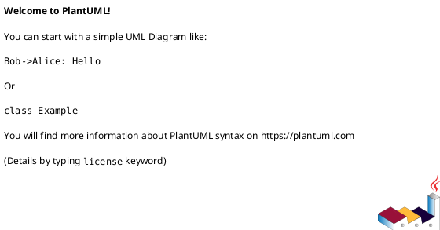

# 作業履歴 2024-08-19

## 概要

2024-08-19の作業内容をまとめています。

## コミット: 088bdca

### メッセージ

```
refactor: ヘキサゴナルアーキテクチャ
- ThirtyMinutesUnit.java の移動およびパッケージ変更
- ThirtyMinutesUnitValidator.java の移動およびパッケージ変更
- EndTimeMustBeAfterStartTime.java の移動およびパッケージ変更
- EndTimeMustBeAfterStartTimeValidator.java の移動およびパッケージ変更
- ReservationForm.java での ThirtyMinutesUnit インポート追加
- 新規パッケージ mrs.common を追加
```

### 変更されたファイル

- A	src/main/java/mrs/common/package-info.java
- M	src/main/java/mrs/infrastructure/in/web/reservation/ReservationForm.java

### 変更内容

```diff
commit 088bdcae4d0e5c509ecd1b6df2b1ca66c4124c33
Author: Katuyuki Kakigi <kakimomokuri@gmail.com>
Date:   Mon Aug 19 19:29:14 2024 +0900

    refactor: ヘキサゴナルアーキテクチャ
    
    - ThirtyMinutesUnit.java の移動およびパッケージ変更
    - ThirtyMinutesUnitValidator.java の移動およびパッケージ変更
    - EndTimeMustBeAfterStartTime.java の移動およびパッケージ変更
    - EndTimeMustBeAfterStartTimeValidator.java の移動およびパッケージ変更
    - ReservationForm.java での ThirtyMinutesUnit インポート追加
    - 新規パッケージ mrs.common を追加

diff --git a/src/main/java/mrs/common/package-info.java b/src/main/java/mrs/common/package-info.java
new file mode 100644
index 0000000..7073391
--- /dev/null
+++ b/src/main/java/mrs/common/package-info.java
@@ -0,0 +1,4 @@
+/**
+ * 共通
+ */
+package mrs.common;
diff --git a/src/main/java/mrs/infrastructure/in/web/reservation/EndTimeMustBeAfterStartTime.java b/src/main/java/mrs/common/validation/EndTimeMustBeAfterStartTime.java
similarity index 95%
rename from src/main/java/mrs/infrastructure/in/web/reservation/EndTimeMustBeAfterStartTime.java
rename to src/main/java/mrs/common/validation/EndTimeMustBeAfterStartTime.java
index 31ad1b3..512be9f 100644
--- a/src/main/java/mrs/infrastructure/in/web/reservation/EndTimeMustBeAfterStartTime.java
+++ b/src/main/java/mrs/common/validation/EndTimeMustBeAfterStartTime.java
@@ -1,4 +1,4 @@
-package mrs.infrastructure.in.web.reservation;
+package mrs.common.validation;
 
 import jakarta.validation.Constraint;
 import jakarta.validation.Payload;
diff --git a/src/main/java/mrs/infrastructure/in/web/reservation/EndTimeMustBeAfterStartTimeValidator.java b/src/main/java/mrs/common/validation/EndTimeMustBeAfterStartTimeValidator.java
similarity index 91%
rename from src/main/java/mrs/infrastructure/in/web/reservation/EndTimeMustBeAfterStartTimeValidator.java
rename to src/main/java/mrs/common/validation/EndTimeMustBeAfterStartTimeValidator.java
index 642b590..7d7226f 100644
--- a/src/main/java/mrs/infrastructure/in/web/reservation/EndTimeMustBeAfterStartTimeValidator.java
+++ b/src/main/java/mrs/common/validation/EndTimeMustBeAfterStartTimeValidator.java
@@ -1,7 +1,8 @@
-package mrs.infrastructure.in.web.reservation;
+package mrs.common.validation;
 
 import jakarta.validation.ConstraintValidator;
 import jakarta.validation.ConstraintValidatorContext;
+import mrs.infrastructure.in.web.reservation.ReservationForm;
 
 public class EndTimeMustBeAfterStartTimeValidator implements ConstraintValidator<EndTimeMustBeAfterStartTime, ReservationForm> {
     private String message;
diff --git a/src/main/java/mrs/infrastructure/in/web/reservation/ThirtyMinutesUnit.java b/src/main/java/mrs/common/validation/ThirtyMinutesUnit.java
similarity index 94%
rename from src/main/java/mrs/infrastructure/in/web/reservation/ThirtyMinutesUnit.java
rename to src/main/java/mrs/common/validation/ThirtyMinutesUnit.java
index dbd77a8..9bde736 100644
--- a/src/main/java/mrs/infrastructure/in/web/reservation/ThirtyMinutesUnit.java
+++ b/src/main/java/mrs/common/validation/ThirtyMinutesUnit.java
@@ -1,4 +1,4 @@
-package mrs.infrastructure.in.web.reservation;
+package mrs.common.validation;
 
 import jakarta.validation.Constraint;
 import jakarta.validation.Payload;
diff --git a/src/main/java/mrs/infrastructure/in/web/reservation/ThirtyMinutesUnitValidator.java b/src/main/java/mrs/common/validation/ThirtyMinutesUnitValidator.java
similarity index 91%
rename from src/main/java/mrs/infrastructure/in/web/reservation/ThirtyMinutesUnitValidator.java
rename to src/main/java/mrs/common/validation/ThirtyMinutesUnitValidator.java
index 8b2e156..c2d4330 100644
--- a/src/main/java/mrs/infrastructure/in/web/reservation/ThirtyMinutesUnitValidator.java
+++ b/src/main/java/mrs/common/validation/ThirtyMinutesUnitValidator.java
@@ -1,4 +1,4 @@
-package mrs.infrastructure.in.web.reservation;
+package mrs.common.validation;
 
 import jakarta.validation.ConstraintValidator;
 import jakarta.validation.ConstraintValidatorContext;
diff --git a/src/main/java/mrs/infrastructure/in/web/reservation/ReservationForm.java b/src/main/java/mrs/infrastructure/in/web/reservation/ReservationForm.java
index da8c4f3..97036da 100644
--- a/src/main/java/mrs/infrastructure/in/web/reservation/ReservationForm.java
+++ b/src/main/java/mrs/infrastructure/in/web/reservation/ReservationForm.java
@@ -2,6 +2,7 @@ package mrs.infrastructure.in.web.reservation;
 
 import jakarta.validation.constraints.NotNull;
 import lombok.Data;
+import mrs.common.validation.ThirtyMinutesUnit;
 import org.springframework.format.annotation.DateTimeFormat;
 
 import java.time.LocalTime;

```

## コミット: 532909a

### メッセージ

```
refactor: ヘキサゴナルアーキテクチャ
- RoomServiceとReservationServiceにポート実装を追加
- ReservationsControllerとRoomsControllerでDIを使用しポートに依存変更
- RoomUseCaseとReservationUseCaseインターフェースを追加
```
```

### 変更されたファイル

- A	src/main/java/mrs/application/port/in/ReservationUseCase.java
- A	src/main/java/mrs/application/port/in/RoomUseCase.java
- M	src/main/java/mrs/application/service/reservation/ReservationService.java
- M	src/main/java/mrs/application/service/room/RoomService.java
- M	src/main/java/mrs/infrastructure/in/web/reservation/ReservationsController.java
- M	src/main/java/mrs/infrastructure/in/web/room/RoomsController.java

### 変更内容

```diff
commit 532909a43df335d45e0719253a7d2b0a5a01227e
Author: Katuyuki Kakigi <kakimomokuri@gmail.com>
Date:   Mon Aug 19 19:23:24 2024 +0900

    refactor: ヘキサゴナルアーキテクチャ
    
    - RoomServiceとReservationServiceにポート実装を追加
    - ReservationsControllerとRoomsControllerでDIを使用しポートに依存変更
    - RoomUseCaseとReservationUseCaseインターフェースを追加
    ```

diff --git a/src/main/java/mrs/application/port/in/ReservationUseCase.java b/src/main/java/mrs/application/port/in/ReservationUseCase.java
new file mode 100644
index 0000000..3c3fbbd
--- /dev/null
+++ b/src/main/java/mrs/application/port/in/ReservationUseCase.java
@@ -0,0 +1,16 @@
+package mrs.application.port.in;
+
+import mrs.application.domain.model.ReservableRoomId;
+import mrs.application.domain.model.Reservation;
+
+import java.util.List;
+
+public interface ReservationUseCase {
+    List<Reservation> findReservations(ReservableRoomId reservableRoomId);
+
+    Reservation reserve(Reservation reservation);
+
+    void cancel(Reservation reservation);
+
+    Reservation findOne(Integer reservationId);
+}
diff --git a/src/main/java/mrs/application/port/in/RoomUseCase.java b/src/main/java/mrs/application/port/in/RoomUseCase.java
new file mode 100644
index 0000000..8ace414
--- /dev/null
+++ b/src/main/java/mrs/application/port/in/RoomUseCase.java
@@ -0,0 +1,13 @@
+package mrs.application.port.in;
+
+import mrs.application.domain.model.MeetingRoom;
+import mrs.application.domain.model.ReservableRoom;
+
+import java.time.LocalDate;
+import java.util.List;
+
+public interface RoomUseCase {
+    public MeetingRoom findMeetingRoom(Integer roomId);
+
+    public List<ReservableRoom> findReservableRooms(LocalDate date);
+}
diff --git a/src/main/java/mrs/application/service/reservation/ReservationService.java b/src/main/java/mrs/application/service/reservation/ReservationService.java
index 13f00cb..11046e4 100644
--- a/src/main/java/mrs/application/service/reservation/ReservationService.java
+++ b/src/main/java/mrs/application/service/reservation/ReservationService.java
@@ -4,6 +4,7 @@ import lombok.RequiredArgsConstructor;
 import mrs.application.domain.model.ReservableRoom;
 import mrs.application.domain.model.ReservableRoomId;
 import mrs.application.domain.model.Reservation;
+import mrs.application.port.in.ReservationUseCase;
 import mrs.application.port.out.ReservableRoomPort;
 import mrs.application.port.out.ReservationPort;
 import org.springframework.security.access.prepost.PreAuthorize;
@@ -19,7 +20,7 @@ import java.util.List;
 @Service
 @Transactional
 @RequiredArgsConstructor
-public class ReservationService {
+public class ReservationService implements ReservationUseCase {
     private final ReservableRoomPort reservableRoomPort;
     private final ReservationPort reservationPort;
 
diff --git a/src/main/java/mrs/application/service/room/RoomService.java b/src/main/java/mrs/application/service/room/RoomService.java
index 06cb7c6..533ba90 100644
--- a/src/main/java/mrs/application/service/room/RoomService.java
+++ b/src/main/java/mrs/application/service/room/RoomService.java
@@ -3,6 +3,7 @@ package mrs.application.service.room;
 import lombok.RequiredArgsConstructor;
 import mrs.application.domain.model.MeetingRoom;
 import mrs.application.domain.model.ReservableRoom;
+import mrs.application.port.in.RoomUseCase;
 import mrs.application.port.out.MeetingRoomPort;
 import mrs.application.port.out.ReservableRoomPort;
 import org.springframework.stereotype.Service;
@@ -17,7 +18,7 @@ import java.util.List;
 @Service
 @Transactional
 @RequiredArgsConstructor
-public class RoomService {
+public class RoomService implements RoomUseCase {
     private final ReservableRoomPort reservableRoomPort;
     private final MeetingRoomPort meetingRoomPort;
 
diff --git a/src/main/java/mrs/infrastructure/in/web/reservation/ReservationsController.java b/src/main/java/mrs/infrastructure/in/web/reservation/ReservationsController.java
index 27ce559..cd6bac2 100644
--- a/src/main/java/mrs/infrastructure/in/web/reservation/ReservationsController.java
+++ b/src/main/java/mrs/infrastructure/in/web/reservation/ReservationsController.java
@@ -1,15 +1,15 @@
 package mrs.infrastructure.in.web.reservation;
 
+import lombok.RequiredArgsConstructor;
 import mrs.application.domain.model.MeetingRoom;
 import mrs.application.domain.model.ReservableRoom;
 import mrs.application.domain.model.ReservableRoomId;
 import mrs.application.domain.model.Reservation;
+import mrs.application.port.in.ReservationUseCase;
+import mrs.application.port.in.RoomUseCase;
 import mrs.application.service.reservation.AlreadyReservedException;
-import mrs.application.service.reservation.ReservationService;
 import mrs.application.service.reservation.UnavailableReservationException;
-import mrs.application.service.room.RoomService;
 import mrs.application.service.user.ReservationUserDetails;
-import org.springframework.beans.factory.annotation.Autowired;
 import org.springframework.format.annotation.DateTimeFormat;
 import org.springframework.security.access.AccessDeniedException;
 import org.springframework.security.core.annotation.AuthenticationPrincipal;
@@ -30,11 +30,10 @@ import java.util.stream.Stream;
  */
 @Controller
 @RequestMapping("reservations/{date}/{roomId}")
+@RequiredArgsConstructor
 public class ReservationsController {
-    @Autowired
-    RoomService roomService;
-    @Autowired
-    ReservationService reservationService;
+    private final RoomUseCase roomUseCase;
+    private final ReservationUseCase reservationUseCase;
 
     @ModelAttribute
     ReservationForm setUpForm() {
@@ -49,9 +48,9 @@ public class ReservationsController {
      */
     @RequestMapping(method = RequestMethod.GET)
     String reserveForm(@DateTimeFormat(iso = DateTimeFormat.ISO.DATE) @PathVariable("date") LocalDate date, @PathVariable("roomId") Integer roomId, Model model) {
-        MeetingRoom meetingRoom = roomService.findMeetingRoom(roomId);
+        MeetingRoom meetingRoom = roomUseCase.findMeetingRoom(roomId);
         ReservableRoomId reservableRoomId = new ReservableRoomId(roomId, date);
-        List<Reservation> reservations = reservationService.findReservations(reservableRoomId);
+        List<Reservation> reservations = reservationUseCase.findReservations(reservableRoomId);
 
         List<LocalTime> timeList = Stream.iterate(LocalTime.of(0, 0), t -> t.plusMinutes(30)).limit(24 * 2).toList();
 
@@ -74,7 +73,7 @@ public class ReservationsController {
         Reservation reservation = new Reservation(form.getStartTime(), form.getEndTime(), reservableRoom, userDetails.getUser());
 
         try {
-            reservationService.reserve(reservation);
+            reservationUseCase.reserve(reservation);
         } catch (UnavailableReservationException | AlreadyReservedException e) {
             model.addAttribute("error", e.getMessage());
             return reserveForm(date, roomId, model);
@@ -89,8 +88,8 @@ public class ReservationsController {
     @RequestMapping(method = RequestMethod.POST, params = "cancel")
     String cancel(@RequestParam("reservationId") Integer reservationId, @PathVariable("roomId") Integer roomId, @DateTimeFormat(iso = DateTimeFormat.ISO.DATE) @PathVariable("date") LocalDate date, Model model) {
         try {
-            Reservation reservation = reservationService.findOne(reservationId);
-            reservationService.cancel(reservation);
+            Reservation reservation = reservationUseCase.findOne(reservationId);
+            reservationUseCase.cancel(reservation);
         } catch (AccessDeniedException e) {
             model.addAttribute("error", e.getMessage());
             return reserveForm(date, roomId, model);
diff --git a/src/main/java/mrs/infrastructure/in/web/room/RoomsController.java b/src/main/java/mrs/infrastructure/in/web/room/RoomsController.java
index 97de7f0..65ac308 100644
--- a/src/main/java/mrs/infrastructure/in/web/room/RoomsController.java
+++ b/src/main/java/mrs/infrastructure/in/web/room/RoomsController.java
@@ -1,8 +1,8 @@
 package mrs.infrastructure.in.web.room;
 
+import lombok.RequiredArgsConstructor;
 import mrs.application.domain.model.ReservableRoom;
-import mrs.application.service.room.RoomService;
-import org.springframework.beans.factory.annotation.Autowired;
+import mrs.application.port.in.RoomUseCase;
 import org.springframework.format.annotation.DateTimeFormat;
 import org.springframework.stereotype.Controller;
 import org.springframework.ui.Model;
@@ -18,9 +18,9 @@ import java.util.List;
  */
 @Controller
 @RequestMapping("rooms")
+@RequiredArgsConstructor
 public class RoomsController {
-    @Autowired
-    RoomService roomService;
+    private final RoomUseCase roomUseCase;
 
     /**
      * 今日の予約可能会議室一覧
@@ -28,7 +28,7 @@ public class RoomsController {
     @RequestMapping(method = RequestMethod.GET)
     String listRooms(Model model) {
         LocalDate today = LocalDate.now();
-        List<ReservableRoom> rooms = roomService.findReservableRooms(today);
+        List<ReservableRoom> rooms = roomUseCase.findReservableRooms(today);
         model.addAttribute("date", today);
         model.addAttribute("rooms", rooms);
         return "room/listRooms";
@@ -39,7 +39,7 @@ public class RoomsController {
      */
     @RequestMapping(path = "{date}", method = RequestMethod.GET)
     String listRooms(@DateTimeFormat(iso = DateTimeFormat.ISO.DATE) @PathVariable("date") LocalDate date, Model model) {
-        List<ReservableRoom> rooms = roomService.findReservableRooms(date);
+        List<ReservableRoom> rooms = roomUseCase.findReservableRooms(date);
         model.addAttribute("rooms", rooms);
         return "room/listRooms";
     }

```

### 構造変更



## コミット: bcfe3c9

### メッセージ

```
refactor: ヘキサゴナルアーキテクチャ
- MeetingRoomPersistenceAdapter を MeetingMeetingRoomPersistenceAdapter にリネーム
- UserPersistenceAdapter, ReservationPersistenceAdapter, ReservableRoomPersistenceAdapter にポートを実装
- 各サービスでポートに依存するよう変更
```

### 変更されたファイル

- A	src/main/java/mrs/application/port/out/MeetingRoomPort.java
- A	src/main/java/mrs/application/port/out/ReservableRoomPort.java
- A	src/main/java/mrs/application/port/out/ReservationPort.java
- A	src/main/java/mrs/application/port/out/UserPort.java
- M	src/main/java/mrs/application/service/reservation/ReservationService.java
- M	src/main/java/mrs/application/service/room/RoomService.java
- M	src/main/java/mrs/application/service/user/ReservationUserDetailsService.java
- M	src/main/java/mrs/infrastructure/out/persistence/reservation/ReservableRoomPersistenceAdapter.java
- M	src/main/java/mrs/infrastructure/out/persistence/reservation/ReservationPersistenceAdapter.java
- M	src/main/java/mrs/infrastructure/out/persistence/user/UserPersistenceAdapter.java
- M	src/test/java/mrs/application/service/room/RoomServiceTest.java
- M	src/test/java/mrs/infrastructure/out/persistence/reservation/ReservableRoomPersistenceAdapterTest.java
- M	src/test/java/mrs/infrastructure/out/persistence/reservation/ReservationPersistenceAdapterTest.java

### 変更内容

```diff
commit bcfe3c93e65c204e1056e8b4893487f0a4b94852
Author: Katuyuki Kakigi <kakimomokuri@gmail.com>
Date:   Mon Aug 19 19:06:42 2024 +0900

    refactor: ヘキサゴナルアーキテクチャ
    
    - MeetingRoomPersistenceAdapter を MeetingMeetingRoomPersistenceAdapter にリネーム
    - UserPersistenceAdapter, ReservationPersistenceAdapter, ReservableRoomPersistenceAdapter にポートを実装
    - 各サービスでポートに依存するよう変更

diff --git a/src/main/java/mrs/application/port/out/MeetingRoomPort.java b/src/main/java/mrs/application/port/out/MeetingRoomPort.java
new file mode 100644
index 0000000..9c7f007
--- /dev/null
+++ b/src/main/java/mrs/application/port/out/MeetingRoomPort.java
@@ -0,0 +1,10 @@
+package mrs.application.port.out;
+
+import mrs.application.domain.model.MeetingRoom;
+
+/**
+ * 会議室情報を取得するためのポート
+ */
+public interface MeetingRoomPort {
+    MeetingRoom findById(Integer roomId);
+}
diff --git a/src/main/java/mrs/application/port/out/ReservableRoomPort.java b/src/main/java/mrs/application/port/out/ReservableRoomPort.java
new file mode 100644
index 0000000..79c3ef4
--- /dev/null
+++ b/src/main/java/mrs/application/port/out/ReservableRoomPort.java
@@ -0,0 +1,18 @@
+package mrs.application.port.out;
+
+import mrs.application.domain.model.ReservableRoom;
+import mrs.application.domain.model.ReservableRoomId;
+
+import java.time.LocalDate;
+import java.util.List;
+
+/**
+ * 予約可能な会議室ポート
+ */
+public interface ReservableRoomPort {
+    ReservableRoom findById(ReservableRoomId roomId);
+
+    List<ReservableRoom> findByReservableRoomId_reservedDateOrderByReservableRoomId_roomIdAsc(LocalDate date);
+
+    ReservableRoom findOneForUpdateByReservableRoomId(ReservableRoomId reservableRoomId);
+}
diff --git a/src/main/java/mrs/application/port/out/ReservationPort.java b/src/main/java/mrs/application/port/out/ReservationPort.java
new file mode 100644
index 0000000..56a1f39
--- /dev/null
+++ b/src/main/java/mrs/application/port/out/ReservationPort.java
@@ -0,0 +1,19 @@
+package mrs.application.port.out;
+
+import mrs.application.domain.model.ReservableRoomId;
+import mrs.application.domain.model.Reservation;
+
+import java.util.List;
+
+/**
+ * 予約ポート
+ */
+public interface ReservationPort {
+    List<Reservation> findByReservableRoom_ReservableRoomIdOrderByStartTimeAsc(ReservableRoomId reservableRoomId);
+
+    Reservation findById(Integer reservationId);
+
+    void save(Reservation reservation);
+
+    void delete(Reservation reservation);
+}
diff --git a/src/main/java/mrs/application/port/out/UserPort.java b/src/main/java/mrs/application/port/out/UserPort.java
new file mode 100644
index 0000000..cb3106c
--- /dev/null
+++ b/src/main/java/mrs/application/port/out/UserPort.java
@@ -0,0 +1,12 @@
+package mrs.application.port.out;
+
+import mrs.application.domain.model.User;
+
+import java.util.Optional;
+
+/**
+ * ユーザポート
+ */
+public interface UserPort {
+    Optional<User> findById(String userId);
+}
diff --git a/src/main/java/mrs/application/service/reservation/ReservationService.java b/src/main/java/mrs/application/service/reservation/ReservationService.java
index 6096568..13f00cb 100644
--- a/src/main/java/mrs/application/service/reservation/ReservationService.java
+++ b/src/main/java/mrs/application/service/reservation/ReservationService.java
@@ -1,11 +1,11 @@
 package mrs.application.service.reservation;
 
+import lombok.RequiredArgsConstructor;
 import mrs.application.domain.model.ReservableRoom;
 import mrs.application.domain.model.ReservableRoomId;
 import mrs.application.domain.model.Reservation;
-import mrs.infrastructure.out.persistence.reservation.ReservableRoomPersistenceAdapter;
-import mrs.infrastructure.out.persistence.reservation.ReservationPersistenceAdapter;
-import org.springframework.beans.factory.annotation.Autowired;
+import mrs.application.port.out.ReservableRoomPort;
+import mrs.application.port.out.ReservationPort;
 import org.springframework.security.access.prepost.PreAuthorize;
 import org.springframework.security.core.parameters.P;
 import org.springframework.stereotype.Service;
@@ -18,17 +18,16 @@ import java.util.List;
  */
 @Service
 @Transactional
+@RequiredArgsConstructor
 public class ReservationService {
-    @Autowired
-    ReservationPersistenceAdapter reservationRepository;
-    @Autowired
-    ReservableRoomPersistenceAdapter reservableRoomRepository;
+    private final ReservableRoomPort reservableRoomPort;
+    private final ReservationPort reservationPort;
 
     /**
      * 予約一覧を取得する
      */
     public List<Reservation> findReservations(ReservableRoomId reservableRoomId) {
-        return reservationRepository.findByReservableRoom_ReservableRoomIdOrderByStartTimeAsc(reservableRoomId);
+        return reservationPort.findByReservableRoom_ReservableRoomIdOrderByStartTimeAsc(reservableRoomId);
     }
 
     /**
@@ -36,17 +35,17 @@ public class ReservationService {
      */
     public Reservation reserve(Reservation reservation) {
         ReservableRoomId reservableRoomId = reservation.getReservableRoom().getReservableRoomId();
-        ReservableRoom reservable = reservableRoomRepository.findOneForUpdateByReservableRoomId(reservableRoomId);
+        ReservableRoom reservable = reservableRoomPort.findOneForUpdateByReservableRoomId(reservableRoomId);
         if (reservable == null) {
             throw new UnavailableReservationException("入力の日付・部屋の組合わせは予約できません。");
         }
-        boolean overlap = reservationRepository.findByReservableRoom_ReservableRoomIdOrderByStartTimeAsc(reservableRoomId)
+        boolean overlap = reservationPort.findByReservableRoom_ReservableRoomIdOrderByStartTimeAsc(reservableRoomId)
                 .stream()
                 .anyMatch(x -> x.overlap(reservation));
         if (overlap) {
             throw new AlreadyReservedException("入力の時間帯はすでに予約済みです。");
         }
-        reservationRepository.save(reservation);
+        reservationPort.save(reservation);
         return reservation;
     }
 
@@ -55,14 +54,14 @@ public class ReservationService {
      */
     @PreAuthorize("hasRole('ADMIN') or #reservation.user.userId == principal.user.userId")
     public void cancel(@P("reservation") Reservation reservation) {
-        reservationRepository.delete(reservation);
+        reservationPort.delete(reservation);
     }
 
     /**
      * 予約情報を取得する
      */
     public Reservation findOne(Integer reservationId) {
-        Reservation reservation = reservationRepository.findById(reservationId);
+        Reservation reservation = reservationPort.findById(reservationId);
         if (reservation == null) {
             throw new IllegalStateException("予約が見つかりません。");
         }
diff --git a/src/main/java/mrs/application/service/room/RoomService.java b/src/main/java/mrs/application/service/room/RoomService.java
index bef7633..06cb7c6 100644
--- a/src/main/java/mrs/application/service/room/RoomService.java
+++ b/src/main/java/mrs/application/service/room/RoomService.java
@@ -1,10 +1,10 @@
 package mrs.application.service.room;
 
+import lombok.RequiredArgsConstructor;
 import mrs.application.domain.model.MeetingRoom;
 import mrs.application.domain.model.ReservableRoom;
-import mrs.infrastructure.out.persistence.reservation.ReservableRoomPersistenceAdapter;
-import mrs.infrastructure.out.persistence.room.MeetingRoomPersistenceAdapter;
-import org.springframework.beans.factory.annotation.Autowired;
+import mrs.application.port.out.MeetingRoomPort;
+import mrs.application.port.out.ReservableRoomPort;
 import org.springframework.stereotype.Service;
 import org.springframework.transaction.annotation.Transactional;
 
@@ -16,17 +16,17 @@ import java.util.List;
  */
 @Service
 @Transactional
+@RequiredArgsConstructor
 public class RoomService {
-    @Autowired
-    ReservableRoomPersistenceAdapter reservableRoomRepository;
-    @Autowired
-    MeetingRoomPersistenceAdapter meetingRoomRepository;
+    private final ReservableRoomPort reservableRoomPort;
+    private final MeetingRoomPort meetingRoomPort;
+
 
     /**
      * 会議室を取得する
      */
     public MeetingRoom findMeetingRoom(Integer roomId) {
-        MeetingRoom meetingRoom = meetingRoomRepository.findById(roomId);
+        MeetingRoom meetingRoom = meetingRoomPort.findById(roomId);
         if (meetingRoom == null) {
             throw new IllegalStateException("会議室が見つかりません。");
         }
@@ -37,6 +37,6 @@ public class RoomService {
      * 予約可能会議室を取得する
      */
     public List<ReservableRoom> findReservableRooms(LocalDate date) {
-        return reservableRoomRepository.findByReservableRoomId_reservedDateOrderByReservableRoomId_roomIdAsc(date);
+        return reservableRoomPort.findByReservableRoomId_reservedDateOrderByReservableRoomId_roomIdAsc(date);
     }
 }
diff --git a/src/main/java/mrs/application/service/user/ReservationUserDetailsService.java b/src/main/java/mrs/application/service/user/ReservationUserDetailsService.java
index 493cb0a..a94d42f 100644
--- a/src/main/java/mrs/application/service/user/ReservationUserDetailsService.java
+++ b/src/main/java/mrs/application/service/user/ReservationUserDetailsService.java
@@ -1,8 +1,8 @@
 package mrs.application.service.user;
 
+import lombok.RequiredArgsConstructor;
 import mrs.application.domain.model.User;
-import mrs.infrastructure.out.persistence.user.UserPersistenceAdapter;
-import org.springframework.beans.factory.annotation.Autowired;
+import mrs.application.port.out.UserPort;
 import org.springframework.security.core.userdetails.UserDetails;
 import org.springframework.security.core.userdetails.UserDetailsService;
 import org.springframework.security.core.userdetails.UsernameNotFoundException;
@@ -12,16 +12,16 @@ import org.springframework.stereotype.Service;
  * 認証サービス
  */
 @Service
+@RequiredArgsConstructor
 public class ReservationUserDetailsService implements UserDetailsService {
-    @Autowired
-    UserPersistenceAdapter userRepository;
+    private final UserPort userPort;
 
     /**
      * ユーザー情報を取得する
      */
     @Override
     public UserDetails loadUserByUsername(String username) throws UsernameNotFoundException {
-        User user = userRepository.findById(username).orElseThrow(() -> new UsernameNotFoundException(username + " is not found."));
+        User user = userPort.findById(username).orElseThrow(() -> new UsernameNotFoundException(username + " is not found."));
         return new ReservationUserDetails(user);
     }
 }
diff --git a/src/main/java/mrs/infrastructure/out/persistence/reservation/ReservableRoomPersistenceAdapter.java b/src/main/java/mrs/infrastructure/out/persistence/reservation/ReservableRoomPersistenceAdapter.java
index 49096cf..4d22ca2 100644
--- a/src/main/java/mrs/infrastructure/out/persistence/reservation/ReservableRoomPersistenceAdapter.java
+++ b/src/main/java/mrs/infrastructure/out/persistence/reservation/ReservableRoomPersistenceAdapter.java
@@ -3,6 +3,7 @@ package mrs.infrastructure.out.persistence.reservation;
 import lombok.RequiredArgsConstructor;
 import mrs.application.domain.model.ReservableRoom;
 import mrs.application.domain.model.ReservableRoomId;
+import mrs.application.port.out.ReservableRoomPort;
 import org.springframework.stereotype.Repository;
 
 import java.time.LocalDate;
@@ -10,7 +11,7 @@ import java.util.List;
 
 @Repository
 @RequiredArgsConstructor
-public class ReservableRoomPersistenceAdapter {
+public class ReservableRoomPersistenceAdapter implements ReservableRoomPort {
     private final ReservableRoomRepository reservableRoomRepository;
     private final ReservableRoomMapper reservableRoomMapper;
 
diff --git a/src/main/java/mrs/infrastructure/out/persistence/reservation/ReservationPersistenceAdapter.java b/src/main/java/mrs/infrastructure/out/persistence/reservation/ReservationPersistenceAdapter.java
index f31bbda..8f2198b 100644
--- a/src/main/java/mrs/infrastructure/out/persistence/reservation/ReservationPersistenceAdapter.java
+++ b/src/main/java/mrs/infrastructure/out/persistence/reservation/ReservationPersistenceAdapter.java
@@ -3,6 +3,7 @@ package mrs.infrastructure.out.persistence.reservation;
 import lombok.RequiredArgsConstructor;
 import mrs.application.domain.model.ReservableRoomId;
 import mrs.application.domain.model.Reservation;
+import mrs.application.port.out.ReservationPort;
 import org.springframework.stereotype.Repository;
 
 import java.util.List;
@@ -10,7 +11,7 @@ import java.util.Objects;
 
 @Repository
 @RequiredArgsConstructor
-public class ReservationPersistenceAdapter {
+public class ReservationPersistenceAdapter implements ReservationPort {
     private final ReservationRepository reservationRepository;
     private final ReservationMapper reservationMapper;
 
diff --git a/src/main/java/mrs/infrastructure/out/persistence/room/MeetingRoomPersistenceAdapter.java b/src/main/java/mrs/infrastructure/out/persistence/room/MeetingMeetingRoomPersistenceAdapter.java
similarity index 83%
rename from src/main/java/mrs/infrastructure/out/persistence/room/MeetingRoomPersistenceAdapter.java
rename to src/main/java/mrs/infrastructure/out/persistence/room/MeetingMeetingRoomPersistenceAdapter.java
index 0dfe95a..ead3dec 100644
--- a/src/main/java/mrs/infrastructure/out/persistence/room/MeetingRoomPersistenceAdapter.java
+++ b/src/main/java/mrs/infrastructure/out/persistence/room/MeetingMeetingRoomPersistenceAdapter.java
@@ -2,11 +2,12 @@ package mrs.infrastructure.out.persistence.room;
 
 import lombok.RequiredArgsConstructor;
 import mrs.application.domain.model.MeetingRoom;
+import mrs.application.port.out.MeetingRoomPort;
 import org.springframework.stereotype.Repository;
 
 @Repository
 @RequiredArgsConstructor
-public class MeetingRoomPersistenceAdapter {
+public class MeetingMeetingRoomPersistenceAdapter implements MeetingRoomPort {
     private final MeetingRoomRepository meetingRoomRepository;
     private final MeetingRoomMapper meetingRoomMapper;
 
diff --git a/src/main/java/mrs/infrastructure/out/persistence/user/UserPersistenceAdapter.java b/src/main/java/mrs/infrastructure/out/persistence/user/UserPersistenceAdapter.java
index 25ed06f..ecf5437 100644
--- a/src/main/java/mrs/infrastructure/out/persistence/user/UserPersistenceAdapter.java
+++ b/src/main/java/mrs/infrastructure/out/persistence/user/UserPersistenceAdapter.java
@@ -2,13 +2,14 @@ package mrs.infrastructure.out.persistence.user;
 
 import lombok.RequiredArgsConstructor;
 import mrs.application.domain.model.User;
+import mrs.application.port.out.UserPort;
 import org.springframework.stereotype.Repository;
 
 import java.util.Optional;
 
 @Repository
 @RequiredArgsConstructor
-public class UserPersistenceAdapter {
+public class UserPersistenceAdapter implements UserPort {
     private final UserMapper userMapper;
     private final UserRepository userRepository;
 
diff --git a/src/test/java/mrs/application/service/room/RoomServiceTest.java b/src/test/java/mrs/application/service/room/RoomServiceTest.java
index ed348f6..a7ef59f 100644
--- a/src/test/java/mrs/application/service/room/RoomServiceTest.java
+++ b/src/test/java/mrs/application/service/room/RoomServiceTest.java
@@ -4,7 +4,7 @@ import mrs.application.domain.model.MeetingRoom;
 import mrs.application.domain.model.ReservableRoom;
 import mrs.application.domain.model.ReservableRoomId;
 import mrs.infrastructure.out.persistence.reservation.ReservableRoomPersistenceAdapter;
-import mrs.infrastructure.out.persistence.room.MeetingRoomPersistenceAdapter;
+import mrs.infrastructure.out.persistence.room.MeetingMeetingRoomPersistenceAdapter;
 import org.junit.jupiter.api.BeforeEach;
 import org.junit.jupiter.api.DisplayName;
 import org.junit.jupiter.api.Test;
@@ -26,7 +26,7 @@ public class RoomServiceTest {
     @Mock
     private ReservableRoomPersistenceAdapter reservableRoomRepository;
     @Mock
-    private MeetingRoomPersistenceAdapter meetingRoomRepository;
+    private MeetingMeetingRoomPersistenceAdapter meetingRoomRepository;
 
     @InjectMocks
     private RoomService roomService;
diff --git a/src/test/java/mrs/infrastructure/out/persistence/reservation/ReservableRoomPersistenceAdapterTest.java b/src/test/java/mrs/infrastructure/out/persistence/reservation/ReservableRoomPersistenceAdapterTest.java
index 68a618f..d0feffa 100644
--- a/src/test/java/mrs/infrastructure/out/persistence/reservation/ReservableRoomPersistenceAdapterTest.java
+++ b/src/test/java/mrs/infrastructure/out/persistence/reservation/ReservableRoomPersistenceAdapterTest.java
@@ -3,8 +3,8 @@ package mrs.infrastructure.out.persistence.reservation;
 import mrs.application.domain.model.MeetingRoom;
 import mrs.application.domain.model.ReservableRoom;
 import mrs.application.domain.model.ReservableRoomId;
+import mrs.infrastructure.out.persistence.room.MeetingMeetingRoomPersistenceAdapter;
 import mrs.infrastructure.out.persistence.room.MeetingRoomMapper;
-import mrs.infrastructure.out.persistence.room.MeetingRoomPersistenceAdapter;
 import org.junit.jupiter.api.BeforeEach;
 import org.junit.jupiter.api.DisplayName;
 import org.junit.jupiter.api.Test;
@@ -19,7 +19,7 @@ import java.util.List;
 import static org.assertj.core.api.Assertions.assertThat;
 
 @DataJpaTest
-@Import({ReservableRoomPersistenceAdapter.class, ReservableRoomMapper.class, MeetingRoomPersistenceAdapter.class, MeetingRoomMapper.class})
+@Import({ReservableRoomPersistenceAdapter.class, ReservableRoomMapper.class, MeetingMeetingRoomPersistenceAdapter.class, MeetingRoomMapper.class})
 @AutoConfigureTestDatabase(replace = AutoConfigureTestDatabase.Replace.NONE)
 class ReservableRoomPersistenceAdapterTest {
 
@@ -27,7 +27,7 @@ class ReservableRoomPersistenceAdapterTest {
     ReservableRoomPersistenceAdapter reservableRoomRepository;
 
     @Autowired
-    MeetingRoomPersistenceAdapter meetingRoomRepository;
+    MeetingMeetingRoomPersistenceAdapter meetingRoomRepository;
 
     @BeforeEach
     void setUp() {
diff --git a/src/test/java/mrs/infrastructure/out/persistence/reservation/ReservationPersistenceAdapterTest.java b/src/test/java/mrs/infrastructure/out/persistence/reservation/ReservationPersistenceAdapterTest.java
index e7bc5e4..7b14eed 100644
--- a/src/test/java/mrs/infrastructure/out/persistence/reservation/ReservationPersistenceAdapterTest.java
+++ b/src/test/java/mrs/infrastructure/out/persistence/reservation/ReservationPersistenceAdapterTest.java
@@ -1,8 +1,8 @@
 package mrs.infrastructure.out.persistence.reservation;
 
 import mrs.application.domain.model.*;
+import mrs.infrastructure.out.persistence.room.MeetingMeetingRoomPersistenceAdapter;
 import mrs.infrastructure.out.persistence.room.MeetingRoomMapper;
-import mrs.infrastructure.out.persistence.room.MeetingRoomPersistenceAdapter;
 import org.junit.jupiter.api.BeforeEach;
 import org.junit.jupiter.api.DisplayName;
 import org.junit.jupiter.api.Test;
@@ -18,12 +18,12 @@ import java.util.List;
 import static org.assertj.core.api.Assertions.assertThat;
 
 @DataJpaTest
-@Import({ReservationPersistenceAdapter.class, ReservationMapper.class, ReservableRoomPersistenceAdapter.class, ReservableRoomMapper.class, MeetingRoomPersistenceAdapter.class, MeetingRoomMapper.class})
+@Import({ReservationPersistenceAdapter.class, ReservationMapper.class, ReservableRoomPersistenceAdapter.class, ReservableRoomMapper.class, MeetingMeetingRoomPersistenceAdapter.class, MeetingRoomMapper.class})
 @AutoConfigureTestDatabase(replace = AutoConfigureTestDatabase.Replace.NONE)
 public class ReservationPersistenceAdapterTest {
 
     @Autowired
-    MeetingRoomPersistenceAdapter meetingRoomRepository;
+    MeetingMeetingRoomPersistenceAdapter meetingRoomRepository;
     @Autowired
     ReservableRoomPersistenceAdapter reservableRoomRepository;
     @Autowired

```

### 構造変更


## コミット: f59e882

### メッセージ

```
refactor: ヘキサゴナルアーキテクチャ
- MeetingRoom関連のJPAエンティティとマッパーを削除
- ReservableRoom関連のJPAエンティティとマッパーを削除
- Reservation関連のJPAエンティティとマッパーを削除
- User関連のJPAエンティティとマッパーを削除
- パッケージ構造のリファクタリングと一部ファイルの移動
```

### 変更されたファイル

- M	.gitignore
- A	src/main/java/mrs/application/domain/package-info.java
- A	src/main/java/mrs/application/package-info.java
- A	src/main/java/mrs/application/service/package-info.java
- D	src/main/java/mrs/domain/package-info.java
- M	src/main/java/mrs/infrastructure/package-info.java
- D	src/main/java/mrs/infrastructure/persistence/package-info.java
- D	src/main/java/mrs/presentation/package-info.java
- D	src/main/java/mrs/service/package-info.java

### 変更内容

```diff
commit f59e882c81ce1f081f39fe4c0d3cf2e8d113748f
Author: Katuyuki Kakigi <kakimomokuri@gmail.com>
Date:   Mon Aug 19 18:37:58 2024 +0900

    refactor: ヘキサゴナルアーキテクチャ
    
    - MeetingRoom関連のJPAエンティティとマッパーを削除
    - ReservableRoom関連のJPAエンティティとマッパーを削除
    - Reservation関連のJPAエンティティとマッパーを削除
    - User関連のJPAエンティティとマッパーを削除
    - パッケージ構造のリファクタリングと一部ファイルの移動

diff --git a/.gitignore b/.gitignore
index ef6344d..1885110 100644
--- a/.gitignore
+++ b/.gitignore
@@ -22,9 +22,6 @@ bin/
 *.iws
 *.iml
 *.ipr
-out/
-!**/src/main/**/out/
-!**/src/test/**/out/
 
 ### NetBeans ###
 /nbproject/private/
@@ -124,7 +121,6 @@ web_modules/
 
 # Next.js build output
 .next
-out
 
 # Nuxt.js build / generate output
 .nuxt
diff --git a/src/main/java/mrs/domain/model/MeetingRoom.java b/src/main/java/mrs/application/domain/model/MeetingRoom.java
similarity index 84%
rename from src/main/java/mrs/domain/model/MeetingRoom.java
rename to src/main/java/mrs/application/domain/model/MeetingRoom.java
index 920f43a..f48c86a 100644
--- a/src/main/java/mrs/domain/model/MeetingRoom.java
+++ b/src/main/java/mrs/application/domain/model/MeetingRoom.java
@@ -1,4 +1,4 @@
-package mrs.domain.model;
+package mrs.application.domain.model;
 
 import lombok.AllArgsConstructor;
 import lombok.Getter;
diff --git a/src/main/java/mrs/domain/model/ReservableRoom.java b/src/main/java/mrs/application/domain/model/ReservableRoom.java
similarity index 93%
rename from src/main/java/mrs/domain/model/ReservableRoom.java
rename to src/main/java/mrs/application/domain/model/ReservableRoom.java
index e268df8..7895889 100644
--- a/src/main/java/mrs/domain/model/ReservableRoom.java
+++ b/src/main/java/mrs/application/domain/model/ReservableRoom.java
@@ -1,4 +1,4 @@
-package mrs.domain.model;
+package mrs.application.domain.model;
 
 import lombok.AllArgsConstructor;
 import lombok.Getter;
diff --git a/src/main/java/mrs/domain/model/ReservableRoomId.java b/src/main/java/mrs/application/domain/model/ReservableRoomId.java
similarity index 89%
rename from src/main/java/mrs/domain/model/ReservableRoomId.java
rename to src/main/java/mrs/application/domain/model/ReservableRoomId.java
index 39feffe..6d04409 100644
--- a/src/main/java/mrs/domain/model/ReservableRoomId.java
+++ b/src/main/java/mrs/application/domain/model/ReservableRoomId.java
@@ -1,4 +1,4 @@
-package mrs.domain.model;
+package mrs.application.domain.model;
 
 import lombok.AllArgsConstructor;
 import lombok.Getter;
diff --git a/src/main/java/mrs/domain/model/Reservation.java b/src/main/java/mrs/application/domain/model/Reservation.java
similarity index 97%
rename from src/main/java/mrs/domain/model/Reservation.java
rename to src/main/java/mrs/application/domain/model/Reservation.java
index 940cf1d..dd0dbaa 100644
--- a/src/main/java/mrs/domain/model/Reservation.java
+++ b/src/main/java/mrs/application/domain/model/Reservation.java
@@ -1,4 +1,4 @@
-package mrs.domain.model;
+package mrs.application.domain.model;
 
 import jakarta.validation.constraints.NotNull;
 import lombok.AllArgsConstructor;
diff --git a/src/main/java/mrs/domain/model/RoleName.java b/src/main/java/mrs/application/domain/model/RoleName.java
similarity index 63%
rename from src/main/java/mrs/domain/model/RoleName.java
rename to src/main/java/mrs/application/domain/model/RoleName.java
index 7f76c54..2a5c54b 100644
--- a/src/main/java/mrs/domain/model/RoleName.java
+++ b/src/main/java/mrs/application/domain/model/RoleName.java
@@ -1,4 +1,4 @@
-package mrs.domain.model;
+package mrs.application.domain.model;
 
 /**
  * ロール名
diff --git a/src/main/java/mrs/domain/model/User.java b/src/main/java/mrs/application/domain/model/User.java
similarity index 91%
rename from src/main/java/mrs/domain/model/User.java
rename to src/main/java/mrs/application/domain/model/User.java
index 41653e5..24425f8 100644
--- a/src/main/java/mrs/domain/model/User.java
+++ b/src/main/java/mrs/application/domain/model/User.java
@@ -1,4 +1,4 @@
-package mrs.domain.model;
+package mrs.application.domain.model;
 
 import lombok.AllArgsConstructor;
 import lombok.Getter;
diff --git a/src/main/java/mrs/domain/model/package-info.java b/src/main/java/mrs/application/domain/model/package-info.java
similarity index 62%
rename from src/main/java/mrs/domain/model/package-info.java
rename to src/main/java/mrs/application/domain/model/package-info.java
index 1cb80f4..121851f 100644
--- a/src/main/java/mrs/domain/model/package-info.java
+++ b/src/main/java/mrs/application/domain/model/package-info.java
@@ -1,4 +1,4 @@
 /**
  * ドメインモデルクラスを提供します。
  */
-package mrs.domain.model;
+package mrs.application.domain.model;
diff --git a/src/main/java/mrs/application/domain/package-info.java b/src/main/java/mrs/application/domain/package-info.java
new file mode 100644
index 0000000..62f4205
--- /dev/null
+++ b/src/main/java/mrs/application/domain/package-info.java
@@ -0,0 +1,4 @@
+/**
+ * ドメイン層
+ */
+package mrs.application.domain;
diff --git a/src/main/java/mrs/application/package-info.java b/src/main/java/mrs/application/package-info.java
new file mode 100644
index 0000000..031aaee
--- /dev/null
+++ b/src/main/java/mrs/application/package-info.java
@@ -0,0 +1,4 @@
+/**
+ * アプリケーション
+ */
+package mrs.application;
diff --git a/src/main/java/mrs/application/service/package-info.java b/src/main/java/mrs/application/service/package-info.java
new file mode 100644
index 0000000..8b80f37
--- /dev/null
+++ b/src/main/java/mrs/application/service/package-info.java
@@ -0,0 +1,4 @@
+/**
+ * サービス層
+ */
+package mrs.application.service;
diff --git a/src/main/java/mrs/service/reservation/AlreadyReservedException.java b/src/main/java/mrs/application/service/reservation/AlreadyReservedException.java
similarity index 77%
rename from src/main/java/mrs/service/reservation/AlreadyReservedException.java
rename to src/main/java/mrs/application/service/reservation/AlreadyReservedException.java
index 240b2a7..8419e01 100644
--- a/src/main/java/mrs/service/reservation/AlreadyReservedException.java
+++ b/src/main/java/mrs/application/service/reservation/AlreadyReservedException.java
@@ -1,4 +1,4 @@
-package mrs.service.reservation;
+package mrs.application.service.reservation;
 
 public class AlreadyReservedException extends RuntimeException {
     public AlreadyReservedException(String message) {
diff --git a/src/main/java/mrs/service/reservation/ReservationService.java b/src/main/java/mrs/application/service/reservation/ReservationService.java
similarity index 86%
rename from src/main/java/mrs/service/reservation/ReservationService.java
rename to src/main/java/mrs/application/service/reservation/ReservationService.java
index 5066455..6096568 100644
--- a/src/main/java/mrs/service/reservation/ReservationService.java
+++ b/src/main/java/mrs/application/service/reservation/ReservationService.java
@@ -1,10 +1,10 @@
-package mrs.service.reservation;
+package mrs.application.service.reservation;
 
-import mrs.domain.model.ReservableRoom;
-import mrs.domain.model.ReservableRoomId;
-import mrs.domain.model.Reservation;
-import mrs.infrastructure.persistence.reservation.ReservableRoomPersistenceAdapter;
-import mrs.infrastructure.persistence.reservation.ReservationPersistenceAdapter;
+import mrs.application.domain.model.ReservableRoom;
+import mrs.application.domain.model.ReservableRoomId;
+import mrs.application.domain.model.Reservation;
+import mrs.infrastructure.out.persistence.reservation.ReservableRoomPersistenceAdapter;
+import mrs.infrastructure.out.persistence.reservation.ReservationPersistenceAdapter;
 import org.springframework.beans.factory.annotation.Autowired;
 import org.springframework.security.access.prepost.PreAuthorize;
 import org.springframework.security.core.parameters.P;
diff --git a/src/main/java/mrs/service/reservation/UnavailableReservationException.java b/src/main/java/mrs/application/service/reservation/UnavailableReservationException.java
similarity index 78%
rename from src/main/java/mrs/service/reservation/UnavailableReservationException.java
rename to src/main/java/mrs/application/service/reservation/UnavailableReservationException.java
index e3b780a..f358ba2 100644
--- a/src/main/java/mrs/service/reservation/UnavailableReservationException.java
+++ b/src/main/java/mrs/application/service/reservation/UnavailableReservationException.java
@@ -1,4 +1,4 @@
-package mrs.service.reservation;
+package mrs.application.service.reservation;
 
 public class UnavailableReservationException extends RuntimeException {
     public UnavailableReservationException(String message) {
diff --git a/src/main/java/mrs/service/room/RoomService.java b/src/main/java/mrs/application/service/room/RoomService.java
similarity index 77%
rename from src/main/java/mrs/service/room/RoomService.java
rename to src/main/java/mrs/application/service/room/RoomService.java
index e5f050d..bef7633 100644
--- a/src/main/java/mrs/service/room/RoomService.java
+++ b/src/main/java/mrs/application/service/room/RoomService.java
@@ -1,9 +1,9 @@
-package mrs.service.room;
+package mrs.application.service.room;
 
-import mrs.domain.model.MeetingRoom;
-import mrs.domain.model.ReservableRoom;
-import mrs.infrastructure.persistence.reservation.ReservableRoomPersistenceAdapter;
-import mrs.infrastructure.persistence.room.MeetingRoomPersistenceAdapter;
+import mrs.application.domain.model.MeetingRoom;
+import mrs.application.domain.model.ReservableRoom;
+import mrs.infrastructure.out.persistence.reservation.ReservableRoomPersistenceAdapter;
+import mrs.infrastructure.out.persistence.room.MeetingRoomPersistenceAdapter;
 import org.springframework.beans.factory.annotation.Autowired;
 import org.springframework.stereotype.Service;
 import org.springframework.transaction.annotation.Transactional;
diff --git a/src/main/java/mrs/service/user/ReservationUserDetails.java b/src/main/java/mrs/application/service/user/ReservationUserDetails.java
similarity index 93%
rename from src/main/java/mrs/service/user/ReservationUserDetails.java
rename to src/main/java/mrs/application/service/user/ReservationUserDetails.java
index 6729323..a08b80b 100644
--- a/src/main/java/mrs/service/user/ReservationUserDetails.java
+++ b/src/main/java/mrs/application/service/user/ReservationUserDetails.java
@@ -1,7 +1,7 @@
-package mrs.service.user;
+package mrs.application.service.user;
 
 import lombok.Getter;
-import mrs.domain.model.User;
+import mrs.application.domain.model.User;
 import org.springframework.security.core.GrantedAuthority;
 import org.springframework.security.core.authority.AuthorityUtils;
 import org.springframework.security.core.userdetails.UserDetails;
diff --git a/src/main/java/mrs/service/user/ReservationUserDetailsService.java b/src/main/java/mrs/application/service/user/ReservationUserDetailsService.java
similarity index 85%
rename from src/main/java/mrs/service/user/ReservationUserDetailsService.java
rename to src/main/java/mrs/application/service/user/ReservationUserDetailsService.java
index 4d66431..493cb0a 100644
--- a/src/main/java/mrs/service/user/ReservationUserDetailsService.java
+++ b/src/main/java/mrs/application/service/user/ReservationUserDetailsService.java
@@ -1,7 +1,7 @@
-package mrs.service.user;
+package mrs.application.service.user;
 
-import mrs.domain.model.User;
-import mrs.infrastructure.persistence.user.UserPersistenceAdapter;
+import mrs.application.domain.model.User;
+import mrs.infrastructure.out.persistence.user.UserPersistenceAdapter;
 import org.springframework.beans.factory.annotation.Autowired;
 import org.springframework.security.core.userdetails.UserDetails;
 import org.springframework.security.core.userdetails.UserDetailsService;
diff --git a/src/main/java/mrs/domain/package-info.java b/src/main/java/mrs/domain/package-info.java
deleted file mode 100644
index 90304ed..0000000
--- a/src/main/java/mrs/domain/package-info.java
+++ /dev/null
@@ -1,4 +0,0 @@
-/**
- * ドメイン層
- */
-package mrs.domain;
diff --git a/src/main/java/mrs/presentation/login/LoginController.java b/src/main/java/mrs/infrastructure/in/web/login/LoginController.java
similarity index 89%
rename from src/main/java/mrs/presentation/login/LoginController.java
rename to src/main/java/mrs/infrastructure/in/web/login/LoginController.java
index 9ad6550..4238f6c 100644
--- a/src/main/java/mrs/presentation/login/LoginController.java
+++ b/src/main/java/mrs/infrastructure/in/web/login/LoginController.java
@@ -1,4 +1,4 @@
-package mrs.presentation.login;
+package mrs.infrastructure.in.web.login;
 
 import org.springframework.stereotype.Controller;
 import org.springframework.web.bind.annotation.RequestMapping;
diff --git a/src/main/java/mrs/presentation/reservation/EndTimeMustBeAfterStartTime.java b/src/main/java/mrs/infrastructure/in/web/reservation/EndTimeMustBeAfterStartTime.java
similarity index 95%
rename from src/main/java/mrs/presentation/reservation/EndTimeMustBeAfterStartTime.java
rename to src/main/java/mrs/infrastructure/in/web/reservation/EndTimeMustBeAfterStartTime.java
index 3d33071..31ad1b3 100644
--- a/src/main/java/mrs/presentation/reservation/EndTimeMustBeAfterStartTime.java
+++ b/src/main/java/mrs/infrastructure/in/web/reservation/EndTimeMustBeAfterStartTime.java
@@ -1,4 +1,4 @@
-package mrs.presentation.reservation;
+package mrs.infrastructure.in.web.reservation;
 
 import jakarta.validation.Constraint;
 import jakarta.validation.Payload;
diff --git a/src/main/java/mrs/presentation/reservation/EndTimeMustBeAfterStartTimeValidator.java b/src/main/java/mrs/infrastructure/in/web/reservation/EndTimeMustBeAfterStartTimeValidator.java
similarity index 95%
rename from src/main/java/mrs/presentation/reservation/EndTimeMustBeAfterStartTimeValidator.java
rename to src/main/java/mrs/infrastructure/in/web/reservation/EndTimeMustBeAfterStartTimeValidator.java
index d3529a7..642b590 100644
--- a/src/main/java/mrs/presentation/reservation/EndTimeMustBeAfterStartTimeValidator.java
+++ b/src/main/java/mrs/infrastructure/in/web/reservation/EndTimeMustBeAfterStartTimeValidator.java
@@ -1,4 +1,4 @@
-package mrs.presentation.reservation;
+package mrs.infrastructure.in.web.reservation;
 
 import jakarta.validation.ConstraintValidator;
 import jakarta.validation.ConstraintValidatorContext;
diff --git a/src/main/java/mrs/presentation/reservation/ReservationForm.java b/src/main/java/mrs/infrastructure/in/web/reservation/ReservationForm.java
similarity index 92%
rename from src/main/java/mrs/presentation/reservation/ReservationForm.java
rename to src/main/java/mrs/infrastructure/in/web/reservation/ReservationForm.java
index 68fb377..da8c4f3 100644
--- a/src/main/java/mrs/presentation/reservation/ReservationForm.java
+++ b/src/main/java/mrs/infrastructure/in/web/reservation/ReservationForm.java
@@ -1,4 +1,4 @@
-package mrs.presentation.reservation;
+package mrs.infrastructure.in.web.reservation;
 
 import jakarta.validation.constraints.NotNull;
 import lombok.Data;
diff --git a/src/main/java/mrs/presentation/reservation/ReservationsController.java b/src/main/java/mrs/infrastructure/in/web/reservation/ReservationsController.java
similarity index 86%
rename from src/main/java/mrs/presentation/reservation/ReservationsController.java
rename to src/main/java/mrs/infrastructure/in/web/reservation/ReservationsController.java
index b115a38..27ce559 100644
--- a/src/main/java/mrs/presentation/reservation/ReservationsController.java
+++ b/src/main/java/mrs/infrastructure/in/web/reservation/ReservationsController.java
@@ -1,14 +1,14 @@
-package mrs.presentation.reservation;
+package mrs.infrastructure.in.web.reservation;
 
-import mrs.domain.model.MeetingRoom;
-import mrs.domain.model.ReservableRoom;
-import mrs.domain.model.ReservableRoomId;
-import mrs.domain.model.Reservation;
-import mrs.service.reservation.AlreadyReservedException;
-import mrs.service.reservation.ReservationService;
-import mrs.service.reservation.UnavailableReservationException;
-import mrs.service.room.RoomService;
-import mrs.service.user.ReservationUserDetails;
+import mrs.application.domain.model.MeetingRoom;
+import mrs.application.domain.model.ReservableRoom;
+import mrs.application.domain.model.ReservableRoomId;
+import mrs.application.domain.model.Reservation;
+import mrs.application.service.reservation.AlreadyReservedException;
+import mrs.application.service.reservation.ReservationService;
+import mrs.application.service.reservation.UnavailableReservationException;
+import mrs.application.service.room.RoomService;
+import mrs.application.service.user.ReservationUserDetails;
 import org.springframework.beans.factory.annotation.Autowired;
 import org.springframework.format.annotation.DateTimeFormat;
 import org.springframework.security.access.AccessDeniedException;
diff --git a/src/main/java/mrs/presentation/reservation/ThirtyMinutesUnit.java b/src/main/java/mrs/infrastructure/in/web/reservation/ThirtyMinutesUnit.java
similarity index 94%
rename from src/main/java/mrs/presentation/reservation/ThirtyMinutesUnit.java
rename to src/main/java/mrs/infrastructure/in/web/reservation/ThirtyMinutesUnit.java
index 4e088f9..dbd77a8 100644
--- a/src/main/java/mrs/presentation/reservation/ThirtyMinutesUnit.java
+++ b/src/main/java/mrs/infrastructure/in/web/reservation/ThirtyMinutesUnit.java
@@ -1,4 +1,4 @@
-package mrs.presentation.reservation;
+package mrs.infrastructure.in.web.reservation;
 
 import jakarta.validation.Constraint;
 import jakarta.validation.Payload;
diff --git a/src/main/java/mrs/presentation/reservation/ThirtyMinutesUnitValidator.java b/src/main/java/mrs/infrastructure/in/web/reservation/ThirtyMinutesUnitValidator.java
similarity index 91%
rename from src/main/java/mrs/presentation/reservation/ThirtyMinutesUnitValidator.java
rename to src/main/java/mrs/infrastructure/in/web/reservation/ThirtyMinutesUnitValidator.java
index 97f98d0..8b2e156 100644
--- a/src/main/java/mrs/presentation/reservation/ThirtyMinutesUnitValidator.java
+++ b/src/main/java/mrs/infrastructure/in/web/reservation/ThirtyMinutesUnitValidator.java
@@ -1,4 +1,4 @@
-package mrs.presentation.reservation;
+package mrs.infrastructure.in.web.reservation;
 
 import jakarta.validation.ConstraintValidator;
 import jakarta.validation.ConstraintValidatorContext;
diff --git a/src/main/java/mrs/presentation/room/RoomsController.java b/src/main/java/mrs/infrastructure/in/web/room/RoomsController.java
similarity index 90%
rename from src/main/java/mrs/presentation/room/RoomsController.java
rename to src/main/java/mrs/infrastructure/in/web/room/RoomsController.java
index cf0c63f..97de7f0 100644
--- a/src/main/java/mrs/presentation/room/RoomsController.java
+++ b/src/main/java/mrs/infrastructure/in/web/room/RoomsController.java
@@ -1,7 +1,7 @@
-package mrs.presentation.room;
+package mrs.infrastructure.in.web.room;
 
-import mrs.domain.model.ReservableRoom;
-import mrs.service.room.RoomService;
+import mrs.application.domain.model.ReservableRoom;
+import mrs.application.service.room.RoomService;
 import org.springframework.beans.factory.annotation.Autowired;
 import org.springframework.format.annotation.DateTimeFormat;
 import org.springframework.stereotype.Controller;
diff --git a/src/main/java/mrs/infrastructure/persistence/reservation/ReservableRoomIdJpaEntity.java b/src/main/java/mrs/infrastructure/out/persistence/reservation/ReservableRoomIdJpaEntity.java
similarity index 88%
rename from src/main/java/mrs/infrastructure/persistence/reservation/ReservableRoomIdJpaEntity.java
rename to src/main/java/mrs/infrastructure/out/persistence/reservation/ReservableRoomIdJpaEntity.java
index 5955553..92ac144 100644
--- a/src/main/java/mrs/infrastructure/persistence/reservation/ReservableRoomIdJpaEntity.java
+++ b/src/main/java/mrs/infrastructure/out/persistence/reservation/ReservableRoomIdJpaEntity.java
@@ -1,4 +1,4 @@
-package mrs.infrastructure.persistence.reservation;
+package mrs.infrastructure.out.persistence.reservation;
 
 import jakarta.persistence.Embeddable;
 import lombok.AllArgsConstructor;
diff --git a/src/main/java/mrs/infrastructure/persistence/reservation/ReservableRoomJpaEntity.java b/src/main/java/mrs/infrastructure/out/persistence/reservation/ReservableRoomJpaEntity.java
similarity index 84%
rename from src/main/java/mrs/infrastructure/persistence/reservation/ReservableRoomJpaEntity.java
rename to src/main/java/mrs/infrastructure/out/persistence/reservation/ReservableRoomJpaEntity.java
index 87f46b4..8555740 100644
--- a/src/main/java/mrs/infrastructure/persistence/reservation/ReservableRoomJpaEntity.java
+++ b/src/main/java/mrs/infrastructure/out/persistence/reservation/ReservableRoomJpaEntity.java
@@ -1,10 +1,10 @@
-package mrs.infrastructure.persistence.reservation;
+package mrs.infrastructure.out.persistence.reservation;
 
 import jakarta.persistence.*;
 import lombok.AllArgsConstructor;
 import lombok.Data;
 import lombok.NoArgsConstructor;
-import mrs.infrastructure.persistence.room.MeetingRoomJpaEntity;
+import mrs.infrastructure.out.persistence.room.MeetingRoomJpaEntity;
 
 /**
  * 特定の日に予約可能な会議室
diff --git a/src/main/java/mrs/infrastructure/persistence/reservation/ReservableRoomMapper.java b/src/main/java/mrs/infrastructure/out/persistence/reservation/ReservableRoomMapper.java
similarity index 84%
rename from src/main/java/mrs/infrastructure/persistence/reservation/ReservableRoomMapper.java
rename to src/main/java/mrs/infrastructure/out/persistence/reservation/ReservableRoomMapper.java
index 20c1d9d..3fd93ce 100644
--- a/src/main/java/mrs/infrastructure/persistence/reservation/ReservableRoomMapper.java
+++ b/src/main/java/mrs/infrastructure/out/persistence/reservation/ReservableRoomMapper.java
@@ -1,9 +1,9 @@
-package mrs.infrastructure.persistence.reservation;
+package mrs.infrastructure.out.persistence.reservation;
 
-import mrs.domain.model.MeetingRoom;
-import mrs.domain.model.ReservableRoom;
-import mrs.domain.model.ReservableRoomId;
-import mrs.infrastructure.persistence.room.MeetingRoomJpaEntity;
+import mrs.application.domain.model.MeetingRoom;
+import mrs.application.domain.model.ReservableRoom;
+import mrs.application.domain.model.ReservableRoomId;
+import mrs.infrastructure.out.persistence.room.MeetingRoomJpaEntity;
 import org.springframework.stereotype.Component;
 
 import java.util.List;
diff --git a/src/main/java/mrs/infrastructure/persistence/reservation/ReservableRoomPersistenceAdapter.java b/src/main/java/mrs/infrastructure/out/persistence/reservation/ReservableRoomPersistenceAdapter.java
similarity index 90%
rename from src/main/java/mrs/infrastructure/persistence/reservation/ReservableRoomPersistenceAdapter.java
rename to src/main/java/mrs/infrastructure/out/persistence/reservation/ReservableRoomPersistenceAdapter.java
index 5645bc4..49096cf 100644
--- a/src/main/java/mrs/infrastructure/persistence/reservation/ReservableRoomPersistenceAdapter.java
+++ b/src/main/java/mrs/infrastructure/out/persistence/reservation/ReservableRoomPersistenceAdapter.java
@@ -1,8 +1,8 @@
-package mrs.infrastructure.persistence.reservation;
+package mrs.infrastructure.out.persistence.reservation;
 
 import lombok.RequiredArgsConstructor;
-import mrs.domain.model.ReservableRoom;
-import mrs.domain.model.ReservableRoomId;
+import mrs.application.domain.model.ReservableRoom;
+import mrs.application.domain.model.ReservableRoomId;
 import org.springframework.stereotype.Repository;
 
 import java.time.LocalDate;
diff --git a/src/main/java/mrs/infrastructure/persistence/reservation/ReservableRoomRepository.java b/src/main/java/mrs/infrastructure/out/persistence/reservation/ReservableRoomRepository.java
similarity index 91%
rename from src/main/java/mrs/infrastructure/persistence/reservation/ReservableRoomRepository.java
rename to src/main/java/mrs/infrastructure/out/persistence/reservation/ReservableRoomRepository.java
index 0db746f..7796a5f 100644
--- a/src/main/java/mrs/infrastructure/persistence/reservation/ReservableRoomRepository.java
+++ b/src/main/java/mrs/infrastructure/out/persistence/reservation/ReservableRoomRepository.java
@@ -1,4 +1,4 @@
-package mrs.infrastructure.persistence.reservation;
+package mrs.infrastructure.out.persistence.reservation;
 
 import jakarta.persistence.LockModeType;
 import org.springframework.data.jpa.repository.JpaRepository;
diff --git a/src/main/java/mrs/infrastructure/persistence/reservation/ReservationJpaEntity.java b/src/main/java/mrs/infrastructure/out/persistence/reservation/ReservationJpaEntity.java
similarity index 86%
rename from src/main/java/mrs/infrastructure/persistence/reservation/ReservationJpaEntity.java
rename to src/main/java/mrs/infrastructure/out/persistence/reservation/ReservationJpaEntity.java
index 09d4733..d1829ed 100644
--- a/src/main/java/mrs/infrastructure/persistence/reservation/ReservationJpaEntity.java
+++ b/src/main/java/mrs/infrastructure/out/persistence/reservation/ReservationJpaEntity.java
@@ -1,10 +1,10 @@
-package mrs.infrastructure.persistence.reservation;
+package mrs.infrastructure.out.persistence.reservation;
 
 import jakarta.persistence.*;
 import lombok.AllArgsConstructor;
 import lombok.Data;
 import lombok.NoArgsConstructor;
-import mrs.infrastructure.persistence.user.UserJpaEntity;
+import mrs.infrastructure.out.persistence.user.UserJpaEntity;
 
 import java.io.Serializable;
 import java.time.LocalTime;
diff --git a/src/main/java/mrs/infrastructure/persistence/reservation/ReservationMapper.java b/src/main/java/mrs/infrastructure/out/persistence/reservation/ReservationMapper.java
similarity index 88%
rename from src/main/java/mrs/infrastructure/persistence/reservation/ReservationMapper.java
rename to src/main/java/mrs/infrastructure/out/persistence/reservation/ReservationMapper.java
index ffb4969..de45df2 100644
--- a/src/main/java/mrs/infrastructure/persistence/reservation/ReservationMapper.java
+++ b/src/main/java/mrs/infrastructure/out/persistence/reservation/ReservationMapper.java
@@ -1,7 +1,7 @@
-package mrs.infrastructure.persistence.reservation;
+package mrs.infrastructure.out.persistence.reservation;
 
-import mrs.domain.model.Reservation;
-import mrs.infrastructure.persistence.user.UserMapper;
+import mrs.application.domain.model.Reservation;
+import mrs.infrastructure.out.persistence.user.UserMapper;
 import org.springframework.stereotype.Component;
 
 import java.util.List;
diff --git a/src/main/java/mrs/infrastructure/persistence/reservation/ReservationPersistenceAdapter.java b/src/main/java/mrs/infrastructure/out/persistence/reservation/ReservationPersistenceAdapter.java
similarity index 89%
rename from src/main/java/mrs/infrastructure/persistence/reservation/ReservationPersistenceAdapter.java
rename to src/main/java/mrs/infrastructure/out/persistence/reservation/ReservationPersistenceAdapter.java
index e789262..f31bbda 100644
--- a/src/main/java/mrs/infrastructure/persistence/reservation/ReservationPersistenceAdapter.java
+++ b/src/main/java/mrs/infrastructure/out/persistence/reservation/ReservationPersistenceAdapter.java
@@ -1,8 +1,8 @@
-package mrs.infrastructure.persistence.reservation;
+package mrs.infrastructure.out.persistence.reservation;
 
 import lombok.RequiredArgsConstructor;
-import mrs.domain.model.ReservableRoomId;
-import mrs.domain.model.Reservation;
+import mrs.application.domain.model.ReservableRoomId;
+import mrs.application.domain.model.Reservation;
 import org.springframework.stereotype.Repository;
 
 import java.util.List;
diff --git a/src/main/java/mrs/infrastructure/persistence/reservation/ReservationRepository.java b/src/main/java/mrs/infrastructure/out/persistence/reservation/ReservationRepository.java
similarity index 84%
rename from src/main/java/mrs/infrastructure/persistence/reservation/ReservationRepository.java
rename to src/main/java/mrs/infrastructure/out/persistence/reservation/ReservationRepository.java
index 20db68f..07a5406 100644
--- a/src/main/java/mrs/infrastructure/persistence/reservation/ReservationRepository.java
+++ b/src/main/java/mrs/infrastructure/out/persistence/reservation/ReservationRepository.java
@@ -1,4 +1,4 @@
-package mrs.infrastructure.persistence.reservation;
+package mrs.infrastructure.out.persistence.reservation;
 
 import org.springframework.data.jpa.repository.JpaRepository;
 
diff --git a/src/main/java/mrs/infrastructure/persistence/room/MeetingRoomJpaEntity.java b/src/main/java/mrs/infrastructure/out/persistence/room/MeetingRoomJpaEntity.java
similarity index 88%
rename from src/main/java/mrs/infrastructure/persistence/room/MeetingRoomJpaEntity.java
rename to src/main/java/mrs/infrastructure/out/persistence/room/MeetingRoomJpaEntity.java
index 9ab151a..1adda9f 100644
--- a/src/main/java/mrs/infrastructure/persistence/room/MeetingRoomJpaEntity.java
+++ b/src/main/java/mrs/infrastructure/out/persistence/room/MeetingRoomJpaEntity.java
@@ -1,4 +1,4 @@
-package mrs.infrastructure.persistence.room;
+package mrs.infrastructure.out.persistence.room;
 
 import jakarta.persistence.*;
 import lombok.AllArgsConstructor;
diff --git a/src/main/java/mrs/infrastructure/persistence/room/MeetingRoomMapper.java b/src/main/java/mrs/infrastructure/out/persistence/room/MeetingRoomMapper.java
similarity index 82%
rename from src/main/java/mrs/infrastructure/persistence/room/MeetingRoomMapper.java
rename to src/main/java/mrs/infrastructure/out/persistence/room/MeetingRoomMapper.java
index 5ea5773..90ad290 100644
--- a/src/main/java/mrs/infrastructure/persistence/room/MeetingRoomMapper.java
+++ b/src/main/java/mrs/infrastructure/out/persistence/room/MeetingRoomMapper.java
@@ -1,6 +1,6 @@
-package mrs.infrastructure.persistence.room;
+package mrs.infrastructure.out.persistence.room;
 
-import mrs.domain.model.MeetingRoom;
+import mrs.application.domain.model.MeetingRoom;
 import org.springframework.stereotype.Component;
 
 @Component
diff --git a/src/main/java/mrs/infrastructure/persistence/room/MeetingRoomPersistenceAdapter.java b/src/main/java/mrs/infrastructure/out/persistence/room/MeetingRoomPersistenceAdapter.java
similarity index 85%
rename from src/main/java/mrs/infrastructure/persistence/room/MeetingRoomPersistenceAdapter.java
rename to src/main/java/mrs/infrastructure/out/persistence/room/MeetingRoomPersistenceAdapter.java
index 925337e..0dfe95a 100644
--- a/src/main/java/mrs/infrastructure/persistence/room/MeetingRoomPersistenceAdapter.java
+++ b/src/main/java/mrs/infrastructure/out/persistence/room/MeetingRoomPersistenceAdapter.java
@@ -1,7 +1,7 @@
-package mrs.infrastructure.persistence.room;
+package mrs.infrastructure.out.persistence.room;
 
 import lombok.RequiredArgsConstructor;
-import mrs.domain.model.MeetingRoom;
+import mrs.application.domain.model.MeetingRoom;
 import org.springframework.stereotype.Repository;
 
 @Repository
diff --git a/src/main/java/mrs/infrastructure/persistence/room/MeetingRoomRepository.java b/src/main/java/mrs/infrastructure/out/persistence/room/MeetingRoomRepository.java
similarity index 76%
rename from src/main/java/mrs/infrastructure/persistence/room/MeetingRoomRepository.java
rename to src/main/java/mrs/infrastructure/out/persistence/room/MeetingRoomRepository.java
index 2a16e9b..c5aa323 100644
--- a/src/main/java/mrs/infrastructure/persistence/room/MeetingRoomRepository.java
+++ b/src/main/java/mrs/infrastructure/out/persistence/room/MeetingRoomRepository.java
@@ -1,4 +1,4 @@
-package mrs.infrastructure.persistence.room;
+package mrs.infrastructure.out.persistence.room;
 
 import org.springframework.data.jpa.repository.JpaRepository;
 
diff --git a/src/main/java/mrs/infrastructure/persistence/user/UserJpaEntity.java b/src/main/java/mrs/infrastructure/out/persistence/user/UserJpaEntity.java
similarity index 83%
rename from src/main/java/mrs/infrastructure/persistence/user/UserJpaEntity.java
rename to src/main/java/mrs/infrastructure/out/persistence/user/UserJpaEntity.java
index 42b07c8..45333ff 100644
--- a/src/main/java/mrs/infrastructure/persistence/user/UserJpaEntity.java
+++ b/src/main/java/mrs/infrastructure/out/persistence/user/UserJpaEntity.java
@@ -1,10 +1,10 @@
-package mrs.infrastructure.persistence.user;
+package mrs.infrastructure.out.persistence.user;
 
 import jakarta.persistence.*;
 import lombok.AllArgsConstructor;
 import lombok.Data;
 import lombok.NoArgsConstructor;
-import mrs.domain.model.RoleName;
+import mrs.application.domain.model.RoleName;
 
 import java.io.Serializable;
 
diff --git a/src/main/java/mrs/infrastructure/persistence/user/UserMapper.java b/src/main/java/mrs/infrastructure/out/persistence/user/UserMapper.java
similarity index 88%
rename from src/main/java/mrs/infrastructure/persistence/user/UserMapper.java
rename to src/main/java/mrs/infrastructure/out/persistence/user/UserMapper.java
index f22cca4..6f23ebf 100644
--- a/src/main/java/mrs/infrastructure/persistence/user/UserMapper.java
+++ b/src/main/java/mrs/infrastructure/out/persistence/user/UserMapper.java
@@ -1,6 +1,6 @@
-package mrs.infrastructure.persistence.user;
+package mrs.infrastructure.out.persistence.user;
 
-import mrs.domain.model.User;
+import mrs.application.domain.model.User;
 import org.springframework.stereotype.Component;
 
 @Component
diff --git a/src/main/java/mrs/infrastructure/persistence/user/UserPersistenceAdapter.java b/src/main/java/mrs/infrastructure/out/persistence/user/UserPersistenceAdapter.java
similarity index 88%
rename from src/main/java/mrs/infrastructure/persistence/user/UserPersistenceAdapter.java
rename to src/main/java/mrs/infrastructure/out/persistence/user/UserPersistenceAdapter.java
index f35b061..25ed06f 100644
--- a/src/main/java/mrs/infrastructure/persistence/user/UserPersistenceAdapter.java
+++ b/src/main/java/mrs/infrastructure/out/persistence/user/UserPersistenceAdapter.java
@@ -1,7 +1,7 @@
-package mrs.infrastructure.persistence.user;
+package mrs.infrastructure.out.persistence.user;
 
 import lombok.RequiredArgsConstructor;
-import mrs.domain.model.User;
+import mrs.application.domain.model.User;
 import org.springframework.stereotype.Repository;
 
 import java.util.Optional;
diff --git a/src/main/java/mrs/infrastructure/persistence/user/UserRepository.java b/src/main/java/mrs/infrastructure/out/persistence/user/UserRepository.java
similarity index 74%
rename from src/main/java/mrs/infrastructure/persistence/user/UserRepository.java
rename to src/main/java/mrs/infrastructure/out/persistence/user/UserRepository.java
index a63dd15..949f95f 100644
--- a/src/main/java/mrs/infrastructure/persistence/user/UserRepository.java
+++ b/src/main/java/mrs/infrastructure/out/persistence/user/UserRepository.java
@@ -1,4 +1,4 @@
-package mrs.infrastructure.persistence.user;
+package mrs.infrastructure.out.persistence.user;
 
 import org.springframework.data.jpa.repository.JpaRepository;
 
diff --git a/src/main/java/mrs/infrastructure/package-info.java b/src/main/java/mrs/infrastructure/package-info.java
index edc657f..db44e14 100644
--- a/src/main/java/mrs/infrastructure/package-info.java
+++ b/src/main/java/mrs/infrastructure/package-info.java
@@ -1,4 +1,4 @@
 /**
- * インフラストラクチャ層
+ * インフラストラクチャ
  */
 package mrs.infrastructure;
diff --git a/src/main/java/mrs/infrastructure/persistence/package-info.java b/src/main/java/mrs/infrastructure/persistence/package-info.java
deleted file mode 100644
index 350a49a..0000000
--- a/src/main/java/mrs/infrastructure/persistence/package-info.java
+++ /dev/null
@@ -1,4 +0,0 @@
-/**
- * エンティティ
- */
-package mrs.infrastructure.persistence;
diff --git a/src/main/java/mrs/presentation/package-info.java b/src/main/java/mrs/presentation/package-info.java
deleted file mode 100644
index 00982df..0000000
--- a/src/main/java/mrs/presentation/package-info.java
+++ /dev/null
@@ -1,4 +0,0 @@
-/**
- * プレゼンテーション層
- */
-package mrs.presentation;
diff --git a/src/main/java/mrs/service/package-info.java b/src/main/java/mrs/service/package-info.java
deleted file mode 100644
index 60a0355..0000000
--- a/src/main/java/mrs/service/package-info.java
+++ /dev/null
@@ -1,4 +0,0 @@
-/**
- * サービス層
- */
-package mrs.service;
diff --git a/src/test/java/mrs/service/reservation/ReservationServiceTest.java b/src/test/java/mrs/application/service/reservation/ReservationServiceTest.java
similarity index 96%
rename from src/test/java/mrs/service/reservation/ReservationServiceTest.java
rename to src/test/java/mrs/application/service/reservation/ReservationServiceTest.java
index 461af24..9dc6d14 100644
--- a/src/test/java/mrs/service/reservation/ReservationServiceTest.java
+++ b/src/test/java/mrs/application/service/reservation/ReservationServiceTest.java
@@ -1,8 +1,8 @@
-package mrs.service.reservation;
+package mrs.application.service.reservation;
 
-import mrs.domain.model.*;
-import mrs.infrastructure.persistence.reservation.ReservableRoomPersistenceAdapter;
-import mrs.infrastructure.persistence.reservation.ReservationPersistenceAdapter;
+import mrs.application.domain.model.*;
+import mrs.infrastructure.out.persistence.reservation.ReservableRoomPersistenceAdapter;
+import mrs.infrastructure.out.persistence.reservation.ReservationPersistenceAdapter;
 import org.junit.jupiter.api.DisplayName;
 import org.junit.jupiter.api.Test;
 import org.mockito.InjectMocks;
diff --git a/src/test/java/mrs/service/room/RoomServiceTest.java b/src/test/java/mrs/application/service/room/RoomServiceTest.java
similarity index 88%
rename from src/test/java/mrs/service/room/RoomServiceTest.java
rename to src/test/java/mrs/application/service/room/RoomServiceTest.java
index 3ba8124..ed348f6 100644
--- a/src/test/java/mrs/service/room/RoomServiceTest.java
+++ b/src/test/java/mrs/application/service/room/RoomServiceTest.java
@@ -1,10 +1,10 @@
-package mrs.service.room;
+package mrs.application.service.room;
 
-import mrs.domain.model.MeetingRoom;
-import mrs.domain.model.ReservableRoom;
-import mrs.domain.model.ReservableRoomId;
-import mrs.infrastructure.persistence.reservation.ReservableRoomPersistenceAdapter;
-import mrs.infrastructure.persistence.room.MeetingRoomPersistenceAdapter;
+import mrs.application.domain.model.MeetingRoom;
+import mrs.application.domain.model.ReservableRoom;
+import mrs.application.domain.model.ReservableRoomId;
+import mrs.infrastructure.out.persistence.reservation.ReservableRoomPersistenceAdapter;
+import mrs.infrastructure.out.persistence.room.MeetingRoomPersistenceAdapter;
 import org.junit.jupiter.api.BeforeEach;
 import org.junit.jupiter.api.DisplayName;
 import org.junit.jupiter.api.Test;
diff --git a/src/test/java/mrs/service/user/ReservationUserDetailsServiceTest.java b/src/test/java/mrs/application/service/user/ReservationUserDetailsServiceTest.java
similarity index 89%
rename from src/test/java/mrs/service/user/ReservationUserDetailsServiceTest.java
rename to src/test/java/mrs/application/service/user/ReservationUserDetailsServiceTest.java
index be99da2..0e947ad 100644
--- a/src/test/java/mrs/service/user/ReservationUserDetailsServiceTest.java
+++ b/src/test/java/mrs/application/service/user/ReservationUserDetailsServiceTest.java
@@ -1,8 +1,8 @@
-package mrs.service.user;
+package mrs.application.service.user;
 
-import mrs.domain.model.RoleName;
-import mrs.domain.model.User;
-import mrs.infrastructure.persistence.user.UserPersistenceAdapter;
+import mrs.application.domain.model.RoleName;
+import mrs.application.domain.model.User;
+import mrs.infrastructure.out.persistence.user.UserPersistenceAdapter;
 import org.junit.jupiter.api.Assertions;
 import org.junit.jupiter.api.DisplayName;
 import org.junit.jupiter.api.Test;
diff --git a/src/test/java/mrs/presentation/login/LoginControllerTest.java b/src/test/java/mrs/infrastructure/in/web/login/LoginControllerTest.java
similarity index 97%
rename from src/test/java/mrs/presentation/login/LoginControllerTest.java
rename to src/test/java/mrs/infrastructure/in/web/login/LoginControllerTest.java
index 1d71b04..684762a 100644
--- a/src/test/java/mrs/presentation/login/LoginControllerTest.java
+++ b/src/test/java/mrs/infrastructure/in/web/login/LoginControllerTest.java
@@ -1,4 +1,4 @@
-package mrs.presentation.login;
+package mrs.infrastructure.in.web.login;
 
 import org.junit.jupiter.api.BeforeEach;
 import org.junit.jupiter.api.DisplayName;
diff --git a/src/test/java/mrs/presentation/reservation/ReservationFormTest.java b/src/test/java/mrs/infrastructure/in/web/reservation/ReservationFormTest.java
similarity index 98%
rename from src/test/java/mrs/presentation/reservation/ReservationFormTest.java
rename to src/test/java/mrs/infrastructure/in/web/reservation/ReservationFormTest.java
index 83170fb..b83e0ce 100644
--- a/src/test/java/mrs/presentation/reservation/ReservationFormTest.java
+++ b/src/test/java/mrs/infrastructure/in/web/reservation/ReservationFormTest.java
@@ -1,4 +1,4 @@
-package mrs.presentation.reservation;
+package mrs.infrastructure.in.web.reservation;
 
 import jakarta.validation.ConstraintViolation;
 import jakarta.validation.Validation;
diff --git a/src/test/java/mrs/presentation/reservation/ReservationsControllerTest.java b/src/test/java/mrs/infrastructure/in/web/reservation/ReservationsControllerTest.java
similarity index 96%
rename from src/test/java/mrs/presentation/reservation/ReservationsControllerTest.java
rename to src/test/java/mrs/infrastructure/in/web/reservation/ReservationsControllerTest.java
index 6b024ce..1273262 100644
--- a/src/test/java/mrs/presentation/reservation/ReservationsControllerTest.java
+++ b/src/test/java/mrs/infrastructure/in/web/reservation/ReservationsControllerTest.java
@@ -1,11 +1,11 @@
-package mrs.presentation.reservation;
-
-import mrs.domain.model.*;
-import mrs.service.reservation.ReservationService;
-import mrs.service.reservation.UnavailableReservationException;
-import mrs.service.room.RoomService;
-import mrs.service.user.ReservationUserDetails;
-import mrs.service.user.ReservationUserDetailsService;
+package mrs.infrastructure.in.web.reservation;
+
+import mrs.application.domain.model.*;
+import mrs.application.service.reservation.ReservationService;
+import mrs.application.service.reservation.UnavailableReservationException;
+import mrs.application.service.room.RoomService;
+import mrs.application.service.user.ReservationUserDetails;
+import mrs.application.service.user.ReservationUserDetailsService;
 import org.junit.jupiter.api.BeforeEach;
 import org.junit.jupiter.api.DisplayName;
 import org.junit.jupiter.api.Test;
diff --git a/src/test/java/mrs/infrastructure/persistence/reservation/ReservableRoomPersistenceAdapterTest.java b/src/test/java/mrs/infrastructure/out/persistence/reservation/ReservableRoomPersistenceAdapterTest.java
similarity index 86%
rename from src/test/java/mrs/infrastructure/persistence/reservation/ReservableRoomPersistenceAdapterTest.java
rename to src/test/java/mrs/infrastructure/out/persistence/reservation/ReservableRoomPersistenceAdapterTest.java
index 0d16bbd..68a618f 100644
--- a/src/test/java/mrs/infrastructure/persistence/reservation/ReservableRoomPersistenceAdapterTest.java
+++ b/src/test/java/mrs/infrastructure/out/persistence/reservation/ReservableRoomPersistenceAdapterTest.java
@@ -1,10 +1,10 @@
-package mrs.infrastructure.persistence.reservation;
+package mrs.infrastructure.out.persistence.reservation;
 
-import mrs.domain.model.MeetingRoom;
-import mrs.domain.model.ReservableRoom;
-import mrs.domain.model.ReservableRoomId;
-import mrs.infrastructure.persistence.room.MeetingRoomMapper;
-import mrs.infrastructure.persistence.room.MeetingRoomPersistenceAdapter;
+import mrs.application.domain.model.MeetingRoom;
+import mrs.application.domain.model.ReservableRoom;
+import mrs.application.domain.model.ReservableRoomId;
+import mrs.infrastructure.out.persistence.room.MeetingRoomMapper;
+import mrs.infrastructure.out.persistence.room.MeetingRoomPersistenceAdapter;
 import org.junit.jupiter.api.BeforeEach;
 import org.junit.jupiter.api.DisplayName;
 import org.junit.jupiter.api.Test;
diff --git a/src/test/java/mrs/infrastructure/persistence/reservation/ReservationPersistenceAdapterTest.java b/src/test/java/mrs/infrastructure/out/persistence/reservation/ReservationPersistenceAdapterTest.java
similarity index 92%
rename from src/test/java/mrs/infrastructure/persistence/reservation/ReservationPersistenceAdapterTest.java
rename to src/test/java/mrs/infrastructure/out/persistence/reservation/ReservationPersistenceAdapterTest.java
index b030f82..e7bc5e4 100644
--- a/src/test/java/mrs/infrastructure/persistence/reservation/ReservationPersistenceAdapterTest.java
+++ b/src/test/java/mrs/infrastructure/out/persistence/reservation/ReservationPersistenceAdapterTest.java
@@ -1,8 +1,8 @@
-package mrs.infrastructure.persistence.reservation;
+package mrs.infrastructure.out.persistence.reservation;
 
-import mrs.domain.model.*;
-import mrs.infrastructure.persistence.room.MeetingRoomMapper;
-import mrs.infrastructure.persistence.room.MeetingRoomPersistenceAdapter;
+import mrs.application.domain.model.*;
+import mrs.infrastructure.out.persistence.room.MeetingRoomMapper;
+import mrs.infrastructure.out.persistence.room.MeetingRoomPersistenceAdapter;
 import org.junit.jupiter.api.BeforeEach;
 import org.junit.jupiter.api.DisplayName;
 import org.junit.jupiter.api.Test;

```

### 構造変更


## コミット: a9d21c4

### メッセージ

```
refactor: パッケージ構成のリファクタリング
- mrs.infrastructure.persistence.* を適切なサブパッケージにリネーム
- 不要な package-info.java を削除
```

### 変更されたファイル

- D	src/main/java/mrs/infrastructure/repository/package-info.java
- M	src/main/java/mrs/service/reservation/ReservationService.java
- M	src/main/java/mrs/service/room/RoomService.java
- M	src/main/java/mrs/service/user/ReservationUserDetailsService.java
- M	src/test/java/mrs/service/reservation/ReservationServiceTest.java
- M	src/test/java/mrs/service/room/RoomServiceTest.java
- M	src/test/java/mrs/service/user/ReservationUserDetailsServiceTest.java

### 変更内容

```diff
commit a9d21c4ddc3c689f475a89e799f6857e0a76eca4
Author: Katuyuki Kakigi <kakimomokuri@gmail.com>
Date:   Mon Aug 19 18:18:23 2024 +0900

    refactor: パッケージ構成のリファクタリング
    
    - mrs.infrastructure.persistence.* を適切なサブパッケージにリネーム
    - 不要な package-info.java を削除

diff --git a/src/main/java/mrs/infrastructure/persistence/ReservableRoomIdJpaEntity.java b/src/main/java/mrs/infrastructure/persistence/reservation/ReservableRoomIdJpaEntity.java
similarity index 89%
rename from src/main/java/mrs/infrastructure/persistence/ReservableRoomIdJpaEntity.java
rename to src/main/java/mrs/infrastructure/persistence/reservation/ReservableRoomIdJpaEntity.java
index 431ecd8..5955553 100644
--- a/src/main/java/mrs/infrastructure/persistence/ReservableRoomIdJpaEntity.java
+++ b/src/main/java/mrs/infrastructure/persistence/reservation/ReservableRoomIdJpaEntity.java
@@ -1,4 +1,4 @@
-package mrs.infrastructure.persistence;
+package mrs.infrastructure.persistence.reservation;
 
 import jakarta.persistence.Embeddable;
 import lombok.AllArgsConstructor;
diff --git a/src/main/java/mrs/infrastructure/persistence/ReservableRoomJpaEntity.java b/src/main/java/mrs/infrastructure/persistence/reservation/ReservableRoomJpaEntity.java
similarity index 85%
rename from src/main/java/mrs/infrastructure/persistence/ReservableRoomJpaEntity.java
rename to src/main/java/mrs/infrastructure/persistence/reservation/ReservableRoomJpaEntity.java
index 57ed089..87f46b4 100644
--- a/src/main/java/mrs/infrastructure/persistence/ReservableRoomJpaEntity.java
+++ b/src/main/java/mrs/infrastructure/persistence/reservation/ReservableRoomJpaEntity.java
@@ -1,9 +1,10 @@
-package mrs.infrastructure.persistence;
+package mrs.infrastructure.persistence.reservation;
 
 import jakarta.persistence.*;
 import lombok.AllArgsConstructor;
 import lombok.Data;
 import lombok.NoArgsConstructor;
+import mrs.infrastructure.persistence.room.MeetingRoomJpaEntity;
 
 /**
  * 特定の日に予約可能な会議室
diff --git a/src/main/java/mrs/infrastructure/persistence/ReservableRoomMapper.java b/src/main/java/mrs/infrastructure/persistence/reservation/ReservableRoomMapper.java
similarity index 93%
rename from src/main/java/mrs/infrastructure/persistence/ReservableRoomMapper.java
rename to src/main/java/mrs/infrastructure/persistence/reservation/ReservableRoomMapper.java
index 849b29b..20c1d9d 100644
--- a/src/main/java/mrs/infrastructure/persistence/ReservableRoomMapper.java
+++ b/src/main/java/mrs/infrastructure/persistence/reservation/ReservableRoomMapper.java
@@ -1,8 +1,9 @@
-package mrs.infrastructure.persistence;
+package mrs.infrastructure.persistence.reservation;
 
 import mrs.domain.model.MeetingRoom;
 import mrs.domain.model.ReservableRoom;
 import mrs.domain.model.ReservableRoomId;
+import mrs.infrastructure.persistence.room.MeetingRoomJpaEntity;
 import org.springframework.stereotype.Component;
 
 import java.util.List;
diff --git a/src/main/java/mrs/infrastructure/persistence/ReservableRoomPersistenceAdapter.java b/src/main/java/mrs/infrastructure/persistence/reservation/ReservableRoomPersistenceAdapter.java
similarity index 97%
rename from src/main/java/mrs/infrastructure/persistence/ReservableRoomPersistenceAdapter.java
rename to src/main/java/mrs/infrastructure/persistence/reservation/ReservableRoomPersistenceAdapter.java
index 93e7ff7..5645bc4 100644
--- a/src/main/java/mrs/infrastructure/persistence/ReservableRoomPersistenceAdapter.java
+++ b/src/main/java/mrs/infrastructure/persistence/reservation/ReservableRoomPersistenceAdapter.java
@@ -1,4 +1,4 @@
-package mrs.infrastructure.persistence;
+package mrs.infrastructure.persistence.reservation;
 
 import lombok.RequiredArgsConstructor;
 import mrs.domain.model.ReservableRoom;
diff --git a/src/main/java/mrs/infrastructure/persistence/ReservableRoomRepository.java b/src/main/java/mrs/infrastructure/persistence/reservation/ReservableRoomRepository.java
similarity index 92%
rename from src/main/java/mrs/infrastructure/persistence/ReservableRoomRepository.java
rename to src/main/java/mrs/infrastructure/persistence/reservation/ReservableRoomRepository.java
index 7dc9658..0db746f 100644
--- a/src/main/java/mrs/infrastructure/persistence/ReservableRoomRepository.java
+++ b/src/main/java/mrs/infrastructure/persistence/reservation/ReservableRoomRepository.java
@@ -1,4 +1,4 @@
-package mrs.infrastructure.persistence;
+package mrs.infrastructure.persistence.reservation;
 
 import jakarta.persistence.LockModeType;
 import org.springframework.data.jpa.repository.JpaRepository;
diff --git a/src/main/java/mrs/infrastructure/persistence/ReservationJpaEntity.java b/src/main/java/mrs/infrastructure/persistence/reservation/ReservationJpaEntity.java
similarity index 87%
rename from src/main/java/mrs/infrastructure/persistence/ReservationJpaEntity.java
rename to src/main/java/mrs/infrastructure/persistence/reservation/ReservationJpaEntity.java
index 05cedbd..09d4733 100644
--- a/src/main/java/mrs/infrastructure/persistence/ReservationJpaEntity.java
+++ b/src/main/java/mrs/infrastructure/persistence/reservation/ReservationJpaEntity.java
@@ -1,9 +1,10 @@
-package mrs.infrastructure.persistence;
+package mrs.infrastructure.persistence.reservation;
 
 import jakarta.persistence.*;
 import lombok.AllArgsConstructor;
 import lombok.Data;
 import lombok.NoArgsConstructor;
+import mrs.infrastructure.persistence.user.UserJpaEntity;
 
 import java.io.Serializable;
 import java.time.LocalTime;
diff --git a/src/main/java/mrs/infrastructure/persistence/ReservationMapper.java b/src/main/java/mrs/infrastructure/persistence/reservation/ReservationMapper.java
similarity index 92%
rename from src/main/java/mrs/infrastructure/persistence/ReservationMapper.java
rename to src/main/java/mrs/infrastructure/persistence/reservation/ReservationMapper.java
index 9285670..ffb4969 100644
--- a/src/main/java/mrs/infrastructure/persistence/ReservationMapper.java
+++ b/src/main/java/mrs/infrastructure/persistence/reservation/ReservationMapper.java
@@ -1,6 +1,7 @@
-package mrs.infrastructure.persistence;
+package mrs.infrastructure.persistence.reservation;
 
 import mrs.domain.model.Reservation;
+import mrs.infrastructure.persistence.user.UserMapper;
 import org.springframework.stereotype.Component;
 
 import java.util.List;
diff --git a/src/main/java/mrs/infrastructure/persistence/ReservationPersistenceAdapter.java b/src/main/java/mrs/infrastructure/persistence/reservation/ReservationPersistenceAdapter.java
similarity index 96%
rename from src/main/java/mrs/infrastructure/persistence/ReservationPersistenceAdapter.java
rename to src/main/java/mrs/infrastructure/persistence/reservation/ReservationPersistenceAdapter.java
index 9761b28..e789262 100644
--- a/src/main/java/mrs/infrastructure/persistence/ReservationPersistenceAdapter.java
+++ b/src/main/java/mrs/infrastructure/persistence/reservation/ReservationPersistenceAdapter.java
@@ -1,4 +1,4 @@
-package mrs.infrastructure.persistence;
+package mrs.infrastructure.persistence.reservation;
 
 import lombok.RequiredArgsConstructor;
 import mrs.domain.model.ReservableRoomId;
diff --git a/src/main/java/mrs/infrastructure/persistence/ReservationRepository.java b/src/main/java/mrs/infrastructure/persistence/reservation/ReservationRepository.java
similarity index 85%
rename from src/main/java/mrs/infrastructure/persistence/ReservationRepository.java
rename to src/main/java/mrs/infrastructure/persistence/reservation/ReservationRepository.java
index 42cd051..20db68f 100644
--- a/src/main/java/mrs/infrastructure/persistence/ReservationRepository.java
+++ b/src/main/java/mrs/infrastructure/persistence/reservation/ReservationRepository.java
@@ -1,4 +1,4 @@
-package mrs.infrastructure.persistence;
+package mrs.infrastructure.persistence.reservation;
 
 import org.springframework.data.jpa.repository.JpaRepository;
 
diff --git a/src/main/java/mrs/infrastructure/persistence/MeetingRoomJpaEntity.java b/src/main/java/mrs/infrastructure/persistence/room/MeetingRoomJpaEntity.java
similarity index 89%
rename from src/main/java/mrs/infrastructure/persistence/MeetingRoomJpaEntity.java
rename to src/main/java/mrs/infrastructure/persistence/room/MeetingRoomJpaEntity.java
index dfd1db0..9ab151a 100644
--- a/src/main/java/mrs/infrastructure/persistence/MeetingRoomJpaEntity.java
+++ b/src/main/java/mrs/infrastructure/persistence/room/MeetingRoomJpaEntity.java
@@ -1,4 +1,4 @@
-package mrs.infrastructure.persistence;
+package mrs.infrastructure.persistence.room;
 
 import jakarta.persistence.*;
 import lombok.AllArgsConstructor;
diff --git a/src/main/java/mrs/infrastructure/persistence/MeetingRoomMapper.java b/src/main/java/mrs/infrastructure/persistence/room/MeetingRoomMapper.java
similarity index 91%
rename from src/main/java/mrs/infrastructure/persistence/MeetingRoomMapper.java
rename to src/main/java/mrs/infrastructure/persistence/room/MeetingRoomMapper.java
index 99e9bb6..5ea5773 100644
--- a/src/main/java/mrs/infrastructure/persistence/MeetingRoomMapper.java
+++ b/src/main/java/mrs/infrastructure/persistence/room/MeetingRoomMapper.java
@@ -1,4 +1,4 @@
-package mrs.infrastructure.persistence;
+package mrs.infrastructure.persistence.room;
 
 import mrs.domain.model.MeetingRoom;
 import org.springframework.stereotype.Component;
diff --git a/src/main/java/mrs/infrastructure/persistence/MeetingRoomPersistenceAdapter.java b/src/main/java/mrs/infrastructure/persistence/room/MeetingRoomPersistenceAdapter.java
similarity index 93%
rename from src/main/java/mrs/infrastructure/persistence/MeetingRoomPersistenceAdapter.java
rename to src/main/java/mrs/infrastructure/persistence/room/MeetingRoomPersistenceAdapter.java
index eb2464d..925337e 100644
--- a/src/main/java/mrs/infrastructure/persistence/MeetingRoomPersistenceAdapter.java
+++ b/src/main/java/mrs/infrastructure/persistence/room/MeetingRoomPersistenceAdapter.java
@@ -1,4 +1,4 @@
-package mrs.infrastructure.persistence;
+package mrs.infrastructure.persistence.room;
 
 import lombok.RequiredArgsConstructor;
 import mrs.domain.model.MeetingRoom;
diff --git a/src/main/java/mrs/infrastructure/persistence/MeetingRoomRepository.java b/src/main/java/mrs/infrastructure/persistence/room/MeetingRoomRepository.java
similarity index 78%
rename from src/main/java/mrs/infrastructure/persistence/MeetingRoomRepository.java
rename to src/main/java/mrs/infrastructure/persistence/room/MeetingRoomRepository.java
index 6d4941c..2a16e9b 100644
--- a/src/main/java/mrs/infrastructure/persistence/MeetingRoomRepository.java
+++ b/src/main/java/mrs/infrastructure/persistence/room/MeetingRoomRepository.java
@@ -1,4 +1,4 @@
-package mrs.infrastructure.persistence;
+package mrs.infrastructure.persistence.room;
 
 import org.springframework.data.jpa.repository.JpaRepository;
 
diff --git a/src/main/java/mrs/infrastructure/persistence/UserJpaEntity.java b/src/main/java/mrs/infrastructure/persistence/user/UserJpaEntity.java
similarity index 92%
rename from src/main/java/mrs/infrastructure/persistence/UserJpaEntity.java
rename to src/main/java/mrs/infrastructure/persistence/user/UserJpaEntity.java
index fc3f622..42b07c8 100644
--- a/src/main/java/mrs/infrastructure/persistence/UserJpaEntity.java
+++ b/src/main/java/mrs/infrastructure/persistence/user/UserJpaEntity.java
@@ -1,4 +1,4 @@
-package mrs.infrastructure.persistence;
+package mrs.infrastructure.persistence.user;
 
 import jakarta.persistence.*;
 import lombok.AllArgsConstructor;
diff --git a/src/main/java/mrs/infrastructure/persistence/UserMapper.java b/src/main/java/mrs/infrastructure/persistence/user/UserMapper.java
similarity index 78%
rename from src/main/java/mrs/infrastructure/persistence/UserMapper.java
rename to src/main/java/mrs/infrastructure/persistence/user/UserMapper.java
index 5065ea8..f22cca4 100644
--- a/src/main/java/mrs/infrastructure/persistence/UserMapper.java
+++ b/src/main/java/mrs/infrastructure/persistence/user/UserMapper.java
@@ -1,11 +1,11 @@
-package mrs.infrastructure.persistence;
+package mrs.infrastructure.persistence.user;
 
 import mrs.domain.model.User;
 import org.springframework.stereotype.Component;
 
 @Component
 public class UserMapper {
-    User mapToDomainEntity(UserJpaEntity userJpaEntity) {
+    public User mapToDomainEntity(UserJpaEntity userJpaEntity) {
         return new User(
                 userJpaEntity.getUserId(),
                 userJpaEntity.getPassword(),
@@ -14,7 +14,7 @@ public class UserMapper {
                 userJpaEntity.getRoleName());
     }
 
-    UserJpaEntity mapToJpaEntity(User user) {
+    public UserJpaEntity mapToJpaEntity(User user) {
         return new UserJpaEntity(
                 user.getUserId(),
                 user.getPassword(),
diff --git a/src/main/java/mrs/infrastructure/persistence/UserPersistenceAdapter.java b/src/main/java/mrs/infrastructure/persistence/user/UserPersistenceAdapter.java
similarity index 94%
rename from src/main/java/mrs/infrastructure/persistence/UserPersistenceAdapter.java
rename to src/main/java/mrs/infrastructure/persistence/user/UserPersistenceAdapter.java
index 2962f16..f35b061 100644
--- a/src/main/java/mrs/infrastructure/persistence/UserPersistenceAdapter.java
+++ b/src/main/java/mrs/infrastructure/persistence/user/UserPersistenceAdapter.java
@@ -1,4 +1,4 @@
-package mrs.infrastructure.persistence;
+package mrs.infrastructure.persistence.user;
 
 import lombok.RequiredArgsConstructor;
 import mrs.domain.model.User;
diff --git a/src/main/java/mrs/infrastructure/persistence/UserRepository.java b/src/main/java/mrs/infrastructure/persistence/user/UserRepository.java
similarity index 76%
rename from src/main/java/mrs/infrastructure/persistence/UserRepository.java
rename to src/main/java/mrs/infrastructure/persistence/user/UserRepository.java
index e71b7d4..a63dd15 100644
--- a/src/main/java/mrs/infrastructure/persistence/UserRepository.java
+++ b/src/main/java/mrs/infrastructure/persistence/user/UserRepository.java
@@ -1,4 +1,4 @@
-package mrs.infrastructure.persistence;
+package mrs.infrastructure.persistence.user;
 
 import org.springframework.data.jpa.repository.JpaRepository;
 
diff --git a/src/main/java/mrs/infrastructure/repository/package-info.java b/src/main/java/mrs/infrastructure/repository/package-info.java
deleted file mode 100644
index 9ae4ac6..0000000
--- a/src/main/java/mrs/infrastructure/repository/package-info.java
+++ /dev/null
@@ -1,4 +0,0 @@
-/**
- * リポジトリクラスを格納するパッケージです。
- */
-package mrs.infrastructure.repository;
diff --git a/src/main/java/mrs/service/reservation/ReservationService.java b/src/main/java/mrs/service/reservation/ReservationService.java
index 9c497ff..5066455 100644
--- a/src/main/java/mrs/service/reservation/ReservationService.java
+++ b/src/main/java/mrs/service/reservation/ReservationService.java
@@ -3,8 +3,8 @@ package mrs.service.reservation;
 import mrs.domain.model.ReservableRoom;
 import mrs.domain.model.ReservableRoomId;
 import mrs.domain.model.Reservation;
-import mrs.infrastructure.persistence.ReservableRoomPersistenceAdapter;
-import mrs.infrastructure.persistence.ReservationPersistenceAdapter;
+import mrs.infrastructure.persistence.reservation.ReservableRoomPersistenceAdapter;
+import mrs.infrastructure.persistence.reservation.ReservationPersistenceAdapter;
 import org.springframework.beans.factory.annotation.Autowired;
 import org.springframework.security.access.prepost.PreAuthorize;
 import org.springframework.security.core.parameters.P;
diff --git a/src/main/java/mrs/service/room/RoomService.java b/src/main/java/mrs/service/room/RoomService.java
index b0fb83f..e5f050d 100644
--- a/src/main/java/mrs/service/room/RoomService.java
+++ b/src/main/java/mrs/service/room/RoomService.java
@@ -2,8 +2,8 @@ package mrs.service.room;
 
 import mrs.domain.model.MeetingRoom;
 import mrs.domain.model.ReservableRoom;
-import mrs.infrastructure.persistence.MeetingRoomPersistenceAdapter;
-import mrs.infrastructure.persistence.ReservableRoomPersistenceAdapter;
+import mrs.infrastructure.persistence.reservation.ReservableRoomPersistenceAdapter;
+import mrs.infrastructure.persistence.room.MeetingRoomPersistenceAdapter;
 import org.springframework.beans.factory.annotation.Autowired;
 import org.springframework.stereotype.Service;
 import org.springframework.transaction.annotation.Transactional;
diff --git a/src/main/java/mrs/service/user/ReservationUserDetailsService.java b/src/main/java/mrs/service/user/ReservationUserDetailsService.java
index 3ddac9e..4d66431 100644
--- a/src/main/java/mrs/service/user/ReservationUserDetailsService.java
+++ b/src/main/java/mrs/service/user/ReservationUserDetailsService.java
@@ -1,7 +1,7 @@
 package mrs.service.user;
 
 import mrs.domain.model.User;
-import mrs.infrastructure.persistence.UserPersistenceAdapter;
+import mrs.infrastructure.persistence.user.UserPersistenceAdapter;
 import org.springframework.beans.factory.annotation.Autowired;
 import org.springframework.security.core.userdetails.UserDetails;
 import org.springframework.security.core.userdetails.UserDetailsService;
diff --git a/src/test/java/mrs/infrastructure/persistence/ReservableRoomPersistenceAdapterTest.java b/src/test/java/mrs/infrastructure/persistence/reservation/ReservableRoomPersistenceAdapterTest.java
similarity index 92%
rename from src/test/java/mrs/infrastructure/persistence/ReservableRoomPersistenceAdapterTest.java
rename to src/test/java/mrs/infrastructure/persistence/reservation/ReservableRoomPersistenceAdapterTest.java
index c1fa2f2..0d16bbd 100644
--- a/src/test/java/mrs/infrastructure/persistence/ReservableRoomPersistenceAdapterTest.java
+++ b/src/test/java/mrs/infrastructure/persistence/reservation/ReservableRoomPersistenceAdapterTest.java
@@ -1,8 +1,10 @@
-package mrs.infrastructure.persistence;
+package mrs.infrastructure.persistence.reservation;
 
 import mrs.domain.model.MeetingRoom;
 import mrs.domain.model.ReservableRoom;
 import mrs.domain.model.ReservableRoomId;
+import mrs.infrastructure.persistence.room.MeetingRoomMapper;
+import mrs.infrastructure.persistence.room.MeetingRoomPersistenceAdapter;
 import org.junit.jupiter.api.BeforeEach;
 import org.junit.jupiter.api.DisplayName;
 import org.junit.jupiter.api.Test;
diff --git a/src/test/java/mrs/infrastructure/persistence/ReservationPersistenceAdapterTest.java b/src/test/java/mrs/infrastructure/persistence/reservation/ReservationPersistenceAdapterTest.java
similarity index 94%
rename from src/test/java/mrs/infrastructure/persistence/ReservationPersistenceAdapterTest.java
rename to src/test/java/mrs/infrastructure/persistence/reservation/ReservationPersistenceAdapterTest.java
index fcc8b0d..b030f82 100644
--- a/src/test/java/mrs/infrastructure/persistence/ReservationPersistenceAdapterTest.java
+++ b/src/test/java/mrs/infrastructure/persistence/reservation/ReservationPersistenceAdapterTest.java
@@ -1,6 +1,8 @@
-package mrs.infrastructure.persistence;
+package mrs.infrastructure.persistence.reservation;
 
 import mrs.domain.model.*;
+import mrs.infrastructure.persistence.room.MeetingRoomMapper;
+import mrs.infrastructure.persistence.room.MeetingRoomPersistenceAdapter;
 import org.junit.jupiter.api.BeforeEach;
 import org.junit.jupiter.api.DisplayName;
 import org.junit.jupiter.api.Test;
diff --git a/src/test/java/mrs/service/reservation/ReservationServiceTest.java b/src/test/java/mrs/service/reservation/ReservationServiceTest.java
index 52bcf67..461af24 100644
--- a/src/test/java/mrs/service/reservation/ReservationServiceTest.java
+++ b/src/test/java/mrs/service/reservation/ReservationServiceTest.java
@@ -1,8 +1,8 @@
 package mrs.service.reservation;
 
 import mrs.domain.model.*;
-import mrs.infrastructure.persistence.ReservableRoomPersistenceAdapter;
-import mrs.infrastructure.persistence.ReservationPersistenceAdapter;
+import mrs.infrastructure.persistence.reservation.ReservableRoomPersistenceAdapter;
+import mrs.infrastructure.persistence.reservation.ReservationPersistenceAdapter;
 import org.junit.jupiter.api.DisplayName;
 import org.junit.jupiter.api.Test;
 import org.mockito.InjectMocks;
diff --git a/src/test/java/mrs/service/room/RoomServiceTest.java b/src/test/java/mrs/service/room/RoomServiceTest.java
index add4d15..3ba8124 100644
--- a/src/test/java/mrs/service/room/RoomServiceTest.java
+++ b/src/test/java/mrs/service/room/RoomServiceTest.java
@@ -3,8 +3,8 @@ package mrs.service.room;
 import mrs.domain.model.MeetingRoom;
 import mrs.domain.model.ReservableRoom;
 import mrs.domain.model.ReservableRoomId;
-import mrs.infrastructure.persistence.MeetingRoomPersistenceAdapter;
-import mrs.infrastructure.persistence.ReservableRoomPersistenceAdapter;
+import mrs.infrastructure.persistence.reservation.ReservableRoomPersistenceAdapter;
+import mrs.infrastructure.persistence.room.MeetingRoomPersistenceAdapter;
 import org.junit.jupiter.api.BeforeEach;
 import org.junit.jupiter.api.DisplayName;
 import org.junit.jupiter.api.Test;
diff --git a/src/test/java/mrs/service/user/ReservationUserDetailsServiceTest.java b/src/test/java/mrs/service/user/ReservationUserDetailsServiceTest.java
index b94762c..be99da2 100644
--- a/src/test/java/mrs/service/user/ReservationUserDetailsServiceTest.java
+++ b/src/test/java/mrs/service/user/ReservationUserDetailsServiceTest.java
@@ -2,7 +2,7 @@ package mrs.service.user;
 
 import mrs.domain.model.RoleName;
 import mrs.domain.model.User;
-import mrs.infrastructure.persistence.UserPersistenceAdapter;
+import mrs.infrastructure.persistence.user.UserPersistenceAdapter;
 import org.junit.jupiter.api.Assertions;
 import org.junit.jupiter.api.DisplayName;
 import org.junit.jupiter.api.Test;

```

### 構造変更


## コミット: 278d20c

### メッセージ

```
refactor: import文の整理及びリポジトリクラスのパス変更
- UserRepository、MeetingRoomRepository、ReservationRepository、ReservableRoomRepositoryのパスを変更
- ReservationPersistenceAdapterTest及びReservableRoomPersistenceAdapterTestに@Importを追加
- User、Reservationエンティティのプロパティを修正
```

### 変更されたファイル

- M	src/main/java/mrs/infrastructure/persistence/MeetingRoomPersistenceAdapter.java
- M	src/main/java/mrs/infrastructure/persistence/ReservableRoomPersistenceAdapter.java
- M	src/main/java/mrs/infrastructure/persistence/ReservationPersistenceAdapter.java
- M	src/main/java/mrs/infrastructure/persistence/UserPersistenceAdapter.java
- M	src/test/java/mrs/infrastructure/persistence/ReservableRoomPersistenceAdapterTest.java
- M	src/test/java/mrs/infrastructure/persistence/ReservationPersistenceAdapterTest.java

### 変更内容

```diff
commit 278d20c9cd45b629ce12e9d32b78c5b8c64a34cf
Author: Katuyuki Kakigi <kakimomokuri@gmail.com>
Date:   Mon Aug 19 18:07:11 2024 +0900

    refactor: import文の整理及びリポジトリクラスのパス変更
    
    - UserRepository、MeetingRoomRepository、ReservationRepository、ReservableRoomRepositoryのパスを変更
    - ReservationPersistenceAdapterTest及びReservableRoomPersistenceAdapterTestに@Importを追加
    - User、Reservationエンティティのプロパティを修正

diff --git a/src/main/java/mrs/infrastructure/persistence/MeetingRoomPersistenceAdapter.java b/src/main/java/mrs/infrastructure/persistence/MeetingRoomPersistenceAdapter.java
index 8263abb..eb2464d 100644
--- a/src/main/java/mrs/infrastructure/persistence/MeetingRoomPersistenceAdapter.java
+++ b/src/main/java/mrs/infrastructure/persistence/MeetingRoomPersistenceAdapter.java
@@ -2,7 +2,6 @@ package mrs.infrastructure.persistence;
 
 import lombok.RequiredArgsConstructor;
 import mrs.domain.model.MeetingRoom;
-import mrs.infrastructure.repository.room.MeetingRoomRepository;
 import org.springframework.stereotype.Repository;
 
 @Repository
diff --git a/src/main/java/mrs/infrastructure/repository/room/MeetingRoomRepository.java b/src/main/java/mrs/infrastructure/persistence/MeetingRoomRepository.java
similarity index 60%
rename from src/main/java/mrs/infrastructure/repository/room/MeetingRoomRepository.java
rename to src/main/java/mrs/infrastructure/persistence/MeetingRoomRepository.java
index 2fa9ad6..6d4941c 100644
--- a/src/main/java/mrs/infrastructure/repository/room/MeetingRoomRepository.java
+++ b/src/main/java/mrs/infrastructure/persistence/MeetingRoomRepository.java
@@ -1,6 +1,5 @@
-package mrs.infrastructure.repository.room;
+package mrs.infrastructure.persistence;
 
-import mrs.infrastructure.persistence.MeetingRoomJpaEntity;
 import org.springframework.data.jpa.repository.JpaRepository;
 
 public interface MeetingRoomRepository extends JpaRepository<MeetingRoomJpaEntity, Integer> {
diff --git a/src/main/java/mrs/infrastructure/persistence/ReservableRoomPersistenceAdapter.java b/src/main/java/mrs/infrastructure/persistence/ReservableRoomPersistenceAdapter.java
index f3032c2..93e7ff7 100644
--- a/src/main/java/mrs/infrastructure/persistence/ReservableRoomPersistenceAdapter.java
+++ b/src/main/java/mrs/infrastructure/persistence/ReservableRoomPersistenceAdapter.java
@@ -3,7 +3,6 @@ package mrs.infrastructure.persistence;
 import lombok.RequiredArgsConstructor;
 import mrs.domain.model.ReservableRoom;
 import mrs.domain.model.ReservableRoomId;
-import mrs.infrastructure.repository.room.ReservableRoomRepository;
 import org.springframework.stereotype.Repository;
 
 import java.time.LocalDate;
diff --git a/src/main/java/mrs/infrastructure/repository/room/ReservableRoomRepository.java b/src/main/java/mrs/infrastructure/persistence/ReservableRoomRepository.java
similarity index 77%
rename from src/main/java/mrs/infrastructure/repository/room/ReservableRoomRepository.java
rename to src/main/java/mrs/infrastructure/persistence/ReservableRoomRepository.java
index 7f52a8b..7dc9658 100644
--- a/src/main/java/mrs/infrastructure/repository/room/ReservableRoomRepository.java
+++ b/src/main/java/mrs/infrastructure/persistence/ReservableRoomRepository.java
@@ -1,8 +1,6 @@
-package mrs.infrastructure.repository.room;
+package mrs.infrastructure.persistence;
 
 import jakarta.persistence.LockModeType;
-import mrs.infrastructure.persistence.ReservableRoomIdJpaEntity;
-import mrs.infrastructure.persistence.ReservableRoomJpaEntity;
 import org.springframework.data.jpa.repository.JpaRepository;
 import org.springframework.data.jpa.repository.Lock;
 
diff --git a/src/main/java/mrs/infrastructure/persistence/ReservationPersistenceAdapter.java b/src/main/java/mrs/infrastructure/persistence/ReservationPersistenceAdapter.java
index 4b800a6..9761b28 100644
--- a/src/main/java/mrs/infrastructure/persistence/ReservationPersistenceAdapter.java
+++ b/src/main/java/mrs/infrastructure/persistence/ReservationPersistenceAdapter.java
@@ -3,7 +3,6 @@ package mrs.infrastructure.persistence;
 import lombok.RequiredArgsConstructor;
 import mrs.domain.model.ReservableRoomId;
 import mrs.domain.model.Reservation;
-import mrs.infrastructure.repository.reservation.ReservationRepository;
 import org.springframework.stereotype.Repository;
 
 import java.util.List;
diff --git a/src/main/java/mrs/infrastructure/repository/reservation/ReservationRepository.java b/src/main/java/mrs/infrastructure/persistence/ReservationRepository.java
similarity index 64%
rename from src/main/java/mrs/infrastructure/repository/reservation/ReservationRepository.java
rename to src/main/java/mrs/infrastructure/persistence/ReservationRepository.java
index cb0405b..42cd051 100644
--- a/src/main/java/mrs/infrastructure/repository/reservation/ReservationRepository.java
+++ b/src/main/java/mrs/infrastructure/persistence/ReservationRepository.java
@@ -1,7 +1,5 @@
-package mrs.infrastructure.repository.reservation;
+package mrs.infrastructure.persistence;
 
-import mrs.infrastructure.persistence.ReservableRoomIdJpaEntity;
-import mrs.infrastructure.persistence.ReservationJpaEntity;
 import org.springframework.data.jpa.repository.JpaRepository;
 
 import java.util.List;
diff --git a/src/main/java/mrs/infrastructure/persistence/UserPersistenceAdapter.java b/src/main/java/mrs/infrastructure/persistence/UserPersistenceAdapter.java
index 946dc24..2962f16 100644
--- a/src/main/java/mrs/infrastructure/persistence/UserPersistenceAdapter.java
+++ b/src/main/java/mrs/infrastructure/persistence/UserPersistenceAdapter.java
@@ -2,7 +2,6 @@ package mrs.infrastructure.persistence;
 
 import lombok.RequiredArgsConstructor;
 import mrs.domain.model.User;
-import mrs.infrastructure.repository.user.UserRepository;
 import org.springframework.stereotype.Repository;
 
 import java.util.Optional;
diff --git a/src/main/java/mrs/infrastructure/repository/user/UserRepository.java b/src/main/java/mrs/infrastructure/persistence/UserRepository.java
similarity index 59%
rename from src/main/java/mrs/infrastructure/repository/user/UserRepository.java
rename to src/main/java/mrs/infrastructure/persistence/UserRepository.java
index 06e5ad7..e71b7d4 100644
--- a/src/main/java/mrs/infrastructure/repository/user/UserRepository.java
+++ b/src/main/java/mrs/infrastructure/persistence/UserRepository.java
@@ -1,6 +1,5 @@
-package mrs.infrastructure.repository.user;
+package mrs.infrastructure.persistence;
 
-import mrs.infrastructure.persistence.UserJpaEntity;
 import org.springframework.data.jpa.repository.JpaRepository;
 
 public interface UserRepository extends JpaRepository<UserJpaEntity, String> {
diff --git a/src/test/java/mrs/infrastructure/persistence/ReservableRoomPersistenceAdapterTest.java b/src/test/java/mrs/infrastructure/persistence/ReservableRoomPersistenceAdapterTest.java
index 46bdb22..c1fa2f2 100644
--- a/src/test/java/mrs/infrastructure/persistence/ReservableRoomPersistenceAdapterTest.java
+++ b/src/test/java/mrs/infrastructure/persistence/ReservableRoomPersistenceAdapterTest.java
@@ -9,6 +9,7 @@ import org.junit.jupiter.api.Test;
 import org.springframework.beans.factory.annotation.Autowired;
 import org.springframework.boot.test.autoconfigure.jdbc.AutoConfigureTestDatabase;
 import org.springframework.boot.test.autoconfigure.orm.jpa.DataJpaTest;
+import org.springframework.context.annotation.Import;
 
 import java.time.LocalDate;
 import java.util.List;
@@ -16,6 +17,7 @@ import java.util.List;
 import static org.assertj.core.api.Assertions.assertThat;
 
 @DataJpaTest
+@Import({ReservableRoomPersistenceAdapter.class, ReservableRoomMapper.class, MeetingRoomPersistenceAdapter.class, MeetingRoomMapper.class})
 @AutoConfigureTestDatabase(replace = AutoConfigureTestDatabase.Replace.NONE)
 class ReservableRoomPersistenceAdapterTest {
 
diff --git a/src/test/java/mrs/infrastructure/persistence/ReservationPersistenceAdapterTest.java b/src/test/java/mrs/infrastructure/persistence/ReservationPersistenceAdapterTest.java
index 3ce922f..fcc8b0d 100644
--- a/src/test/java/mrs/infrastructure/persistence/ReservationPersistenceAdapterTest.java
+++ b/src/test/java/mrs/infrastructure/persistence/ReservationPersistenceAdapterTest.java
@@ -7,6 +7,7 @@ import org.junit.jupiter.api.Test;
 import org.springframework.beans.factory.annotation.Autowired;
 import org.springframework.boot.test.autoconfigure.jdbc.AutoConfigureTestDatabase;
 import org.springframework.boot.test.autoconfigure.orm.jpa.DataJpaTest;
+import org.springframework.context.annotation.Import;
 
 import java.time.LocalDate;
 import java.time.LocalTime;
@@ -15,6 +16,7 @@ import java.util.List;
 import static org.assertj.core.api.Assertions.assertThat;
 
 @DataJpaTest
+@Import({ReservationPersistenceAdapter.class, ReservationMapper.class, ReservableRoomPersistenceAdapter.class, ReservableRoomMapper.class, MeetingRoomPersistenceAdapter.class, MeetingRoomMapper.class})
 @AutoConfigureTestDatabase(replace = AutoConfigureTestDatabase.Replace.NONE)
 public class ReservationPersistenceAdapterTest {
 
@@ -23,7 +25,7 @@ public class ReservationPersistenceAdapterTest {
     @Autowired
     ReservableRoomPersistenceAdapter reservableRoomRepository;
     @Autowired
-    private ReservationPersistenceAdapter reservationRepository;
+    ReservationPersistenceAdapter reservationRepository;
 
     @BeforeEach
     void setUp() {
@@ -46,8 +48,8 @@ public class ReservationPersistenceAdapterTest {
         List<ReservableRoom> rooms = reservableRoomRepository.findByReservableRoomId_reservedDateOrderByReservableRoomId_roomIdAsc(reservedDate);
         ReservableRoom room = rooms.get(0);
 
-        User user = new User("taro-yamada", "password", "太郎", "山田", RoleName.USER);
-        Reservation reservation = new Reservation(LocalTime.from(reservedDate.atTime(10, 0)), LocalTime.from(reservedDate.atTime(11, 0)), room, user);
+        User user = new User("taro-yamada", "$2a$10$oxSJl.keBwxmsMLkcT9lPeAIxfNTPNQxpeywMrF7A3kVszwUTqfTK", "太郎", "山田", RoleName.USER);
+        Reservation reservation = new Reservation(1, LocalTime.from(reservedDate.atTime(10, 0)), LocalTime.from(reservedDate.atTime(11, 0)), room, user);
         reservationRepository.save(reservation);
 
         List<Reservation> foundReservations = reservationRepository.findByReservableRoom_ReservableRoomIdOrderByStartTimeAsc(room.getReservableRoomId());

```

## コミット: 87255f7

### メッセージ

```
refactor: インフラストラクチャ層
fix: Reservationオブジェクトのインスタンス生成ロジックをリファクタリング

refactor:
- リポジトリテストクラスをPersistence Adapterテストクラスにリネーム
- Userオブジェクトの生成ロジックをリファクタリング
- Reservation関連のテストをリファクタリング

feat:
- 新規JPAエンティティクラスの追加 (ReservableRoomIdJpaEntity, MeetingRoomJpaEntity, ReservationJpaEntity, UserJpaEntity)
- ReservableRoomとReservationのドメインモデル変更
- 新規Mapperクラスの追加 (ReservableRoomMapper)
```

### 変更されたファイル

- M	src/main/java/mrs/domain/model/MeetingRoom.java
- M	src/main/java/mrs/domain/model/ReservableRoom.java
- M	src/main/java/mrs/domain/model/ReservableRoomId.java
- M	src/main/java/mrs/domain/model/Reservation.java
- M	src/main/java/mrs/domain/model/User.java
- A	src/main/java/mrs/infrastructure/persistence/MeetingRoomJpaEntity.java
- A	src/main/java/mrs/infrastructure/persistence/MeetingRoomMapper.java
- A	src/main/java/mrs/infrastructure/persistence/MeetingRoomPersistenceAdapter.java
- A	src/main/java/mrs/infrastructure/persistence/ReservableRoomIdJpaEntity.java
- A	src/main/java/mrs/infrastructure/persistence/ReservableRoomJpaEntity.java
- A	src/main/java/mrs/infrastructure/persistence/ReservableRoomMapper.java
- A	src/main/java/mrs/infrastructure/persistence/ReservableRoomPersistenceAdapter.java
- A	src/main/java/mrs/infrastructure/persistence/ReservationJpaEntity.java
- A	src/main/java/mrs/infrastructure/persistence/ReservationMapper.java
- A	src/main/java/mrs/infrastructure/persistence/ReservationPersistenceAdapter.java
- A	src/main/java/mrs/infrastructure/persistence/UserJpaEntity.java
- A	src/main/java/mrs/infrastructure/persistence/UserMapper.java
- A	src/main/java/mrs/infrastructure/persistence/UserPersistenceAdapter.java
- A	src/main/java/mrs/infrastructure/persistence/package-info.java
- M	src/main/java/mrs/infrastructure/repository/reservation/ReservationRepository.java
- M	src/main/java/mrs/infrastructure/repository/room/MeetingRoomRepository.java
- M	src/main/java/mrs/infrastructure/repository/room/ReservableRoomRepository.java
- M	src/main/java/mrs/infrastructure/repository/user/UserRepository.java
- M	src/main/java/mrs/presentation/reservation/ReservationsController.java
- M	src/main/java/mrs/service/reservation/ReservationService.java
- M	src/main/java/mrs/service/room/RoomService.java
- M	src/main/java/mrs/service/user/ReservationUserDetailsService.java
- M	src/test/java/mrs/presentation/reservation/ReservationsControllerTest.java
- M	src/test/java/mrs/service/reservation/ReservationServiceTest.java
- M	src/test/java/mrs/service/room/RoomServiceTest.java
- M	src/test/java/mrs/service/user/ReservationUserDetailsServiceTest.java

### 変更内容

```diff
commit 87255f71954ccb4d0c220625f5c849c1983d6906
Author: Katuyuki Kakigi <kakimomokuri@gmail.com>
Date:   Mon Aug 19 17:57:06 2024 +0900

    refactor: インフラストラクチャ層
    
    fix: Reservationオブジェクトのインスタンス生成ロジックをリファクタリング
    
    refactor:
    - リポジトリテストクラスをPersistence Adapterテストクラスにリネーム
    - Userオブジェクトの生成ロジックをリファクタリング
    - Reservation関連のテストをリファクタリング
    
    feat:
    - 新規JPAエンティティクラスの追加 (ReservableRoomIdJpaEntity, MeetingRoomJpaEntity, ReservationJpaEntity, UserJpaEntity)
    - ReservableRoomとReservationのドメインモデル変更
    - 新規Mapperクラスの追加 (ReservableRoomMapper)

diff --git a/src/main/java/mrs/domain/model/MeetingRoom.java b/src/main/java/mrs/domain/model/MeetingRoom.java
index a9626d1..920f43a 100644
--- a/src/main/java/mrs/domain/model/MeetingRoom.java
+++ b/src/main/java/mrs/domain/model/MeetingRoom.java
@@ -1,24 +1,17 @@
 package mrs.domain.model;
 
-import jakarta.persistence.Entity;
-import jakarta.persistence.GeneratedValue;
-import jakarta.persistence.GenerationType;
-import jakarta.persistence.Id;
 import lombok.AllArgsConstructor;
-import lombok.Data;
-import lombok.NoArgsConstructor;
+import lombok.Getter;
+import lombok.Value;
 
 /**
  * 会議室
  */
-@Entity
-@Data
+@Value
+@Getter
 @AllArgsConstructor
-@NoArgsConstructor
 public class MeetingRoom {
-    @Id
-    @GeneratedValue(strategy = GenerationType.IDENTITY)
-    private Integer roomId;
+    Integer roomId;
 
-    private String roomName;
+    String roomName;
 }
diff --git a/src/main/java/mrs/domain/model/ReservableRoom.java b/src/main/java/mrs/domain/model/ReservableRoom.java
index 3cb2ddb..e268df8 100644
--- a/src/main/java/mrs/domain/model/ReservableRoom.java
+++ b/src/main/java/mrs/domain/model/ReservableRoom.java
@@ -1,28 +1,24 @@
 package mrs.domain.model;
 
-import jakarta.persistence.*;
 import lombok.AllArgsConstructor;
-import lombok.Data;
+import lombok.Getter;
 import lombok.NoArgsConstructor;
+import lombok.Value;
 
 /**
  * 特定の日に予約可能な会議室
  */
-@Entity
-@Data
+@Value
+@Getter
 @AllArgsConstructor
-@NoArgsConstructor
+@NoArgsConstructor(force = true)
 public class ReservableRoom {
-    @EmbeddedId
-    private ReservableRoomId reservableRoomId;
+    ReservableRoomId reservableRoomId;
 
-    @ManyToOne
-    @JoinColumn(name = "room_id", insertable = false, updatable = false)
-    @MapsId("roomId")
-    private MeetingRoom meetingRoom;
+    MeetingRoom meetingRoom;
 
     public ReservableRoom(ReservableRoomId reservableRoomId) {
         this.reservableRoomId = reservableRoomId;
+        this.meetingRoom = new MeetingRoom(reservableRoomId.getRoomId(), null);
     }
-
 }
diff --git a/src/main/java/mrs/domain/model/ReservableRoomId.java b/src/main/java/mrs/domain/model/ReservableRoomId.java
index 6efd803..39feffe 100644
--- a/src/main/java/mrs/domain/model/ReservableRoomId.java
+++ b/src/main/java/mrs/domain/model/ReservableRoomId.java
@@ -1,12 +1,10 @@
 package mrs.domain.model;
 
-import jakarta.persistence.Embeddable;
 import lombok.AllArgsConstructor;
 import lombok.Getter;
 import lombok.NoArgsConstructor;
 import lombok.Value;
 
-import java.io.Serializable;
 import java.time.LocalDate;
 
 /**
@@ -16,8 +14,7 @@ import java.time.LocalDate;
 @Value
 @AllArgsConstructor
 @NoArgsConstructor(force = true)
-@Embeddable
-public class ReservableRoomId implements Serializable {
+public class ReservableRoomId {
     Integer roomId;
     LocalDate reservedDate;
 }
diff --git a/src/main/java/mrs/domain/model/Reservation.java b/src/main/java/mrs/domain/model/Reservation.java
index 63a17d4..940cf1d 100644
--- a/src/main/java/mrs/domain/model/Reservation.java
+++ b/src/main/java/mrs/domain/model/Reservation.java
@@ -1,37 +1,39 @@
 package mrs.domain.model;
 
-import jakarta.persistence.*;
+import jakarta.validation.constraints.NotNull;
 import lombok.AllArgsConstructor;
-import lombok.Data;
+import lombok.Getter;
 import lombok.NoArgsConstructor;
+import lombok.Value;
 
-import java.io.Serializable;
 import java.time.LocalTime;
 import java.util.Objects;
 
 /**
  * 予約情報
  */
-@Entity
-@Data
+@Value
+@Getter
 @AllArgsConstructor
-@NoArgsConstructor
-public class Reservation implements Serializable {
-    @Id
-    @GeneratedValue(strategy = GenerationType.IDENTITY)
-    private Integer reservationId;
+@NoArgsConstructor(force = true)
+public class Reservation {
+    Integer reservationId;
 
-    private LocalTime startTime;
+    LocalTime startTime;
 
-    private LocalTime endTime;
+    LocalTime endTime;
 
-    @ManyToOne
-    @JoinColumns({@JoinColumn(name = "reserved_date"), @JoinColumn(name = "room_id")})
-    private ReservableRoom reservableRoom;
+    ReservableRoom reservableRoom;
 
-    @ManyToOne
-    @JoinColumn(name = "user_id")
-    private User user;
+    User user;
+
+    public Reservation(@NotNull(message = "必須です") LocalTime startTime, @NotNull(message = "必須です") LocalTime endTime, ReservableRoom reservableRoom, User user) {
+        this.reservationId = null;
+        this.startTime = startTime;
+        this.endTime = endTime;
+        this.reservableRoom = reservableRoom;
+        this.user = user;
+    }
 
     public boolean overlap(Reservation target) {
         if (!Objects.equals(reservableRoom.getReservableRoomId(), target.reservableRoom.getReservableRoomId())) {
diff --git a/src/main/java/mrs/domain/model/User.java b/src/main/java/mrs/domain/model/User.java
index 09a4c1e..41653e5 100644
--- a/src/main/java/mrs/domain/model/User.java
+++ b/src/main/java/mrs/domain/model/User.java
@@ -1,30 +1,27 @@
 package mrs.domain.model;
 
-import jakarta.persistence.*;
 import lombok.AllArgsConstructor;
-import lombok.Data;
+import lombok.Getter;
 import lombok.NoArgsConstructor;
+import lombok.Value;
 
 import java.io.Serializable;
 
 /**
  * ユーザー
  */
-@Entity
-@Table(name = "usr")
-@Data
+@Value
+@Getter
 @AllArgsConstructor
-@NoArgsConstructor
+@NoArgsConstructor(force = true)
 public class User implements Serializable {
-    @Id
-    private String userId;
+    String userId;
 
-    private String password;
+    String password;
 
-    private String firstName;
+    String firstName;
 
-    private String lastName;
+    String lastName;
 
-    @Enumerated(EnumType.STRING)
-    private RoleName roleName;
+    RoleName roleName;
 }
diff --git a/src/main/java/mrs/infrastructure/persistence/MeetingRoomJpaEntity.java b/src/main/java/mrs/infrastructure/persistence/MeetingRoomJpaEntity.java
new file mode 100644
index 0000000..dfd1db0
--- /dev/null
+++ b/src/main/java/mrs/infrastructure/persistence/MeetingRoomJpaEntity.java
@@ -0,0 +1,22 @@
+package mrs.infrastructure.persistence;
+
+import jakarta.persistence.*;
+import lombok.AllArgsConstructor;
+import lombok.Data;
+import lombok.NoArgsConstructor;
+
+/**
+ * 会議室
+ */
+@Entity
+@Table(name = "meeting_room")
+@Data
+@AllArgsConstructor
+@NoArgsConstructor
+public class MeetingRoomJpaEntity {
+    @Id
+    @GeneratedValue(strategy = GenerationType.IDENTITY)
+    private Integer roomId;
+
+    private String roomName;
+}
diff --git a/src/main/java/mrs/infrastructure/persistence/MeetingRoomMapper.java b/src/main/java/mrs/infrastructure/persistence/MeetingRoomMapper.java
new file mode 100644
index 0000000..99e9bb6
--- /dev/null
+++ b/src/main/java/mrs/infrastructure/persistence/MeetingRoomMapper.java
@@ -0,0 +1,15 @@
+package mrs.infrastructure.persistence;
+
+import mrs.domain.model.MeetingRoom;
+import org.springframework.stereotype.Component;
+
+@Component
+public class MeetingRoomMapper {
+    MeetingRoom mapToDomainEntity(MeetingRoomJpaEntity meetingRoomJpaEntity) {
+        return new MeetingRoom(meetingRoomJpaEntity.getRoomId(), meetingRoomJpaEntity.getRoomName());
+    }
+
+    MeetingRoomJpaEntity mapToJpaEntity(MeetingRoom meetingRoom) {
+        return new MeetingRoomJpaEntity(meetingRoom.getRoomId(), meetingRoom.getRoomName());
+    }
+}
diff --git a/src/main/java/mrs/infrastructure/persistence/MeetingRoomPersistenceAdapter.java b/src/main/java/mrs/infrastructure/persistence/MeetingRoomPersistenceAdapter.java
new file mode 100644
index 0000000..8263abb
--- /dev/null
+++ b/src/main/java/mrs/infrastructure/persistence/MeetingRoomPersistenceAdapter.java
@@ -0,0 +1,21 @@
+package mrs.infrastructure.persistence;
+
+import lombok.RequiredArgsConstructor;
+import mrs.domain.model.MeetingRoom;
+import mrs.infrastructure.repository.room.MeetingRoomRepository;
+import org.springframework.stereotype.Repository;
+
+@Repository
+@RequiredArgsConstructor
+public class MeetingRoomPersistenceAdapter {
+    private final MeetingRoomRepository meetingRoomRepository;
+    private final MeetingRoomMapper meetingRoomMapper;
+
+    public MeetingRoom findById(Integer roomId) {
+        return meetingRoomMapper.mapToDomainEntity(meetingRoomRepository.findById(roomId).orElseThrow());
+    }
+
+    public void save(MeetingRoom room) {
+        meetingRoomRepository.save(meetingRoomMapper.mapToJpaEntity(room));
+    }
+}
diff --git a/src/main/java/mrs/infrastructure/persistence/ReservableRoomIdJpaEntity.java b/src/main/java/mrs/infrastructure/persistence/ReservableRoomIdJpaEntity.java
new file mode 100644
index 0000000..431ecd8
--- /dev/null
+++ b/src/main/java/mrs/infrastructure/persistence/ReservableRoomIdJpaEntity.java
@@ -0,0 +1,23 @@
+package mrs.infrastructure.persistence;
+
+import jakarta.persistence.Embeddable;
+import lombok.AllArgsConstructor;
+import lombok.Getter;
+import lombok.NoArgsConstructor;
+import lombok.Value;
+
+import java.io.Serializable;
+import java.time.LocalDate;
+
+/**
+ * 予約可能な会議室のID
+ */
+@Getter
+@Value
+@AllArgsConstructor
+@NoArgsConstructor(force = true)
+@Embeddable
+public class ReservableRoomIdJpaEntity implements Serializable {
+    Integer roomId;
+    LocalDate reservedDate;
+}
diff --git a/src/main/java/mrs/infrastructure/persistence/ReservableRoomJpaEntity.java b/src/main/java/mrs/infrastructure/persistence/ReservableRoomJpaEntity.java
new file mode 100644
index 0000000..57ed089
--- /dev/null
+++ b/src/main/java/mrs/infrastructure/persistence/ReservableRoomJpaEntity.java
@@ -0,0 +1,29 @@
+package mrs.infrastructure.persistence;
+
+import jakarta.persistence.*;
+import lombok.AllArgsConstructor;
+import lombok.Data;
+import lombok.NoArgsConstructor;
+
+/**
+ * 特定の日に予約可能な会議室
+ */
+@Entity
+@Table(name = "reservable_room")
+@Data
+@AllArgsConstructor
+@NoArgsConstructor
+public class ReservableRoomJpaEntity {
+    @EmbeddedId
+    private ReservableRoomIdJpaEntity reservableRoomId;
+
+    @ManyToOne
+    @JoinColumn(name = "room_id", insertable = false, updatable = false)
+    @MapsId("roomId")
+    private MeetingRoomJpaEntity meetingRoomJpaEntity;
+
+    public ReservableRoomJpaEntity(ReservableRoomIdJpaEntity reservableRoomId) {
+        this.reservableRoomId = reservableRoomId;
+    }
+
+}
diff --git a/src/main/java/mrs/infrastructure/persistence/ReservableRoomMapper.java b/src/main/java/mrs/infrastructure/persistence/ReservableRoomMapper.java
new file mode 100644
index 0000000..849b29b
--- /dev/null
+++ b/src/main/java/mrs/infrastructure/persistence/ReservableRoomMapper.java
@@ -0,0 +1,36 @@
+package mrs.infrastructure.persistence;
+
+import mrs.domain.model.MeetingRoom;
+import mrs.domain.model.ReservableRoom;
+import mrs.domain.model.ReservableRoomId;
+import org.springframework.stereotype.Component;
+
+import java.util.List;
+
+@Component
+public class ReservableRoomMapper {
+    ReservableRoom mapToDomainEntity(ReservableRoomJpaEntity reservableRoomJpaEntity) {
+        return new ReservableRoom(
+                new ReservableRoomId(
+                        reservableRoomJpaEntity.getReservableRoomId().getRoomId(),
+                        reservableRoomJpaEntity.getReservableRoomId().getReservedDate()),
+                new MeetingRoom(reservableRoomJpaEntity.getMeetingRoomJpaEntity().getRoomId(),
+                        reservableRoomJpaEntity.getMeetingRoomJpaEntity().getRoomName()));
+    }
+
+    ReservableRoomJpaEntity mapToJpaEntity(ReservableRoom reservableRoom) {
+        return new ReservableRoomJpaEntity(
+                new ReservableRoomIdJpaEntity(
+                        reservableRoom.getReservableRoomId().getRoomId(),
+                        reservableRoom.getReservableRoomId().getReservedDate()),
+                new MeetingRoomJpaEntity(
+                        reservableRoom.getMeetingRoom().getRoomId(),
+                        reservableRoom.getMeetingRoom().getRoomName()));
+    }
+
+    public List<ReservableRoom> mapToDomainEntityList(List<ReservableRoomJpaEntity> byReservableRoomIdReservedDateOrderByReservableRoomIdRoomIdAsc) {
+        return byReservableRoomIdReservedDateOrderByReservableRoomIdRoomIdAsc.stream()
+                .map(this::mapToDomainEntity)
+                .toList();
+    }
+}
diff --git a/src/main/java/mrs/infrastructure/persistence/ReservableRoomPersistenceAdapter.java b/src/main/java/mrs/infrastructure/persistence/ReservableRoomPersistenceAdapter.java
new file mode 100644
index 0000000..f3032c2
--- /dev/null
+++ b/src/main/java/mrs/infrastructure/persistence/ReservableRoomPersistenceAdapter.java
@@ -0,0 +1,39 @@
+package mrs.infrastructure.persistence;
+
+import lombok.RequiredArgsConstructor;
+import mrs.domain.model.ReservableRoom;
+import mrs.domain.model.ReservableRoomId;
+import mrs.infrastructure.repository.room.ReservableRoomRepository;
+import org.springframework.stereotype.Repository;
+
+import java.time.LocalDate;
+import java.util.List;
+
+@Repository
+@RequiredArgsConstructor
+public class ReservableRoomPersistenceAdapter {
+    private final ReservableRoomRepository reservableRoomRepository;
+    private final ReservableRoomMapper reservableRoomMapper;
+
+    public ReservableRoom findById(ReservableRoomId roomId) {
+        ReservableRoomIdJpaEntity reservableRoomIdJpaEntity = new ReservableRoomIdJpaEntity(roomId.getRoomId(), roomId.getReservedDate());
+        return reservableRoomMapper.mapToDomainEntity(reservableRoomRepository.findById(reservableRoomIdJpaEntity).orElseThrow());
+    }
+
+    public void save(ReservableRoom room) {
+        reservableRoomRepository.save(reservableRoomMapper.mapToJpaEntity(room));
+    }
+
+    public List<ReservableRoom> findByReservableRoomId_reservedDateOrderByReservableRoomId_roomIdAsc(LocalDate date) {
+        return reservableRoomMapper.mapToDomainEntityList(reservableRoomRepository.findByReservableRoomId_reservedDateOrderByReservableRoomId_roomIdAsc(date));
+    }
+
+    public ReservableRoom findOneForUpdateByReservableRoomId(ReservableRoomId reservableRoomId) {
+        ReservableRoomIdJpaEntity reservableRoomIdJpaEntity = new ReservableRoomIdJpaEntity(reservableRoomId.getRoomId(), reservableRoomId.getReservedDate());
+        return reservableRoomMapper.mapToDomainEntity(reservableRoomRepository.findOneForUpdateByReservableRoomId(reservableRoomIdJpaEntity));
+    }
+
+    public void deleteAll() {
+        reservableRoomRepository.deleteAll();
+    }
+}
diff --git a/src/main/java/mrs/infrastructure/persistence/ReservationJpaEntity.java b/src/main/java/mrs/infrastructure/persistence/ReservationJpaEntity.java
new file mode 100644
index 0000000..05cedbd
--- /dev/null
+++ b/src/main/java/mrs/infrastructure/persistence/ReservationJpaEntity.java
@@ -0,0 +1,35 @@
+package mrs.infrastructure.persistence;
+
+import jakarta.persistence.*;
+import lombok.AllArgsConstructor;
+import lombok.Data;
+import lombok.NoArgsConstructor;
+
+import java.io.Serializable;
+import java.time.LocalTime;
+
+/**
+ * 予約情報
+ */
+@Entity
+@Table(name = "reservation")
+@Data
+@AllArgsConstructor
+@NoArgsConstructor
+public class ReservationJpaEntity implements Serializable {
+    @Id
+    @GeneratedValue(strategy = GenerationType.IDENTITY)
+    private Integer reservationId;
+
+    private LocalTime startTime;
+
+    private LocalTime endTime;
+
+    @ManyToOne
+    @JoinColumns({@JoinColumn(name = "reserved_date"), @JoinColumn(name = "room_id")})
+    private ReservableRoomJpaEntity reservableRoom;
+
+    @ManyToOne
+    @JoinColumn(name = "user_id")
+    private UserJpaEntity user;
+}
diff --git a/src/main/java/mrs/infrastructure/persistence/ReservationMapper.java b/src/main/java/mrs/infrastructure/persistence/ReservationMapper.java
new file mode 100644
index 0000000..9285670
--- /dev/null
+++ b/src/main/java/mrs/infrastructure/persistence/ReservationMapper.java
@@ -0,0 +1,33 @@
+package mrs.infrastructure.persistence;
+
+import mrs.domain.model.Reservation;
+import org.springframework.stereotype.Component;
+
+import java.util.List;
+
+@Component
+public class ReservationMapper {
+    Reservation mapToDomainEntity(ReservationJpaEntity reservationJpaEntity) {
+        return new Reservation(
+                reservationJpaEntity.getReservationId(),
+                reservationJpaEntity.getStartTime(),
+                reservationJpaEntity.getEndTime(),
+                new ReservableRoomMapper().mapToDomainEntity(reservationJpaEntity.getReservableRoom()),
+                new UserMapper().mapToDomainEntity(reservationJpaEntity.getUser()));
+    }
+
+    ReservationJpaEntity mapToJpaEntity(Reservation reservation) {
+        return new ReservationJpaEntity(
+                reservation.getReservationId(),
+                reservation.getStartTime(),
+                reservation.getEndTime(),
+                new ReservableRoomMapper().mapToJpaEntity(reservation.getReservableRoom()),
+                new UserMapper().mapToJpaEntity(reservation.getUser()));
+    }
+
+    public List<Reservation> mapToDomainEntities(List<ReservationJpaEntity> byReservableRoomReservableRoomIdOrderByStartTimeAsc) {
+        return byReservableRoomReservableRoomIdOrderByStartTimeAsc.stream()
+                .map(this::mapToDomainEntity)
+                .toList();
+    }
+}
diff --git a/src/main/java/mrs/infrastructure/persistence/ReservationPersistenceAdapter.java b/src/main/java/mrs/infrastructure/persistence/ReservationPersistenceAdapter.java
new file mode 100644
index 0000000..4b800a6
--- /dev/null
+++ b/src/main/java/mrs/infrastructure/persistence/ReservationPersistenceAdapter.java
@@ -0,0 +1,38 @@
+package mrs.infrastructure.persistence;
+
+import lombok.RequiredArgsConstructor;
+import mrs.domain.model.ReservableRoomId;
+import mrs.domain.model.Reservation;
+import mrs.infrastructure.repository.reservation.ReservationRepository;
+import org.springframework.stereotype.Repository;
+
+import java.util.List;
+import java.util.Objects;
+
+@Repository
+@RequiredArgsConstructor
+public class ReservationPersistenceAdapter {
+    private final ReservationRepository reservationRepository;
+    private final ReservationMapper reservationMapper;
+
+    public void save(Reservation reservation) {
+        reservationRepository.save(reservationMapper.mapToJpaEntity(reservation));
+    }
+
+    public void deleteAll() {
+        reservationRepository.deleteAll();
+    }
+
+    public List<Reservation> findByReservableRoom_ReservableRoomIdOrderByStartTimeAsc(ReservableRoomId reservableRoomId) {
+        ReservableRoomIdJpaEntity reservableRoomIdJpaEntity = new ReservableRoomIdJpaEntity(reservableRoomId.getRoomId(), reservableRoomId.getReservedDate());
+        return reservationMapper.mapToDomainEntities(reservationRepository.findByReservableRoom_ReservableRoomIdOrderByStartTimeAsc(reservableRoomIdJpaEntity));
+    }
+
+    public void delete(Reservation reservation) {
+        reservationRepository.delete(reservationMapper.mapToJpaEntity(reservation));
+    }
+
+    public Reservation findById(Integer reservationId) {
+        return reservationMapper.mapToDomainEntity(Objects.requireNonNull(reservationRepository.findById(reservationId).orElse(null)));
+    }
+}
diff --git a/src/main/java/mrs/infrastructure/persistence/UserJpaEntity.java b/src/main/java/mrs/infrastructure/persistence/UserJpaEntity.java
new file mode 100644
index 0000000..fc3f622
--- /dev/null
+++ b/src/main/java/mrs/infrastructure/persistence/UserJpaEntity.java
@@ -0,0 +1,31 @@
+package mrs.infrastructure.persistence;
+
+import jakarta.persistence.*;
+import lombok.AllArgsConstructor;
+import lombok.Data;
+import lombok.NoArgsConstructor;
+import mrs.domain.model.RoleName;
+
+import java.io.Serializable;
+
+/**
+ * ユーザー
+ */
+@Entity
+@Table(name = "usr")
+@Data
+@AllArgsConstructor
+@NoArgsConstructor
+public class UserJpaEntity implements Serializable {
+    @Id
+    private String userId;
+
+    private String password;
+
+    private String firstName;
+
+    private String lastName;
+
+    @Enumerated(EnumType.STRING)
+    private RoleName roleName;
+}
diff --git a/src/main/java/mrs/infrastructure/persistence/UserMapper.java b/src/main/java/mrs/infrastructure/persistence/UserMapper.java
new file mode 100644
index 0000000..5065ea8
--- /dev/null
+++ b/src/main/java/mrs/infrastructure/persistence/UserMapper.java
@@ -0,0 +1,25 @@
+package mrs.infrastructure.persistence;
+
+import mrs.domain.model.User;
+import org.springframework.stereotype.Component;
+
+@Component
+public class UserMapper {
+    User mapToDomainEntity(UserJpaEntity userJpaEntity) {
+        return new User(
+                userJpaEntity.getUserId(),
+                userJpaEntity.getPassword(),
+                userJpaEntity.getFirstName(),
+                userJpaEntity.getLastName(),
+                userJpaEntity.getRoleName());
+    }
+
+    UserJpaEntity mapToJpaEntity(User user) {
+        return new UserJpaEntity(
+                user.getUserId(),
+                user.getPassword(),
+                user.getFirstName(),
+                user.getLastName(),
+                user.getRoleName());
+    }
+}
diff --git a/src/main/java/mrs/infrastructure/persistence/UserPersistenceAdapter.java b/src/main/java/mrs/infrastructure/persistence/UserPersistenceAdapter.java
new file mode 100644
index 0000000..946dc24
--- /dev/null
+++ b/src/main/java/mrs/infrastructure/persistence/UserPersistenceAdapter.java
@@ -0,0 +1,28 @@
+package mrs.infrastructure.persistence;
+
+import lombok.RequiredArgsConstructor;
+import mrs.domain.model.User;
+import mrs.infrastructure.repository.user.UserRepository;
+import org.springframework.stereotype.Repository;
+
+import java.util.Optional;
+
+@Repository
+@RequiredArgsConstructor
+public class UserPersistenceAdapter {
+    private final UserMapper userMapper;
+    private final UserRepository userRepository;
+
+    public Optional<User> findById(String userId) {
+        Optional<UserJpaEntity> userJpaEntity = userRepository.findById(userId);
+        return Optional.of(userMapper.mapToDomainEntity(userJpaEntity.orElseThrow()));
+    }
+
+    public void save(User user) {
+        userRepository.save(userMapper.mapToJpaEntity(user));
+    }
+
+    public void deleteAll() {
+        userRepository.deleteAll();
+    }
+}
diff --git a/src/main/java/mrs/infrastructure/persistence/package-info.java b/src/main/java/mrs/infrastructure/persistence/package-info.java
new file mode 100644
index 0000000..350a49a
--- /dev/null
+++ b/src/main/java/mrs/infrastructure/persistence/package-info.java
@@ -0,0 +1,4 @@
+/**
+ * エンティティ
+ */
+package mrs.infrastructure.persistence;
diff --git a/src/main/java/mrs/infrastructure/repository/reservation/ReservationRepository.java b/src/main/java/mrs/infrastructure/repository/reservation/ReservationRepository.java
index 7b9fd72..cb0405b 100644
--- a/src/main/java/mrs/infrastructure/repository/reservation/ReservationRepository.java
+++ b/src/main/java/mrs/infrastructure/repository/reservation/ReservationRepository.java
@@ -1,11 +1,11 @@
 package mrs.infrastructure.repository.reservation;
 
-import mrs.domain.model.ReservableRoomId;
-import mrs.domain.model.Reservation;
+import mrs.infrastructure.persistence.ReservableRoomIdJpaEntity;
+import mrs.infrastructure.persistence.ReservationJpaEntity;
 import org.springframework.data.jpa.repository.JpaRepository;
 
 import java.util.List;
 
-public interface ReservationRepository extends JpaRepository<Reservation, Integer> {
-    List<Reservation> findByReservableRoom_ReservableRoomIdOrderByStartTimeAsc(ReservableRoomId reservableRoomId);
+public interface ReservationRepository extends JpaRepository<ReservationJpaEntity, Integer> {
+    List<ReservationJpaEntity> findByReservableRoom_ReservableRoomIdOrderByStartTimeAsc(ReservableRoomIdJpaEntity reservableRoomId);
 }
diff --git a/src/main/java/mrs/infrastructure/repository/room/MeetingRoomRepository.java b/src/main/java/mrs/infrastructure/repository/room/MeetingRoomRepository.java
index dad4c85..2fa9ad6 100644
--- a/src/main/java/mrs/infrastructure/repository/room/MeetingRoomRepository.java
+++ b/src/main/java/mrs/infrastructure/repository/room/MeetingRoomRepository.java
@@ -1,7 +1,7 @@
 package mrs.infrastructure.repository.room;
 
-import mrs.domain.model.MeetingRoom;
+import mrs.infrastructure.persistence.MeetingRoomJpaEntity;
 import org.springframework.data.jpa.repository.JpaRepository;
 
-public interface MeetingRoomRepository extends JpaRepository<MeetingRoom, Integer> {
+public interface MeetingRoomRepository extends JpaRepository<MeetingRoomJpaEntity, Integer> {
 }
diff --git a/src/main/java/mrs/infrastructure/repository/room/ReservableRoomRepository.java b/src/main/java/mrs/infrastructure/repository/room/ReservableRoomRepository.java
index 7f2a4da..7f52a8b 100644
--- a/src/main/java/mrs/infrastructure/repository/room/ReservableRoomRepository.java
+++ b/src/main/java/mrs/infrastructure/repository/room/ReservableRoomRepository.java
@@ -1,16 +1,17 @@
 package mrs.infrastructure.repository.room;
 
 import jakarta.persistence.LockModeType;
-import mrs.domain.model.ReservableRoom;
-import mrs.domain.model.ReservableRoomId;
+import mrs.infrastructure.persistence.ReservableRoomIdJpaEntity;
+import mrs.infrastructure.persistence.ReservableRoomJpaEntity;
 import org.springframework.data.jpa.repository.JpaRepository;
 import org.springframework.data.jpa.repository.Lock;
 
 import java.time.LocalDate;
 import java.util.List;
 
-public interface ReservableRoomRepository extends JpaRepository<ReservableRoom, ReservableRoomId> {
+public interface ReservableRoomRepository extends JpaRepository<ReservableRoomJpaEntity, ReservableRoomIdJpaEntity> {
     @Lock(LockModeType.PESSIMISTIC_WRITE)
-    ReservableRoom findOneForUpdateByReservableRoomId(ReservableRoomId reservableRoomId);
-    List<ReservableRoom> findByReservableRoomId_reservedDateOrderByReservableRoomId_roomIdAsc(LocalDate reservedDate);
+    ReservableRoomJpaEntity findOneForUpdateByReservableRoomId(ReservableRoomIdJpaEntity reservableRoomId);
+
+    List<ReservableRoomJpaEntity> findByReservableRoomId_reservedDateOrderByReservableRoomId_roomIdAsc(LocalDate reservedDate);
 }
diff --git a/src/main/java/mrs/infrastructure/repository/user/UserRepository.java b/src/main/java/mrs/infrastructure/repository/user/UserRepository.java
index 45bfbb5..06e5ad7 100644
--- a/src/main/java/mrs/infrastructure/repository/user/UserRepository.java
+++ b/src/main/java/mrs/infrastructure/repository/user/UserRepository.java
@@ -1,7 +1,7 @@
 package mrs.infrastructure.repository.user;
 
-import mrs.domain.model.User;
+import mrs.infrastructure.persistence.UserJpaEntity;
 import org.springframework.data.jpa.repository.JpaRepository;
 
-public interface UserRepository extends JpaRepository<User, String> {
+public interface UserRepository extends JpaRepository<UserJpaEntity, String> {
 }
diff --git a/src/main/java/mrs/presentation/reservation/ReservationsController.java b/src/main/java/mrs/presentation/reservation/ReservationsController.java
index 1216150..b115a38 100644
--- a/src/main/java/mrs/presentation/reservation/ReservationsController.java
+++ b/src/main/java/mrs/presentation/reservation/ReservationsController.java
@@ -71,11 +71,7 @@ public class ReservationsController {
         }
 
         ReservableRoom reservableRoom = new ReservableRoom(new ReservableRoomId(roomId, date));
-        Reservation reservation = new Reservation();
-        reservation.setStartTime(form.getStartTime());
-        reservation.setEndTime(form.getEndTime());
-        reservation.setReservableRoom(reservableRoom);
-        reservation.setUser(userDetails.getUser());
+        Reservation reservation = new Reservation(form.getStartTime(), form.getEndTime(), reservableRoom, userDetails.getUser());
 
         try {
             reservationService.reserve(reservation);
diff --git a/src/main/java/mrs/service/reservation/ReservationService.java b/src/main/java/mrs/service/reservation/ReservationService.java
index 59bfe69..9c497ff 100644
--- a/src/main/java/mrs/service/reservation/ReservationService.java
+++ b/src/main/java/mrs/service/reservation/ReservationService.java
@@ -3,8 +3,8 @@ package mrs.service.reservation;
 import mrs.domain.model.ReservableRoom;
 import mrs.domain.model.ReservableRoomId;
 import mrs.domain.model.Reservation;
-import mrs.infrastructure.repository.reservation.ReservationRepository;
-import mrs.infrastructure.repository.room.ReservableRoomRepository;
+import mrs.infrastructure.persistence.ReservableRoomPersistenceAdapter;
+import mrs.infrastructure.persistence.ReservationPersistenceAdapter;
 import org.springframework.beans.factory.annotation.Autowired;
 import org.springframework.security.access.prepost.PreAuthorize;
 import org.springframework.security.core.parameters.P;
@@ -20,9 +20,9 @@ import java.util.List;
 @Transactional
 public class ReservationService {
     @Autowired
-    ReservationRepository reservationRepository;
+    ReservationPersistenceAdapter reservationRepository;
     @Autowired
-    ReservableRoomRepository reservableRoomRepository;
+    ReservableRoomPersistenceAdapter reservableRoomRepository;
 
     /**
      * 予約一覧を取得する
@@ -62,7 +62,7 @@ public class ReservationService {
      * 予約情報を取得する
      */
     public Reservation findOne(Integer reservationId) {
-        Reservation reservation = reservationRepository.findById(reservationId).orElse(null);
+        Reservation reservation = reservationRepository.findById(reservationId);
         if (reservation == null) {
             throw new IllegalStateException("予約が見つかりません。");
         }
diff --git a/src/main/java/mrs/service/room/RoomService.java b/src/main/java/mrs/service/room/RoomService.java
index 36a9639..b0fb83f 100644
--- a/src/main/java/mrs/service/room/RoomService.java
+++ b/src/main/java/mrs/service/room/RoomService.java
@@ -2,8 +2,8 @@ package mrs.service.room;
 
 import mrs.domain.model.MeetingRoom;
 import mrs.domain.model.ReservableRoom;
-import mrs.infrastructure.repository.room.MeetingRoomRepository;
-import mrs.infrastructure.repository.room.ReservableRoomRepository;
+import mrs.infrastructure.persistence.MeetingRoomPersistenceAdapter;
+import mrs.infrastructure.persistence.ReservableRoomPersistenceAdapter;
 import org.springframework.beans.factory.annotation.Autowired;
 import org.springframework.stereotype.Service;
 import org.springframework.transaction.annotation.Transactional;
@@ -18,15 +18,15 @@ import java.util.List;
 @Transactional
 public class RoomService {
     @Autowired
-    ReservableRoomRepository reservableRoomRepository;
+    ReservableRoomPersistenceAdapter reservableRoomRepository;
     @Autowired
-    MeetingRoomRepository meetingRoomRepository;
+    MeetingRoomPersistenceAdapter meetingRoomRepository;
 
     /**
      * 会議室を取得する
      */
     public MeetingRoom findMeetingRoom(Integer roomId) {
-        MeetingRoom meetingRoom = meetingRoomRepository.findById(roomId).orElse(null);
+        MeetingRoom meetingRoom = meetingRoomRepository.findById(roomId);
         if (meetingRoom == null) {
             throw new IllegalStateException("会議室が見つかりません。");
         }
diff --git a/src/main/java/mrs/service/user/ReservationUserDetailsService.java b/src/main/java/mrs/service/user/ReservationUserDetailsService.java
index 67b56db..3ddac9e 100644
--- a/src/main/java/mrs/service/user/ReservationUserDetailsService.java
+++ b/src/main/java/mrs/service/user/ReservationUserDetailsService.java
@@ -1,7 +1,7 @@
 package mrs.service.user;
 
 import mrs.domain.model.User;
-import mrs.infrastructure.repository.user.UserRepository;
+import mrs.infrastructure.persistence.UserPersistenceAdapter;
 import org.springframework.beans.factory.annotation.Autowired;
 import org.springframework.security.core.userdetails.UserDetails;
 import org.springframework.security.core.userdetails.UserDetailsService;
@@ -14,7 +14,7 @@ import org.springframework.stereotype.Service;
 @Service
 public class ReservationUserDetailsService implements UserDetailsService {
     @Autowired
-    UserRepository userRepository;
+    UserPersistenceAdapter userRepository;
 
     /**
      * ユーザー情報を取得する
diff --git a/src/test/java/mrs/infrastructure/repository/room/ReservableRoomRepositoryTest.java b/src/test/java/mrs/infrastructure/persistence/ReservableRoomPersistenceAdapterTest.java
similarity index 81%
rename from src/test/java/mrs/infrastructure/repository/room/ReservableRoomRepositoryTest.java
rename to src/test/java/mrs/infrastructure/persistence/ReservableRoomPersistenceAdapterTest.java
index c7cb85a..46bdb22 100644
--- a/src/test/java/mrs/infrastructure/repository/room/ReservableRoomRepositoryTest.java
+++ b/src/test/java/mrs/infrastructure/persistence/ReservableRoomPersistenceAdapterTest.java
@@ -1,4 +1,4 @@
-package mrs.infrastructure.repository.room;
+package mrs.infrastructure.persistence;
 
 import mrs.domain.model.MeetingRoom;
 import mrs.domain.model.ReservableRoom;
@@ -17,26 +17,22 @@ import static org.assertj.core.api.Assertions.assertThat;
 
 @DataJpaTest
 @AutoConfigureTestDatabase(replace = AutoConfigureTestDatabase.Replace.NONE)
-class ReservableRoomRepositoryTest {
+class ReservableRoomPersistenceAdapterTest {
 
     @Autowired
-    ReservableRoomRepository reservableRoomRepository;
+    ReservableRoomPersistenceAdapter reservableRoomRepository;
 
     @Autowired
-    MeetingRoomRepository meetingRoomRepository;
+    MeetingRoomPersistenceAdapter meetingRoomRepository;
 
     @BeforeEach
     void setUp() {
         reservableRoomRepository.deleteAll();
 
-        MeetingRoom room1 = new MeetingRoom();
-        room1.setRoomId(1);
-        room1.setRoomName("会議室1");
+        MeetingRoom room1 = new MeetingRoom(1, "会議室1");
         meetingRoomRepository.save(room1);
 
-        MeetingRoom room2 = new MeetingRoom();
-        room2.setRoomId(2);
-        room2.setRoomName("会議室2");
+        MeetingRoom room2 = new MeetingRoom(2, "会議室2");
         meetingRoomRepository.save(room2);
 
         ReservableRoomId id1 = new ReservableRoomId(1, LocalDate.of(2023, 10, 1));
diff --git a/src/test/java/mrs/infrastructure/repository/reservation/ReservationRepositoryTest.java b/src/test/java/mrs/infrastructure/persistence/ReservationPersistenceAdapterTest.java
similarity index 66%
rename from src/test/java/mrs/infrastructure/repository/reservation/ReservationRepositoryTest.java
rename to src/test/java/mrs/infrastructure/persistence/ReservationPersistenceAdapterTest.java
index 7330ada..3ce922f 100644
--- a/src/test/java/mrs/infrastructure/repository/reservation/ReservationRepositoryTest.java
+++ b/src/test/java/mrs/infrastructure/persistence/ReservationPersistenceAdapterTest.java
@@ -1,15 +1,12 @@
-package mrs.infrastructure.repository.reservation;
+package mrs.infrastructure.persistence;
 
 import mrs.domain.model.*;
-import mrs.infrastructure.repository.room.MeetingRoomRepository;
-import mrs.infrastructure.repository.room.ReservableRoomRepository;
 import org.junit.jupiter.api.BeforeEach;
 import org.junit.jupiter.api.DisplayName;
 import org.junit.jupiter.api.Test;
 import org.springframework.beans.factory.annotation.Autowired;
 import org.springframework.boot.test.autoconfigure.jdbc.AutoConfigureTestDatabase;
 import org.springframework.boot.test.autoconfigure.orm.jpa.DataJpaTest;
-import org.springframework.boot.test.autoconfigure.orm.jpa.TestEntityManager;
 
 import java.time.LocalDate;
 import java.time.LocalTime;
@@ -19,16 +16,14 @@ import static org.assertj.core.api.Assertions.assertThat;
 
 @DataJpaTest
 @AutoConfigureTestDatabase(replace = AutoConfigureTestDatabase.Replace.NONE)
-public class ReservationRepositoryTest {
+public class ReservationPersistenceAdapterTest {
 
     @Autowired
-    MeetingRoomRepository meetingRoomRepository;
+    MeetingRoomPersistenceAdapter meetingRoomRepository;
     @Autowired
-    ReservableRoomRepository reservableRoomRepository;
+    ReservableRoomPersistenceAdapter reservableRoomRepository;
     @Autowired
-    private TestEntityManager entityManager;
-    @Autowired
-    private ReservationRepository reservationRepository;
+    private ReservationPersistenceAdapter reservationRepository;
 
     @BeforeEach
     void setUp() {
@@ -36,9 +31,7 @@ public class ReservationRepositoryTest {
 
         ReservableRoomId id1 = new ReservableRoomId(1, LocalDate.of(2023, 10, 1));
 
-        MeetingRoom room1 = new MeetingRoom();
-        room1.setRoomId(1);
-        room1.setRoomName("会議室1");
+        MeetingRoom room1 = new MeetingRoom(1, "会議室1");
         meetingRoomRepository.save(room1);
 
         ReservableRoom reservableRoom1 = new ReservableRoom(id1, room1);
@@ -53,17 +46,8 @@ public class ReservationRepositoryTest {
         List<ReservableRoom> rooms = reservableRoomRepository.findByReservableRoomId_reservedDateOrderByReservableRoomId_roomIdAsc(reservedDate);
         ReservableRoom room = rooms.get(0);
 
-        User user = new User();
-        user.setUserId("taro-yamada");
-        user.setFirstName("太郎");
-        user.setLastName("山田");
-        user.setRoleName(RoleName.USER);
-
-        Reservation reservation = new Reservation();
-        reservation.setStartTime(LocalTime.from(reservedDate.atTime(10, 0)));
-        reservation.setEndTime(LocalTime.from(reservedDate.atTime(11, 0)));
-        reservation.setReservableRoom(room);
-        reservation.setUser(user);
+        User user = new User("taro-yamada", "password", "太郎", "山田", RoleName.USER);
+        Reservation reservation = new Reservation(LocalTime.from(reservedDate.atTime(10, 0)), LocalTime.from(reservedDate.atTime(11, 0)), room, user);
         reservationRepository.save(reservation);
 
         List<Reservation> foundReservations = reservationRepository.findByReservableRoom_ReservableRoomIdOrderByStartTimeAsc(room.getReservableRoomId());
diff --git a/src/test/java/mrs/presentation/reservation/ReservationsControllerTest.java b/src/test/java/mrs/presentation/reservation/ReservationsControllerTest.java
index 93cc83d..6b024ce 100644
--- a/src/test/java/mrs/presentation/reservation/ReservationsControllerTest.java
+++ b/src/test/java/mrs/presentation/reservation/ReservationsControllerTest.java
@@ -65,11 +65,7 @@ public class ReservationsControllerTest {
         form.setStartTime(LocalTime.of(9, 0));
         form.setEndTime(LocalTime.of(10, 0));
 
-        User user = new User();
-        user.setUserId("taro-yamada");
-        user.setFirstName("太郎");
-        user.setLastName("山田");
-        user.setRoleName(RoleName.USER);
+        User user = new User("taro-yamada", "password", "太郎", "山田", RoleName.USER);
         given(userDetails.getUser()).willReturn(user);
         UserDetails userDetails = userDetailsService.loadUserByUsername(user.getUserId());
 
@@ -108,11 +104,7 @@ public class ReservationsControllerTest {
 
         given(roomService.findMeetingRoom(roomId)).willReturn(meetingRoom);
 
-        User user = new User();
-        user.setUserId("taro-yamada");
-        user.setFirstName("太郎");
-        user.setLastName("山田");
-        user.setRoleName(RoleName.USER);
+        User user = new User("taro-yamada", "password", "太郎", "山田", RoleName.USER);
         given(userDetails.getUser()).willReturn(user);
         UserDetails userDetails = userDetailsService.loadUserByUsername(user.getUserId());
 
@@ -140,11 +132,7 @@ public class ReservationsControllerTest {
         doThrow(new UnavailableReservationException("nothing")).when(reservationService).reserve(any(Reservation.class));
         given(roomService.findMeetingRoom(roomId)).willReturn(meetingRoom);
 
-        User user = new User();
-        user.setUserId("taro-yamada");
-        user.setFirstName("太郎");
-        user.setLastName("山田");
-        user.setRoleName(RoleName.USER);
+        User user = new User("taro-yamada", "password", "太郎", "山田", RoleName.USER);
         given(userDetails.getUser()).willReturn(user);
         UserDetails userDetails = userDetailsService.loadUserByUsername(user.getUserId());
 
@@ -170,11 +158,7 @@ public class ReservationsControllerTest {
         form.setStartTime(LocalTime.of(9, 0));
         form.setEndTime(LocalTime.of(10, 0));
 
-        User user = new User();
-        user.setUserId("taro-yamada");
-        user.setFirstName("太郎");
-        user.setLastName("山田");
-        user.setRoleName(RoleName.USER);
+        User user = new User("taro-yamada", "password", "太郎", "山田", RoleName.USER);
         given(userDetails.getUser()).willReturn(user);
         UserDetails userDetails = userDetailsService.loadUserByUsername(user.getUserId());
 
@@ -198,11 +182,7 @@ public class ReservationsControllerTest {
         MeetingRoom meetingRoom = new MeetingRoom(roomId, "Room-1");
         given(roomService.findMeetingRoom(roomId)).willReturn(meetingRoom);
 
-        User user = new User();
-        user.setUserId("taro-yamada");
-        user.setFirstName("太郎");
-        user.setLastName("山田");
-        user.setRoleName(RoleName.USER);
+        User user = new User("taro-yamada", "password", "太郎", "山田", RoleName.USER);
         given(userDetails.getUser()).willReturn(user);
         UserDetails userDetails = userDetailsService.loadUserByUsername(user.getUserId());
 
@@ -224,11 +204,7 @@ public class ReservationsControllerTest {
         Integer reservationId = 1;
         LocalDate date = LocalDate.of(2022, 2, 22);
 
-        User user = new User();
-        user.setUserId("taro-yamada");
-        user.setFirstName("太郎");
-        user.setLastName("山田");
-        user.setRoleName(RoleName.USER);
+        User user = new User("taro-yamada", "password", "太郎", "山田", RoleName.USER);
         given(userDetails.getUser()).willReturn(user);
         UserDetails userDetails = userDetailsService.loadUserByUsername(user.getUserId());
 
diff --git a/src/test/java/mrs/service/reservation/ReservationServiceTest.java b/src/test/java/mrs/service/reservation/ReservationServiceTest.java
index f24ff80..52bcf67 100644
--- a/src/test/java/mrs/service/reservation/ReservationServiceTest.java
+++ b/src/test/java/mrs/service/reservation/ReservationServiceTest.java
@@ -1,8 +1,8 @@
 package mrs.service.reservation;
 
 import mrs.domain.model.*;
-import mrs.infrastructure.repository.reservation.ReservationRepository;
-import mrs.infrastructure.repository.room.ReservableRoomRepository;
+import mrs.infrastructure.persistence.ReservableRoomPersistenceAdapter;
+import mrs.infrastructure.persistence.ReservationPersistenceAdapter;
 import org.junit.jupiter.api.DisplayName;
 import org.junit.jupiter.api.Test;
 import org.mockito.InjectMocks;
@@ -13,7 +13,6 @@ import java.time.LocalDate;
 import java.time.LocalTime;
 import java.util.ArrayList;
 import java.util.List;
-import java.util.Optional;
 import java.util.stream.Collectors;
 import java.util.stream.IntStream;
 
@@ -28,10 +27,10 @@ public class ReservationServiceTest {
     private ReservationService reservationService;
 
     @Mock
-    private ReservationRepository reservationRepository;
+    private ReservationPersistenceAdapter reservationRepository;
 
     @Mock
-    private ReservableRoomRepository reservableRoomRepository;
+    private ReservableRoomPersistenceAdapter reservableRoomRepository;
 
     @Test
     @DisplayName("指定した部屋IDの予約情報を取得する")
@@ -65,16 +64,13 @@ public class ReservationServiceTest {
     @Test
     @DisplayName("正常に予約に成功する場合")
     public void shouldSuccessfullyReserve() {
-        Reservation reservation = new Reservation();
         ReservableRoomId reservableRoomId = new ReservableRoomId();
-        ReservableRoom reservableRoom = new ReservableRoom();
-        reservableRoom.setReservableRoomId(reservableRoomId);
-        reservation.setReservableRoom(reservableRoom);
+        ReservableRoom reservableRoom = new ReservableRoom(reservableRoomId, new MeetingRoom(reservableRoomId.getRoomId(), "会議室1"));
+        Reservation reservation = new Reservation(LocalTime.of(10, 0), LocalTime.of(11, 0), reservableRoom, null);
 
         when(reservableRoomRepository.findOneForUpdateByReservableRoomId(reservableRoomId)).thenReturn(reservableRoom);
         when(reservationRepository.findByReservableRoom_ReservableRoomIdOrderByStartTimeAsc(reservableRoomId))
                 .thenReturn(new ArrayList<>());
-        when(reservationRepository.save(reservation)).thenReturn(reservation);
 
         Reservation actualReservation = reservationService.reserve(reservation);
 
@@ -84,13 +80,11 @@ public class ReservationServiceTest {
     @Test
     @DisplayName("会議室が存在しない場合はエラーが発生する")
     public void shouldThrowErrorWhenRoomDoesNotExist() {
-        Reservation reservation = new Reservation();
         ReservableRoomId reservableRoomId = new ReservableRoomId();
-        ReservableRoom reservableRoom = new ReservableRoom();
-        reservableRoom.setReservableRoomId(reservableRoomId);
-        reservation.setReservableRoom(reservableRoom);
+        ReservableRoom reservableRoom = new ReservableRoom(reservableRoomId, new MeetingRoom(reservableRoomId.getRoomId(), "会議室1"));
+        Reservation reservation = new Reservation(LocalTime.of(10, 0), LocalTime.of(11, 0), reservableRoom, null);
 
-        when(reservableRoomRepository.findById(reservableRoomId)).thenReturn(Optional.empty());
+        when(reservableRoomRepository.findById(reservableRoomId)).thenReturn(null);
 
         assertThrows(UnavailableReservationException.class, () -> {
             reservationService.reserve(reservation);
@@ -100,17 +94,10 @@ public class ReservationServiceTest {
     @Test
     @DisplayName("他の予約と時間が重複する場合はエラーが発生する")
     public void shouldThrowErrorWhenReservationOverlaps() {
-        Reservation reservation = new Reservation();
         ReservableRoomId reservableRoomId = new ReservableRoomId(1, LocalDate.of(2023, 10, 1));
-        MeetingRoom room = new MeetingRoom();
-        room.setRoomId(1);
-        room.setRoomName("会議室1");
-        ReservableRoom reservableRoom = new ReservableRoom();
-        reservableRoom.setReservableRoomId(reservableRoomId);
-        reservableRoom.setMeetingRoom(room);
-        reservation.setStartTime(LocalTime.of(10, 0));
-        reservation.setEndTime(LocalTime.of(11, 0));
-        reservation.setReservableRoom(reservableRoom);
+        MeetingRoom room = new MeetingRoom(1, "会議室1");
+        ReservableRoom reservableRoom = new ReservableRoom(reservableRoomId, room);
+        Reservation reservation = new Reservation(LocalTime.of(10, 0), LocalTime.of(11, 0), reservableRoom, null);
 
         when(reservableRoomRepository.findOneForUpdateByReservableRoomId(reservableRoomId)).thenReturn(reservableRoom);
         when(reservationRepository.findByReservableRoom_ReservableRoomIdOrderByStartTimeAsc(reservableRoomId))
@@ -125,13 +112,10 @@ public class ReservationServiceTest {
     @DisplayName("正常に予約をキャンセルする場合")
     public void shouldSuccessfullyCancel() {
         int reservationId = 1;
-        User requestUser = new User();
-        requestUser.setUserId("admin");
-        requestUser.setRoleName(RoleName.ADMIN);
-        Reservation reservation = new Reservation();
-        reservation.setReservationId(reservationId);
+        User requestUser = new User("admin", "password", "太郎", "山田", RoleName.ADMIN);
+        Reservation reservation = new Reservation(reservationId, LocalTime.of(10, 0), LocalTime.of(11, 0), null, requestUser);
 
-        when(reservationRepository.findById(reservationId)).thenReturn(Optional.of(reservation));
+        when(reservationRepository.findById(reservationId)).thenReturn(reservation);
 
         reservationService.cancel(reservation);
         verify(reservationRepository, times(1)).delete(reservation);
@@ -141,11 +125,9 @@ public class ReservationServiceTest {
     @DisplayName("予約が存在しない場合はエラーが発生する")
     public void shouldThrowErrorWhenReservationDoesNotExist() {
         int reservationId = 1;
-        User requestUser = new User();
-        requestUser.setUserId("admin");
-        requestUser.setRoleName(RoleName.ADMIN);
+        User requestUser = new User("admin", "password", "太郎", "山田", RoleName.ADMIN);
 
-        when(reservationRepository.findById(reservationId)).thenReturn(Optional.empty());
+        when(reservationRepository.findById(reservationId)).thenReturn(null);
 
         assertThrows(IllegalStateException.class, () -> {
             reservationService.findOne(reservationId);
@@ -156,17 +138,10 @@ public class ReservationServiceTest {
     @DisplayName("管理者権限を持つユーザーが他のユーザーの予約をキャンセルする場合")
     public void shouldSuccessfullyCancelOtherUsersReservation() {
         int reservationId = 1;
-        User requestUser = new User();
-        requestUser.setUserId("admin");
-        requestUser.setRoleName(RoleName.ADMIN);
-        User owner = new User();
-        owner.setUserId("user1");
-        owner.setRoleName(RoleName.USER);
-        Reservation reservation = new Reservation();
-        reservation.setUser(owner);
-        reservation.setReservationId(reservationId);
-
-        when(reservationRepository.findById(reservationId)).thenReturn(Optional.of(reservation));
+        User owner = new User("user1", "password", "太郎", "山田", RoleName.USER);
+        Reservation reservation = new Reservation(reservationId, LocalTime.of(10, 0), LocalTime.of(11, 0), null, owner);
+
+        when(reservationRepository.findById(reservationId)).thenReturn(reservation);
 
         reservationService.cancel(reservation);
         verify(reservationRepository, times(1)).delete(reservation);
diff --git a/src/test/java/mrs/service/room/RoomServiceTest.java b/src/test/java/mrs/service/room/RoomServiceTest.java
index 8b59eb2..add4d15 100644
--- a/src/test/java/mrs/service/room/RoomServiceTest.java
+++ b/src/test/java/mrs/service/room/RoomServiceTest.java
@@ -3,8 +3,8 @@ package mrs.service.room;
 import mrs.domain.model.MeetingRoom;
 import mrs.domain.model.ReservableRoom;
 import mrs.domain.model.ReservableRoomId;
-import mrs.infrastructure.repository.room.MeetingRoomRepository;
-import mrs.infrastructure.repository.room.ReservableRoomRepository;
+import mrs.infrastructure.persistence.MeetingRoomPersistenceAdapter;
+import mrs.infrastructure.persistence.ReservableRoomPersistenceAdapter;
 import org.junit.jupiter.api.BeforeEach;
 import org.junit.jupiter.api.DisplayName;
 import org.junit.jupiter.api.Test;
@@ -15,7 +15,6 @@ import org.springframework.boot.test.context.SpringBootTest;
 import java.time.LocalDate;
 import java.util.ArrayList;
 import java.util.List;
-import java.util.Optional;
 
 import static org.junit.jupiter.api.Assertions.*;
 import static org.mockito.ArgumentMatchers.any;
@@ -25,9 +24,9 @@ import static org.mockito.Mockito.when;
 public class RoomServiceTest {
 
     @Mock
-    private ReservableRoomRepository reservableRoomRepository;
+    private ReservableRoomPersistenceAdapter reservableRoomRepository;
     @Mock
-    private MeetingRoomRepository meetingRoomRepository;
+    private MeetingRoomPersistenceAdapter meetingRoomRepository;
 
     @InjectMocks
     private RoomService roomService;
@@ -55,9 +54,8 @@ public class RoomServiceTest {
     @DisplayName("会議室が見つかる時")
     public void testFindMeetingRoom_Found() {
         Integer roomId = 1;
-        MeetingRoom expectedMeetingRoom = new MeetingRoom();
-        expectedMeetingRoom.setRoomId(roomId);
-        when(meetingRoomRepository.findById(roomId)).thenReturn(Optional.of(expectedMeetingRoom));
+        MeetingRoom expectedMeetingRoom = new MeetingRoom(roomId, "会議室1");
+        when(meetingRoomRepository.findById(roomId)).thenReturn(expectedMeetingRoom);
 
         MeetingRoom meetingRoom = roomService.findMeetingRoom(roomId);
         assertNotNull(meetingRoom, "Returned meeting room should not be null");
@@ -68,7 +66,7 @@ public class RoomServiceTest {
     @DisplayName("会議室が見つからない時")
     public void testFindMeetingRoom_NotFound() {
         Integer roomId = 1;
-        when(meetingRoomRepository.findById(roomId)).thenReturn(Optional.empty());
+        when(meetingRoomRepository.findById(roomId)).thenReturn(null);
 
         Throwable exception = assertThrows(IllegalStateException.class, () -> {
             roomService.findMeetingRoom(roomId);
diff --git a/src/test/java/mrs/service/user/ReservationUserDetailsServiceTest.java b/src/test/java/mrs/service/user/ReservationUserDetailsServiceTest.java
index 2778ea3..b94762c 100644
--- a/src/test/java/mrs/service/user/ReservationUserDetailsServiceTest.java
+++ b/src/test/java/mrs/service/user/ReservationUserDetailsServiceTest.java
@@ -2,7 +2,7 @@ package mrs.service.user;
 
 import mrs.domain.model.RoleName;
 import mrs.domain.model.User;
-import mrs.infrastructure.repository.user.UserRepository;
+import mrs.infrastructure.persistence.UserPersistenceAdapter;
 import org.junit.jupiter.api.Assertions;
 import org.junit.jupiter.api.DisplayName;
 import org.junit.jupiter.api.Test;
@@ -24,17 +24,12 @@ public class ReservationUserDetailsServiceTest {
     ReservationUserDetailsService service;
 
     @MockBean
-    UserRepository repository;
+    UserPersistenceAdapter repository;
 
     @Test
     @DisplayName("ユーザが存在する場合、ユーザ情報を返す")
     void loadUserByUsername_WhenUserExists_ReturnsUserDetails() {
-        User user = new User();
-        user.setUserId("test");
-        user.setPassword("pass");
-        user.setFirstName("first");
-        user.setLastName("last");
-        user.setRoleName(RoleName.USER);
+        User user = new User("test", "pass", "first", "last", RoleName.USER);
 
         when(repository.findById(anyString())).thenReturn(Optional.of(user));
 

```

### 構造変更


