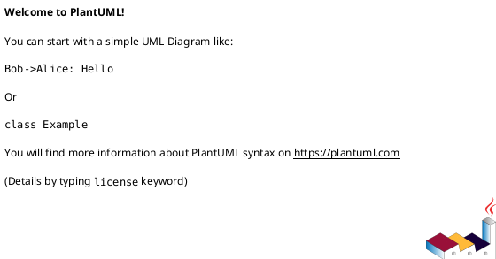

# 作業履歴 2024-08-20

## 概要

2024-08-20の作業内容をまとめています。

## コミット: 59a7e1c

### メッセージ

```
Merge pull request #2 from k2works/develop
アーキテクチャ変更
```

### 変更されたファイル


### 変更内容

```diff
commit 59a7e1cba8607716001b2d8aae267a960f76cfab
Merge: 4a1baf1 776effb
Author: Katuyuki Kakigi <kakimomokuri@gmail.com>
Date:   Tue Aug 20 19:12:23 2024 +0900

    Merge pull request #2 from k2works/develop
    
    アーキテクチャ変更


```

## コミット: 776effb

### メッセージ

```
refactor: ReservationList クラスを導入
- ReservationUseCase.findReservations の戻り値を ReservationList に変更
- ReservationService の findReservations メソッドで ReservationList を返すように変更
- ReservationsController で ReservationList に対応するよう変更
- ReservationsControllerTest など関連テストを修正
```

### 変更されたファイル

- A	src/main/java/mrs/application/domain/model/reservation/ReservationList.java
- M	src/main/java/mrs/application/port/in/ReservationUseCase.java
- M	src/main/java/mrs/application/service/reservation/ReservationService.java
- M	src/main/java/mrs/infrastructure/in/web/reservation/ReservationsController.java
- M	src/test/java/mrs/application/service/reservation/ReservationServiceTest.java
- M	src/test/java/mrs/infrastructure/in/web/reservation/ReservationsControllerTest.java

### 変更内容

```diff
commit 776effb5835b74e8bf10a4ba202eaec9f12929f8
Author: Katuyuki Kakigi <kakimomokuri@gmail.com>
Date:   Tue Aug 20 19:02:01 2024 +0900

    refactor: ReservationList クラスを導入
    
    - ReservationUseCase.findReservations の戻り値を ReservationList に変更
    - ReservationService の findReservations メソッドで ReservationList を返すように変更
    - ReservationsController で ReservationList に対応するよう変更
    - ReservationsControllerTest など関連テストを修正

diff --git a/src/main/java/mrs/application/domain/model/reservation/ReservationList.java b/src/main/java/mrs/application/domain/model/reservation/ReservationList.java
new file mode 100644
index 0000000..86d5699
--- /dev/null
+++ b/src/main/java/mrs/application/domain/model/reservation/ReservationList.java
@@ -0,0 +1,28 @@
+package mrs.application.domain.model.reservation;
+
+import lombok.AllArgsConstructor;
+import lombok.Getter;
+import lombok.NoArgsConstructor;
+import lombok.Value;
+
+import java.util.List;
+import java.util.Objects;
+
+/**
+ * 予約一覧
+ */
+@Value
+@Getter
+@AllArgsConstructor
+@NoArgsConstructor(force = true)
+public class ReservationList {
+    List<Reservation> value;
+
+    public static ReservationList of(List<Reservation> value) {
+        return new ReservationList(value);
+    }
+
+    public int size() {
+        return Objects.requireNonNull(value).size();
+    }
+}
diff --git a/src/main/java/mrs/application/port/in/ReservationUseCase.java b/src/main/java/mrs/application/port/in/ReservationUseCase.java
index e5795dc..7ec8f1a 100644
--- a/src/main/java/mrs/application/port/in/ReservationUseCase.java
+++ b/src/main/java/mrs/application/port/in/ReservationUseCase.java
@@ -3,11 +3,10 @@ package mrs.application.port.in;
 import mrs.application.domain.model.reservation.ReservableRoomId;
 import mrs.application.domain.model.reservation.Reservation;
 import mrs.application.domain.model.reservation.ReservationId;
-
-import java.util.List;
+import mrs.application.domain.model.reservation.ReservationList;
 
 public interface ReservationUseCase {
-    List<Reservation> findReservations(ReservableRoomId reservableRoomId);
+    ReservationList findReservations(ReservableRoomId reservableRoomId);
 
     Reservation reserve(Reservation reservation);
 
diff --git a/src/main/java/mrs/application/service/reservation/ReservationService.java b/src/main/java/mrs/application/service/reservation/ReservationService.java
index 981aa1b..f4186c3 100644
--- a/src/main/java/mrs/application/service/reservation/ReservationService.java
+++ b/src/main/java/mrs/application/service/reservation/ReservationService.java
@@ -1,10 +1,7 @@
 package mrs.application.service.reservation;
 
 import lombok.RequiredArgsConstructor;
-import mrs.application.domain.model.reservation.ReservableRoom;
-import mrs.application.domain.model.reservation.ReservableRoomId;
-import mrs.application.domain.model.reservation.Reservation;
-import mrs.application.domain.model.reservation.ReservationId;
+import mrs.application.domain.model.reservation.*;
 import mrs.application.port.in.ReservationUseCase;
 import mrs.application.port.out.ReservableRoomPort;
 import mrs.application.port.out.ReservationPort;
@@ -13,8 +10,6 @@ import org.springframework.security.core.parameters.P;
 import org.springframework.stereotype.Service;
 import org.springframework.transaction.annotation.Transactional;
 
-import java.util.List;
-
 /**
  * 会議室予約サービス
  */
@@ -28,8 +23,8 @@ public class ReservationService implements ReservationUseCase {
     /**
      * 予約一覧を取得する
      */
-    public List<Reservation> findReservations(ReservableRoomId reservableRoomId) {
-        return reservationPort.findByReservableRoom_ReservableRoomIdOrderByStartTimeAsc(reservableRoomId);
+    public ReservationList findReservations(ReservableRoomId reservableRoomId) {
+        return ReservationList.of(reservationPort.findByReservableRoom_ReservableRoomIdOrderByStartTimeAsc(reservableRoomId));
     }
 
     /**
diff --git a/src/main/java/mrs/infrastructure/in/web/reservation/ReservationsController.java b/src/main/java/mrs/infrastructure/in/web/reservation/ReservationsController.java
index 79b1ac7..78f8e31 100644
--- a/src/main/java/mrs/infrastructure/in/web/reservation/ReservationsController.java
+++ b/src/main/java/mrs/infrastructure/in/web/reservation/ReservationsController.java
@@ -1,10 +1,7 @@
 package mrs.infrastructure.in.web.reservation;
 
 import lombok.RequiredArgsConstructor;
-import mrs.application.domain.model.reservation.ReservableRoom;
-import mrs.application.domain.model.reservation.ReservableRoomId;
-import mrs.application.domain.model.reservation.Reservation;
-import mrs.application.domain.model.reservation.ReservationId;
+import mrs.application.domain.model.reservation.*;
 import mrs.application.domain.model.room.MeetingRoom;
 import mrs.application.domain.model.room.RoomId;
 import mrs.application.port.in.ReservationUseCase;
@@ -23,6 +20,7 @@ import org.springframework.web.bind.annotation.*;
 
 import java.time.LocalDate;
 import java.time.LocalTime;
+import java.util.Collections;
 import java.util.List;
 import java.util.stream.Stream;
 
@@ -52,12 +50,13 @@ public class ReservationsController {
     String reserveForm(@DateTimeFormat(iso = DateTimeFormat.ISO.DATE) @PathVariable("date") LocalDate date, @PathVariable("roomId") Integer roomId, Model model) {
         MeetingRoom meetingRoom = roomUseCase.findMeetingRoom(new RoomId(roomId));
         ReservableRoomId reservableRoomId = ReservableRoomId.of(roomId, date);
-        List<Reservation> reservations = reservationUseCase.findReservations(reservableRoomId);
+        ReservationList reservations = reservationUseCase.findReservations(reservableRoomId);
 
         List<LocalTime> timeList = Stream.iterate(LocalTime.of(0, 0), t -> t.plusMinutes(30)).limit(24 * 2).toList();
+        List<Reservation> reservationList = reservations != null ? reservations.getValue() : Collections.emptyList();
 
         model.addAttribute("room", meetingRoom);
-        model.addAttribute("reservations", reservations);
+        model.addAttribute("reservations", reservationList);
         model.addAttribute("timeList", timeList);
         return "reservation/reserveForm";
     }
diff --git a/src/test/java/mrs/application/service/reservation/ReservationServiceTest.java b/src/test/java/mrs/application/service/reservation/ReservationServiceTest.java
index e05a1a6..55005ed 100644
--- a/src/test/java/mrs/application/service/reservation/ReservationServiceTest.java
+++ b/src/test/java/mrs/application/service/reservation/ReservationServiceTest.java
@@ -48,7 +48,7 @@ public class ReservationServiceTest {
         when(reservationRepository.findByReservableRoom_ReservableRoomIdOrderByStartTimeAsc(reservableRoomId)).
                 thenReturn(expectedReservations);
 
-        List<Reservation> actualReservations = reservationService.findReservations(reservableRoomId);
+        List<Reservation> actualReservations = reservationService.findReservations(reservableRoomId).getValue();
 
         assertEquals(expectedReservations, actualReservations);
     }
@@ -61,7 +61,7 @@ public class ReservationServiceTest {
         when(reservationRepository.findByReservableRoom_ReservableRoomIdOrderByStartTimeAsc(reservableRoomId)).
                 thenReturn(List.of());
 
-        List<Reservation> actualReservations = reservationService.findReservations(reservableRoomId);
+        List<Reservation> actualReservations = reservationService.findReservations(reservableRoomId).getValue();
 
         assertEquals(List.of(), actualReservations);
     }
diff --git a/src/test/java/mrs/infrastructure/in/web/reservation/ReservationsControllerTest.java b/src/test/java/mrs/infrastructure/in/web/reservation/ReservationsControllerTest.java
index 75c5bd1..c19efd1 100644
--- a/src/test/java/mrs/infrastructure/in/web/reservation/ReservationsControllerTest.java
+++ b/src/test/java/mrs/infrastructure/in/web/reservation/ReservationsControllerTest.java
@@ -2,10 +2,7 @@ package mrs.infrastructure.in.web.reservation;
 
 import mrs.application.domain.model.auth.RoleName;
 import mrs.application.domain.model.auth.User;
-import mrs.application.domain.model.reservation.ReservableRoom;
-import mrs.application.domain.model.reservation.ReservableRoomId;
-import mrs.application.domain.model.reservation.Reservation;
-import mrs.application.domain.model.reservation.ReservationId;
+import mrs.application.domain.model.reservation.*;
 import mrs.application.domain.model.room.MeetingRoom;
 import mrs.application.domain.model.room.RoomId;
 import mrs.application.service.auth.AuthService;
@@ -88,7 +85,7 @@ public class ReservationsControllerTest {
         given(roomService.findMeetingRoom(roomId)).willReturn(meetingRoom);
 
         Reservation reservation = Reservation.of(1, form.getStartTime(), form.getEndTime(), reservableRoom, user);
-        given(reservationService.findReservations(reservableRoomId)).willReturn(List.of(reservation));
+        given(reservationService.findReservations(reservableRoomId)).willReturn(ReservationList.of(List.of(reservation)));
 
         this.mockMvc.perform(get("/reservations/{date}/{roomId}", date, roomId.getValue())
                         .with(user(userDetails))

```

### 構造変更



## コミット: 73429bd

### メッセージ

```
refactor: ReservableRoomListクラスを導入
- ReservableRoomListクラスを新規追加
- RoomService, RoomUseCase, RoomsControllerのインターフェース変更
- テストコードの修正
```

### 変更されたファイル

- A	src/main/java/mrs/application/domain/model/reservation/ReservableRoomList.java
- M	src/main/java/mrs/application/port/in/RoomUseCase.java
- M	src/main/java/mrs/application/service/room/RoomService.java
- M	src/main/java/mrs/infrastructure/in/web/room/RoomsController.java
- M	src/test/java/mrs/application/service/room/RoomServiceTest.java

### 変更内容

```diff
commit 73429bd1f2e6d4000fd1987f7efa5239b0bec4fd
Author: Katuyuki Kakigi <kakimomokuri@gmail.com>
Date:   Tue Aug 20 18:41:56 2024 +0900

    refactor: ReservableRoomListクラスを導入
    
    - ReservableRoomListクラスを新規追加
    - RoomService, RoomUseCase, RoomsControllerのインターフェース変更
    - テストコードの修正

diff --git a/src/main/java/mrs/application/domain/model/reservation/ReservableRoomList.java b/src/main/java/mrs/application/domain/model/reservation/ReservableRoomList.java
new file mode 100644
index 0000000..7333c5f
--- /dev/null
+++ b/src/main/java/mrs/application/domain/model/reservation/ReservableRoomList.java
@@ -0,0 +1,28 @@
+package mrs.application.domain.model.reservation;
+
+import lombok.AllArgsConstructor;
+import lombok.Getter;
+import lombok.NoArgsConstructor;
+import lombok.Value;
+
+import java.util.List;
+import java.util.Objects;
+
+/**
+ * 予約可能な会議室一覧
+ */
+@Value
+@Getter
+@AllArgsConstructor
+@NoArgsConstructor(force = true)
+public class ReservableRoomList {
+    List<ReservableRoom> value;
+
+    public static ReservableRoomList of(List<ReservableRoom> value) {
+        return new ReservableRoomList(value);
+    }
+
+    public int size() {
+        return Objects.requireNonNull(value).size();
+    }
+}
diff --git a/src/main/java/mrs/application/port/in/RoomUseCase.java b/src/main/java/mrs/application/port/in/RoomUseCase.java
index 56ab17a..fc6fec5 100644
--- a/src/main/java/mrs/application/port/in/RoomUseCase.java
+++ b/src/main/java/mrs/application/port/in/RoomUseCase.java
@@ -1,14 +1,12 @@
 package mrs.application.port.in;
 
-import mrs.application.domain.model.reservation.ReservableRoom;
+import mrs.application.domain.model.reservation.ReservableRoomList;
 import mrs.application.domain.model.reservation.ReservedDate;
 import mrs.application.domain.model.room.MeetingRoom;
 import mrs.application.domain.model.room.RoomId;
 
-import java.util.List;
-
 public interface RoomUseCase {
     MeetingRoom findMeetingRoom(RoomId roomId);
 
-    List<ReservableRoom> findReservableRooms(ReservedDate date);
+    ReservableRoomList findReservableRooms(ReservedDate date);
 }
diff --git a/src/main/java/mrs/application/service/room/RoomService.java b/src/main/java/mrs/application/service/room/RoomService.java
index 761e9ef..4932675 100644
--- a/src/main/java/mrs/application/service/room/RoomService.java
+++ b/src/main/java/mrs/application/service/room/RoomService.java
@@ -1,7 +1,7 @@
 package mrs.application.service.room;
 
 import lombok.RequiredArgsConstructor;
-import mrs.application.domain.model.reservation.ReservableRoom;
+import mrs.application.domain.model.reservation.ReservableRoomList;
 import mrs.application.domain.model.reservation.ReservedDate;
 import mrs.application.domain.model.room.MeetingRoom;
 import mrs.application.domain.model.room.RoomId;
@@ -11,8 +11,6 @@ import mrs.application.port.out.ReservableRoomPort;
 import org.springframework.stereotype.Service;
 import org.springframework.transaction.annotation.Transactional;
 
-import java.util.List;
-
 /**
  * 会議室サービス
  */
@@ -38,7 +36,7 @@ public class RoomService implements RoomUseCase {
     /**
      * 予約可能会議室を取得する
      */
-    public List<ReservableRoom> findReservableRooms(ReservedDate date) {
-        return reservableRoomPort.findByReservableRoomId_reservedDateOrderByReservableRoomId_roomIdAsc(date.getValue());
+    public ReservableRoomList findReservableRooms(ReservedDate date) {
+        return ReservableRoomList.of(reservableRoomPort.findByReservableRoomId_reservedDateOrderByReservableRoomId_roomIdAsc(date.getValue()));
     }
 }
diff --git a/src/main/java/mrs/infrastructure/in/web/room/RoomsController.java b/src/main/java/mrs/infrastructure/in/web/room/RoomsController.java
index d1986a9..4842407 100644
--- a/src/main/java/mrs/infrastructure/in/web/room/RoomsController.java
+++ b/src/main/java/mrs/infrastructure/in/web/room/RoomsController.java
@@ -1,7 +1,7 @@
 package mrs.infrastructure.in.web.room;
 
 import lombok.RequiredArgsConstructor;
-import mrs.application.domain.model.reservation.ReservableRoom;
+import mrs.application.domain.model.reservation.ReservableRoomList;
 import mrs.application.domain.model.reservation.ReservedDate;
 import mrs.application.port.in.RoomUseCase;
 import org.springframework.format.annotation.DateTimeFormat;
@@ -12,7 +12,6 @@ import org.springframework.web.bind.annotation.RequestMapping;
 import org.springframework.web.bind.annotation.RequestMethod;
 
 import java.time.LocalDate;
-import java.util.List;
 
 /**
  * 会議室一覧表示画面
@@ -29,9 +28,9 @@ public class RoomsController {
     @RequestMapping(method = RequestMethod.GET)
     String listRooms(Model model) {
         LocalDate today = LocalDate.now();
-        List<ReservableRoom> rooms = roomUseCase.findReservableRooms(new ReservedDate(today));
+        ReservableRoomList rooms = roomUseCase.findReservableRooms(new ReservedDate(today));
         model.addAttribute("date", today);
-        model.addAttribute("rooms", rooms);
+        model.addAttribute("rooms", rooms.getValue());
         return "room/listRooms";
     }
 
@@ -40,8 +39,8 @@ public class RoomsController {
      */
     @RequestMapping(path = "{date}", method = RequestMethod.GET)
     String listRooms(@DateTimeFormat(iso = DateTimeFormat.ISO.DATE) @PathVariable("date") LocalDate date, Model model) {
-        List<ReservableRoom> rooms = roomUseCase.findReservableRooms(new ReservedDate(date));
-        model.addAttribute("rooms", rooms);
+        ReservableRoomList rooms = roomUseCase.findReservableRooms(new ReservedDate(date));
+        model.addAttribute("rooms", rooms.getValue());
         return "room/listRooms";
     }
 }
diff --git a/src/test/java/mrs/application/service/room/RoomServiceTest.java b/src/test/java/mrs/application/service/room/RoomServiceTest.java
index 2d84277..b780e2d 100644
--- a/src/test/java/mrs/application/service/room/RoomServiceTest.java
+++ b/src/test/java/mrs/application/service/room/RoomServiceTest.java
@@ -2,6 +2,7 @@ package mrs.application.service.room;
 
 import mrs.application.domain.model.reservation.ReservableRoom;
 import mrs.application.domain.model.reservation.ReservableRoomId;
+import mrs.application.domain.model.reservation.ReservableRoomList;
 import mrs.application.domain.model.reservation.ReservedDate;
 import mrs.application.domain.model.room.MeetingRoom;
 import mrs.application.domain.model.room.RoomId;
@@ -45,11 +46,11 @@ public class RoomServiceTest {
     @DisplayName("本日の日付の予約可能会議室一覧を取得する")
     public void testFindReservableRooms() {
         LocalDate date = LocalDate.now();
-        List<ReservableRoom> reservableRooms = roomService.findReservableRooms(new ReservedDate(date));
+        ReservableRoomList reservableRooms = roomService.findReservableRooms(new ReservedDate(date));
         assertNotNull(reservableRooms, "Returned list should not be null");
         assertEquals(1, reservableRooms.size(), "The size of the returned list should be 1");
-        assertEquals(1, reservableRooms.get(0).getReservableRoomId().getRoomId().getValue(), "The roomId should be 1");
-        assertEquals(date, reservableRooms.get(0).getReservableRoomId().getReservedDate().getValue(), "Reserved date should be equal");
+        assertEquals(1, reservableRooms.getValue().get(0).getReservableRoomId().getRoomId().getValue(), "The roomId should be 1");
+        assertEquals(date, reservableRooms.getValue().get(0).getReservableRoomId().getReservedDate().getValue(), "Reserved date should be equal");
     }
 
     @Test

```

### 構造変更


## コミット: 7ec7d50

### メッセージ

```
refactor: RoomIdとReservedDateクラスを導入
- RoomIdをIntegerからRoomIdクラスに変更
- LocalDateをReservedDateクラスに変更
- RoomService, RoomsController, ReservationControllerなどで対応
```

### 変更されたファイル

- M	src/main/java/mrs/application/port/in/RoomUseCase.java
- M	src/main/java/mrs/application/service/room/RoomService.java
- M	src/main/java/mrs/infrastructure/in/web/reservation/ReservationsController.java
- M	src/main/java/mrs/infrastructure/in/web/room/RoomsController.java
- M	src/test/java/mrs/application/service/room/RoomServiceTest.java
- M	src/test/java/mrs/infrastructure/in/web/reservation/ReservationsControllerTest.java

### 変更内容

```diff
commit 7ec7d5032640c1fbe4c98ccc34d04aa2f1cbaf20
Author: Katuyuki Kakigi <kakimomokuri@gmail.com>
Date:   Tue Aug 20 18:26:01 2024 +0900

    refactor: RoomIdとReservedDateクラスを導入
    
    - RoomIdをIntegerからRoomIdクラスに変更
    - LocalDateをReservedDateクラスに変更
    - RoomService, RoomsController, ReservationControllerなどで対応

diff --git a/src/main/java/mrs/application/port/in/RoomUseCase.java b/src/main/java/mrs/application/port/in/RoomUseCase.java
index 46bb663..56ab17a 100644
--- a/src/main/java/mrs/application/port/in/RoomUseCase.java
+++ b/src/main/java/mrs/application/port/in/RoomUseCase.java
@@ -1,13 +1,14 @@
 package mrs.application.port.in;
 
 import mrs.application.domain.model.reservation.ReservableRoom;
+import mrs.application.domain.model.reservation.ReservedDate;
 import mrs.application.domain.model.room.MeetingRoom;
+import mrs.application.domain.model.room.RoomId;
 
-import java.time.LocalDate;
 import java.util.List;
 
 public interface RoomUseCase {
-    MeetingRoom findMeetingRoom(Integer roomId);
+    MeetingRoom findMeetingRoom(RoomId roomId);
 
-    List<ReservableRoom> findReservableRooms(LocalDate date);
+    List<ReservableRoom> findReservableRooms(ReservedDate date);
 }
diff --git a/src/main/java/mrs/application/service/room/RoomService.java b/src/main/java/mrs/application/service/room/RoomService.java
index accc6b2..761e9ef 100644
--- a/src/main/java/mrs/application/service/room/RoomService.java
+++ b/src/main/java/mrs/application/service/room/RoomService.java
@@ -2,14 +2,15 @@ package mrs.application.service.room;
 
 import lombok.RequiredArgsConstructor;
 import mrs.application.domain.model.reservation.ReservableRoom;
+import mrs.application.domain.model.reservation.ReservedDate;
 import mrs.application.domain.model.room.MeetingRoom;
+import mrs.application.domain.model.room.RoomId;
 import mrs.application.port.in.RoomUseCase;
 import mrs.application.port.out.MeetingRoomPort;
 import mrs.application.port.out.ReservableRoomPort;
 import org.springframework.stereotype.Service;
 import org.springframework.transaction.annotation.Transactional;
 
-import java.time.LocalDate;
 import java.util.List;
 
 /**
@@ -26,8 +27,8 @@ public class RoomService implements RoomUseCase {
     /**
      * 会議室を取得する
      */
-    public MeetingRoom findMeetingRoom(Integer roomId) {
-        MeetingRoom meetingRoom = meetingRoomPort.findById(roomId);
+    public MeetingRoom findMeetingRoom(RoomId roomId) {
+        MeetingRoom meetingRoom = meetingRoomPort.findById(roomId.getValue());
         if (meetingRoom == null) {
             throw new IllegalStateException("会議室が見つかりません。");
         }
@@ -37,7 +38,7 @@ public class RoomService implements RoomUseCase {
     /**
      * 予約可能会議室を取得する
      */
-    public List<ReservableRoom> findReservableRooms(LocalDate date) {
-        return reservableRoomPort.findByReservableRoomId_reservedDateOrderByReservableRoomId_roomIdAsc(date);
+    public List<ReservableRoom> findReservableRooms(ReservedDate date) {
+        return reservableRoomPort.findByReservableRoomId_reservedDateOrderByReservableRoomId_roomIdAsc(date.getValue());
     }
 }
diff --git a/src/main/java/mrs/infrastructure/in/web/reservation/ReservationsController.java b/src/main/java/mrs/infrastructure/in/web/reservation/ReservationsController.java
index 2bde095..79b1ac7 100644
--- a/src/main/java/mrs/infrastructure/in/web/reservation/ReservationsController.java
+++ b/src/main/java/mrs/infrastructure/in/web/reservation/ReservationsController.java
@@ -6,6 +6,7 @@ import mrs.application.domain.model.reservation.ReservableRoomId;
 import mrs.application.domain.model.reservation.Reservation;
 import mrs.application.domain.model.reservation.ReservationId;
 import mrs.application.domain.model.room.MeetingRoom;
+import mrs.application.domain.model.room.RoomId;
 import mrs.application.port.in.ReservationUseCase;
 import mrs.application.port.in.RoomUseCase;
 import mrs.application.service.auth.AuthUserDetails;
@@ -49,7 +50,7 @@ public class ReservationsController {
      */
     @RequestMapping(method = RequestMethod.GET)
     String reserveForm(@DateTimeFormat(iso = DateTimeFormat.ISO.DATE) @PathVariable("date") LocalDate date, @PathVariable("roomId") Integer roomId, Model model) {
-        MeetingRoom meetingRoom = roomUseCase.findMeetingRoom(roomId);
+        MeetingRoom meetingRoom = roomUseCase.findMeetingRoom(new RoomId(roomId));
         ReservableRoomId reservableRoomId = ReservableRoomId.of(roomId, date);
         List<Reservation> reservations = reservationUseCase.findReservations(reservableRoomId);
 
diff --git a/src/main/java/mrs/infrastructure/in/web/room/RoomsController.java b/src/main/java/mrs/infrastructure/in/web/room/RoomsController.java
index 6b9a76f..d1986a9 100644
--- a/src/main/java/mrs/infrastructure/in/web/room/RoomsController.java
+++ b/src/main/java/mrs/infrastructure/in/web/room/RoomsController.java
@@ -2,6 +2,7 @@ package mrs.infrastructure.in.web.room;
 
 import lombok.RequiredArgsConstructor;
 import mrs.application.domain.model.reservation.ReservableRoom;
+import mrs.application.domain.model.reservation.ReservedDate;
 import mrs.application.port.in.RoomUseCase;
 import org.springframework.format.annotation.DateTimeFormat;
 import org.springframework.stereotype.Controller;
@@ -28,7 +29,7 @@ public class RoomsController {
     @RequestMapping(method = RequestMethod.GET)
     String listRooms(Model model) {
         LocalDate today = LocalDate.now();
-        List<ReservableRoom> rooms = roomUseCase.findReservableRooms(today);
+        List<ReservableRoom> rooms = roomUseCase.findReservableRooms(new ReservedDate(today));
         model.addAttribute("date", today);
         model.addAttribute("rooms", rooms);
         return "room/listRooms";
@@ -39,7 +40,7 @@ public class RoomsController {
      */
     @RequestMapping(path = "{date}", method = RequestMethod.GET)
     String listRooms(@DateTimeFormat(iso = DateTimeFormat.ISO.DATE) @PathVariable("date") LocalDate date, Model model) {
-        List<ReservableRoom> rooms = roomUseCase.findReservableRooms(date);
+        List<ReservableRoom> rooms = roomUseCase.findReservableRooms(new ReservedDate(date));
         model.addAttribute("rooms", rooms);
         return "room/listRooms";
     }
diff --git a/src/test/java/mrs/application/service/room/RoomServiceTest.java b/src/test/java/mrs/application/service/room/RoomServiceTest.java
index 65b8a3d..2d84277 100644
--- a/src/test/java/mrs/application/service/room/RoomServiceTest.java
+++ b/src/test/java/mrs/application/service/room/RoomServiceTest.java
@@ -2,7 +2,9 @@ package mrs.application.service.room;
 
 import mrs.application.domain.model.reservation.ReservableRoom;
 import mrs.application.domain.model.reservation.ReservableRoomId;
+import mrs.application.domain.model.reservation.ReservedDate;
 import mrs.application.domain.model.room.MeetingRoom;
+import mrs.application.domain.model.room.RoomId;
 import mrs.infrastructure.out.persistence.reservation.ReservableRoomPersistenceAdapter;
 import mrs.infrastructure.out.persistence.room.MeetingMeetingRoomPersistenceAdapter;
 import org.junit.jupiter.api.BeforeEach;
@@ -43,7 +45,7 @@ public class RoomServiceTest {
     @DisplayName("本日の日付の予約可能会議室一覧を取得する")
     public void testFindReservableRooms() {
         LocalDate date = LocalDate.now();
-        List<ReservableRoom> reservableRooms = roomService.findReservableRooms(date);
+        List<ReservableRoom> reservableRooms = roomService.findReservableRooms(new ReservedDate(date));
         assertNotNull(reservableRooms, "Returned list should not be null");
         assertEquals(1, reservableRooms.size(), "The size of the returned list should be 1");
         assertEquals(1, reservableRooms.get(0).getReservableRoomId().getRoomId().getValue(), "The roomId should be 1");
@@ -53,20 +55,20 @@ public class RoomServiceTest {
     @Test
     @DisplayName("会議室が見つかる時")
     public void testFindMeetingRoom_Found() {
-        Integer roomId = 1;
-        MeetingRoom expectedMeetingRoom = MeetingRoom.of(roomId, "会議室1");
-        when(meetingRoomRepository.findById(roomId)).thenReturn(expectedMeetingRoom);
+        RoomId roomId = new RoomId(1);
+        MeetingRoom expectedMeetingRoom = MeetingRoom.of(roomId.getValue(), "会議室1");
+        when(meetingRoomRepository.findById(roomId.getValue())).thenReturn(expectedMeetingRoom);
 
         MeetingRoom meetingRoom = roomService.findMeetingRoom(roomId);
         assertNotNull(meetingRoom, "Returned meeting room should not be null");
-        assertEquals(roomId, meetingRoom.getRoomId().getValue(), "Returned room id should be 1");
+        assertEquals(roomId, meetingRoom.getRoomId(), "Returned room id should be 1");
     }
 
     @Test
     @DisplayName("会議室が見つからない時")
     public void testFindMeetingRoom_NotFound() {
-        Integer roomId = 1;
-        when(meetingRoomRepository.findById(roomId)).thenReturn(null);
+        RoomId roomId = new RoomId(1);
+        when(meetingRoomRepository.findById(roomId.getValue())).thenReturn(null);
 
         Throwable exception = assertThrows(IllegalStateException.class, () -> {
             roomService.findMeetingRoom(roomId);
diff --git a/src/test/java/mrs/infrastructure/in/web/reservation/ReservationsControllerTest.java b/src/test/java/mrs/infrastructure/in/web/reservation/ReservationsControllerTest.java
index f990217..75c5bd1 100644
--- a/src/test/java/mrs/infrastructure/in/web/reservation/ReservationsControllerTest.java
+++ b/src/test/java/mrs/infrastructure/in/web/reservation/ReservationsControllerTest.java
@@ -7,6 +7,7 @@ import mrs.application.domain.model.reservation.ReservableRoomId;
 import mrs.application.domain.model.reservation.Reservation;
 import mrs.application.domain.model.reservation.ReservationId;
 import mrs.application.domain.model.room.MeetingRoom;
+import mrs.application.domain.model.room.RoomId;
 import mrs.application.service.auth.AuthService;
 import mrs.application.service.auth.AuthUserDetails;
 import mrs.application.service.reservation.ReservationService;
@@ -79,17 +80,17 @@ public class ReservationsControllerTest {
         given(userDetails.getUser()).willReturn(user);
         UserDetails userDetails = userDetailsService.loadUserByUsername(user.getUserId().getValue());
 
-        Integer roomId = 1;
+        RoomId roomId = new RoomId(1);
         LocalDate date = LocalDate.of(2022, 2, 22);
-        MeetingRoom meetingRoom = MeetingRoom.of(roomId, "Room-1");
-        ReservableRoomId reservableRoomId = ReservableRoomId.of(roomId, date);
+        MeetingRoom meetingRoom = MeetingRoom.of(roomId.getValue(), "Room-1");
+        ReservableRoomId reservableRoomId = ReservableRoomId.of(roomId.getValue(), date);
         ReservableRoom reservableRoom = new ReservableRoom(reservableRoomId, meetingRoom);
         given(roomService.findMeetingRoom(roomId)).willReturn(meetingRoom);
 
         Reservation reservation = Reservation.of(1, form.getStartTime(), form.getEndTime(), reservableRoom, user);
         given(reservationService.findReservations(reservableRoomId)).willReturn(List.of(reservation));
 
-        this.mockMvc.perform(get("/reservations/{date}/{roomId}", date, roomId)
+        this.mockMvc.perform(get("/reservations/{date}/{roomId}", date, roomId.getValue())
                         .with(user(userDetails))
                 )
                 .andExpect(status().isOk())
@@ -103,10 +104,10 @@ public class ReservationsControllerTest {
     @WithMockUser(username = "user", roles = "USER")  // この行を追加
     @DisplayName("BindResultにエラーがある場合、エラー付きでreserveFormを返すことをテスト")
     public void testReserve_BindResultHasErrors() throws Exception {
-        Integer roomId = 1;
+        RoomId roomId = new RoomId(1);
         LocalDate date = LocalDate.of(2022, 2, 22);
-        MeetingRoom meetingRoom = MeetingRoom.of(roomId, "Room-1");
-        ReservableRoomId reservableRoomId = ReservableRoomId.of(roomId, date);
+        MeetingRoom meetingRoom = MeetingRoom.of(roomId.getValue(), "Room-1");
+        ReservableRoomId reservableRoomId = ReservableRoomId.of(roomId.getValue(), date);
         ReservationForm form = new ReservationForm();
         form.setStartTime(null);
         form.setEndTime(LocalTime.of(10, 0));
@@ -117,7 +118,7 @@ public class ReservationsControllerTest {
         given(userDetails.getUser()).willReturn(user);
         UserDetails userDetails = userDetailsService.loadUserByUsername(user.getUserId().getValue());
 
-        mockMvc.perform(post("/reservations/{date}/{roomId}", date, roomId)
+        mockMvc.perform(post("/reservations/{date}/{roomId}", date, roomId.getValue())
                         .with(user(userDetails))
                         .with(csrf())
                         .flashAttr("reservationForm", form))
@@ -129,10 +130,10 @@ public class ReservationsControllerTest {
     @WithMockUser(username = "user", roles = "USER")  // この行を追加
     @DisplayName("予約中に例外が発生した場合に、エラーメッセージ付きでreserveFormを返すことをテスト")
     public void testReserve_ThrowsExceptionDuringReservation() throws Exception {
-        Integer roomId = 1;
+        RoomId roomId = new RoomId(1);
         LocalDate date = LocalDate.of(2022, 2, 22);
-        MeetingRoom meetingRoom = MeetingRoom.of(roomId, "Room-1");
-        ReservableRoomId reservableRoomId = ReservableRoomId.of(roomId, date);
+        MeetingRoom meetingRoom = MeetingRoom.of(roomId.getValue(), "Room-1");
+        ReservableRoomId reservableRoomId = ReservableRoomId.of(roomId.getValue(), date);
         ReservableRoom reservableRoom = new ReservableRoom(reservableRoomId, meetingRoom);
         ReservationForm form = new ReservationForm();
         form.setStartTime(LocalTime.of(9, 0));
@@ -145,7 +146,7 @@ public class ReservationsControllerTest {
         given(userDetails.getUser()).willReturn(user);
         UserDetails userDetails = userDetailsService.loadUserByUsername(user.getUserId().getValue());
 
-        this.mockMvc.perform(post("/reservations/{date}/{roomId}", date, roomId)
+        this.mockMvc.perform(post("/reservations/{date}/{roomId}", date, roomId.getValue())
                         .with(user(userDetails))
                         .with(csrf())
                         .flashAttr("reservationForm", form))
@@ -158,10 +159,10 @@ public class ReservationsControllerTest {
     @WithMockUser(username = "user", roles = "USER")  // この行を追加
     @DisplayName("エラーや例外が発生しない場合に、/reservations/{date}/{roomId}にリダイレクトすることをテスト")
     public void testReserve_NoErrorsOrExceptions() throws Exception {
-        Integer roomId = 1;
+        RoomId roomId = new RoomId(1);
         LocalDate date = LocalDate.of(2022, 2, 22);
-        MeetingRoom meetingRoom = MeetingRoom.of(roomId, "Room-1");
-        ReservableRoomId reservableRoomId = ReservableRoomId.of(roomId, date);
+        MeetingRoom meetingRoom = MeetingRoom.of(roomId.getValue(), "Room-1");
+        ReservableRoomId reservableRoomId = ReservableRoomId.of(roomId.getValue(), date);
         ReservableRoom reservableRoom = new ReservableRoom(reservableRoomId, meetingRoom);
         ReservationForm form = new ReservationForm();
         form.setStartTime(LocalTime.of(9, 0));
@@ -171,31 +172,31 @@ public class ReservationsControllerTest {
         given(userDetails.getUser()).willReturn(user);
         UserDetails userDetails = userDetailsService.loadUserByUsername(user.getUserId().getValue());
 
-        mockMvc.perform(post("/reservations/{date}/{roomId}", date, roomId)
+        mockMvc.perform(post("/reservations/{date}/{roomId}", date, roomId.getValue())
                         .with(user(userDetails))
                         .with(csrf())
                         .flashAttr("reservationForm", form))
                 .andExpect(status().isFound())
-                .andExpect(redirectedUrl("/reservations/" + date + "/" + roomId));
+                .andExpect(redirectedUrl("/reservations/" + date + "/" + roomId.getValue()));
     }
 
     @Test
     @WithMockUser(username = "taro-yamada", roles = "USER")  // この行を追加
     @DisplayName("権限のない予約をキャンセルしようとした場合、エラーメッセージと共にフォームが再読み込みされるべきである")
     public void testCancel_NonExistentReservation_() throws Exception {
-        Integer roomId = 1;
+        RoomId roomId = new RoomId(1);
         ReservationId reservationId = new ReservationId(1);
         LocalDate date = LocalDate.of(2022, 2, 22);
         String errorMessage = "要求されたキャンセルは許可できません。";
         doThrow(new AccessDeniedException(errorMessage)).when(reservationService).findOne(eq(reservationId));
-        MeetingRoom meetingRoom = MeetingRoom.of(roomId, "Room-1");
+        MeetingRoom meetingRoom = MeetingRoom.of(roomId.getValue(), "Room-1");
         given(roomService.findMeetingRoom(roomId)).willReturn(meetingRoom);
 
         User user = getUser();
         given(userDetails.getUser()).willReturn(user);
         UserDetails userDetails = userDetailsService.loadUserByUsername(user.getUserId().getValue());
 
-        this.mockMvc.perform(post("/reservations/{date}/{roomId}", date, roomId)
+        this.mockMvc.perform(post("/reservations/{date}/{roomId}", date, roomId.getValue())
                         .with(user(userDetails))
                         .with(csrf())
                         .param("cancel", "")
@@ -209,7 +210,7 @@ public class ReservationsControllerTest {
     @WithMockUser(username = "user", roles = "USER")  // この行を追加
     @DisplayName("予約のキャンセルが成功した場合、ページは更新された予約一覧にリダイレクトされるべきである")
     public void testCancel_SuccessfulCancellation_() throws Exception {
-        Integer roomId = 1;
+        RoomId roomId = new RoomId(1);
         Integer reservationId = 1;
         LocalDate date = LocalDate.of(2022, 2, 22);
 
@@ -217,12 +218,12 @@ public class ReservationsControllerTest {
         given(userDetails.getUser()).willReturn(user);
         UserDetails userDetails = userDetailsService.loadUserByUsername(user.getUserId().getValue());
 
-        this.mockMvc.perform(post("/reservations/{date}/{roomId}", date, roomId)
+        this.mockMvc.perform(post("/reservations/{date}/{roomId}", date, roomId.getValue())
                         .with(user(userDetails))
                         .with(csrf())
                         .param("cancel", "")
                         .param("reservationId", String.valueOf(reservationId)))
                 .andExpect(status().isFound())
-                .andExpect(redirectedUrl("/reservations/" + date + "/" + roomId));
+                .andExpect(redirectedUrl("/reservations/" + date + "/" + roomId.getValue()));
     }
 }

```

### 構造変更


## コミット: 0b8fefb

### メッセージ

```
refactor: ReservableRoomId に ReservedDate を導入し、関連クラスを修正
- LocalDate を ReservedDate に変更
- 新しいクラス ReservedDate を追加
- findById メソッドの修正
- findOneForUpdateByReservableRoomId メソッドの修正
- ReservationPersistenceAdapter の修正
- RoomServiceTest の修正
```

### 変更されたファイル

- M	src/main/java/mrs/application/domain/model/reservation/ReservableRoomId.java
- A	src/main/java/mrs/application/domain/model/reservation/ReservedDate.java
- M	src/main/java/mrs/infrastructure/out/persistence/reservation/ReservableRoomMapper.java
- M	src/main/java/mrs/infrastructure/out/persistence/reservation/ReservableRoomPersistenceAdapter.java
- M	src/main/java/mrs/infrastructure/out/persistence/reservation/ReservationPersistenceAdapter.java
- M	src/test/java/mrs/application/service/room/RoomServiceTest.java

### 変更内容

```diff
commit 0b8fefbbb0f1715f1cc1d52166ed248da4508050
Author: Katuyuki Kakigi <kakimomokuri@gmail.com>
Date:   Tue Aug 20 18:02:49 2024 +0900

    refactor: ReservableRoomId に ReservedDate を導入し、関連クラスを修正
    
    - LocalDate を ReservedDate に変更
    - 新しいクラス ReservedDate を追加
    - findById メソッドの修正
    - findOneForUpdateByReservableRoomId メソッドの修正
    - ReservationPersistenceAdapter の修正
    - RoomServiceTest の修正

diff --git a/src/main/java/mrs/application/domain/model/reservation/ReservableRoomId.java b/src/main/java/mrs/application/domain/model/reservation/ReservableRoomId.java
index e29e7d1..9f6bbb6 100644
--- a/src/main/java/mrs/application/domain/model/reservation/ReservableRoomId.java
+++ b/src/main/java/mrs/application/domain/model/reservation/ReservableRoomId.java
@@ -17,9 +17,9 @@ import java.time.LocalDate;
 @NoArgsConstructor(force = true)
 public class ReservableRoomId {
     RoomId roomId;
-    LocalDate reservedDate;
+    ReservedDate reservedDate;
 
     public static ReservableRoomId of(Integer roomId, LocalDate reservedDate) {
-        return new ReservableRoomId(new RoomId(roomId), reservedDate);
+        return new ReservableRoomId(new RoomId(roomId), new ReservedDate(reservedDate));
     }
 }
diff --git a/src/main/java/mrs/application/domain/model/reservation/ReservedDate.java b/src/main/java/mrs/application/domain/model/reservation/ReservedDate.java
new file mode 100644
index 0000000..ffd1b84
--- /dev/null
+++ b/src/main/java/mrs/application/domain/model/reservation/ReservedDate.java
@@ -0,0 +1,19 @@
+package mrs.application.domain.model.reservation;
+
+import lombok.AllArgsConstructor;
+import lombok.Getter;
+import lombok.NoArgsConstructor;
+import lombok.Value;
+
+import java.time.LocalDate;
+
+/**
+ * 予約日
+ */
+@Getter
+@Value
+@AllArgsConstructor
+@NoArgsConstructor(force = true)
+public class ReservedDate {
+    LocalDate value;
+}
diff --git a/src/main/java/mrs/infrastructure/out/persistence/reservation/ReservableRoomMapper.java b/src/main/java/mrs/infrastructure/out/persistence/reservation/ReservableRoomMapper.java
index 9c33550..d273e05 100644
--- a/src/main/java/mrs/infrastructure/out/persistence/reservation/ReservableRoomMapper.java
+++ b/src/main/java/mrs/infrastructure/out/persistence/reservation/ReservableRoomMapper.java
@@ -23,7 +23,7 @@ public class ReservableRoomMapper {
         return new ReservableRoomJpaEntity(
                 new ReservableRoomIdJpaEntity(
                         reservableRoom.getReservableRoomId().getRoomId().getValue(),
-                        reservableRoom.getReservableRoomId().getReservedDate()),
+                        reservableRoom.getReservableRoomId().getReservedDate().getValue()),
                 new MeetingRoomJpaEntity(
                         reservableRoom.getMeetingRoom().getRoomId().getValue(),
                         reservableRoom.getMeetingRoom().getRoomName().getValue()));
diff --git a/src/main/java/mrs/infrastructure/out/persistence/reservation/ReservableRoomPersistenceAdapter.java b/src/main/java/mrs/infrastructure/out/persistence/reservation/ReservableRoomPersistenceAdapter.java
index b4e4e93..76ef2e7 100644
--- a/src/main/java/mrs/infrastructure/out/persistence/reservation/ReservableRoomPersistenceAdapter.java
+++ b/src/main/java/mrs/infrastructure/out/persistence/reservation/ReservableRoomPersistenceAdapter.java
@@ -16,7 +16,7 @@ public class ReservableRoomPersistenceAdapter implements ReservableRoomPort {
     private final ReservableRoomMapper reservableRoomMapper;
 
     public ReservableRoom findById(ReservableRoomId roomId) {
-        ReservableRoomIdJpaEntity reservableRoomIdJpaEntity = new ReservableRoomIdJpaEntity(roomId.getRoomId().getValue(), roomId.getReservedDate());
+        ReservableRoomIdJpaEntity reservableRoomIdJpaEntity = new ReservableRoomIdJpaEntity(roomId.getRoomId().getValue(), roomId.getReservedDate().getValue());
         return reservableRoomMapper.mapToDomainEntity(reservableRoomRepository.findById(reservableRoomIdJpaEntity).orElseThrow());
     }
 
@@ -29,7 +29,7 @@ public class ReservableRoomPersistenceAdapter implements ReservableRoomPort {
     }
 
     public ReservableRoom findOneForUpdateByReservableRoomId(ReservableRoomId reservableRoomId) {
-        ReservableRoomIdJpaEntity reservableRoomIdJpaEntity = new ReservableRoomIdJpaEntity(reservableRoomId.getRoomId().getValue(), reservableRoomId.getReservedDate());
+        ReservableRoomIdJpaEntity reservableRoomIdJpaEntity = new ReservableRoomIdJpaEntity(reservableRoomId.getRoomId().getValue(), reservableRoomId.getReservedDate().getValue());
         return reservableRoomMapper.mapToDomainEntity(reservableRoomRepository.findOneForUpdateByReservableRoomId(reservableRoomIdJpaEntity));
     }
 
diff --git a/src/main/java/mrs/infrastructure/out/persistence/reservation/ReservationPersistenceAdapter.java b/src/main/java/mrs/infrastructure/out/persistence/reservation/ReservationPersistenceAdapter.java
index 6e6a7f9..e13c72c 100644
--- a/src/main/java/mrs/infrastructure/out/persistence/reservation/ReservationPersistenceAdapter.java
+++ b/src/main/java/mrs/infrastructure/out/persistence/reservation/ReservationPersistenceAdapter.java
@@ -24,7 +24,7 @@ public class ReservationPersistenceAdapter implements ReservationPort {
     }
 
     public List<Reservation> findByReservableRoom_ReservableRoomIdOrderByStartTimeAsc(ReservableRoomId reservableRoomId) {
-        ReservableRoomIdJpaEntity reservableRoomIdJpaEntity = new ReservableRoomIdJpaEntity(reservableRoomId.getRoomId().getValue(), reservableRoomId.getReservedDate());
+        ReservableRoomIdJpaEntity reservableRoomIdJpaEntity = new ReservableRoomIdJpaEntity(reservableRoomId.getRoomId().getValue(), reservableRoomId.getReservedDate().getValue());
         return reservationMapper.mapToDomainEntities(reservationRepository.findByReservableRoom_ReservableRoomIdOrderByStartTimeAsc(reservableRoomIdJpaEntity));
     }
 
diff --git a/src/test/java/mrs/application/service/room/RoomServiceTest.java b/src/test/java/mrs/application/service/room/RoomServiceTest.java
index 5f2e5e1..65b8a3d 100644
--- a/src/test/java/mrs/application/service/room/RoomServiceTest.java
+++ b/src/test/java/mrs/application/service/room/RoomServiceTest.java
@@ -47,7 +47,7 @@ public class RoomServiceTest {
         assertNotNull(reservableRooms, "Returned list should not be null");
         assertEquals(1, reservableRooms.size(), "The size of the returned list should be 1");
         assertEquals(1, reservableRooms.get(0).getReservableRoomId().getRoomId().getValue(), "The roomId should be 1");
-        assertEquals(date, reservableRooms.get(0).getReservableRoomId().getReservedDate(), "Reserved date should be equal");
+        assertEquals(date, reservableRooms.get(0).getReservableRoomId().getReservedDate().getValue(), "Reserved date should be equal");
     }
 
     @Test

```

### 構造変更


## コミット: 0fb6ad8

### メッセージ

```
refactor: ReservationIdを使用するよう変更
- ReservationsControllerTestでReservationIdを使用
- ReservationsControllerでReservationIdを使用
- ReservationServiceTestでReservationIdを使用
- ReservationUseCaseのfindOneメソッドの引数をReservationIdに変更
- ReservationServiceのfindOneメソッドの引数をReservationIdに変更
```

### 変更されたファイル

- M	src/main/java/mrs/application/port/in/ReservationUseCase.java
- M	src/main/java/mrs/application/service/reservation/ReservationService.java
- M	src/main/java/mrs/infrastructure/in/web/reservation/ReservationsController.java
- M	src/test/java/mrs/application/service/reservation/ReservationServiceTest.java
- M	src/test/java/mrs/infrastructure/in/web/reservation/ReservationsControllerTest.java

### 変更内容

```diff
commit 0fb6ad8c3e8356938fc106b2313c336ac56d5664
Author: Katuyuki Kakigi <kakimomokuri@gmail.com>
Date:   Tue Aug 20 17:53:37 2024 +0900

    refactor: ReservationIdを使用するよう変更
    
    - ReservationsControllerTestでReservationIdを使用
    - ReservationsControllerでReservationIdを使用
    - ReservationServiceTestでReservationIdを使用
    - ReservationUseCaseのfindOneメソッドの引数をReservationIdに変更
    - ReservationServiceのfindOneメソッドの引数をReservationIdに変更

diff --git a/src/main/java/mrs/application/port/in/ReservationUseCase.java b/src/main/java/mrs/application/port/in/ReservationUseCase.java
index 9b52125..e5795dc 100644
--- a/src/main/java/mrs/application/port/in/ReservationUseCase.java
+++ b/src/main/java/mrs/application/port/in/ReservationUseCase.java
@@ -2,6 +2,7 @@ package mrs.application.port.in;
 
 import mrs.application.domain.model.reservation.ReservableRoomId;
 import mrs.application.domain.model.reservation.Reservation;
+import mrs.application.domain.model.reservation.ReservationId;
 
 import java.util.List;
 
@@ -12,5 +13,5 @@ public interface ReservationUseCase {
 
     void cancel(Reservation reservation);
 
-    Reservation findOne(Integer reservationId);
+    Reservation findOne(ReservationId reservationId);
 }
diff --git a/src/main/java/mrs/application/service/reservation/ReservationService.java b/src/main/java/mrs/application/service/reservation/ReservationService.java
index 7dcfb11..981aa1b 100644
--- a/src/main/java/mrs/application/service/reservation/ReservationService.java
+++ b/src/main/java/mrs/application/service/reservation/ReservationService.java
@@ -4,6 +4,7 @@ import lombok.RequiredArgsConstructor;
 import mrs.application.domain.model.reservation.ReservableRoom;
 import mrs.application.domain.model.reservation.ReservableRoomId;
 import mrs.application.domain.model.reservation.Reservation;
+import mrs.application.domain.model.reservation.ReservationId;
 import mrs.application.port.in.ReservationUseCase;
 import mrs.application.port.out.ReservableRoomPort;
 import mrs.application.port.out.ReservationPort;
@@ -61,8 +62,8 @@ public class ReservationService implements ReservationUseCase {
     /**
      * 予約情報を取得する
      */
-    public Reservation findOne(Integer reservationId) {
-        Reservation reservation = reservationPort.findById(reservationId);
+    public Reservation findOne(ReservationId reservationId) {
+        Reservation reservation = reservationPort.findById(reservationId.getValue());
         if (reservation == null) {
             throw new IllegalStateException("予約が見つかりません。");
         }
diff --git a/src/main/java/mrs/infrastructure/in/web/reservation/ReservationsController.java b/src/main/java/mrs/infrastructure/in/web/reservation/ReservationsController.java
index fb8daa6..2bde095 100644
--- a/src/main/java/mrs/infrastructure/in/web/reservation/ReservationsController.java
+++ b/src/main/java/mrs/infrastructure/in/web/reservation/ReservationsController.java
@@ -4,6 +4,7 @@ import lombok.RequiredArgsConstructor;
 import mrs.application.domain.model.reservation.ReservableRoom;
 import mrs.application.domain.model.reservation.ReservableRoomId;
 import mrs.application.domain.model.reservation.Reservation;
+import mrs.application.domain.model.reservation.ReservationId;
 import mrs.application.domain.model.room.MeetingRoom;
 import mrs.application.port.in.ReservationUseCase;
 import mrs.application.port.in.RoomUseCase;
@@ -88,7 +89,7 @@ public class ReservationsController {
     @RequestMapping(method = RequestMethod.POST, params = "cancel")
     String cancel(@RequestParam("reservationId") Integer reservationId, @PathVariable("roomId") Integer roomId, @DateTimeFormat(iso = DateTimeFormat.ISO.DATE) @PathVariable("date") LocalDate date, Model model) {
         try {
-            Reservation reservation = reservationUseCase.findOne(reservationId);
+            Reservation reservation = reservationUseCase.findOne(new ReservationId(reservationId));
             reservationUseCase.cancel(reservation);
         } catch (AccessDeniedException e) {
             model.addAttribute("error", e.getMessage());
diff --git a/src/test/java/mrs/application/service/reservation/ReservationServiceTest.java b/src/test/java/mrs/application/service/reservation/ReservationServiceTest.java
index 3dae46d..e05a1a6 100644
--- a/src/test/java/mrs/application/service/reservation/ReservationServiceTest.java
+++ b/src/test/java/mrs/application/service/reservation/ReservationServiceTest.java
@@ -4,6 +4,7 @@ import mrs.application.domain.model.auth.*;
 import mrs.application.domain.model.reservation.ReservableRoom;
 import mrs.application.domain.model.reservation.ReservableRoomId;
 import mrs.application.domain.model.reservation.Reservation;
+import mrs.application.domain.model.reservation.ReservationId;
 import mrs.application.domain.model.room.MeetingRoom;
 import mrs.infrastructure.out.persistence.reservation.ReservableRoomPersistenceAdapter;
 import mrs.infrastructure.out.persistence.reservation.ReservationPersistenceAdapter;
@@ -128,9 +129,9 @@ public class ReservationServiceTest {
     @Test
     @DisplayName("予約が存在しない場合はエラーが発生する")
     public void shouldThrowErrorWhenReservationDoesNotExist() {
-        int reservationId = 1;
+        ReservationId reservationId = new ReservationId(1);
 
-        when(reservationRepository.findById(reservationId)).thenReturn(null);
+        when(reservationRepository.findById(reservationId.getValue())).thenReturn(null);
 
         assertThrows(IllegalStateException.class, () -> {
             reservationService.findOne(reservationId);
diff --git a/src/test/java/mrs/infrastructure/in/web/reservation/ReservationsControllerTest.java b/src/test/java/mrs/infrastructure/in/web/reservation/ReservationsControllerTest.java
index b905de4..f990217 100644
--- a/src/test/java/mrs/infrastructure/in/web/reservation/ReservationsControllerTest.java
+++ b/src/test/java/mrs/infrastructure/in/web/reservation/ReservationsControllerTest.java
@@ -5,6 +5,7 @@ import mrs.application.domain.model.auth.User;
 import mrs.application.domain.model.reservation.ReservableRoom;
 import mrs.application.domain.model.reservation.ReservableRoomId;
 import mrs.application.domain.model.reservation.Reservation;
+import mrs.application.domain.model.reservation.ReservationId;
 import mrs.application.domain.model.room.MeetingRoom;
 import mrs.application.service.auth.AuthService;
 import mrs.application.service.auth.AuthUserDetails;
@@ -183,7 +184,7 @@ public class ReservationsControllerTest {
     @DisplayName("権限のない予約をキャンセルしようとした場合、エラーメッセージと共にフォームが再読み込みされるべきである")
     public void testCancel_NonExistentReservation_() throws Exception {
         Integer roomId = 1;
-        Integer reservationId = 1;
+        ReservationId reservationId = new ReservationId(1);
         LocalDate date = LocalDate.of(2022, 2, 22);
         String errorMessage = "要求されたキャンセルは許可できません。";
         doThrow(new AccessDeniedException(errorMessage)).when(reservationService).findOne(eq(reservationId));
@@ -198,7 +199,7 @@ public class ReservationsControllerTest {
                         .with(user(userDetails))
                         .with(csrf())
                         .param("cancel", "")
-                        .param("reservationId", String.valueOf(reservationId)))
+                        .param("reservationId", String.valueOf(reservationId.getValue())))
                 .andExpect(status().isOk())
                 .andExpect(model().attributeExists("error"))
                 .andExpect(model().attribute("error", errorMessage));

```

### 構造変更


## コミット: 18f3e53

### メッセージ

```
refactor: Userクラスにファクトリメソッドを追加
- Userクラスに`of`メソッドを追加
- 既存のテストコードを`of`メソッドを使用するように変更
- UserMapperクラスで`of`メソッドを使用するように変更
```

### 変更されたファイル

- M	src/main/java/mrs/application/domain/model/auth/User.java
- M	src/main/java/mrs/infrastructure/out/persistence/auth/UserMapper.java
- M	src/test/java/mrs/infrastructure/in/web/reservation/ReservationsControllerTest.java
- M	src/test/java/mrs/infrastructure/out/persistence/reservation/ReservationPersistenceAdapterTest.java

### 変更内容

```diff
commit 18f3e535b764efabaf21b378115ddf6fcfb7bc7d
Author: Katuyuki Kakigi <kakimomokuri@gmail.com>
Date:   Tue Aug 20 17:37:33 2024 +0900

    refactor: Userクラスにファクトリメソッドを追加
    
    - Userクラスに`of`メソッドを追加
    - 既存のテストコードを`of`メソッドを使用するように変更
    - UserMapperクラスで`of`メソッドを使用するように変更

diff --git a/src/main/java/mrs/application/domain/model/auth/User.java b/src/main/java/mrs/application/domain/model/auth/User.java
index 3b853a2..ec2b753 100644
--- a/src/main/java/mrs/application/domain/model/auth/User.java
+++ b/src/main/java/mrs/application/domain/model/auth/User.java
@@ -22,4 +22,8 @@ public class User implements Serializable {
     Name name;
 
     RoleName roleName;
+
+    public static User of(String userId, String password, String firstName, String lastName, RoleName roleName) {
+        return new User(new UserId(userId), new Password(password), new Name(firstName, lastName), roleName);
+    }
 }
diff --git a/src/main/java/mrs/infrastructure/out/persistence/auth/UserMapper.java b/src/main/java/mrs/infrastructure/out/persistence/auth/UserMapper.java
index 2e34ef9..370739b 100644
--- a/src/main/java/mrs/infrastructure/out/persistence/auth/UserMapper.java
+++ b/src/main/java/mrs/infrastructure/out/persistence/auth/UserMapper.java
@@ -1,18 +1,16 @@
 package mrs.infrastructure.out.persistence.auth;
 
-import mrs.application.domain.model.auth.Name;
-import mrs.application.domain.model.auth.Password;
 import mrs.application.domain.model.auth.User;
-import mrs.application.domain.model.auth.UserId;
 import org.springframework.stereotype.Component;
 
 @Component
 public class UserMapper {
     public User mapToDomainEntity(UserJpaEntity userJpaEntity) {
-        return new User(
-                new UserId(userJpaEntity.getUserId()),
-                new Password(userJpaEntity.getPassword()),
-                new Name(userJpaEntity.getFirstName(), userJpaEntity.getLastName()),
+        return User.of(
+                userJpaEntity.getUserId(),
+                userJpaEntity.getPassword(),
+                userJpaEntity.getFirstName(),
+                userJpaEntity.getLastName(),
                 userJpaEntity.getRoleName());
     }
 
diff --git a/src/test/java/mrs/infrastructure/in/web/reservation/ReservationsControllerTest.java b/src/test/java/mrs/infrastructure/in/web/reservation/ReservationsControllerTest.java
index 38b3ce8..b905de4 100644
--- a/src/test/java/mrs/infrastructure/in/web/reservation/ReservationsControllerTest.java
+++ b/src/test/java/mrs/infrastructure/in/web/reservation/ReservationsControllerTest.java
@@ -1,6 +1,7 @@
 package mrs.infrastructure.in.web.reservation;
 
-import mrs.application.domain.model.auth.*;
+import mrs.application.domain.model.auth.RoleName;
+import mrs.application.domain.model.auth.User;
 import mrs.application.domain.model.reservation.ReservableRoom;
 import mrs.application.domain.model.reservation.ReservableRoomId;
 import mrs.application.domain.model.reservation.Reservation;
@@ -62,7 +63,7 @@ public class ReservationsControllerTest {
     private AuthService userDetailsService;
 
     private static User getUser() {
-        return new User(new UserId("taro-yamada"), new Password("password"), new Name("太郎", "山田"), RoleName.USER);
+        return User.of("taro-yamada", "password", "太郎", "山田", RoleName.USER);
     }
 
     @Test
diff --git a/src/test/java/mrs/infrastructure/out/persistence/reservation/ReservationPersistenceAdapterTest.java b/src/test/java/mrs/infrastructure/out/persistence/reservation/ReservationPersistenceAdapterTest.java
index 44e98b2..1b3ed53 100644
--- a/src/test/java/mrs/infrastructure/out/persistence/reservation/ReservationPersistenceAdapterTest.java
+++ b/src/test/java/mrs/infrastructure/out/persistence/reservation/ReservationPersistenceAdapterTest.java
@@ -1,6 +1,7 @@
 package mrs.infrastructure.out.persistence.reservation;
 
-import mrs.application.domain.model.auth.*;
+import mrs.application.domain.model.auth.RoleName;
+import mrs.application.domain.model.auth.User;
 import mrs.application.domain.model.reservation.ReservableRoom;
 import mrs.application.domain.model.reservation.ReservableRoomId;
 import mrs.application.domain.model.reservation.Reservation;
@@ -54,7 +55,7 @@ public class ReservationPersistenceAdapterTest {
         List<ReservableRoom> rooms = reservableRoomRepository.findByReservableRoomId_reservedDateOrderByReservableRoomId_roomIdAsc(reservedDate);
         ReservableRoom room = rooms.get(0);
 
-        User user = new User(new UserId("taro-yamada"), new Password("$2a$10$oxSJl.keBwxmsMLkcT9lPeAIxfNTPNQxpeywMrF7A3kVszwUTqfTK"), new Name("太郎", "山田"), RoleName.USER);
+        User user = User.of("taro-yamada", "$2a$10$oxSJl.keBwxmsMLkcT9lPeAIxfNTPNQxpeywMrF7A3kVszwUTqfTK", "太郎", "山田", RoleName.USER);
         Reservation reservation = Reservation.of(1, LocalTime.from(reservedDate.atTime(10, 0)), LocalTime.from(reservedDate.atTime(11, 0)), room, user);
         reservationRepository.save(reservation);
 

```

### 構造変更


## コミット: 43e53d9

### メッセージ

```
refactor: ReservableRoomIdの生成方法をコンストラクタから静的メソッドに変更
- ReservableRoomIdの生成をnewからofメソッドに統一
- ReservableRoomIdのroomIdフィールドをIntegerからRoomIdに変更
- 関連するテストコードと使用箇所を修正
```

### 変更されたファイル

- M	src/main/java/mrs/application/domain/model/reservation/ReservableRoom.java
- M	src/main/java/mrs/application/domain/model/reservation/ReservableRoomId.java
- M	src/main/java/mrs/infrastructure/in/web/reservation/ReservationsController.java
- M	src/main/java/mrs/infrastructure/out/persistence/reservation/ReservableRoomMapper.java
- M	src/main/java/mrs/infrastructure/out/persistence/reservation/ReservableRoomPersistenceAdapter.java
- M	src/main/java/mrs/infrastructure/out/persistence/reservation/ReservationPersistenceAdapter.java
- M	src/test/java/mrs/application/domain/model/ReservationTest.java
- M	src/test/java/mrs/application/service/reservation/ReservationServiceTest.java
- M	src/test/java/mrs/application/service/room/RoomServiceTest.java
- M	src/test/java/mrs/infrastructure/in/web/reservation/ReservationsControllerTest.java
- M	src/test/java/mrs/infrastructure/out/persistence/reservation/ReservableRoomPersistenceAdapterTest.java
- M	src/test/java/mrs/infrastructure/out/persistence/reservation/ReservationPersistenceAdapterTest.java

### 変更内容

```diff
commit 43e53d9a57952c81734737fccfa4eacb7c2192f5
Author: Katuyuki Kakigi <kakimomokuri@gmail.com>
Date:   Tue Aug 20 17:26:55 2024 +0900

    refactor: ReservableRoomIdの生成方法をコンストラクタから静的メソッドに変更
    
    - ReservableRoomIdの生成をnewからofメソッドに統一
    - ReservableRoomIdのroomIdフィールドをIntegerからRoomIdに変更
    - 関連するテストコードと使用箇所を修正

diff --git a/src/main/java/mrs/application/domain/model/reservation/ReservableRoom.java b/src/main/java/mrs/application/domain/model/reservation/ReservableRoom.java
index 0c04d29..34c7597 100644
--- a/src/main/java/mrs/application/domain/model/reservation/ReservableRoom.java
+++ b/src/main/java/mrs/application/domain/model/reservation/ReservableRoom.java
@@ -20,6 +20,6 @@ public class ReservableRoom {
 
     public ReservableRoom(ReservableRoomId reservableRoomId) {
         this.reservableRoomId = reservableRoomId;
-        this.meetingRoom = MeetingRoom.of(reservableRoomId.getRoomId(), null);
+        this.meetingRoom = MeetingRoom.of(reservableRoomId.getRoomId().getValue(), null);
     }
 }
diff --git a/src/main/java/mrs/application/domain/model/reservation/ReservableRoomId.java b/src/main/java/mrs/application/domain/model/reservation/ReservableRoomId.java
index c27d44e..e29e7d1 100644
--- a/src/main/java/mrs/application/domain/model/reservation/ReservableRoomId.java
+++ b/src/main/java/mrs/application/domain/model/reservation/ReservableRoomId.java
@@ -4,6 +4,7 @@ import lombok.AllArgsConstructor;
 import lombok.Getter;
 import lombok.NoArgsConstructor;
 import lombok.Value;
+import mrs.application.domain.model.room.RoomId;
 
 import java.time.LocalDate;
 
@@ -15,6 +16,10 @@ import java.time.LocalDate;
 @AllArgsConstructor
 @NoArgsConstructor(force = true)
 public class ReservableRoomId {
-    Integer roomId;
+    RoomId roomId;
     LocalDate reservedDate;
+
+    public static ReservableRoomId of(Integer roomId, LocalDate reservedDate) {
+        return new ReservableRoomId(new RoomId(roomId), reservedDate);
+    }
 }
diff --git a/src/main/java/mrs/infrastructure/in/web/reservation/ReservationsController.java b/src/main/java/mrs/infrastructure/in/web/reservation/ReservationsController.java
index 5582caa..fb8daa6 100644
--- a/src/main/java/mrs/infrastructure/in/web/reservation/ReservationsController.java
+++ b/src/main/java/mrs/infrastructure/in/web/reservation/ReservationsController.java
@@ -49,7 +49,7 @@ public class ReservationsController {
     @RequestMapping(method = RequestMethod.GET)
     String reserveForm(@DateTimeFormat(iso = DateTimeFormat.ISO.DATE) @PathVariable("date") LocalDate date, @PathVariable("roomId") Integer roomId, Model model) {
         MeetingRoom meetingRoom = roomUseCase.findMeetingRoom(roomId);
-        ReservableRoomId reservableRoomId = new ReservableRoomId(roomId, date);
+        ReservableRoomId reservableRoomId = ReservableRoomId.of(roomId, date);
         List<Reservation> reservations = reservationUseCase.findReservations(reservableRoomId);
 
         List<LocalTime> timeList = Stream.iterate(LocalTime.of(0, 0), t -> t.plusMinutes(30)).limit(24 * 2).toList();
@@ -69,7 +69,7 @@ public class ReservationsController {
             return reserveForm(date, roomId, model);
         }
 
-        ReservableRoom reservableRoom = new ReservableRoom(new ReservableRoomId(roomId, date));
+        ReservableRoom reservableRoom = new ReservableRoom(ReservableRoomId.of(roomId, date));
         Reservation reservation = new Reservation(form.getStartTime(), form.getEndTime(), reservableRoom, userDetails.getUser());
 
         try {
diff --git a/src/main/java/mrs/infrastructure/out/persistence/reservation/ReservableRoomMapper.java b/src/main/java/mrs/infrastructure/out/persistence/reservation/ReservableRoomMapper.java
index 7b0ae70..9c33550 100644
--- a/src/main/java/mrs/infrastructure/out/persistence/reservation/ReservableRoomMapper.java
+++ b/src/main/java/mrs/infrastructure/out/persistence/reservation/ReservableRoomMapper.java
@@ -12,7 +12,7 @@ import java.util.List;
 public class ReservableRoomMapper {
     ReservableRoom mapToDomainEntity(ReservableRoomJpaEntity reservableRoomJpaEntity) {
         return new ReservableRoom(
-                new ReservableRoomId(
+                ReservableRoomId.of(
                         reservableRoomJpaEntity.getReservableRoomId().getRoomId(),
                         reservableRoomJpaEntity.getReservableRoomId().getReservedDate()),
                 MeetingRoom.of(reservableRoomJpaEntity.getMeetingRoomJpaEntity().getRoomId(),
@@ -22,7 +22,7 @@ public class ReservableRoomMapper {
     ReservableRoomJpaEntity mapToJpaEntity(ReservableRoom reservableRoom) {
         return new ReservableRoomJpaEntity(
                 new ReservableRoomIdJpaEntity(
-                        reservableRoom.getReservableRoomId().getRoomId(),
+                        reservableRoom.getReservableRoomId().getRoomId().getValue(),
                         reservableRoom.getReservableRoomId().getReservedDate()),
                 new MeetingRoomJpaEntity(
                         reservableRoom.getMeetingRoom().getRoomId().getValue(),
diff --git a/src/main/java/mrs/infrastructure/out/persistence/reservation/ReservableRoomPersistenceAdapter.java b/src/main/java/mrs/infrastructure/out/persistence/reservation/ReservableRoomPersistenceAdapter.java
index 041643a..b4e4e93 100644
--- a/src/main/java/mrs/infrastructure/out/persistence/reservation/ReservableRoomPersistenceAdapter.java
+++ b/src/main/java/mrs/infrastructure/out/persistence/reservation/ReservableRoomPersistenceAdapter.java
@@ -16,7 +16,7 @@ public class ReservableRoomPersistenceAdapter implements ReservableRoomPort {
     private final ReservableRoomMapper reservableRoomMapper;
 
     public ReservableRoom findById(ReservableRoomId roomId) {
-        ReservableRoomIdJpaEntity reservableRoomIdJpaEntity = new ReservableRoomIdJpaEntity(roomId.getRoomId(), roomId.getReservedDate());
+        ReservableRoomIdJpaEntity reservableRoomIdJpaEntity = new ReservableRoomIdJpaEntity(roomId.getRoomId().getValue(), roomId.getReservedDate());
         return reservableRoomMapper.mapToDomainEntity(reservableRoomRepository.findById(reservableRoomIdJpaEntity).orElseThrow());
     }
 
@@ -29,7 +29,7 @@ public class ReservableRoomPersistenceAdapter implements ReservableRoomPort {
     }
 
     public ReservableRoom findOneForUpdateByReservableRoomId(ReservableRoomId reservableRoomId) {
-        ReservableRoomIdJpaEntity reservableRoomIdJpaEntity = new ReservableRoomIdJpaEntity(reservableRoomId.getRoomId(), reservableRoomId.getReservedDate());
+        ReservableRoomIdJpaEntity reservableRoomIdJpaEntity = new ReservableRoomIdJpaEntity(reservableRoomId.getRoomId().getValue(), reservableRoomId.getReservedDate());
         return reservableRoomMapper.mapToDomainEntity(reservableRoomRepository.findOneForUpdateByReservableRoomId(reservableRoomIdJpaEntity));
     }
 
diff --git a/src/main/java/mrs/infrastructure/out/persistence/reservation/ReservationPersistenceAdapter.java b/src/main/java/mrs/infrastructure/out/persistence/reservation/ReservationPersistenceAdapter.java
index 209b43d..6e6a7f9 100644
--- a/src/main/java/mrs/infrastructure/out/persistence/reservation/ReservationPersistenceAdapter.java
+++ b/src/main/java/mrs/infrastructure/out/persistence/reservation/ReservationPersistenceAdapter.java
@@ -24,7 +24,7 @@ public class ReservationPersistenceAdapter implements ReservationPort {
     }
 
     public List<Reservation> findByReservableRoom_ReservableRoomIdOrderByStartTimeAsc(ReservableRoomId reservableRoomId) {
-        ReservableRoomIdJpaEntity reservableRoomIdJpaEntity = new ReservableRoomIdJpaEntity(reservableRoomId.getRoomId(), reservableRoomId.getReservedDate());
+        ReservableRoomIdJpaEntity reservableRoomIdJpaEntity = new ReservableRoomIdJpaEntity(reservableRoomId.getRoomId().getValue(), reservableRoomId.getReservedDate());
         return reservationMapper.mapToDomainEntities(reservationRepository.findByReservableRoom_ReservableRoomIdOrderByStartTimeAsc(reservableRoomIdJpaEntity));
     }
 
diff --git a/src/test/java/mrs/application/domain/model/ReservationTest.java b/src/test/java/mrs/application/domain/model/ReservationTest.java
index 36736a0..7877f2f 100644
--- a/src/test/java/mrs/application/domain/model/ReservationTest.java
+++ b/src/test/java/mrs/application/domain/model/ReservationTest.java
@@ -16,8 +16,8 @@ public class ReservationTest {
     @Test
     @DisplayName("異なる部屋の予約は重複しない")
     void testOverlapWithDifferentRoomId() {
-        ReservableRoomId reservableRoomId1 = new ReservableRoomId(1, null);
-        ReservableRoomId reservableRoomId2 = new ReservableRoomId(2, null);
+        ReservableRoomId reservableRoomId1 = ReservableRoomId.of(1, null);
+        ReservableRoomId reservableRoomId2 = ReservableRoomId.of(2, null);
         ReservableRoom reservableRoom1 = new ReservableRoom(reservableRoomId1);
         ReservableRoom reservableRoom2 = new ReservableRoom(reservableRoomId2);
         Reservation reservation1 = new Reservation(LocalTime.of(11, 0), LocalTime.of(12, 0), reservableRoom1, null);
@@ -28,7 +28,7 @@ public class ReservationTest {
     @Test
     @DisplayName("同じ部屋の予約で開始時刻が同じで終了時刻が異なる場合は重複する")
     void testOverlapWithSameRoomIdAndExactTimes() {
-        ReservableRoomId reservableRoomId = new ReservableRoomId(1, null);
+        ReservableRoomId reservableRoomId = ReservableRoomId.of(1, null);
         ReservableRoom reservableRoom = new ReservableRoom(reservableRoomId);
         Reservation reservation1 = new Reservation(LocalTime.of(11, 0), LocalTime.of(12, 0), reservableRoom, null);
         Reservation reservation2 = new Reservation(LocalTime.of(11, 0), LocalTime.of(12, 0), reservableRoom, null);
@@ -38,7 +38,7 @@ public class ReservationTest {
     @Test
     @DisplayName("同じ部屋の予約で開始時刻が同じで終了時刻が異なる場合は重複する")
     void testOverlapWithSameRoomIdAndOverlappingTimes() {
-        ReservableRoomId reservableRoomId = new ReservableRoomId(1, null);
+        ReservableRoomId reservableRoomId = ReservableRoomId.of(1, null);
         ReservableRoom reservableRoom = new ReservableRoom(reservableRoomId);
         Reservation reservation1 = new Reservation(LocalTime.of(11, 0), LocalTime.of(13, 0), reservableRoom, null);
         Reservation reservation2 = new Reservation(LocalTime.of(12, 0), LocalTime.of(14, 0), reservableRoom, null);
@@ -48,7 +48,7 @@ public class ReservationTest {
     @Test
     @DisplayName("同じ部屋の予約で開始時刻が異なり終了時刻が同じ場合は重複する")
     void testNoOverlapWithSameRoomIdAndNonOverlappingTimes() {
-        ReservableRoomId reservableRoomId = new ReservableRoomId(1, null);
+        ReservableRoomId reservableRoomId = ReservableRoomId.of(1, null);
         ReservableRoom reservableRoom = new ReservableRoom(reservableRoomId);
         Reservation reservation1 = new Reservation(LocalTime.of(11, 0), LocalTime.of(13, 0), reservableRoom, null);
         Reservation reservation2 = new Reservation(LocalTime.of(13, 1), LocalTime.of(14, 0), reservableRoom, null);
diff --git a/src/test/java/mrs/application/service/reservation/ReservationServiceTest.java b/src/test/java/mrs/application/service/reservation/ReservationServiceTest.java
index e1ac878..3dae46d 100644
--- a/src/test/java/mrs/application/service/reservation/ReservationServiceTest.java
+++ b/src/test/java/mrs/application/service/reservation/ReservationServiceTest.java
@@ -39,7 +39,7 @@ public class ReservationServiceTest {
     @Test
     @DisplayName("指定した部屋IDの予約情報を取得する")
     public void shouldFindReservationsByRoomId() {
-        ReservableRoomId reservableRoomId = new ReservableRoomId(1, LocalDate.of(2023, 10, 1));
+        ReservableRoomId reservableRoomId = ReservableRoomId.of(1, LocalDate.of(2023, 10, 1));
         List<Reservation> expectedReservations = IntStream.range(0, 5)
                 .mapToObj(i -> new Reservation(/* construct as needed */))
                 .collect(Collectors.toList());
@@ -55,7 +55,7 @@ public class ReservationServiceTest {
     @Test
     @DisplayName("指定した部屋IDの予約情報が見つからない場合、空のリストを返す")
     public void shouldReturnEmptyListIfNoReservationsFoundByRoomId() {
-        ReservableRoomId reservableRoomId = new ReservableRoomId(1, LocalDate.of(2023, 10, 1));
+        ReservableRoomId reservableRoomId = ReservableRoomId.of(1, LocalDate.of(2023, 10, 1));
 
         when(reservationRepository.findByReservableRoom_ReservableRoomIdOrderByStartTimeAsc(reservableRoomId)).
                 thenReturn(List.of());
@@ -68,8 +68,8 @@ public class ReservationServiceTest {
     @Test
     @DisplayName("正常に予約に成功する場合")
     public void shouldSuccessfullyReserve() {
-        ReservableRoomId reservableRoomId = new ReservableRoomId();
-        ReservableRoom reservableRoom = new ReservableRoom(reservableRoomId, MeetingRoom.of(reservableRoomId.getRoomId(), "会議室1"));
+        ReservableRoomId reservableRoomId = ReservableRoomId.of(1, LocalDate.of(2023, 10, 1));
+        ReservableRoom reservableRoom = new ReservableRoom(reservableRoomId, MeetingRoom.of(reservableRoomId.getRoomId().getValue(), "会議室1"));
         Reservation reservation = new Reservation(LocalTime.of(10, 0), LocalTime.of(11, 0), reservableRoom, null);
 
         when(reservableRoomRepository.findOneForUpdateByReservableRoomId(reservableRoomId)).thenReturn(reservableRoom);
@@ -84,8 +84,8 @@ public class ReservationServiceTest {
     @Test
     @DisplayName("会議室が存在しない場合はエラーが発生する")
     public void shouldThrowErrorWhenRoomDoesNotExist() {
-        ReservableRoomId reservableRoomId = new ReservableRoomId();
-        ReservableRoom reservableRoom = new ReservableRoom(reservableRoomId, MeetingRoom.of(reservableRoomId.getRoomId(), "会議室1"));
+        ReservableRoomId reservableRoomId = ReservableRoomId.of(1, LocalDate.of(2023, 10, 1));
+        ReservableRoom reservableRoom = new ReservableRoom(reservableRoomId, MeetingRoom.of(reservableRoomId.getRoomId().getValue(), "会議室1"));
         Reservation reservation = new Reservation(LocalTime.of(10, 0), LocalTime.of(11, 0), reservableRoom, null);
 
         when(reservableRoomRepository.findById(reservableRoomId)).thenReturn(null);
@@ -98,7 +98,7 @@ public class ReservationServiceTest {
     @Test
     @DisplayName("他の予約と時間が重複する場合はエラーが発生する")
     public void shouldThrowErrorWhenReservationOverlaps() {
-        ReservableRoomId reservableRoomId = new ReservableRoomId(1, LocalDate.of(2023, 10, 1));
+        ReservableRoomId reservableRoomId = ReservableRoomId.of(1, LocalDate.of(2023, 10, 1));
         MeetingRoom room = MeetingRoom.of(1, "会議室1");
         ReservableRoom reservableRoom = new ReservableRoom(reservableRoomId, room);
         Reservation reservation = new Reservation(LocalTime.of(10, 0), LocalTime.of(11, 0), reservableRoom, null);
diff --git a/src/test/java/mrs/application/service/room/RoomServiceTest.java b/src/test/java/mrs/application/service/room/RoomServiceTest.java
index ef47acc..5f2e5e1 100644
--- a/src/test/java/mrs/application/service/room/RoomServiceTest.java
+++ b/src/test/java/mrs/application/service/room/RoomServiceTest.java
@@ -33,7 +33,7 @@ public class RoomServiceTest {
 
     @BeforeEach
     public void setUp() {
-        ReservableRoomId roomId = new ReservableRoomId(1, LocalDate.now());
+        ReservableRoomId roomId = ReservableRoomId.of(1, LocalDate.now());
         List<ReservableRoom> rooms = new ArrayList<>();
         rooms.add(new ReservableRoom(roomId));
         when(reservableRoomRepository.findByReservableRoomId_reservedDateOrderByReservableRoomId_roomIdAsc(any())).thenReturn(rooms);
@@ -46,7 +46,7 @@ public class RoomServiceTest {
         List<ReservableRoom> reservableRooms = roomService.findReservableRooms(date);
         assertNotNull(reservableRooms, "Returned list should not be null");
         assertEquals(1, reservableRooms.size(), "The size of the returned list should be 1");
-        assertEquals(1, reservableRooms.get(0).getReservableRoomId().getRoomId(), "The roomId should be 1");
+        assertEquals(1, reservableRooms.get(0).getReservableRoomId().getRoomId().getValue(), "The roomId should be 1");
         assertEquals(date, reservableRooms.get(0).getReservableRoomId().getReservedDate(), "Reserved date should be equal");
     }
 
diff --git a/src/test/java/mrs/infrastructure/in/web/reservation/ReservationsControllerTest.java b/src/test/java/mrs/infrastructure/in/web/reservation/ReservationsControllerTest.java
index d378143..38b3ce8 100644
--- a/src/test/java/mrs/infrastructure/in/web/reservation/ReservationsControllerTest.java
+++ b/src/test/java/mrs/infrastructure/in/web/reservation/ReservationsControllerTest.java
@@ -80,7 +80,7 @@ public class ReservationsControllerTest {
         Integer roomId = 1;
         LocalDate date = LocalDate.of(2022, 2, 22);
         MeetingRoom meetingRoom = MeetingRoom.of(roomId, "Room-1");
-        ReservableRoomId reservableRoomId = new ReservableRoomId(roomId, date);
+        ReservableRoomId reservableRoomId = ReservableRoomId.of(roomId, date);
         ReservableRoom reservableRoom = new ReservableRoom(reservableRoomId, meetingRoom);
         given(roomService.findMeetingRoom(roomId)).willReturn(meetingRoom);
 
@@ -104,7 +104,7 @@ public class ReservationsControllerTest {
         Integer roomId = 1;
         LocalDate date = LocalDate.of(2022, 2, 22);
         MeetingRoom meetingRoom = MeetingRoom.of(roomId, "Room-1");
-        ReservableRoomId reservableRoomId = new ReservableRoomId(roomId, date);
+        ReservableRoomId reservableRoomId = ReservableRoomId.of(roomId, date);
         ReservationForm form = new ReservationForm();
         form.setStartTime(null);
         form.setEndTime(LocalTime.of(10, 0));
@@ -130,7 +130,7 @@ public class ReservationsControllerTest {
         Integer roomId = 1;
         LocalDate date = LocalDate.of(2022, 2, 22);
         MeetingRoom meetingRoom = MeetingRoom.of(roomId, "Room-1");
-        ReservableRoomId reservableRoomId = new ReservableRoomId(roomId, date);
+        ReservableRoomId reservableRoomId = ReservableRoomId.of(roomId, date);
         ReservableRoom reservableRoom = new ReservableRoom(reservableRoomId, meetingRoom);
         ReservationForm form = new ReservationForm();
         form.setStartTime(LocalTime.of(9, 0));
@@ -159,7 +159,7 @@ public class ReservationsControllerTest {
         Integer roomId = 1;
         LocalDate date = LocalDate.of(2022, 2, 22);
         MeetingRoom meetingRoom = MeetingRoom.of(roomId, "Room-1");
-        ReservableRoomId reservableRoomId = new ReservableRoomId(roomId, date);
+        ReservableRoomId reservableRoomId = ReservableRoomId.of(roomId, date);
         ReservableRoom reservableRoom = new ReservableRoom(reservableRoomId, meetingRoom);
         ReservationForm form = new ReservationForm();
         form.setStartTime(LocalTime.of(9, 0));
diff --git a/src/test/java/mrs/infrastructure/out/persistence/reservation/ReservableRoomPersistenceAdapterTest.java b/src/test/java/mrs/infrastructure/out/persistence/reservation/ReservableRoomPersistenceAdapterTest.java
index 7625260..0ba9111 100644
--- a/src/test/java/mrs/infrastructure/out/persistence/reservation/ReservableRoomPersistenceAdapterTest.java
+++ b/src/test/java/mrs/infrastructure/out/persistence/reservation/ReservableRoomPersistenceAdapterTest.java
@@ -39,8 +39,8 @@ class ReservableRoomPersistenceAdapterTest {
         MeetingRoom room2 = MeetingRoom.of(2, "会議室2");
         meetingRoomRepository.save(room2);
 
-        ReservableRoomId id1 = new ReservableRoomId(1, LocalDate.of(2023, 10, 1));
-        ReservableRoomId id2 = new ReservableRoomId(2, LocalDate.of(2023, 10, 1));
+        ReservableRoomId id1 = ReservableRoomId.of(1, LocalDate.of(2023, 10, 1));
+        ReservableRoomId id2 = ReservableRoomId.of(2, LocalDate.of(2023, 10, 1));
         ReservableRoom reservableRoom1 = new ReservableRoom(id1, room1);
         ReservableRoom reservableRoom2 = new ReservableRoom(id2, room2);
 
@@ -55,7 +55,7 @@ class ReservableRoomPersistenceAdapterTest {
         List<ReservableRoom> rooms = reservableRoomRepository.findByReservableRoomId_reservedDateOrderByReservableRoomId_roomIdAsc(reservedDate);
 
         assertThat(rooms).hasSize(2);
-        assertThat(rooms.get(0).getReservableRoomId().getRoomId()).isEqualTo(1);
-        assertThat(rooms.get(1).getReservableRoomId().getRoomId()).isEqualTo(2);
+        assertThat(rooms.get(0).getReservableRoomId().getRoomId().getValue()).isEqualTo(1);
+        assertThat(rooms.get(1).getReservableRoomId().getRoomId().getValue()).isEqualTo(2);
     }
 }
diff --git a/src/test/java/mrs/infrastructure/out/persistence/reservation/ReservationPersistenceAdapterTest.java b/src/test/java/mrs/infrastructure/out/persistence/reservation/ReservationPersistenceAdapterTest.java
index 6d9f410..44e98b2 100644
--- a/src/test/java/mrs/infrastructure/out/persistence/reservation/ReservationPersistenceAdapterTest.java
+++ b/src/test/java/mrs/infrastructure/out/persistence/reservation/ReservationPersistenceAdapterTest.java
@@ -37,7 +37,7 @@ public class ReservationPersistenceAdapterTest {
     void setUp() {
         reservableRoomRepository.deleteAll();
 
-        ReservableRoomId id1 = new ReservableRoomId(1, LocalDate.of(2023, 10, 1));
+        ReservableRoomId id1 = ReservableRoomId.of(1, LocalDate.of(2023, 10, 1));
 
         MeetingRoom room1 = MeetingRoom.of(1, "会議室1");
         meetingRoomRepository.save(room1);
@@ -67,7 +67,7 @@ public class ReservationPersistenceAdapterTest {
     @Test
     @DisplayName("指定した日付の予約が存在しない場合、空のリストを取得する")
     void findByReservableRoom_ReservableRoomIdOrderByStartTimeAsc_Empty() {
-        ReservableRoomId reservableRoomId = new ReservableRoomId();
+        ReservableRoomId reservableRoomId = ReservableRoomId.of(1, LocalDate.of(2023, 10, 1));
 
         List<Reservation> foundReservations = reservationRepository.findByReservableRoom_ReservableRoomIdOrderByStartTimeAsc(reservableRoomId);
 

```

### 構造変更


## コミット: bee1321

### メッセージ

```
refactor: Reservationクラスのリファクタリング
- Reservationに対する工場メソッドの追加
- ReservationTimeSlotとReservationIdクラスの導入
- HTMLテンプレートでのプロパティアクセス更新
- ReservationMapperの更新
```

### 変更されたファイル

- M	src/main/java/mrs/application/domain/model/reservation/Reservation.java
- A	src/main/java/mrs/application/domain/model/reservation/ReservationId.java
- A	src/main/java/mrs/application/domain/model/reservation/ReservationTimeSlot.java
- M	src/main/java/mrs/infrastructure/out/persistence/reservation/ReservationMapper.java
- M	src/main/resources/templates/reservation/reserveForm.html
- M	src/main/resources/templates/room/listRooms.html
- M	src/test/java/mrs/application/service/reservation/ReservationServiceTest.java
- M	src/test/java/mrs/infrastructure/in/web/reservation/ReservationsControllerTest.java
- M	src/test/java/mrs/infrastructure/out/persistence/reservation/ReservationPersistenceAdapterTest.java

### 変更内容

```diff
commit bee132169ce24b866aa809c7e2129ea60f8555f2
Author: Katuyuki Kakigi <kakimomokuri@gmail.com>
Date:   Tue Aug 20 17:04:34 2024 +0900

    refactor: Reservationクラスのリファクタリング
    
    - Reservationに対する工場メソッドの追加
    - ReservationTimeSlotとReservationIdクラスの導入
    - HTMLテンプレートでのプロパティアクセス更新
    - ReservationMapperの更新

diff --git a/src/main/java/mrs/application/domain/model/reservation/Reservation.java b/src/main/java/mrs/application/domain/model/reservation/Reservation.java
index e87a9c4..700e08b 100644
--- a/src/main/java/mrs/application/domain/model/reservation/Reservation.java
+++ b/src/main/java/mrs/application/domain/model/reservation/Reservation.java
@@ -18,11 +18,9 @@ import java.util.Objects;
 @AllArgsConstructor
 @NoArgsConstructor(force = true)
 public class Reservation {
-    Integer reservationId;
+    ReservationId reservationId;
 
-    LocalTime startTime;
-
-    LocalTime endTime;
+    ReservationTimeSlot reservationTimeSlot;
 
     ReservableRoom reservableRoom;
 
@@ -30,19 +28,29 @@ public class Reservation {
 
     public Reservation(@NotNull(message = "必須です") LocalTime startTime, @NotNull(message = "必須です") LocalTime endTime, ReservableRoom reservableRoom, User user) {
         this.reservationId = null;
-        this.startTime = startTime;
-        this.endTime = endTime;
+        this.reservationTimeSlot = new ReservationTimeSlot(startTime, endTime);
         this.reservableRoom = reservableRoom;
         this.user = user;
     }
 
+    public static Reservation of(Integer reservationId, LocalTime startTime, LocalTime endTime, ReservableRoom reservableRoom, User user) {
+        return new Reservation(new ReservationId(reservationId), new ReservationTimeSlot(startTime, endTime), reservableRoom, user);
+    }
+
     public boolean overlap(Reservation target) {
         if (!Objects.equals(Objects.requireNonNull(reservableRoom).getReservableRoomId(), Objects.requireNonNull(target.reservableRoom).getReservableRoomId())) {
             return false;
         }
-        if (Objects.requireNonNull(startTime).equals(target.startTime) && Objects.requireNonNull(endTime).equals(target.endTime)) {
+
+        if (Objects.requireNonNull(reservationTimeSlot).equals(target.getReservationTimeSlot())) {
             return true;
         }
-        return Objects.requireNonNull(target.endTime).isAfter(startTime) && Objects.requireNonNull(endTime).isAfter(target.startTime);
+
+        LocalTime startTime = Objects.requireNonNull(getReservationTimeSlot().getStartTime());
+        LocalTime endTime = Objects.requireNonNull(getReservationTimeSlot().getEndTime());
+        LocalTime targetStartTime = Objects.requireNonNull(target.getReservationTimeSlot().getStartTime());
+        LocalTime targetEndTime = Objects.requireNonNull(target.getReservationTimeSlot().getEndTime());
+
+        return targetEndTime.isAfter(startTime) && endTime.isAfter(targetStartTime);
     }
 }
diff --git a/src/main/java/mrs/application/domain/model/reservation/ReservationId.java b/src/main/java/mrs/application/domain/model/reservation/ReservationId.java
new file mode 100644
index 0000000..31ca140
--- /dev/null
+++ b/src/main/java/mrs/application/domain/model/reservation/ReservationId.java
@@ -0,0 +1,15 @@
+package mrs.application.domain.model.reservation;
+
+import lombok.AllArgsConstructor;
+import lombok.Getter;
+import lombok.Value;
+
+/**
+ * 予約ID
+ */
+@Value
+@Getter
+@AllArgsConstructor
+public class ReservationId {
+    Integer value;
+}
diff --git a/src/main/java/mrs/application/domain/model/reservation/ReservationTimeSlot.java b/src/main/java/mrs/application/domain/model/reservation/ReservationTimeSlot.java
new file mode 100644
index 0000000..f255c57
--- /dev/null
+++ b/src/main/java/mrs/application/domain/model/reservation/ReservationTimeSlot.java
@@ -0,0 +1,19 @@
+package mrs.application.domain.model.reservation;
+
+import lombok.AllArgsConstructor;
+import lombok.Getter;
+import lombok.Value;
+
+import java.time.LocalTime;
+
+/**
+ * 予約時間帯
+ */
+@Value
+@Getter
+@AllArgsConstructor
+public class ReservationTimeSlot {
+    LocalTime startTime;
+
+    LocalTime endTime;
+}
diff --git a/src/main/java/mrs/infrastructure/out/persistence/reservation/ReservationMapper.java b/src/main/java/mrs/infrastructure/out/persistence/reservation/ReservationMapper.java
index 0df481e..3948e1f 100644
--- a/src/main/java/mrs/infrastructure/out/persistence/reservation/ReservationMapper.java
+++ b/src/main/java/mrs/infrastructure/out/persistence/reservation/ReservationMapper.java
@@ -1,15 +1,17 @@
 package mrs.infrastructure.out.persistence.reservation;
 
 import mrs.application.domain.model.reservation.Reservation;
+import mrs.application.domain.model.reservation.ReservationId;
 import mrs.infrastructure.out.persistence.auth.UserMapper;
 import org.springframework.stereotype.Component;
 
 import java.util.List;
+import java.util.Optional;
 
 @Component
 public class ReservationMapper {
     Reservation mapToDomainEntity(ReservationJpaEntity reservationJpaEntity) {
-        return new Reservation(
+        return Reservation.of(
                 reservationJpaEntity.getReservationId(),
                 reservationJpaEntity.getStartTime(),
                 reservationJpaEntity.getEndTime(),
@@ -19,9 +21,9 @@ public class ReservationMapper {
 
     ReservationJpaEntity mapToJpaEntity(Reservation reservation) {
         return new ReservationJpaEntity(
-                reservation.getReservationId(),
-                reservation.getStartTime(),
-                reservation.getEndTime(),
+                Optional.ofNullable(reservation.getReservationId()).map(ReservationId::getValue).orElse(null),
+                reservation.getReservationTimeSlot().getStartTime(),
+                reservation.getReservationTimeSlot().getEndTime(),
                 new ReservableRoomMapper().mapToJpaEntity(reservation.getReservableRoom()),
                 new UserMapper().mapToJpaEntity(reservation.getUser()));
     }
diff --git a/src/main/resources/templates/reservation/reserveForm.html b/src/main/resources/templates/reservation/reserveForm.html
index 60a9890..8508c79 100644
--- a/src/main/resources/templates/reservation/reserveForm.html
+++ b/src/main/resources/templates/reservation/reserveForm.html
@@ -16,7 +16,7 @@
 
 <form method="post"
       th:action="@{'/reservations/' + ${date} + '/' + ${roomId}}" th:object="${reservationForm}">
-    会議室: <span th:text="${room.roomName}">豊洲</span>
+    会議室: <span th:text="${room.roomName.value}">豊洲</span>
     <br/>
     予約者名: <span th:text="${user.name.lastName + ' ' + user.name.firstName}">山田 太郎</span>
     <br/>
@@ -44,9 +44,9 @@
     </tr>
     <tr th:each="reservation : ${reservations}">
         <td>
-            <span th:text="${reservation.startTime}"/>
+            <span th:text="${reservation.reservationTimeSlot.startTime}"/>
             -
-            <span th:text="${reservation.endTime}"/>
+            <span th:text="${reservation.reservationTimeSlot.endTime}"/>
         </td>
         <td>
             <span th:text="${reservation.user.name.lastName}"/>
@@ -55,7 +55,7 @@
         <td>
             <form method="post" th:action="@{'/reservations/' + ${date} + '/' + ${roomId}}"
                   sec:authorize="${hasRole('ADMIN') or #vars.user.userId.value == #vars.reservation.user.userId.value}">
-                <input name="reservationId" th:value="${reservation.reservationId}" type="hidden"/>
+                <input name="reservationId" th:value="${reservation.reservationId.value}" type="hidden"/>
                 <input name="cancel" type="submit" value="取消">
             </form>
         </td>
diff --git a/src/main/resources/templates/room/listRooms.html b/src/main/resources/templates/room/listRooms.html
index d500a19..72adf99 100644
--- a/src/main/resources/templates/room/listRooms.html
+++ b/src/main/resources/templates/room/listRooms.html
@@ -12,8 +12,8 @@
 
 <ul>
     <li th:each="room: ${rooms}">
-        <a th:href="@{'/reservations/' + ${date} + '/' + ${room.meetingRoom.roomId}}"
-           th:text="${room.meetingRoom.roomName}"></a>
+        <a th:href="@{'/reservations/' + ${date} + '/' + ${room.meetingRoom.roomId.value}}"
+           th:text="${room.meetingRoom.roomName.value}"></a>
     </li>
 </ul>
 <form method="post" th:action="@{/logout}">
diff --git a/src/test/java/mrs/application/service/reservation/ReservationServiceTest.java b/src/test/java/mrs/application/service/reservation/ReservationServiceTest.java
index 4a2ecf2..e1ac878 100644
--- a/src/test/java/mrs/application/service/reservation/ReservationServiceTest.java
+++ b/src/test/java/mrs/application/service/reservation/ReservationServiceTest.java
@@ -117,7 +117,7 @@ public class ReservationServiceTest {
     public void shouldSuccessfullyCancel() {
         int reservationId = 1;
         User requestUser = new User(new UserId("admin"), new Password("password"), new Name("太郎", "山田"), RoleName.ADMIN);
-        Reservation reservation = new Reservation(reservationId, LocalTime.of(10, 0), LocalTime.of(11, 0), null, requestUser);
+        Reservation reservation = Reservation.of(reservationId, LocalTime.of(10, 0), LocalTime.of(11, 0), null, requestUser);
 
         when(reservationRepository.findById(reservationId)).thenReturn(reservation);
 
@@ -142,7 +142,7 @@ public class ReservationServiceTest {
     public void shouldSuccessfullyCancelOtherUsersReservation() {
         int reservationId = 1;
         User owner = new User(new UserId("user1"), new Password("password"), new Name("太郎", "山田"), RoleName.USER);
-        Reservation reservation = new Reservation(reservationId, LocalTime.of(10, 0), LocalTime.of(11, 0), null, owner);
+        Reservation reservation = Reservation.of(reservationId, LocalTime.of(10, 0), LocalTime.of(11, 0), null, owner);
 
         when(reservationRepository.findById(reservationId)).thenReturn(reservation);
 
diff --git a/src/test/java/mrs/infrastructure/in/web/reservation/ReservationsControllerTest.java b/src/test/java/mrs/infrastructure/in/web/reservation/ReservationsControllerTest.java
index bc6cbcf..d378143 100644
--- a/src/test/java/mrs/infrastructure/in/web/reservation/ReservationsControllerTest.java
+++ b/src/test/java/mrs/infrastructure/in/web/reservation/ReservationsControllerTest.java
@@ -84,7 +84,7 @@ public class ReservationsControllerTest {
         ReservableRoom reservableRoom = new ReservableRoom(reservableRoomId, meetingRoom);
         given(roomService.findMeetingRoom(roomId)).willReturn(meetingRoom);
 
-        Reservation reservation = new Reservation(1, form.getStartTime(), form.getEndTime(), reservableRoom, user);
+        Reservation reservation = Reservation.of(1, form.getStartTime(), form.getEndTime(), reservableRoom, user);
         given(reservationService.findReservations(reservableRoomId)).willReturn(List.of(reservation));
 
         this.mockMvc.perform(get("/reservations/{date}/{roomId}", date, roomId)
diff --git a/src/test/java/mrs/infrastructure/out/persistence/reservation/ReservationPersistenceAdapterTest.java b/src/test/java/mrs/infrastructure/out/persistence/reservation/ReservationPersistenceAdapterTest.java
index 0e394af..6d9f410 100644
--- a/src/test/java/mrs/infrastructure/out/persistence/reservation/ReservationPersistenceAdapterTest.java
+++ b/src/test/java/mrs/infrastructure/out/persistence/reservation/ReservationPersistenceAdapterTest.java
@@ -55,7 +55,7 @@ public class ReservationPersistenceAdapterTest {
         ReservableRoom room = rooms.get(0);
 
         User user = new User(new UserId("taro-yamada"), new Password("$2a$10$oxSJl.keBwxmsMLkcT9lPeAIxfNTPNQxpeywMrF7A3kVszwUTqfTK"), new Name("太郎", "山田"), RoleName.USER);
-        Reservation reservation = new Reservation(1, LocalTime.from(reservedDate.atTime(10, 0)), LocalTime.from(reservedDate.atTime(11, 0)), room, user);
+        Reservation reservation = Reservation.of(1, LocalTime.from(reservedDate.atTime(10, 0)), LocalTime.from(reservedDate.atTime(11, 0)), room, user);
         reservationRepository.save(reservation);
 
         List<Reservation> foundReservations = reservationRepository.findByReservableRoom_ReservableRoomIdOrderByStartTimeAsc(room.getReservableRoomId());

```

### 構造変更


## コミット: 4a13192

### メッセージ

```
refactor: MeetingRoomの生成方法を変更
- MeetingRoomのコンストラクタをofメソッドに置き換え
- RoomIdとRoomNameの値オブジェクトを追加
```

### 変更されたファイル

- M	src/main/java/mrs/application/domain/model/reservation/ReservableRoom.java
- M	src/main/java/mrs/application/domain/model/room/MeetingRoom.java
- A	src/main/java/mrs/application/domain/model/room/RoomId.java
- A	src/main/java/mrs/application/domain/model/room/RoomName.java
- M	src/main/java/mrs/infrastructure/out/persistence/reservation/ReservableRoomMapper.java
- M	src/main/java/mrs/infrastructure/out/persistence/room/MeetingRoomMapper.java
- M	src/test/java/mrs/application/service/reservation/ReservationServiceTest.java
- M	src/test/java/mrs/application/service/room/RoomServiceTest.java
- M	src/test/java/mrs/infrastructure/in/web/reservation/ReservationsControllerTest.java
- M	src/test/java/mrs/infrastructure/out/persistence/reservation/ReservableRoomPersistenceAdapterTest.java
- M	src/test/java/mrs/infrastructure/out/persistence/reservation/ReservationPersistenceAdapterTest.java

### 変更内容

```diff
commit 4a13192b591385a9154872e0e08a260ce985dbde
Author: Katuyuki Kakigi <kakimomokuri@gmail.com>
Date:   Tue Aug 20 16:24:44 2024 +0900

    refactor: MeetingRoomの生成方法を変更
    
    - MeetingRoomのコンストラクタをofメソッドに置き換え
    - RoomIdとRoomNameの値オブジェクトを追加

diff --git a/src/main/java/mrs/application/domain/model/reservation/ReservableRoom.java b/src/main/java/mrs/application/domain/model/reservation/ReservableRoom.java
index d4d5b8f..0c04d29 100644
--- a/src/main/java/mrs/application/domain/model/reservation/ReservableRoom.java
+++ b/src/main/java/mrs/application/domain/model/reservation/ReservableRoom.java
@@ -20,6 +20,6 @@ public class ReservableRoom {
 
     public ReservableRoom(ReservableRoomId reservableRoomId) {
         this.reservableRoomId = reservableRoomId;
-        this.meetingRoom = new MeetingRoom(reservableRoomId.getRoomId(), null);
+        this.meetingRoom = MeetingRoom.of(reservableRoomId.getRoomId(), null);
     }
 }
diff --git a/src/main/java/mrs/application/domain/model/room/MeetingRoom.java b/src/main/java/mrs/application/domain/model/room/MeetingRoom.java
index ec84e40..f15fbb4 100644
--- a/src/main/java/mrs/application/domain/model/room/MeetingRoom.java
+++ b/src/main/java/mrs/application/domain/model/room/MeetingRoom.java
@@ -11,7 +11,11 @@ import lombok.Value;
 @Getter
 @AllArgsConstructor
 public class MeetingRoom {
-    Integer roomId;
+    RoomId roomId;
 
-    String roomName;
+    RoomName roomName;
+
+    public static MeetingRoom of(Integer roomId, String roomName) {
+        return new MeetingRoom(new RoomId(roomId), new RoomName(roomName));
+    }
 }
diff --git a/src/main/java/mrs/application/domain/model/room/RoomId.java b/src/main/java/mrs/application/domain/model/room/RoomId.java
new file mode 100644
index 0000000..3892918
--- /dev/null
+++ b/src/main/java/mrs/application/domain/model/room/RoomId.java
@@ -0,0 +1,15 @@
+package mrs.application.domain.model.room;
+
+import lombok.AllArgsConstructor;
+import lombok.Getter;
+import lombok.Value;
+
+/**
+ * 会議室ID
+ */
+@Value
+@Getter
+@AllArgsConstructor
+public class RoomId {
+    Integer value;
+}
diff --git a/src/main/java/mrs/application/domain/model/room/RoomName.java b/src/main/java/mrs/application/domain/model/room/RoomName.java
new file mode 100644
index 0000000..6c05530
--- /dev/null
+++ b/src/main/java/mrs/application/domain/model/room/RoomName.java
@@ -0,0 +1,15 @@
+package mrs.application.domain.model.room;
+
+import lombok.AllArgsConstructor;
+import lombok.Getter;
+import lombok.Value;
+
+/**
+ * 会議室名
+ */
+@Value
+@Getter
+@AllArgsConstructor
+public class RoomName {
+    String value;
+}
diff --git a/src/main/java/mrs/infrastructure/out/persistence/reservation/ReservableRoomMapper.java b/src/main/java/mrs/infrastructure/out/persistence/reservation/ReservableRoomMapper.java
index fd77116..7b0ae70 100644
--- a/src/main/java/mrs/infrastructure/out/persistence/reservation/ReservableRoomMapper.java
+++ b/src/main/java/mrs/infrastructure/out/persistence/reservation/ReservableRoomMapper.java
@@ -15,7 +15,7 @@ public class ReservableRoomMapper {
                 new ReservableRoomId(
                         reservableRoomJpaEntity.getReservableRoomId().getRoomId(),
                         reservableRoomJpaEntity.getReservableRoomId().getReservedDate()),
-                new MeetingRoom(reservableRoomJpaEntity.getMeetingRoomJpaEntity().getRoomId(),
+                MeetingRoom.of(reservableRoomJpaEntity.getMeetingRoomJpaEntity().getRoomId(),
                         reservableRoomJpaEntity.getMeetingRoomJpaEntity().getRoomName()));
     }
 
@@ -25,8 +25,8 @@ public class ReservableRoomMapper {
                         reservableRoom.getReservableRoomId().getRoomId(),
                         reservableRoom.getReservableRoomId().getReservedDate()),
                 new MeetingRoomJpaEntity(
-                        reservableRoom.getMeetingRoom().getRoomId(),
-                        reservableRoom.getMeetingRoom().getRoomName()));
+                        reservableRoom.getMeetingRoom().getRoomId().getValue(),
+                        reservableRoom.getMeetingRoom().getRoomName().getValue()));
     }
 
     public List<ReservableRoom> mapToDomainEntityList(List<ReservableRoomJpaEntity> byReservableRoomIdReservedDateOrderByReservableRoomIdRoomIdAsc) {
diff --git a/src/main/java/mrs/infrastructure/out/persistence/room/MeetingRoomMapper.java b/src/main/java/mrs/infrastructure/out/persistence/room/MeetingRoomMapper.java
index 4fa3a76..d20578d 100644
--- a/src/main/java/mrs/infrastructure/out/persistence/room/MeetingRoomMapper.java
+++ b/src/main/java/mrs/infrastructure/out/persistence/room/MeetingRoomMapper.java
@@ -6,10 +6,10 @@ import org.springframework.stereotype.Component;
 @Component
 public class MeetingRoomMapper {
     MeetingRoom mapToDomainEntity(MeetingRoomJpaEntity meetingRoomJpaEntity) {
-        return new MeetingRoom(meetingRoomJpaEntity.getRoomId(), meetingRoomJpaEntity.getRoomName());
+        return MeetingRoom.of(meetingRoomJpaEntity.getRoomId(), meetingRoomJpaEntity.getRoomName());
     }
 
     MeetingRoomJpaEntity mapToJpaEntity(MeetingRoom meetingRoom) {
-        return new MeetingRoomJpaEntity(meetingRoom.getRoomId(), meetingRoom.getRoomName());
+        return new MeetingRoomJpaEntity(meetingRoom.getRoomId().getValue(), meetingRoom.getRoomName().getValue());
     }
 }
diff --git a/src/test/java/mrs/application/service/reservation/ReservationServiceTest.java b/src/test/java/mrs/application/service/reservation/ReservationServiceTest.java
index 09ccbcb..4a2ecf2 100644
--- a/src/test/java/mrs/application/service/reservation/ReservationServiceTest.java
+++ b/src/test/java/mrs/application/service/reservation/ReservationServiceTest.java
@@ -69,7 +69,7 @@ public class ReservationServiceTest {
     @DisplayName("正常に予約に成功する場合")
     public void shouldSuccessfullyReserve() {
         ReservableRoomId reservableRoomId = new ReservableRoomId();
-        ReservableRoom reservableRoom = new ReservableRoom(reservableRoomId, new MeetingRoom(reservableRoomId.getRoomId(), "会議室1"));
+        ReservableRoom reservableRoom = new ReservableRoom(reservableRoomId, MeetingRoom.of(reservableRoomId.getRoomId(), "会議室1"));
         Reservation reservation = new Reservation(LocalTime.of(10, 0), LocalTime.of(11, 0), reservableRoom, null);
 
         when(reservableRoomRepository.findOneForUpdateByReservableRoomId(reservableRoomId)).thenReturn(reservableRoom);
@@ -85,7 +85,7 @@ public class ReservationServiceTest {
     @DisplayName("会議室が存在しない場合はエラーが発生する")
     public void shouldThrowErrorWhenRoomDoesNotExist() {
         ReservableRoomId reservableRoomId = new ReservableRoomId();
-        ReservableRoom reservableRoom = new ReservableRoom(reservableRoomId, new MeetingRoom(reservableRoomId.getRoomId(), "会議室1"));
+        ReservableRoom reservableRoom = new ReservableRoom(reservableRoomId, MeetingRoom.of(reservableRoomId.getRoomId(), "会議室1"));
         Reservation reservation = new Reservation(LocalTime.of(10, 0), LocalTime.of(11, 0), reservableRoom, null);
 
         when(reservableRoomRepository.findById(reservableRoomId)).thenReturn(null);
@@ -99,7 +99,7 @@ public class ReservationServiceTest {
     @DisplayName("他の予約と時間が重複する場合はエラーが発生する")
     public void shouldThrowErrorWhenReservationOverlaps() {
         ReservableRoomId reservableRoomId = new ReservableRoomId(1, LocalDate.of(2023, 10, 1));
-        MeetingRoom room = new MeetingRoom(1, "会議室1");
+        MeetingRoom room = MeetingRoom.of(1, "会議室1");
         ReservableRoom reservableRoom = new ReservableRoom(reservableRoomId, room);
         Reservation reservation = new Reservation(LocalTime.of(10, 0), LocalTime.of(11, 0), reservableRoom, null);
 
diff --git a/src/test/java/mrs/application/service/room/RoomServiceTest.java b/src/test/java/mrs/application/service/room/RoomServiceTest.java
index 84f0b7e..ef47acc 100644
--- a/src/test/java/mrs/application/service/room/RoomServiceTest.java
+++ b/src/test/java/mrs/application/service/room/RoomServiceTest.java
@@ -54,12 +54,12 @@ public class RoomServiceTest {
     @DisplayName("会議室が見つかる時")
     public void testFindMeetingRoom_Found() {
         Integer roomId = 1;
-        MeetingRoom expectedMeetingRoom = new MeetingRoom(roomId, "会議室1");
+        MeetingRoom expectedMeetingRoom = MeetingRoom.of(roomId, "会議室1");
         when(meetingRoomRepository.findById(roomId)).thenReturn(expectedMeetingRoom);
 
         MeetingRoom meetingRoom = roomService.findMeetingRoom(roomId);
         assertNotNull(meetingRoom, "Returned meeting room should not be null");
-        assertEquals(roomId, meetingRoom.getRoomId(), "Returned room id should be 1");
+        assertEquals(roomId, meetingRoom.getRoomId().getValue(), "Returned room id should be 1");
     }
 
     @Test
diff --git a/src/test/java/mrs/infrastructure/in/web/reservation/ReservationsControllerTest.java b/src/test/java/mrs/infrastructure/in/web/reservation/ReservationsControllerTest.java
index d4b6776..bc6cbcf 100644
--- a/src/test/java/mrs/infrastructure/in/web/reservation/ReservationsControllerTest.java
+++ b/src/test/java/mrs/infrastructure/in/web/reservation/ReservationsControllerTest.java
@@ -79,7 +79,7 @@ public class ReservationsControllerTest {
 
         Integer roomId = 1;
         LocalDate date = LocalDate.of(2022, 2, 22);
-        MeetingRoom meetingRoom = new MeetingRoom(roomId, "Room-1");
+        MeetingRoom meetingRoom = MeetingRoom.of(roomId, "Room-1");
         ReservableRoomId reservableRoomId = new ReservableRoomId(roomId, date);
         ReservableRoom reservableRoom = new ReservableRoom(reservableRoomId, meetingRoom);
         given(roomService.findMeetingRoom(roomId)).willReturn(meetingRoom);
@@ -103,7 +103,7 @@ public class ReservationsControllerTest {
     public void testReserve_BindResultHasErrors() throws Exception {
         Integer roomId = 1;
         LocalDate date = LocalDate.of(2022, 2, 22);
-        MeetingRoom meetingRoom = new MeetingRoom(roomId, "Room-1");
+        MeetingRoom meetingRoom = MeetingRoom.of(roomId, "Room-1");
         ReservableRoomId reservableRoomId = new ReservableRoomId(roomId, date);
         ReservationForm form = new ReservationForm();
         form.setStartTime(null);
@@ -129,7 +129,7 @@ public class ReservationsControllerTest {
     public void testReserve_ThrowsExceptionDuringReservation() throws Exception {
         Integer roomId = 1;
         LocalDate date = LocalDate.of(2022, 2, 22);
-        MeetingRoom meetingRoom = new MeetingRoom(roomId, "Room-1");
+        MeetingRoom meetingRoom = MeetingRoom.of(roomId, "Room-1");
         ReservableRoomId reservableRoomId = new ReservableRoomId(roomId, date);
         ReservableRoom reservableRoom = new ReservableRoom(reservableRoomId, meetingRoom);
         ReservationForm form = new ReservationForm();
@@ -158,7 +158,7 @@ public class ReservationsControllerTest {
     public void testReserve_NoErrorsOrExceptions() throws Exception {
         Integer roomId = 1;
         LocalDate date = LocalDate.of(2022, 2, 22);
-        MeetingRoom meetingRoom = new MeetingRoom(roomId, "Room-1");
+        MeetingRoom meetingRoom = MeetingRoom.of(roomId, "Room-1");
         ReservableRoomId reservableRoomId = new ReservableRoomId(roomId, date);
         ReservableRoom reservableRoom = new ReservableRoom(reservableRoomId, meetingRoom);
         ReservationForm form = new ReservationForm();
@@ -186,7 +186,7 @@ public class ReservationsControllerTest {
         LocalDate date = LocalDate.of(2022, 2, 22);
         String errorMessage = "要求されたキャンセルは許可できません。";
         doThrow(new AccessDeniedException(errorMessage)).when(reservationService).findOne(eq(reservationId));
-        MeetingRoom meetingRoom = new MeetingRoom(roomId, "Room-1");
+        MeetingRoom meetingRoom = MeetingRoom.of(roomId, "Room-1");
         given(roomService.findMeetingRoom(roomId)).willReturn(meetingRoom);
 
         User user = getUser();
diff --git a/src/test/java/mrs/infrastructure/out/persistence/reservation/ReservableRoomPersistenceAdapterTest.java b/src/test/java/mrs/infrastructure/out/persistence/reservation/ReservableRoomPersistenceAdapterTest.java
index 0a5c8e8..7625260 100644
--- a/src/test/java/mrs/infrastructure/out/persistence/reservation/ReservableRoomPersistenceAdapterTest.java
+++ b/src/test/java/mrs/infrastructure/out/persistence/reservation/ReservableRoomPersistenceAdapterTest.java
@@ -33,10 +33,10 @@ class ReservableRoomPersistenceAdapterTest {
     void setUp() {
         reservableRoomRepository.deleteAll();
 
-        MeetingRoom room1 = new MeetingRoom(1, "会議室1");
+        MeetingRoom room1 = MeetingRoom.of(1, "会議室1");
         meetingRoomRepository.save(room1);
 
-        MeetingRoom room2 = new MeetingRoom(2, "会議室2");
+        MeetingRoom room2 = MeetingRoom.of(2, "会議室2");
         meetingRoomRepository.save(room2);
 
         ReservableRoomId id1 = new ReservableRoomId(1, LocalDate.of(2023, 10, 1));
diff --git a/src/test/java/mrs/infrastructure/out/persistence/reservation/ReservationPersistenceAdapterTest.java b/src/test/java/mrs/infrastructure/out/persistence/reservation/ReservationPersistenceAdapterTest.java
index c0e8fad..0e394af 100644
--- a/src/test/java/mrs/infrastructure/out/persistence/reservation/ReservationPersistenceAdapterTest.java
+++ b/src/test/java/mrs/infrastructure/out/persistence/reservation/ReservationPersistenceAdapterTest.java
@@ -39,7 +39,7 @@ public class ReservationPersistenceAdapterTest {
 
         ReservableRoomId id1 = new ReservableRoomId(1, LocalDate.of(2023, 10, 1));
 
-        MeetingRoom room1 = new MeetingRoom(1, "会議室1");
+        MeetingRoom room1 = MeetingRoom.of(1, "会議室1");
         meetingRoomRepository.save(room1);
 
         ReservableRoom reservableRoom1 = new ReservableRoom(id1, room1);

```

### 構造変更


## コミット: ce9ca03

### メッセージ

```
refactor: Userクラスのプロパティをオブジェクトに変更
- UserId、Password、Nameクラスを新規作成
- UserクラスのuserId、password、firstName、lastNameプロパティをUserId、Password、Nameに置換
- 既存テストコードを修正
- テンプレートファイルの該当箇所を修正
```

### 変更されたファイル

- A	src/main/java/mrs/application/domain/model/auth/Name.java
- A	src/main/java/mrs/application/domain/model/auth/Password.java
- M	src/main/java/mrs/application/domain/model/auth/User.java
- A	src/main/java/mrs/application/domain/model/auth/UserId.java
- M	src/main/java/mrs/application/service/auth/AuthUserDetails.java
- M	src/main/java/mrs/infrastructure/out/persistence/auth/UserMapper.java
- M	src/main/resources/templates/reservation/reserveForm.html
- M	src/test/java/mrs/application/service/auth/AuthUserDetailsServiceTest.java
- M	src/test/java/mrs/application/service/reservation/ReservationServiceTest.java
- M	src/test/java/mrs/infrastructure/in/web/reservation/ReservationsControllerTest.java
- M	src/test/java/mrs/infrastructure/out/persistence/reservation/ReservationPersistenceAdapterTest.java

### 変更内容

```diff
commit ce9ca0326662ece165bedcafda42739c220aa628
Author: Katuyuki Kakigi <kakimomokuri@gmail.com>
Date:   Tue Aug 20 15:59:12 2024 +0900

    refactor: Userクラスのプロパティをオブジェクトに変更
    
    - UserId、Password、Nameクラスを新規作成
    - UserクラスのuserId、password、firstName、lastNameプロパティをUserId、Password、Nameに置換
    - 既存テストコードを修正
    - テンプレートファイルの該当箇所を修正

diff --git a/src/main/java/mrs/application/domain/model/auth/Name.java b/src/main/java/mrs/application/domain/model/auth/Name.java
new file mode 100644
index 0000000..558e125
--- /dev/null
+++ b/src/main/java/mrs/application/domain/model/auth/Name.java
@@ -0,0 +1,16 @@
+package mrs.application.domain.model.auth;
+
+import lombok.AllArgsConstructor;
+import lombok.Getter;
+import lombok.Value;
+
+/**
+ * 名前
+ */
+@Value
+@Getter
+@AllArgsConstructor
+public class Name {
+    String firstName;
+    String lastName;
+}
diff --git a/src/main/java/mrs/application/domain/model/auth/Password.java b/src/main/java/mrs/application/domain/model/auth/Password.java
new file mode 100644
index 0000000..684d541
--- /dev/null
+++ b/src/main/java/mrs/application/domain/model/auth/Password.java
@@ -0,0 +1,16 @@
+package mrs.application.domain.model.auth;
+
+
+import lombok.AllArgsConstructor;
+import lombok.Getter;
+import lombok.Value;
+
+/**
+ * パスワード
+ */
+@Value
+@Getter
+@AllArgsConstructor
+public class Password {
+    String value;
+}
diff --git a/src/main/java/mrs/application/domain/model/auth/User.java b/src/main/java/mrs/application/domain/model/auth/User.java
index 315137b..3b853a2 100644
--- a/src/main/java/mrs/application/domain/model/auth/User.java
+++ b/src/main/java/mrs/application/domain/model/auth/User.java
@@ -15,13 +15,11 @@ import java.io.Serializable;
 @AllArgsConstructor
 @NoArgsConstructor(force = true)
 public class User implements Serializable {
-    String userId;
+    UserId userId;
 
-    String password;
+    Password password;
 
-    String firstName;
-
-    String lastName;
+    Name name;
 
     RoleName roleName;
 }
diff --git a/src/main/java/mrs/application/domain/model/auth/UserId.java b/src/main/java/mrs/application/domain/model/auth/UserId.java
new file mode 100644
index 0000000..6cac817
--- /dev/null
+++ b/src/main/java/mrs/application/domain/model/auth/UserId.java
@@ -0,0 +1,15 @@
+package mrs.application.domain.model.auth;
+
+import lombok.AllArgsConstructor;
+import lombok.Getter;
+import lombok.Value;
+
+/**
+ * ユーザーID
+ */
+@Value
+@Getter
+@AllArgsConstructor
+public class UserId {
+    String value;
+}
diff --git a/src/main/java/mrs/application/service/auth/AuthUserDetails.java b/src/main/java/mrs/application/service/auth/AuthUserDetails.java
index de26846..c792f82 100644
--- a/src/main/java/mrs/application/service/auth/AuthUserDetails.java
+++ b/src/main/java/mrs/application/service/auth/AuthUserDetails.java
@@ -23,12 +23,12 @@ public class AuthUserDetails implements UserDetails {
 
     @Override
     public String getPassword() {
-        return user.getPassword();
+        return user.getPassword().getValue();
     }
 
     @Override
     public String getUsername() {
-        return user.getUserId();
+        return user.getUserId().getValue();
     }
 
     @Override
diff --git a/src/main/java/mrs/infrastructure/out/persistence/auth/UserMapper.java b/src/main/java/mrs/infrastructure/out/persistence/auth/UserMapper.java
index edc8c66..2e34ef9 100644
--- a/src/main/java/mrs/infrastructure/out/persistence/auth/UserMapper.java
+++ b/src/main/java/mrs/infrastructure/out/persistence/auth/UserMapper.java
@@ -1,25 +1,27 @@
 package mrs.infrastructure.out.persistence.auth;
 
+import mrs.application.domain.model.auth.Name;
+import mrs.application.domain.model.auth.Password;
 import mrs.application.domain.model.auth.User;
+import mrs.application.domain.model.auth.UserId;
 import org.springframework.stereotype.Component;
 
 @Component
 public class UserMapper {
     public User mapToDomainEntity(UserJpaEntity userJpaEntity) {
         return new User(
-                userJpaEntity.getUserId(),
-                userJpaEntity.getPassword(),
-                userJpaEntity.getFirstName(),
-                userJpaEntity.getLastName(),
+                new UserId(userJpaEntity.getUserId()),
+                new Password(userJpaEntity.getPassword()),
+                new Name(userJpaEntity.getFirstName(), userJpaEntity.getLastName()),
                 userJpaEntity.getRoleName());
     }
 
     public UserJpaEntity mapToJpaEntity(User user) {
         return new UserJpaEntity(
-                user.getUserId(),
-                user.getPassword(),
-                user.getFirstName(),
-                user.getLastName(),
+                user.getUserId().getValue(),
+                user.getPassword().getValue(),
+                user.getName().getFirstName(),
+                user.getName().getLastName(),
                 user.getRoleName());
     }
 }
diff --git a/src/main/resources/templates/reservation/reserveForm.html b/src/main/resources/templates/reservation/reserveForm.html
index 8dd8cf3..60a9890 100644
--- a/src/main/resources/templates/reservation/reserveForm.html
+++ b/src/main/resources/templates/reservation/reserveForm.html
@@ -18,7 +18,7 @@
       th:action="@{'/reservations/' + ${date} + '/' + ${roomId}}" th:object="${reservationForm}">
     会議室: <span th:text="${room.roomName}">豊洲</span>
     <br/>
-    予約者名: <span th:text="${user.lastName + ' ' + user.firstName}">山田 太郎</span>
+    予約者名: <span th:text="${user.name.lastName + ' ' + user.name.firstName}">山田 太郎</span>
     <br/>
     日付: <span th:text="${#temporals.format(date, 'yyyy/M/d')}">2016/5/20</span>
     <br/>
@@ -49,12 +49,12 @@
             <span th:text="${reservation.endTime}"/>
         </td>
         <td>
-            <span th:text="${reservation.user.lastName}"/>
-            <span th:text="${reservation.user.firstName}"/>
+            <span th:text="${reservation.user.name.lastName}"/>
+            <span th:text="${reservation.user.name.firstName}"/>
         </td>
         <td>
             <form method="post" th:action="@{'/reservations/' + ${date} + '/' + ${roomId}}"
-                  sec:authorize="${hasRole('ADMIN') or #vars.user.userId == #vars.reservation.user.userId}">
+                  sec:authorize="${hasRole('ADMIN') or #vars.user.userId.value == #vars.reservation.user.userId.value}">
                 <input name="reservationId" th:value="${reservation.reservationId}" type="hidden"/>
                 <input name="cancel" type="submit" value="取消">
             </form>
diff --git a/src/test/java/mrs/application/service/auth/AuthUserDetailsServiceTest.java b/src/test/java/mrs/application/service/auth/AuthUserDetailsServiceTest.java
index d283541..fc2eb8a 100644
--- a/src/test/java/mrs/application/service/auth/AuthUserDetailsServiceTest.java
+++ b/src/test/java/mrs/application/service/auth/AuthUserDetailsServiceTest.java
@@ -1,7 +1,6 @@
 package mrs.application.service.auth;
 
-import mrs.application.domain.model.auth.RoleName;
-import mrs.application.domain.model.auth.User;
+import mrs.application.domain.model.auth.*;
 import mrs.infrastructure.out.persistence.auth.UserPersistenceAdapter;
 import org.junit.jupiter.api.Assertions;
 import org.junit.jupiter.api.DisplayName;
@@ -29,7 +28,7 @@ public class AuthUserDetailsServiceTest {
     @Test
     @DisplayName("ユーザが存在する場合、ユーザ情報を返す")
     void loadUserByUsername_WhenUserExists_ReturnsUserDetails() {
-        User user = new User("test", "pass", "first", "last", RoleName.USER);
+        User user = new User(new UserId("test"), new Password("pass"), new Name("first", "last"), RoleName.USER);
 
         when(repository.findById(anyString())).thenReturn(Optional.of(user));
 
diff --git a/src/test/java/mrs/application/service/reservation/ReservationServiceTest.java b/src/test/java/mrs/application/service/reservation/ReservationServiceTest.java
index 46ef1db..09ccbcb 100644
--- a/src/test/java/mrs/application/service/reservation/ReservationServiceTest.java
+++ b/src/test/java/mrs/application/service/reservation/ReservationServiceTest.java
@@ -1,7 +1,6 @@
 package mrs.application.service.reservation;
 
-import mrs.application.domain.model.auth.RoleName;
-import mrs.application.domain.model.auth.User;
+import mrs.application.domain.model.auth.*;
 import mrs.application.domain.model.reservation.ReservableRoom;
 import mrs.application.domain.model.reservation.ReservableRoomId;
 import mrs.application.domain.model.reservation.Reservation;
@@ -117,7 +116,7 @@ public class ReservationServiceTest {
     @DisplayName("正常に予約をキャンセルする場合")
     public void shouldSuccessfullyCancel() {
         int reservationId = 1;
-        User requestUser = new User("admin", "password", "太郎", "山田", RoleName.ADMIN);
+        User requestUser = new User(new UserId("admin"), new Password("password"), new Name("太郎", "山田"), RoleName.ADMIN);
         Reservation reservation = new Reservation(reservationId, LocalTime.of(10, 0), LocalTime.of(11, 0), null, requestUser);
 
         when(reservationRepository.findById(reservationId)).thenReturn(reservation);
@@ -130,7 +129,6 @@ public class ReservationServiceTest {
     @DisplayName("予約が存在しない場合はエラーが発生する")
     public void shouldThrowErrorWhenReservationDoesNotExist() {
         int reservationId = 1;
-        User requestUser = new User("admin", "password", "太郎", "山田", RoleName.ADMIN);
 
         when(reservationRepository.findById(reservationId)).thenReturn(null);
 
@@ -143,7 +141,7 @@ public class ReservationServiceTest {
     @DisplayName("管理者権限を持つユーザーが他のユーザーの予約をキャンセルする場合")
     public void shouldSuccessfullyCancelOtherUsersReservation() {
         int reservationId = 1;
-        User owner = new User("user1", "password", "太郎", "山田", RoleName.USER);
+        User owner = new User(new UserId("user1"), new Password("password"), new Name("太郎", "山田"), RoleName.USER);
         Reservation reservation = new Reservation(reservationId, LocalTime.of(10, 0), LocalTime.of(11, 0), null, owner);
 
         when(reservationRepository.findById(reservationId)).thenReturn(reservation);
diff --git a/src/test/java/mrs/infrastructure/in/web/reservation/ReservationsControllerTest.java b/src/test/java/mrs/infrastructure/in/web/reservation/ReservationsControllerTest.java
index 3cd1578..d4b6776 100644
--- a/src/test/java/mrs/infrastructure/in/web/reservation/ReservationsControllerTest.java
+++ b/src/test/java/mrs/infrastructure/in/web/reservation/ReservationsControllerTest.java
@@ -1,7 +1,6 @@
 package mrs.infrastructure.in.web.reservation;
 
-import mrs.application.domain.model.auth.RoleName;
-import mrs.application.domain.model.auth.User;
+import mrs.application.domain.model.auth.*;
 import mrs.application.domain.model.reservation.ReservableRoom;
 import mrs.application.domain.model.reservation.ReservableRoomId;
 import mrs.application.domain.model.reservation.Reservation;
@@ -62,6 +61,10 @@ public class ReservationsControllerTest {
     @Autowired
     private AuthService userDetailsService;
 
+    private static User getUser() {
+        return new User(new UserId("taro-yamada"), new Password("password"), new Name("太郎", "山田"), RoleName.USER);
+    }
+
     @Test
     @WithMockUser(username = "user", roles = "USER")  // この行を追加
     @DisplayName("指定した日付と会議室IDに対応する予約情報を取得して予約フォームを表示する")
@@ -70,9 +73,9 @@ public class ReservationsControllerTest {
         form.setStartTime(LocalTime.of(9, 0));
         form.setEndTime(LocalTime.of(10, 0));
 
-        User user = new User("taro-yamada", "password", "太郎", "山田", RoleName.USER);
+        User user = getUser();
         given(userDetails.getUser()).willReturn(user);
-        UserDetails userDetails = userDetailsService.loadUserByUsername(user.getUserId());
+        UserDetails userDetails = userDetailsService.loadUserByUsername(user.getUserId().getValue());
 
         Integer roomId = 1;
         LocalDate date = LocalDate.of(2022, 2, 22);
@@ -94,7 +97,6 @@ public class ReservationsControllerTest {
                 .andExpect(model().attribute("reservations", List.of(reservation)));
     }
 
-
     @Test
     @WithMockUser(username = "user", roles = "USER")  // この行を追加
     @DisplayName("BindResultにエラーがある場合、エラー付きでreserveFormを返すことをテスト")
@@ -109,9 +111,9 @@ public class ReservationsControllerTest {
 
         given(roomService.findMeetingRoom(roomId)).willReturn(meetingRoom);
 
-        User user = new User("taro-yamada", "password", "太郎", "山田", RoleName.USER);
+        User user = getUser();
         given(userDetails.getUser()).willReturn(user);
-        UserDetails userDetails = userDetailsService.loadUserByUsername(user.getUserId());
+        UserDetails userDetails = userDetailsService.loadUserByUsername(user.getUserId().getValue());
 
         mockMvc.perform(post("/reservations/{date}/{roomId}", date, roomId)
                         .with(user(userDetails))
@@ -137,9 +139,9 @@ public class ReservationsControllerTest {
         doThrow(new UnavailableReservationException("nothing")).when(reservationService).reserve(any(Reservation.class));
         given(roomService.findMeetingRoom(roomId)).willReturn(meetingRoom);
 
-        User user = new User("taro-yamada", "password", "太郎", "山田", RoleName.USER);
+        User user = getUser();
         given(userDetails.getUser()).willReturn(user);
-        UserDetails userDetails = userDetailsService.loadUserByUsername(user.getUserId());
+        UserDetails userDetails = userDetailsService.loadUserByUsername(user.getUserId().getValue());
 
         this.mockMvc.perform(post("/reservations/{date}/{roomId}", date, roomId)
                         .with(user(userDetails))
@@ -163,9 +165,9 @@ public class ReservationsControllerTest {
         form.setStartTime(LocalTime.of(9, 0));
         form.setEndTime(LocalTime.of(10, 0));
 
-        User user = new User("taro-yamada", "password", "太郎", "山田", RoleName.USER);
+        User user = getUser();
         given(userDetails.getUser()).willReturn(user);
-        UserDetails userDetails = userDetailsService.loadUserByUsername(user.getUserId());
+        UserDetails userDetails = userDetailsService.loadUserByUsername(user.getUserId().getValue());
 
         mockMvc.perform(post("/reservations/{date}/{roomId}", date, roomId)
                         .with(user(userDetails))
@@ -187,9 +189,9 @@ public class ReservationsControllerTest {
         MeetingRoom meetingRoom = new MeetingRoom(roomId, "Room-1");
         given(roomService.findMeetingRoom(roomId)).willReturn(meetingRoom);
 
-        User user = new User("taro-yamada", "password", "太郎", "山田", RoleName.USER);
+        User user = getUser();
         given(userDetails.getUser()).willReturn(user);
-        UserDetails userDetails = userDetailsService.loadUserByUsername(user.getUserId());
+        UserDetails userDetails = userDetailsService.loadUserByUsername(user.getUserId().getValue());
 
         this.mockMvc.perform(post("/reservations/{date}/{roomId}", date, roomId)
                         .with(user(userDetails))
@@ -209,9 +211,9 @@ public class ReservationsControllerTest {
         Integer reservationId = 1;
         LocalDate date = LocalDate.of(2022, 2, 22);
 
-        User user = new User("taro-yamada", "password", "太郎", "山田", RoleName.USER);
+        User user = getUser();
         given(userDetails.getUser()).willReturn(user);
-        UserDetails userDetails = userDetailsService.loadUserByUsername(user.getUserId());
+        UserDetails userDetails = userDetailsService.loadUserByUsername(user.getUserId().getValue());
 
         this.mockMvc.perform(post("/reservations/{date}/{roomId}", date, roomId)
                         .with(user(userDetails))
diff --git a/src/test/java/mrs/infrastructure/out/persistence/reservation/ReservationPersistenceAdapterTest.java b/src/test/java/mrs/infrastructure/out/persistence/reservation/ReservationPersistenceAdapterTest.java
index 1c77111..c0e8fad 100644
--- a/src/test/java/mrs/infrastructure/out/persistence/reservation/ReservationPersistenceAdapterTest.java
+++ b/src/test/java/mrs/infrastructure/out/persistence/reservation/ReservationPersistenceAdapterTest.java
@@ -1,7 +1,6 @@
 package mrs.infrastructure.out.persistence.reservation;
 
-import mrs.application.domain.model.auth.RoleName;
-import mrs.application.domain.model.auth.User;
+import mrs.application.domain.model.auth.*;
 import mrs.application.domain.model.reservation.ReservableRoom;
 import mrs.application.domain.model.reservation.ReservableRoomId;
 import mrs.application.domain.model.reservation.Reservation;
@@ -55,7 +54,7 @@ public class ReservationPersistenceAdapterTest {
         List<ReservableRoom> rooms = reservableRoomRepository.findByReservableRoomId_reservedDateOrderByReservableRoomId_roomIdAsc(reservedDate);
         ReservableRoom room = rooms.get(0);
 
-        User user = new User("taro-yamada", "$2a$10$oxSJl.keBwxmsMLkcT9lPeAIxfNTPNQxpeywMrF7A3kVszwUTqfTK", "太郎", "山田", RoleName.USER);
+        User user = new User(new UserId("taro-yamada"), new Password("$2a$10$oxSJl.keBwxmsMLkcT9lPeAIxfNTPNQxpeywMrF7A3kVszwUTqfTK"), new Name("太郎", "山田"), RoleName.USER);
         Reservation reservation = new Reservation(1, LocalTime.from(reservedDate.atTime(10, 0)), LocalTime.from(reservedDate.atTime(11, 0)), room, user);
         reservationRepository.save(reservation);
 

```

### 構造変更


## コミット: 24c16fb

### メッセージ

```
refactor: 認証関連のクラス名とパッケージ名を変更
- UserPersistenceAdapter.javaをuserパッケージからauthパッケージに移動
- LoginControllerTest.javaをloginパッケージからauthパッケージに移動
- UserRepository.javaをuserパッケージからauthパッケージに移動
- UserMapper.javaをuserパッケージからauthパッケージに移動
- UserJpaEntity.javaをuserパッケージからauthパッケージに移動
- ReservationUserDetailsService.javaをAuthService.javaにリネーム
- ReservationUserDetailsServiceTest.javaをAuthUserDetailsServiceTest.javaにリネーム
- ReservationUserDetails.javaをAuthUserDetails.javaにリネーム
- LoginController.javaをloginパッケージからauthパッケージに移動
```

### 変更されたファイル

- M	src/main/java/mrs/infrastructure/in/web/reservation/ReservationsController.java
- M	src/main/java/mrs/infrastructure/out/persistence/reservation/ReservationJpaEntity.java
- M	src/main/java/mrs/infrastructure/out/persistence/reservation/ReservationMapper.java
- M	src/test/java/mrs/infrastructure/in/web/reservation/ReservationsControllerTest.java

### 変更内容

```diff
commit 24c16fb2cd2f1718f1e9b9774b82804ab4bff58d
Author: Katuyuki Kakigi <kakimomokuri@gmail.com>
Date:   Tue Aug 20 12:31:39 2024 +0900

    refactor: 認証関連のクラス名とパッケージ名を変更
    
    - UserPersistenceAdapter.javaをuserパッケージからauthパッケージに移動
    - LoginControllerTest.javaをloginパッケージからauthパッケージに移動
    - UserRepository.javaをuserパッケージからauthパッケージに移動
    - UserMapper.javaをuserパッケージからauthパッケージに移動
    - UserJpaEntity.javaをuserパッケージからauthパッケージに移動
    - ReservationUserDetailsService.javaをAuthService.javaにリネーム
    - ReservationUserDetailsServiceTest.javaをAuthUserDetailsServiceTest.javaにリネーム
    - ReservationUserDetails.javaをAuthUserDetails.javaにリネーム
    - LoginController.javaをloginパッケージからauthパッケージに移動

diff --git a/src/main/java/mrs/application/service/user/ReservationUserDetailsService.java b/src/main/java/mrs/application/service/auth/AuthService.java
similarity index 83%
rename from src/main/java/mrs/application/service/user/ReservationUserDetailsService.java
rename to src/main/java/mrs/application/service/auth/AuthService.java
index 104d60d..4e33bf4 100644
--- a/src/main/java/mrs/application/service/user/ReservationUserDetailsService.java
+++ b/src/main/java/mrs/application/service/auth/AuthService.java
@@ -1,4 +1,4 @@
-package mrs.application.service.user;
+package mrs.application.service.auth;
 
 import lombok.RequiredArgsConstructor;
 import mrs.application.domain.model.auth.User;
@@ -13,7 +13,7 @@ import org.springframework.stereotype.Service;
  */
 @Service
 @RequiredArgsConstructor
-public class ReservationUserDetailsService implements UserDetailsService {
+public class AuthService implements UserDetailsService {
     private final UserPort userPort;
 
     /**
@@ -22,6 +22,6 @@ public class ReservationUserDetailsService implements UserDetailsService {
     @Override
     public UserDetails loadUserByUsername(String username) throws UsernameNotFoundException {
         User user = userPort.findById(username).orElseThrow(() -> new UsernameNotFoundException(username + " is not found."));
-        return new ReservationUserDetails(user);
+        return new AuthUserDetails(user);
     }
 }
diff --git a/src/main/java/mrs/application/service/user/ReservationUserDetails.java b/src/main/java/mrs/application/service/auth/AuthUserDetails.java
similarity index 88%
rename from src/main/java/mrs/application/service/user/ReservationUserDetails.java
rename to src/main/java/mrs/application/service/auth/AuthUserDetails.java
index d1a4b4e..de26846 100644
--- a/src/main/java/mrs/application/service/user/ReservationUserDetails.java
+++ b/src/main/java/mrs/application/service/auth/AuthUserDetails.java
@@ -1,4 +1,4 @@
-package mrs.application.service.user;
+package mrs.application.service.auth;
 
 import lombok.Getter;
 import mrs.application.domain.model.auth.User;
@@ -9,10 +9,10 @@ import org.springframework.security.core.userdetails.UserDetails;
 import java.util.Collection;
 
 @Getter
-public class ReservationUserDetails implements UserDetails {
+public class AuthUserDetails implements UserDetails {
     private final User user;
 
-    public ReservationUserDetails(User user) {
+    public AuthUserDetails(User user) {
         this.user = user;
     }
 
diff --git a/src/main/java/mrs/infrastructure/in/web/login/LoginController.java b/src/main/java/mrs/infrastructure/in/web/auth/LoginController.java
similarity index 89%
rename from src/main/java/mrs/infrastructure/in/web/login/LoginController.java
rename to src/main/java/mrs/infrastructure/in/web/auth/LoginController.java
index 4238f6c..b437391 100644
--- a/src/main/java/mrs/infrastructure/in/web/login/LoginController.java
+++ b/src/main/java/mrs/infrastructure/in/web/auth/LoginController.java
@@ -1,4 +1,4 @@
-package mrs.infrastructure.in.web.login;
+package mrs.infrastructure.in.web.auth;
 
 import org.springframework.stereotype.Controller;
 import org.springframework.web.bind.annotation.RequestMapping;
diff --git a/src/main/java/mrs/infrastructure/in/web/reservation/ReservationsController.java b/src/main/java/mrs/infrastructure/in/web/reservation/ReservationsController.java
index c9677bf..5582caa 100644
--- a/src/main/java/mrs/infrastructure/in/web/reservation/ReservationsController.java
+++ b/src/main/java/mrs/infrastructure/in/web/reservation/ReservationsController.java
@@ -7,9 +7,9 @@ import mrs.application.domain.model.reservation.Reservation;
 import mrs.application.domain.model.room.MeetingRoom;
 import mrs.application.port.in.ReservationUseCase;
 import mrs.application.port.in.RoomUseCase;
+import mrs.application.service.auth.AuthUserDetails;
 import mrs.application.service.reservation.AlreadyReservedException;
 import mrs.application.service.reservation.UnavailableReservationException;
-import mrs.application.service.user.ReservationUserDetails;
 import org.springframework.format.annotation.DateTimeFormat;
 import org.springframework.security.access.AccessDeniedException;
 import org.springframework.security.core.annotation.AuthenticationPrincipal;
@@ -64,7 +64,7 @@ public class ReservationsController {
      * 指定した会議室の予約処理
      */
     @RequestMapping(method = RequestMethod.POST)
-    String reserve(@Validated ReservationForm form, BindingResult bindingResult, @AuthenticationPrincipal ReservationUserDetails userDetails, @DateTimeFormat(iso = DateTimeFormat.ISO.DATE) @PathVariable("date") LocalDate date, @PathVariable("roomId") Integer roomId, Model model) {
+    String reserve(@Validated ReservationForm form, BindingResult bindingResult, @AuthenticationPrincipal AuthUserDetails userDetails, @DateTimeFormat(iso = DateTimeFormat.ISO.DATE) @PathVariable("date") LocalDate date, @PathVariable("roomId") Integer roomId, Model model) {
         if (bindingResult.hasErrors()) {
             return reserveForm(date, roomId, model);
         }
diff --git a/src/main/java/mrs/infrastructure/out/persistence/user/UserJpaEntity.java b/src/main/java/mrs/infrastructure/out/persistence/auth/UserJpaEntity.java
similarity index 91%
rename from src/main/java/mrs/infrastructure/out/persistence/user/UserJpaEntity.java
rename to src/main/java/mrs/infrastructure/out/persistence/auth/UserJpaEntity.java
index 6b7ede8..2af86b7 100644
--- a/src/main/java/mrs/infrastructure/out/persistence/user/UserJpaEntity.java
+++ b/src/main/java/mrs/infrastructure/out/persistence/auth/UserJpaEntity.java
@@ -1,4 +1,4 @@
-package mrs.infrastructure.out.persistence.user;
+package mrs.infrastructure.out.persistence.auth;
 
 import jakarta.persistence.*;
 import lombok.AllArgsConstructor;
diff --git a/src/main/java/mrs/infrastructure/out/persistence/user/UserMapper.java b/src/main/java/mrs/infrastructure/out/persistence/auth/UserMapper.java
similarity index 93%
rename from src/main/java/mrs/infrastructure/out/persistence/user/UserMapper.java
rename to src/main/java/mrs/infrastructure/out/persistence/auth/UserMapper.java
index 4d33544..edc8c66 100644
--- a/src/main/java/mrs/infrastructure/out/persistence/user/UserMapper.java
+++ b/src/main/java/mrs/infrastructure/out/persistence/auth/UserMapper.java
@@ -1,4 +1,4 @@
-package mrs.infrastructure.out.persistence.user;
+package mrs.infrastructure.out.persistence.auth;
 
 import mrs.application.domain.model.auth.User;
 import org.springframework.stereotype.Component;
diff --git a/src/main/java/mrs/infrastructure/out/persistence/user/UserPersistenceAdapter.java b/src/main/java/mrs/infrastructure/out/persistence/auth/UserPersistenceAdapter.java
similarity index 94%
rename from src/main/java/mrs/infrastructure/out/persistence/user/UserPersistenceAdapter.java
rename to src/main/java/mrs/infrastructure/out/persistence/auth/UserPersistenceAdapter.java
index d95b917..4794733 100644
--- a/src/main/java/mrs/infrastructure/out/persistence/user/UserPersistenceAdapter.java
+++ b/src/main/java/mrs/infrastructure/out/persistence/auth/UserPersistenceAdapter.java
@@ -1,4 +1,4 @@
-package mrs.infrastructure.out.persistence.user;
+package mrs.infrastructure.out.persistence.auth;
 
 import lombok.RequiredArgsConstructor;
 import mrs.application.domain.model.auth.User;
diff --git a/src/main/java/mrs/infrastructure/out/persistence/user/UserRepository.java b/src/main/java/mrs/infrastructure/out/persistence/auth/UserRepository.java
similarity index 74%
rename from src/main/java/mrs/infrastructure/out/persistence/user/UserRepository.java
rename to src/main/java/mrs/infrastructure/out/persistence/auth/UserRepository.java
index 949f95f..1d1f76a 100644
--- a/src/main/java/mrs/infrastructure/out/persistence/user/UserRepository.java
+++ b/src/main/java/mrs/infrastructure/out/persistence/auth/UserRepository.java
@@ -1,4 +1,4 @@
-package mrs.infrastructure.out.persistence.user;
+package mrs.infrastructure.out.persistence.auth;
 
 import org.springframework.data.jpa.repository.JpaRepository;
 
diff --git a/src/main/java/mrs/infrastructure/out/persistence/reservation/ReservationJpaEntity.java b/src/main/java/mrs/infrastructure/out/persistence/reservation/ReservationJpaEntity.java
index d1829ed..e29544e 100644
--- a/src/main/java/mrs/infrastructure/out/persistence/reservation/ReservationJpaEntity.java
+++ b/src/main/java/mrs/infrastructure/out/persistence/reservation/ReservationJpaEntity.java
@@ -4,7 +4,7 @@ import jakarta.persistence.*;
 import lombok.AllArgsConstructor;
 import lombok.Data;
 import lombok.NoArgsConstructor;
-import mrs.infrastructure.out.persistence.user.UserJpaEntity;
+import mrs.infrastructure.out.persistence.auth.UserJpaEntity;
 
 import java.io.Serializable;
 import java.time.LocalTime;
diff --git a/src/main/java/mrs/infrastructure/out/persistence/reservation/ReservationMapper.java b/src/main/java/mrs/infrastructure/out/persistence/reservation/ReservationMapper.java
index 5e2318c..0df481e 100644
--- a/src/main/java/mrs/infrastructure/out/persistence/reservation/ReservationMapper.java
+++ b/src/main/java/mrs/infrastructure/out/persistence/reservation/ReservationMapper.java
@@ -1,7 +1,7 @@
 package mrs.infrastructure.out.persistence.reservation;
 
 import mrs.application.domain.model.reservation.Reservation;
-import mrs.infrastructure.out.persistence.user.UserMapper;
+import mrs.infrastructure.out.persistence.auth.UserMapper;
 import org.springframework.stereotype.Component;
 
 import java.util.List;
diff --git a/src/test/java/mrs/application/service/user/ReservationUserDetailsServiceTest.java b/src/test/java/mrs/application/service/auth/AuthUserDetailsServiceTest.java
similarity index 89%
rename from src/test/java/mrs/application/service/user/ReservationUserDetailsServiceTest.java
rename to src/test/java/mrs/application/service/auth/AuthUserDetailsServiceTest.java
index f219f6a..d283541 100644
--- a/src/test/java/mrs/application/service/user/ReservationUserDetailsServiceTest.java
+++ b/src/test/java/mrs/application/service/auth/AuthUserDetailsServiceTest.java
@@ -1,8 +1,8 @@
-package mrs.application.service.user;
+package mrs.application.service.auth;
 
 import mrs.application.domain.model.auth.RoleName;
 import mrs.application.domain.model.auth.User;
-import mrs.infrastructure.out.persistence.user.UserPersistenceAdapter;
+import mrs.infrastructure.out.persistence.auth.UserPersistenceAdapter;
 import org.junit.jupiter.api.Assertions;
 import org.junit.jupiter.api.DisplayName;
 import org.junit.jupiter.api.Test;
@@ -18,10 +18,10 @@ import static org.mockito.ArgumentMatchers.anyString;
 import static org.mockito.Mockito.when;
 
 @SpringBootTest
-public class ReservationUserDetailsServiceTest {
+public class AuthUserDetailsServiceTest {
 
     @Autowired
-    ReservationUserDetailsService service;
+    AuthService service;
 
     @MockBean
     UserPersistenceAdapter repository;
diff --git a/src/test/java/mrs/infrastructure/in/web/login/LoginControllerTest.java b/src/test/java/mrs/infrastructure/in/web/auth/LoginControllerTest.java
similarity index 97%
rename from src/test/java/mrs/infrastructure/in/web/login/LoginControllerTest.java
rename to src/test/java/mrs/infrastructure/in/web/auth/LoginControllerTest.java
index 684762a..98a32d1 100644
--- a/src/test/java/mrs/infrastructure/in/web/login/LoginControllerTest.java
+++ b/src/test/java/mrs/infrastructure/in/web/auth/LoginControllerTest.java
@@ -1,4 +1,4 @@
-package mrs.infrastructure.in.web.login;
+package mrs.infrastructure.in.web.auth;
 
 import org.junit.jupiter.api.BeforeEach;
 import org.junit.jupiter.api.DisplayName;
diff --git a/src/test/java/mrs/infrastructure/in/web/reservation/ReservationsControllerTest.java b/src/test/java/mrs/infrastructure/in/web/reservation/ReservationsControllerTest.java
index 2d00596..3cd1578 100644
--- a/src/test/java/mrs/infrastructure/in/web/reservation/ReservationsControllerTest.java
+++ b/src/test/java/mrs/infrastructure/in/web/reservation/ReservationsControllerTest.java
@@ -6,11 +6,11 @@ import mrs.application.domain.model.reservation.ReservableRoom;
 import mrs.application.domain.model.reservation.ReservableRoomId;
 import mrs.application.domain.model.reservation.Reservation;
 import mrs.application.domain.model.room.MeetingRoom;
+import mrs.application.service.auth.AuthService;
+import mrs.application.service.auth.AuthUserDetails;
 import mrs.application.service.reservation.ReservationService;
 import mrs.application.service.reservation.UnavailableReservationException;
 import mrs.application.service.room.RoomService;
-import mrs.application.service.user.ReservationUserDetails;
-import mrs.application.service.user.ReservationUserDetailsService;
 import org.junit.jupiter.api.BeforeEach;
 import org.junit.jupiter.api.DisplayName;
 import org.junit.jupiter.api.Test;
@@ -48,7 +48,7 @@ public class ReservationsControllerTest {
     @Autowired
     private WebApplicationContext context;
     @MockBean
-    ReservationUserDetails userDetails;
+    AuthUserDetails userDetails;
 
     @BeforeEach
     void setUp() {
@@ -60,7 +60,7 @@ public class ReservationsControllerTest {
     @MockBean
     ReservationService reservationService;
     @Autowired
-    private ReservationUserDetailsService userDetailsService;
+    private AuthService userDetailsService;
 
     @Test
     @WithMockUser(username = "user", roles = "USER")  // この行を追加

```

## コミット: a543439

### メッセージ

```
refactor: モデルのパッケージ構成を改善
- ReservableRoomId, ReservableRoom, Reservationをreservationパッケージへ移動
- User, RoleNameをauthパッケージへ移動
- MeetingRoomをroomパッケージへ移動
```

### 変更されたファイル

- A	src/main/java/mrs/application/domain/model/auth/package-info.java
- A	src/main/java/mrs/application/domain/model/reservation/package-info.java
- A	src/main/java/mrs/application/domain/model/room/package-info.java
- M	src/main/java/mrs/application/port/in/ReservationUseCase.java
- M	src/main/java/mrs/application/port/in/RoomUseCase.java
- M	src/main/java/mrs/application/port/out/MeetingRoomPort.java
- M	src/main/java/mrs/application/port/out/ReservableRoomPort.java
- M	src/main/java/mrs/application/port/out/ReservationPort.java
- M	src/main/java/mrs/application/port/out/UserPort.java
- M	src/main/java/mrs/application/service/reservation/ReservationService.java
- M	src/main/java/mrs/application/service/room/RoomService.java
- M	src/main/java/mrs/application/service/user/ReservationUserDetails.java
- M	src/main/java/mrs/application/service/user/ReservationUserDetailsService.java
- M	src/main/java/mrs/infrastructure/in/web/reservation/ReservationsController.java
- M	src/main/java/mrs/infrastructure/in/web/room/RoomsController.java
- M	src/main/java/mrs/infrastructure/out/persistence/reservation/ReservableRoomMapper.java
- M	src/main/java/mrs/infrastructure/out/persistence/reservation/ReservableRoomPersistenceAdapter.java
- M	src/main/java/mrs/infrastructure/out/persistence/reservation/ReservationMapper.java
- M	src/main/java/mrs/infrastructure/out/persistence/reservation/ReservationPersistenceAdapter.java
- M	src/main/java/mrs/infrastructure/out/persistence/room/MeetingMeetingRoomPersistenceAdapter.java
- M	src/main/java/mrs/infrastructure/out/persistence/room/MeetingRoomMapper.java
- M	src/main/java/mrs/infrastructure/out/persistence/user/UserJpaEntity.java
- M	src/main/java/mrs/infrastructure/out/persistence/user/UserMapper.java
- M	src/main/java/mrs/infrastructure/out/persistence/user/UserPersistenceAdapter.java
- M	src/test/java/mrs/application/domain/model/ReservationTest.java
- M	src/test/java/mrs/application/service/reservation/ReservationServiceTest.java
- M	src/test/java/mrs/application/service/room/RoomServiceTest.java
- M	src/test/java/mrs/application/service/user/ReservationUserDetailsServiceTest.java
- M	src/test/java/mrs/infrastructure/in/web/reservation/ReservationsControllerTest.java
- M	src/test/java/mrs/infrastructure/out/persistence/reservation/ReservableRoomPersistenceAdapterTest.java
- M	src/test/java/mrs/infrastructure/out/persistence/reservation/ReservationPersistenceAdapterTest.java

### 変更内容

```diff
commit a54343950ebd0cb2c07f17bdfd638d8735c8e067
Author: Katuyuki Kakigi <kakimomokuri@gmail.com>
Date:   Tue Aug 20 12:13:23 2024 +0900

    refactor: モデルのパッケージ構成を改善
    
    - ReservableRoomId, ReservableRoom, Reservationをreservationパッケージへ移動
    - User, RoleNameをauthパッケージへ移動
    - MeetingRoomをroomパッケージへ移動

diff --git a/src/main/java/mrs/application/domain/model/RoleName.java b/src/main/java/mrs/application/domain/model/auth/RoleName.java
similarity index 60%
rename from src/main/java/mrs/application/domain/model/RoleName.java
rename to src/main/java/mrs/application/domain/model/auth/RoleName.java
index 2a5c54b..60567e9 100644
--- a/src/main/java/mrs/application/domain/model/RoleName.java
+++ b/src/main/java/mrs/application/domain/model/auth/RoleName.java
@@ -1,4 +1,4 @@
-package mrs.application.domain.model;
+package mrs.application.domain.model.auth;
 
 /**
  * ロール名
diff --git a/src/main/java/mrs/application/domain/model/User.java b/src/main/java/mrs/application/domain/model/auth/User.java
similarity index 90%
rename from src/main/java/mrs/application/domain/model/User.java
rename to src/main/java/mrs/application/domain/model/auth/User.java
index 24425f8..315137b 100644
--- a/src/main/java/mrs/application/domain/model/User.java
+++ b/src/main/java/mrs/application/domain/model/auth/User.java
@@ -1,4 +1,4 @@
-package mrs.application.domain.model;
+package mrs.application.domain.model.auth;
 
 import lombok.AllArgsConstructor;
 import lombok.Getter;
diff --git a/src/main/java/mrs/application/domain/model/auth/package-info.java b/src/main/java/mrs/application/domain/model/auth/package-info.java
new file mode 100644
index 0000000..e87bc52
--- /dev/null
+++ b/src/main/java/mrs/application/domain/model/auth/package-info.java
@@ -0,0 +1,4 @@
+/**
+ * 認証
+ */
+package mrs.application.domain.model.auth;
diff --git a/src/main/java/mrs/application/domain/model/ReservableRoom.java b/src/main/java/mrs/application/domain/model/reservation/ReservableRoom.java
similarity index 83%
rename from src/main/java/mrs/application/domain/model/ReservableRoom.java
rename to src/main/java/mrs/application/domain/model/reservation/ReservableRoom.java
index 7895889..d4d5b8f 100644
--- a/src/main/java/mrs/application/domain/model/ReservableRoom.java
+++ b/src/main/java/mrs/application/domain/model/reservation/ReservableRoom.java
@@ -1,9 +1,10 @@
-package mrs.application.domain.model;
+package mrs.application.domain.model.reservation;
 
 import lombok.AllArgsConstructor;
 import lombok.Getter;
 import lombok.NoArgsConstructor;
 import lombok.Value;
+import mrs.application.domain.model.room.MeetingRoom;
 
 /**
  * 特定の日に予約可能な会議室
diff --git a/src/main/java/mrs/application/domain/model/ReservableRoomId.java b/src/main/java/mrs/application/domain/model/reservation/ReservableRoomId.java
similarity index 86%
rename from src/main/java/mrs/application/domain/model/ReservableRoomId.java
rename to src/main/java/mrs/application/domain/model/reservation/ReservableRoomId.java
index 6d04409..c27d44e 100644
--- a/src/main/java/mrs/application/domain/model/ReservableRoomId.java
+++ b/src/main/java/mrs/application/domain/model/reservation/ReservableRoomId.java
@@ -1,4 +1,4 @@
-package mrs.application.domain.model;
+package mrs.application.domain.model.reservation;
 
 import lombok.AllArgsConstructor;
 import lombok.Getter;
diff --git a/src/main/java/mrs/application/domain/model/Reservation.java b/src/main/java/mrs/application/domain/model/reservation/Reservation.java
similarity index 93%
rename from src/main/java/mrs/application/domain/model/Reservation.java
rename to src/main/java/mrs/application/domain/model/reservation/Reservation.java
index bde9d3a..e87a9c4 100644
--- a/src/main/java/mrs/application/domain/model/Reservation.java
+++ b/src/main/java/mrs/application/domain/model/reservation/Reservation.java
@@ -1,10 +1,11 @@
-package mrs.application.domain.model;
+package mrs.application.domain.model.reservation;
 
 import jakarta.validation.constraints.NotNull;
 import lombok.AllArgsConstructor;
 import lombok.Getter;
 import lombok.NoArgsConstructor;
 import lombok.Value;
+import mrs.application.domain.model.auth.User;
 
 import java.time.LocalTime;
 import java.util.Objects;
diff --git a/src/main/java/mrs/application/domain/model/reservation/package-info.java b/src/main/java/mrs/application/domain/model/reservation/package-info.java
new file mode 100644
index 0000000..d32612b
--- /dev/null
+++ b/src/main/java/mrs/application/domain/model/reservation/package-info.java
@@ -0,0 +1,4 @@
+/**
+ * 予約
+ */
+package mrs.application.domain.model.reservation;
diff --git a/src/main/java/mrs/application/domain/model/MeetingRoom.java b/src/main/java/mrs/application/domain/model/room/MeetingRoom.java
similarity index 82%
rename from src/main/java/mrs/application/domain/model/MeetingRoom.java
rename to src/main/java/mrs/application/domain/model/room/MeetingRoom.java
index f48c86a..ec84e40 100644
--- a/src/main/java/mrs/application/domain/model/MeetingRoom.java
+++ b/src/main/java/mrs/application/domain/model/room/MeetingRoom.java
@@ -1,4 +1,4 @@
-package mrs.application.domain.model;
+package mrs.application.domain.model.room;
 
 import lombok.AllArgsConstructor;
 import lombok.Getter;
diff --git a/src/main/java/mrs/application/domain/model/room/package-info.java b/src/main/java/mrs/application/domain/model/room/package-info.java
new file mode 100644
index 0000000..041097b
--- /dev/null
+++ b/src/main/java/mrs/application/domain/model/room/package-info.java
@@ -0,0 +1,4 @@
+/**
+ * 会議室
+ */
+package mrs.application.domain.model.room;
diff --git a/src/main/java/mrs/application/port/in/ReservationUseCase.java b/src/main/java/mrs/application/port/in/ReservationUseCase.java
index 3c3fbbd..9b52125 100644
--- a/src/main/java/mrs/application/port/in/ReservationUseCase.java
+++ b/src/main/java/mrs/application/port/in/ReservationUseCase.java
@@ -1,7 +1,7 @@
 package mrs.application.port.in;
 
-import mrs.application.domain.model.ReservableRoomId;
-import mrs.application.domain.model.Reservation;
+import mrs.application.domain.model.reservation.ReservableRoomId;
+import mrs.application.domain.model.reservation.Reservation;
 
 import java.util.List;
 
diff --git a/src/main/java/mrs/application/port/in/RoomUseCase.java b/src/main/java/mrs/application/port/in/RoomUseCase.java
index 9969d56..46bb663 100644
--- a/src/main/java/mrs/application/port/in/RoomUseCase.java
+++ b/src/main/java/mrs/application/port/in/RoomUseCase.java
@@ -1,7 +1,7 @@
 package mrs.application.port.in;
 
-import mrs.application.domain.model.MeetingRoom;
-import mrs.application.domain.model.ReservableRoom;
+import mrs.application.domain.model.reservation.ReservableRoom;
+import mrs.application.domain.model.room.MeetingRoom;
 
 import java.time.LocalDate;
 import java.util.List;
diff --git a/src/main/java/mrs/application/port/out/MeetingRoomPort.java b/src/main/java/mrs/application/port/out/MeetingRoomPort.java
index 9c7f007..00b17b7 100644
--- a/src/main/java/mrs/application/port/out/MeetingRoomPort.java
+++ b/src/main/java/mrs/application/port/out/MeetingRoomPort.java
@@ -1,6 +1,6 @@
 package mrs.application.port.out;
 
-import mrs.application.domain.model.MeetingRoom;
+import mrs.application.domain.model.room.MeetingRoom;
 
 /**
  * 会議室情報を取得するためのポート
diff --git a/src/main/java/mrs/application/port/out/ReservableRoomPort.java b/src/main/java/mrs/application/port/out/ReservableRoomPort.java
index 79c3ef4..0824fe6 100644
--- a/src/main/java/mrs/application/port/out/ReservableRoomPort.java
+++ b/src/main/java/mrs/application/port/out/ReservableRoomPort.java
@@ -1,7 +1,7 @@
 package mrs.application.port.out;
 
-import mrs.application.domain.model.ReservableRoom;
-import mrs.application.domain.model.ReservableRoomId;
+import mrs.application.domain.model.reservation.ReservableRoom;
+import mrs.application.domain.model.reservation.ReservableRoomId;
 
 import java.time.LocalDate;
 import java.util.List;
diff --git a/src/main/java/mrs/application/port/out/ReservationPort.java b/src/main/java/mrs/application/port/out/ReservationPort.java
index 56a1f39..382242e 100644
--- a/src/main/java/mrs/application/port/out/ReservationPort.java
+++ b/src/main/java/mrs/application/port/out/ReservationPort.java
@@ -1,7 +1,7 @@
 package mrs.application.port.out;
 
-import mrs.application.domain.model.ReservableRoomId;
-import mrs.application.domain.model.Reservation;
+import mrs.application.domain.model.reservation.ReservableRoomId;
+import mrs.application.domain.model.reservation.Reservation;
 
 import java.util.List;
 
diff --git a/src/main/java/mrs/application/port/out/UserPort.java b/src/main/java/mrs/application/port/out/UserPort.java
index cb3106c..ddf9d49 100644
--- a/src/main/java/mrs/application/port/out/UserPort.java
+++ b/src/main/java/mrs/application/port/out/UserPort.java
@@ -1,6 +1,6 @@
 package mrs.application.port.out;
 
-import mrs.application.domain.model.User;
+import mrs.application.domain.model.auth.User;
 
 import java.util.Optional;
 
diff --git a/src/main/java/mrs/application/service/reservation/ReservationService.java b/src/main/java/mrs/application/service/reservation/ReservationService.java
index 11046e4..7dcfb11 100644
--- a/src/main/java/mrs/application/service/reservation/ReservationService.java
+++ b/src/main/java/mrs/application/service/reservation/ReservationService.java
@@ -1,9 +1,9 @@
 package mrs.application.service.reservation;
 
 import lombok.RequiredArgsConstructor;
-import mrs.application.domain.model.ReservableRoom;
-import mrs.application.domain.model.ReservableRoomId;
-import mrs.application.domain.model.Reservation;
+import mrs.application.domain.model.reservation.ReservableRoom;
+import mrs.application.domain.model.reservation.ReservableRoomId;
+import mrs.application.domain.model.reservation.Reservation;
 import mrs.application.port.in.ReservationUseCase;
 import mrs.application.port.out.ReservableRoomPort;
 import mrs.application.port.out.ReservationPort;
diff --git a/src/main/java/mrs/application/service/room/RoomService.java b/src/main/java/mrs/application/service/room/RoomService.java
index 533ba90..accc6b2 100644
--- a/src/main/java/mrs/application/service/room/RoomService.java
+++ b/src/main/java/mrs/application/service/room/RoomService.java
@@ -1,8 +1,8 @@
 package mrs.application.service.room;
 
 import lombok.RequiredArgsConstructor;
-import mrs.application.domain.model.MeetingRoom;
-import mrs.application.domain.model.ReservableRoom;
+import mrs.application.domain.model.reservation.ReservableRoom;
+import mrs.application.domain.model.room.MeetingRoom;
 import mrs.application.port.in.RoomUseCase;
 import mrs.application.port.out.MeetingRoomPort;
 import mrs.application.port.out.ReservableRoomPort;
diff --git a/src/main/java/mrs/application/service/user/ReservationUserDetails.java b/src/main/java/mrs/application/service/user/ReservationUserDetails.java
index a08b80b..d1a4b4e 100644
--- a/src/main/java/mrs/application/service/user/ReservationUserDetails.java
+++ b/src/main/java/mrs/application/service/user/ReservationUserDetails.java
@@ -1,7 +1,7 @@
 package mrs.application.service.user;
 
 import lombok.Getter;
-import mrs.application.domain.model.User;
+import mrs.application.domain.model.auth.User;
 import org.springframework.security.core.GrantedAuthority;
 import org.springframework.security.core.authority.AuthorityUtils;
 import org.springframework.security.core.userdetails.UserDetails;
diff --git a/src/main/java/mrs/application/service/user/ReservationUserDetailsService.java b/src/main/java/mrs/application/service/user/ReservationUserDetailsService.java
index a94d42f..104d60d 100644
--- a/src/main/java/mrs/application/service/user/ReservationUserDetailsService.java
+++ b/src/main/java/mrs/application/service/user/ReservationUserDetailsService.java
@@ -1,7 +1,7 @@
 package mrs.application.service.user;
 
 import lombok.RequiredArgsConstructor;
-import mrs.application.domain.model.User;
+import mrs.application.domain.model.auth.User;
 import mrs.application.port.out.UserPort;
 import org.springframework.security.core.userdetails.UserDetails;
 import org.springframework.security.core.userdetails.UserDetailsService;
diff --git a/src/main/java/mrs/infrastructure/in/web/reservation/ReservationsController.java b/src/main/java/mrs/infrastructure/in/web/reservation/ReservationsController.java
index cd6bac2..c9677bf 100644
--- a/src/main/java/mrs/infrastructure/in/web/reservation/ReservationsController.java
+++ b/src/main/java/mrs/infrastructure/in/web/reservation/ReservationsController.java
@@ -1,10 +1,10 @@
 package mrs.infrastructure.in.web.reservation;
 
 import lombok.RequiredArgsConstructor;
-import mrs.application.domain.model.MeetingRoom;
-import mrs.application.domain.model.ReservableRoom;
-import mrs.application.domain.model.ReservableRoomId;
-import mrs.application.domain.model.Reservation;
+import mrs.application.domain.model.reservation.ReservableRoom;
+import mrs.application.domain.model.reservation.ReservableRoomId;
+import mrs.application.domain.model.reservation.Reservation;
+import mrs.application.domain.model.room.MeetingRoom;
 import mrs.application.port.in.ReservationUseCase;
 import mrs.application.port.in.RoomUseCase;
 import mrs.application.service.reservation.AlreadyReservedException;
diff --git a/src/main/java/mrs/infrastructure/in/web/room/RoomsController.java b/src/main/java/mrs/infrastructure/in/web/room/RoomsController.java
index 65ac308..6b9a76f 100644
--- a/src/main/java/mrs/infrastructure/in/web/room/RoomsController.java
+++ b/src/main/java/mrs/infrastructure/in/web/room/RoomsController.java
@@ -1,7 +1,7 @@
 package mrs.infrastructure.in.web.room;
 
 import lombok.RequiredArgsConstructor;
-import mrs.application.domain.model.ReservableRoom;
+import mrs.application.domain.model.reservation.ReservableRoom;
 import mrs.application.port.in.RoomUseCase;
 import org.springframework.format.annotation.DateTimeFormat;
 import org.springframework.stereotype.Controller;
diff --git a/src/main/java/mrs/infrastructure/out/persistence/reservation/ReservableRoomMapper.java b/src/main/java/mrs/infrastructure/out/persistence/reservation/ReservableRoomMapper.java
index 3fd93ce..fd77116 100644
--- a/src/main/java/mrs/infrastructure/out/persistence/reservation/ReservableRoomMapper.java
+++ b/src/main/java/mrs/infrastructure/out/persistence/reservation/ReservableRoomMapper.java
@@ -1,8 +1,8 @@
 package mrs.infrastructure.out.persistence.reservation;
 
-import mrs.application.domain.model.MeetingRoom;
-import mrs.application.domain.model.ReservableRoom;
-import mrs.application.domain.model.ReservableRoomId;
+import mrs.application.domain.model.reservation.ReservableRoom;
+import mrs.application.domain.model.reservation.ReservableRoomId;
+import mrs.application.domain.model.room.MeetingRoom;
 import mrs.infrastructure.out.persistence.room.MeetingRoomJpaEntity;
 import org.springframework.stereotype.Component;
 
diff --git a/src/main/java/mrs/infrastructure/out/persistence/reservation/ReservableRoomPersistenceAdapter.java b/src/main/java/mrs/infrastructure/out/persistence/reservation/ReservableRoomPersistenceAdapter.java
index 4d22ca2..041643a 100644
--- a/src/main/java/mrs/infrastructure/out/persistence/reservation/ReservableRoomPersistenceAdapter.java
+++ b/src/main/java/mrs/infrastructure/out/persistence/reservation/ReservableRoomPersistenceAdapter.java
@@ -1,8 +1,8 @@
 package mrs.infrastructure.out.persistence.reservation;
 
 import lombok.RequiredArgsConstructor;
-import mrs.application.domain.model.ReservableRoom;
-import mrs.application.domain.model.ReservableRoomId;
+import mrs.application.domain.model.reservation.ReservableRoom;
+import mrs.application.domain.model.reservation.ReservableRoomId;
 import mrs.application.port.out.ReservableRoomPort;
 import org.springframework.stereotype.Repository;
 
diff --git a/src/main/java/mrs/infrastructure/out/persistence/reservation/ReservationMapper.java b/src/main/java/mrs/infrastructure/out/persistence/reservation/ReservationMapper.java
index de45df2..5e2318c 100644
--- a/src/main/java/mrs/infrastructure/out/persistence/reservation/ReservationMapper.java
+++ b/src/main/java/mrs/infrastructure/out/persistence/reservation/ReservationMapper.java
@@ -1,6 +1,6 @@
 package mrs.infrastructure.out.persistence.reservation;
 
-import mrs.application.domain.model.Reservation;
+import mrs.application.domain.model.reservation.Reservation;
 import mrs.infrastructure.out.persistence.user.UserMapper;
 import org.springframework.stereotype.Component;
 
diff --git a/src/main/java/mrs/infrastructure/out/persistence/reservation/ReservationPersistenceAdapter.java b/src/main/java/mrs/infrastructure/out/persistence/reservation/ReservationPersistenceAdapter.java
index 8f2198b..209b43d 100644
--- a/src/main/java/mrs/infrastructure/out/persistence/reservation/ReservationPersistenceAdapter.java
+++ b/src/main/java/mrs/infrastructure/out/persistence/reservation/ReservationPersistenceAdapter.java
@@ -1,8 +1,8 @@
 package mrs.infrastructure.out.persistence.reservation;
 
 import lombok.RequiredArgsConstructor;
-import mrs.application.domain.model.ReservableRoomId;
-import mrs.application.domain.model.Reservation;
+import mrs.application.domain.model.reservation.ReservableRoomId;
+import mrs.application.domain.model.reservation.Reservation;
 import mrs.application.port.out.ReservationPort;
 import org.springframework.stereotype.Repository;
 
diff --git a/src/main/java/mrs/infrastructure/out/persistence/room/MeetingMeetingRoomPersistenceAdapter.java b/src/main/java/mrs/infrastructure/out/persistence/room/MeetingMeetingRoomPersistenceAdapter.java
index ead3dec..5094754 100644
--- a/src/main/java/mrs/infrastructure/out/persistence/room/MeetingMeetingRoomPersistenceAdapter.java
+++ b/src/main/java/mrs/infrastructure/out/persistence/room/MeetingMeetingRoomPersistenceAdapter.java
@@ -1,7 +1,7 @@
 package mrs.infrastructure.out.persistence.room;
 
 import lombok.RequiredArgsConstructor;
-import mrs.application.domain.model.MeetingRoom;
+import mrs.application.domain.model.room.MeetingRoom;
 import mrs.application.port.out.MeetingRoomPort;
 import org.springframework.stereotype.Repository;
 
diff --git a/src/main/java/mrs/infrastructure/out/persistence/room/MeetingRoomMapper.java b/src/main/java/mrs/infrastructure/out/persistence/room/MeetingRoomMapper.java
index 90ad290..4fa3a76 100644
--- a/src/main/java/mrs/infrastructure/out/persistence/room/MeetingRoomMapper.java
+++ b/src/main/java/mrs/infrastructure/out/persistence/room/MeetingRoomMapper.java
@@ -1,6 +1,6 @@
 package mrs.infrastructure.out.persistence.room;
 
-import mrs.application.domain.model.MeetingRoom;
+import mrs.application.domain.model.room.MeetingRoom;
 import org.springframework.stereotype.Component;
 
 @Component
diff --git a/src/main/java/mrs/infrastructure/out/persistence/user/UserJpaEntity.java b/src/main/java/mrs/infrastructure/out/persistence/user/UserJpaEntity.java
index 45333ff..6b7ede8 100644
--- a/src/main/java/mrs/infrastructure/out/persistence/user/UserJpaEntity.java
+++ b/src/main/java/mrs/infrastructure/out/persistence/user/UserJpaEntity.java
@@ -4,7 +4,7 @@ import jakarta.persistence.*;
 import lombok.AllArgsConstructor;
 import lombok.Data;
 import lombok.NoArgsConstructor;
-import mrs.application.domain.model.RoleName;
+import mrs.application.domain.model.auth.RoleName;
 
 import java.io.Serializable;
 
diff --git a/src/main/java/mrs/infrastructure/out/persistence/user/UserMapper.java b/src/main/java/mrs/infrastructure/out/persistence/user/UserMapper.java
index 6f23ebf..4d33544 100644
--- a/src/main/java/mrs/infrastructure/out/persistence/user/UserMapper.java
+++ b/src/main/java/mrs/infrastructure/out/persistence/user/UserMapper.java
@@ -1,6 +1,6 @@
 package mrs.infrastructure.out.persistence.user;
 
-import mrs.application.domain.model.User;
+import mrs.application.domain.model.auth.User;
 import org.springframework.stereotype.Component;
 
 @Component
diff --git a/src/main/java/mrs/infrastructure/out/persistence/user/UserPersistenceAdapter.java b/src/main/java/mrs/infrastructure/out/persistence/user/UserPersistenceAdapter.java
index ecf5437..d95b917 100644
--- a/src/main/java/mrs/infrastructure/out/persistence/user/UserPersistenceAdapter.java
+++ b/src/main/java/mrs/infrastructure/out/persistence/user/UserPersistenceAdapter.java
@@ -1,7 +1,7 @@
 package mrs.infrastructure.out.persistence.user;
 
 import lombok.RequiredArgsConstructor;
-import mrs.application.domain.model.User;
+import mrs.application.domain.model.auth.User;
 import mrs.application.port.out.UserPort;
 import org.springframework.stereotype.Repository;
 
diff --git a/src/test/java/mrs/application/domain/model/ReservationTest.java b/src/test/java/mrs/application/domain/model/ReservationTest.java
index ef4a6a2..36736a0 100644
--- a/src/test/java/mrs/application/domain/model/ReservationTest.java
+++ b/src/test/java/mrs/application/domain/model/ReservationTest.java
@@ -1,5 +1,8 @@
 package mrs.application.domain.model;
 
+import mrs.application.domain.model.reservation.ReservableRoom;
+import mrs.application.domain.model.reservation.ReservableRoomId;
+import mrs.application.domain.model.reservation.Reservation;
 import org.junit.jupiter.api.DisplayName;
 import org.junit.jupiter.api.Test;
 
diff --git a/src/test/java/mrs/application/service/reservation/ReservationServiceTest.java b/src/test/java/mrs/application/service/reservation/ReservationServiceTest.java
index 9dc6d14..46ef1db 100644
--- a/src/test/java/mrs/application/service/reservation/ReservationServiceTest.java
+++ b/src/test/java/mrs/application/service/reservation/ReservationServiceTest.java
@@ -1,6 +1,11 @@
 package mrs.application.service.reservation;
 
-import mrs.application.domain.model.*;
+import mrs.application.domain.model.auth.RoleName;
+import mrs.application.domain.model.auth.User;
+import mrs.application.domain.model.reservation.ReservableRoom;
+import mrs.application.domain.model.reservation.ReservableRoomId;
+import mrs.application.domain.model.reservation.Reservation;
+import mrs.application.domain.model.room.MeetingRoom;
 import mrs.infrastructure.out.persistence.reservation.ReservableRoomPersistenceAdapter;
 import mrs.infrastructure.out.persistence.reservation.ReservationPersistenceAdapter;
 import org.junit.jupiter.api.DisplayName;
diff --git a/src/test/java/mrs/application/service/room/RoomServiceTest.java b/src/test/java/mrs/application/service/room/RoomServiceTest.java
index a7ef59f..84f0b7e 100644
--- a/src/test/java/mrs/application/service/room/RoomServiceTest.java
+++ b/src/test/java/mrs/application/service/room/RoomServiceTest.java
@@ -1,8 +1,8 @@
 package mrs.application.service.room;
 
-import mrs.application.domain.model.MeetingRoom;
-import mrs.application.domain.model.ReservableRoom;
-import mrs.application.domain.model.ReservableRoomId;
+import mrs.application.domain.model.reservation.ReservableRoom;
+import mrs.application.domain.model.reservation.ReservableRoomId;
+import mrs.application.domain.model.room.MeetingRoom;
 import mrs.infrastructure.out.persistence.reservation.ReservableRoomPersistenceAdapter;
 import mrs.infrastructure.out.persistence.room.MeetingMeetingRoomPersistenceAdapter;
 import org.junit.jupiter.api.BeforeEach;
diff --git a/src/test/java/mrs/application/service/user/ReservationUserDetailsServiceTest.java b/src/test/java/mrs/application/service/user/ReservationUserDetailsServiceTest.java
index 0e947ad..f219f6a 100644
--- a/src/test/java/mrs/application/service/user/ReservationUserDetailsServiceTest.java
+++ b/src/test/java/mrs/application/service/user/ReservationUserDetailsServiceTest.java
@@ -1,7 +1,7 @@
 package mrs.application.service.user;
 
-import mrs.application.domain.model.RoleName;
-import mrs.application.domain.model.User;
+import mrs.application.domain.model.auth.RoleName;
+import mrs.application.domain.model.auth.User;
 import mrs.infrastructure.out.persistence.user.UserPersistenceAdapter;
 import org.junit.jupiter.api.Assertions;
 import org.junit.jupiter.api.DisplayName;
diff --git a/src/test/java/mrs/infrastructure/in/web/reservation/ReservationsControllerTest.java b/src/test/java/mrs/infrastructure/in/web/reservation/ReservationsControllerTest.java
index 1273262..2d00596 100644
--- a/src/test/java/mrs/infrastructure/in/web/reservation/ReservationsControllerTest.java
+++ b/src/test/java/mrs/infrastructure/in/web/reservation/ReservationsControllerTest.java
@@ -1,6 +1,11 @@
 package mrs.infrastructure.in.web.reservation;
 
-import mrs.application.domain.model.*;
+import mrs.application.domain.model.auth.RoleName;
+import mrs.application.domain.model.auth.User;
+import mrs.application.domain.model.reservation.ReservableRoom;
+import mrs.application.domain.model.reservation.ReservableRoomId;
+import mrs.application.domain.model.reservation.Reservation;
+import mrs.application.domain.model.room.MeetingRoom;
 import mrs.application.service.reservation.ReservationService;
 import mrs.application.service.reservation.UnavailableReservationException;
 import mrs.application.service.room.RoomService;
diff --git a/src/test/java/mrs/infrastructure/out/persistence/reservation/ReservableRoomPersistenceAdapterTest.java b/src/test/java/mrs/infrastructure/out/persistence/reservation/ReservableRoomPersistenceAdapterTest.java
index d0feffa..0a5c8e8 100644
--- a/src/test/java/mrs/infrastructure/out/persistence/reservation/ReservableRoomPersistenceAdapterTest.java
+++ b/src/test/java/mrs/infrastructure/out/persistence/reservation/ReservableRoomPersistenceAdapterTest.java
@@ -1,8 +1,8 @@
 package mrs.infrastructure.out.persistence.reservation;
 
-import mrs.application.domain.model.MeetingRoom;
-import mrs.application.domain.model.ReservableRoom;
-import mrs.application.domain.model.ReservableRoomId;
+import mrs.application.domain.model.reservation.ReservableRoom;
+import mrs.application.domain.model.reservation.ReservableRoomId;
+import mrs.application.domain.model.room.MeetingRoom;
 import mrs.infrastructure.out.persistence.room.MeetingMeetingRoomPersistenceAdapter;
 import mrs.infrastructure.out.persistence.room.MeetingRoomMapper;
 import org.junit.jupiter.api.BeforeEach;
diff --git a/src/test/java/mrs/infrastructure/out/persistence/reservation/ReservationPersistenceAdapterTest.java b/src/test/java/mrs/infrastructure/out/persistence/reservation/ReservationPersistenceAdapterTest.java
index 7b14eed..1c77111 100644
--- a/src/test/java/mrs/infrastructure/out/persistence/reservation/ReservationPersistenceAdapterTest.java
+++ b/src/test/java/mrs/infrastructure/out/persistence/reservation/ReservationPersistenceAdapterTest.java
@@ -1,6 +1,11 @@
 package mrs.infrastructure.out.persistence.reservation;
 
-import mrs.application.domain.model.*;
+import mrs.application.domain.model.auth.RoleName;
+import mrs.application.domain.model.auth.User;
+import mrs.application.domain.model.reservation.ReservableRoom;
+import mrs.application.domain.model.reservation.ReservableRoomId;
+import mrs.application.domain.model.reservation.Reservation;
+import mrs.application.domain.model.room.MeetingRoom;
 import mrs.infrastructure.out.persistence.room.MeetingMeetingRoomPersistenceAdapter;
 import mrs.infrastructure.out.persistence.room.MeetingRoomMapper;
 import org.junit.jupiter.api.BeforeEach;

```

### 構造変更


## コミット: 2486324

### メッセージ

```
test: overlapメソッドのNullチェック追加
ReservationTestクラスを追加
```

### 変更されたファイル

- M	src/main/java/mrs/application/domain/model/Reservation.java
- A	src/test/java/mrs/application/domain/model/ReservationTest.java

### 変更内容

```diff
commit 24863244794a0cd3f5be1af51de04b94ee82075b
Author: Katuyuki Kakigi <kakimomokuri@gmail.com>
Date:   Tue Aug 20 11:24:17 2024 +0900

    test: overlapメソッドのNullチェック追加
    
    ReservationTestクラスを追加

diff --git a/src/main/java/mrs/application/domain/model/Reservation.java b/src/main/java/mrs/application/domain/model/Reservation.java
index dd0dbaa..bde9d3a 100644
--- a/src/main/java/mrs/application/domain/model/Reservation.java
+++ b/src/main/java/mrs/application/domain/model/Reservation.java
@@ -36,12 +36,12 @@ public class Reservation {
     }
 
     public boolean overlap(Reservation target) {
-        if (!Objects.equals(reservableRoom.getReservableRoomId(), target.reservableRoom.getReservableRoomId())) {
+        if (!Objects.equals(Objects.requireNonNull(reservableRoom).getReservableRoomId(), Objects.requireNonNull(target.reservableRoom).getReservableRoomId())) {
             return false;
         }
-        if (startTime.equals(target.startTime) && endTime.equals(target.endTime)) {
+        if (Objects.requireNonNull(startTime).equals(target.startTime) && Objects.requireNonNull(endTime).equals(target.endTime)) {
             return true;
         }
-        return target.endTime.isAfter(startTime) && endTime.isAfter(target.startTime);
+        return Objects.requireNonNull(target.endTime).isAfter(startTime) && Objects.requireNonNull(endTime).isAfter(target.startTime);
     }
 }
diff --git a/src/test/java/mrs/application/domain/model/ReservationTest.java b/src/test/java/mrs/application/domain/model/ReservationTest.java
new file mode 100644
index 0000000..ef4a6a2
--- /dev/null
+++ b/src/test/java/mrs/application/domain/model/ReservationTest.java
@@ -0,0 +1,55 @@
+package mrs.application.domain.model;
+
+import org.junit.jupiter.api.DisplayName;
+import org.junit.jupiter.api.Test;
+
+import java.time.LocalTime;
+
+import static org.junit.jupiter.api.Assertions.assertFalse;
+import static org.junit.jupiter.api.Assertions.assertTrue;
+
+public class ReservationTest {
+
+    @Test
+    @DisplayName("異なる部屋の予約は重複しない")
+    void testOverlapWithDifferentRoomId() {
+        ReservableRoomId reservableRoomId1 = new ReservableRoomId(1, null);
+        ReservableRoomId reservableRoomId2 = new ReservableRoomId(2, null);
+        ReservableRoom reservableRoom1 = new ReservableRoom(reservableRoomId1);
+        ReservableRoom reservableRoom2 = new ReservableRoom(reservableRoomId2);
+        Reservation reservation1 = new Reservation(LocalTime.of(11, 0), LocalTime.of(12, 0), reservableRoom1, null);
+        Reservation reservation2 = new Reservation(LocalTime.of(11, 0), LocalTime.of(12, 0), reservableRoom2, null);
+        assertFalse(reservation1.overlap(reservation2));
+    }
+
+    @Test
+    @DisplayName("同じ部屋の予約で開始時刻が同じで終了時刻が異なる場合は重複する")
+    void testOverlapWithSameRoomIdAndExactTimes() {
+        ReservableRoomId reservableRoomId = new ReservableRoomId(1, null);
+        ReservableRoom reservableRoom = new ReservableRoom(reservableRoomId);
+        Reservation reservation1 = new Reservation(LocalTime.of(11, 0), LocalTime.of(12, 0), reservableRoom, null);
+        Reservation reservation2 = new Reservation(LocalTime.of(11, 0), LocalTime.of(12, 0), reservableRoom, null);
+        assertTrue(reservation1.overlap(reservation2));
+    }
+
+    @Test
+    @DisplayName("同じ部屋の予約で開始時刻が同じで終了時刻が異なる場合は重複する")
+    void testOverlapWithSameRoomIdAndOverlappingTimes() {
+        ReservableRoomId reservableRoomId = new ReservableRoomId(1, null);
+        ReservableRoom reservableRoom = new ReservableRoom(reservableRoomId);
+        Reservation reservation1 = new Reservation(LocalTime.of(11, 0), LocalTime.of(13, 0), reservableRoom, null);
+        Reservation reservation2 = new Reservation(LocalTime.of(12, 0), LocalTime.of(14, 0), reservableRoom, null);
+        assertTrue(reservation1.overlap(reservation2));
+    }
+
+    @Test
+    @DisplayName("同じ部屋の予約で開始時刻が異なり終了時刻が同じ場合は重複する")
+    void testNoOverlapWithSameRoomIdAndNonOverlappingTimes() {
+        ReservableRoomId reservableRoomId = new ReservableRoomId(1, null);
+        ReservableRoom reservableRoom = new ReservableRoom(reservableRoomId);
+        Reservation reservation1 = new Reservation(LocalTime.of(11, 0), LocalTime.of(13, 0), reservableRoom, null);
+        Reservation reservation2 = new Reservation(LocalTime.of(13, 1), LocalTime.of(14, 0), reservableRoom, null);
+        assertFalse(reservation1.overlap(reservation2));
+    }
+
+}

```

### 構造変更


## コミット: 3721fd6

### メッセージ

```
fix: バリデーションメッセージのパスを修正
- ThirtyMinutesUnitとEndTimeMustBeAfterStartTimeのメッセージパス修正
- ReservationFormにSerializableを実装し、終了時刻バリデーション追加
- ReservationFormTestに終了時刻バリデーションテスト追加
- RoomUse
```

### 変更されたファイル

- M	src/main/java/mrs/application/port/in/RoomUseCase.java
- M	src/main/java/mrs/common/validation/EndTimeMustBeAfterStartTime.java
- M	src/main/java/mrs/common/validation/ThirtyMinutesUnit.java
- M	src/main/java/mrs/infrastructure/in/web/reservation/ReservationForm.java
- M	src/test/java/mrs/infrastructure/in/web/reservation/ReservationFormTest.java

### 変更内容

```diff
commit 3721fd6690efe77ce98daaa7ce79d3e39cb0ee6a
Author: Katuyuki Kakigi <kakimomokuri@gmail.com>
Date:   Tue Aug 20 11:14:22 2024 +0900

    fix: バリデーションメッセージのパスを修正
    
    - ThirtyMinutesUnitとEndTimeMustBeAfterStartTimeのメッセージパス修正
    - ReservationFormにSerializableを実装し、終了時刻バリデーション追加
    - ReservationFormTestに終了時刻バリデーションテスト追加
    - RoomUse

diff --git a/src/main/java/mrs/application/port/in/RoomUseCase.java b/src/main/java/mrs/application/port/in/RoomUseCase.java
index 8ace414..9969d56 100644
--- a/src/main/java/mrs/application/port/in/RoomUseCase.java
+++ b/src/main/java/mrs/application/port/in/RoomUseCase.java
@@ -7,7 +7,7 @@ import java.time.LocalDate;
 import java.util.List;
 
 public interface RoomUseCase {
-    public MeetingRoom findMeetingRoom(Integer roomId);
+    MeetingRoom findMeetingRoom(Integer roomId);
 
-    public List<ReservableRoom> findReservableRooms(LocalDate date);
+    List<ReservableRoom> findReservableRooms(LocalDate date);
 }
diff --git a/src/main/java/mrs/common/validation/EndTimeMustBeAfterStartTime.java b/src/main/java/mrs/common/validation/EndTimeMustBeAfterStartTime.java
index 512be9f..9041338 100644
--- a/src/main/java/mrs/common/validation/EndTimeMustBeAfterStartTime.java
+++ b/src/main/java/mrs/common/validation/EndTimeMustBeAfterStartTime.java
@@ -12,10 +12,10 @@ import static java.lang.annotation.RetentionPolicy.RUNTIME;
 
 @Documented
 @Constraint(validatedBy = {EndTimeMustBeAfterStartTimeValidator.class})
-@Target({METHOD, FIELD, ANNOTATION_TYPE, CONSTRUCTOR, PARAMETER})
+@Target({TYPE, ANNOTATION_TYPE})
 @Retention(RUNTIME)
 public @interface EndTimeMustBeAfterStartTime {
-    String message() default "{mrs.app.reservation.EndTimeMustBeAfterStartTime.message}";
+    String message() default "{mrs.common.validation.EndTimeMustBeAfterStartTime.message}";
 
     Class<?>[] groups() default {};
 
diff --git a/src/main/java/mrs/common/validation/ThirtyMinutesUnit.java b/src/main/java/mrs/common/validation/ThirtyMinutesUnit.java
index 9bde736..cfd4ec1 100644
--- a/src/main/java/mrs/common/validation/ThirtyMinutesUnit.java
+++ b/src/main/java/mrs/common/validation/ThirtyMinutesUnit.java
@@ -15,7 +15,7 @@ import static java.lang.annotation.RetentionPolicy.RUNTIME;
 @Target({METHOD, FIELD, ANNOTATION_TYPE, CONSTRUCTOR, PARAMETER})
 @Retention(RUNTIME)
 public @interface ThirtyMinutesUnit {
-    String message() default "{mrs.app.reservation.ThirtyMinutesUnit.message}";
+    String message() default "{mrs.common.validation.ThirtyMinutesUnit.message}";
 
     Class<?>[] groups() default {};
 
diff --git a/src/main/java/mrs/infrastructure/in/web/reservation/ReservationForm.java b/src/main/java/mrs/infrastructure/in/web/reservation/ReservationForm.java
index 97036da..9b21801 100644
--- a/src/main/java/mrs/infrastructure/in/web/reservation/ReservationForm.java
+++ b/src/main/java/mrs/infrastructure/in/web/reservation/ReservationForm.java
@@ -2,13 +2,16 @@ package mrs.infrastructure.in.web.reservation;
 
 import jakarta.validation.constraints.NotNull;
 import lombok.Data;
+import mrs.common.validation.EndTimeMustBeAfterStartTime;
 import mrs.common.validation.ThirtyMinutesUnit;
 import org.springframework.format.annotation.DateTimeFormat;
 
+import java.io.Serializable;
 import java.time.LocalTime;
 
 @Data
-public class ReservationForm {
+@EndTimeMustBeAfterStartTime(message = "終了時刻は開始時刻より後にしてください")
+public class ReservationForm implements Serializable {
     @NotNull(message = "必須です")
     @ThirtyMinutesUnit(message = "30分単位で入力してください")
     @DateTimeFormat(pattern = "HH:mm")
diff --git a/src/test/java/mrs/infrastructure/in/web/reservation/ReservationFormTest.java b/src/test/java/mrs/infrastructure/in/web/reservation/ReservationFormTest.java
index b83e0ce..18260c1 100644
--- a/src/test/java/mrs/infrastructure/in/web/reservation/ReservationFormTest.java
+++ b/src/test/java/mrs/infrastructure/in/web/reservation/ReservationFormTest.java
@@ -98,4 +98,21 @@ public class ReservationFormTest {
             }
         }
     }
+
+    @Test
+    @DisplayName("終了時刻が開始時刻より前")
+    public void testEndTimeBeforeStartTime() {
+        ReservationForm form = new ReservationForm();
+        form.setStartTime(LocalTime.of(11, 0));
+        form.setEndTime(LocalTime.of(10, 0));
+
+        Set<ConstraintViolation<ReservationForm>> violations = validator.validate(form);
+        assertFalse(violations.isEmpty());
+
+        for (ConstraintViolation<ReservationForm> violation : violations) {
+            if ("endTime".equals(violation.getPropertyPath().toString())) {
+                assertEquals("終了時刻は開始時刻より後にしてください", violation.getMessage());
+            }
+        }
+    }
 }

```

